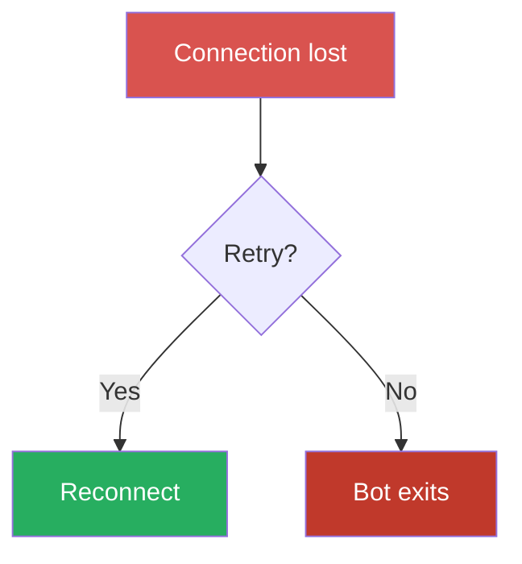

# Documentation Standards

<!-- KEYWORDS: docs, README, CHANGELOG.md, Javadoc, docstring, changelog, user-visible, mermaid, diagram, flowchart, sequence diagram -->

## When to Update

Update for user-visible changes: new features, breaking changes, behavior modifications, deprecations.

**Files to update:**
- `/README.md` — project overview
- `/CHANGELOG.md` — changelog
- Module-specific `README.md` files
- API docs: Javadoc (Java) · docstrings (Python) · XML comments (C#)

## CHANGELOG.md Format

Follows [Keep a Changelog](https://keepachangelog.com/) with project-specific emoji sub-sections.

```markdown
## [X.Y.Z] - YYYY-MM-DD – Release Title

### ✨ Features
- ...

### 🐞 Bug Fixes
- ...

### 🔧 Changes
- ...

### Deprecated
- ... (include migration path)
```

## API Doc Alignment

Javadoc (Java) is authoritative. Python docstrings and C# XML comments must match Java semantics: same parameter descriptions, return values, and examples.

## Checklist

- [ ] API docs match actual behavior
- [ ] Breaking changes noted with migration path
- [ ] Minimal diff (no unnecessary formatting changes)
- [ ] Cross-language naming consistent

---

## Mermaid Diagrams

Diagrams must be readable on **both** GitHub light and dark themes.

### Rule: always pair `fill` with `color`

Every `style` or `classDef` that sets `fill:` **must** also set `color:` explicitly.
Without it, Mermaid's dark theme injects white text — invisible on light fills.

```mermaid
%% ❌ Bad — white text on light pink in dark mode
style A fill:#FFCCCC

%% ✅ Good — explicit dark text readable on any background
style A fill:#D9534F,color:#fff
```

### Semantic colour palette

Use these five values consistently across all diagrams:

| Semantic | Fill | Text | Usage |
|----------|------|------|-------|
| Error / danger | `#D9534F` | `#fff` | Input node for an error path, failed state |
| Fatal / disqualified | `#C0392B` | `#fff` | Terminal error (bot disqualified, exits) |
| Warning / intermediate | `#E67E22` | `#fff` | Consequence step between error and outcome |
| Success / continue | `#27AE60` | `#fff` | Positive outcome, game continues |
| Info / neutral | `#2980B9` | `#fff` | Informational state, wait state, snapshot |

Example:



### GitHub rendering note

GitHub renders Mermaid with `theme: default` (light mode) and `theme: dark`
(dark mode) depending on user preference. Do **not** use `%%{init: ...}%%` to
force a theme — let GitHub handle it; the palette above works for both.

---

## Schema ↔ Architecture Flow Mapping

**Rule:** When any `.schema.yaml` file in `schema/schemas/` changes (new fields, new message types, changed behaviour), check the table below and update the corresponding architecture flow document.

Canonical home for all sequence diagrams: `docs/architecture/models/flows/`

| Schema category | When it changes, update… |
|-----------------|--------------------------|
| `server-handshake`, `bot-handshake`, `bot-ready`, `bot-list-update` | `bot-connection.md` — Bot Joining / Bot Leaving sections |
| `observer-handshake` | `bot-connection.md` — Observer Joining section |
| `controller-handshake` | `bot-connection.md` — Controller Joining section |
| `start-game`, `game-started-event-for-bot`, `game-started-event-for-observer` | `battle-lifecycle.md` — Phase 2 (WAIT_FOR_READY) |
| `round-started-event`, `round-ended-event-*`, `tick-event-for-bot`, `tick-event-for-observer`, `bot-intent`, `skipped-turn-event` | `turn-execution.md` — Steps 4–15 |
| `game-ended-event-*` | `battle-lifecycle.md` — Phase 4 (GAME_ENDED) |
| `game-aborted-event`, `stop-game` | `battle-lifecycle.md` — Aborting a Game |
| `pause-game`, `resume-game`, `game-paused-event-*`, `game-resumed-event-*` | `battle-lifecycle.md` — Manual Pause |
| `next-turn` | `battle-lifecycle.md` — Debug Mode (ADR-033) |
| `enable-debug-mode`, `disable-debug-mode` | `battle-lifecycle.md` — Debug Mode (ADR-033) |
| `bot-policy-update` | `battle-lifecycle.md` — Breakpoint Mode (ADR-034) and Debug Graphics Policy |
| `change-tps`, `tps-changed-event` | `battle-lifecycle.md` — Changing TPS |
| All bot gameplay events (`scanned-bot-event`, `hit-by-bullet-event`, etc.) | `event-handling.md` — Key event list |
| `team-message`, `team-message-event` | `event-handling.md` — Team Events section |
| Any state object (`bot-state`, `bullet-state`, `game-setup`, etc.) | `docs/architecture/models/message-schema/state.md` |
