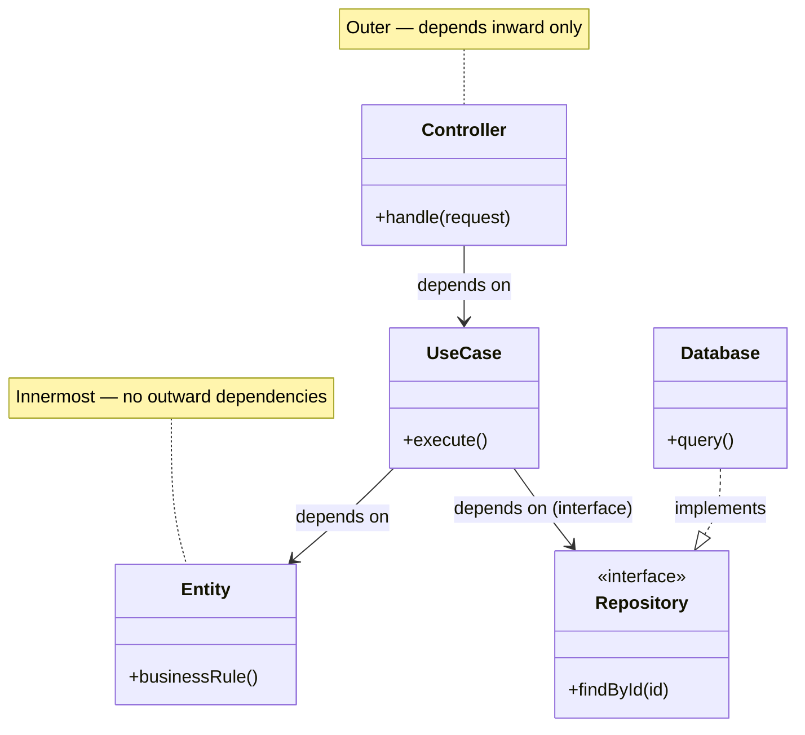
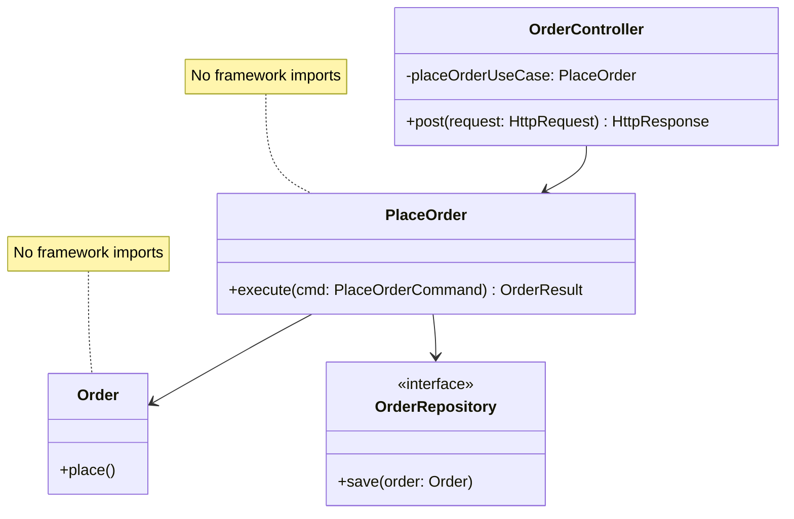

# .principles prime context — clean-arch
# Sections: Principle · Why it matters · Good practice

### CLEAN-ARCH-ARCHITECTURAL-BOUNDARIES — Define Clear Architectural Boundaries

Draw explicit boundaries between components that change for different reasons or at different rates. Each boundary separates a higher-level policy from a lower-level detail, and communication across the boundary should occur through well-defined interfaces. Boundaries can be enforced at the source level (separate modules), at the deployment level (separate libraries or packages), or at the service level (separate processes) — the choice depends on the cost of crossing the boundary versus the cost of not having one.

Why it matters:

Without explicit boundaries, changes in one part of the system bleed into others, creating a "big ball of mud" where every modification carries unpredictable risk. Architectural boundaries protect stable, high-value components from volatile ones. They allow teams to work independently, enable independent deployability, and make the system's structure visible and enforceable rather than merely aspirational.

Good practice:

- Define a public API for each component — only types and functions in the public API may be referenced by other components
- Use language or build-system mechanisms to enforce boundaries (Java modules, Go internal packages, TypeScript project references, Bazel visibility rules)
- Start with simpler boundaries (source-level modules) and promote to deployment or service boundaries only when the cost-benefit analysis justifies it
- Regularly review dependency graphs to detect boundary violations before they accumulate

### CLEAN-ARCH-DEPENDENCY-RULE — The Dependency Rule

In a Clean Architecture, source code dependencies must always point inward — from outer layers (frameworks, drivers, UI) toward inner layers (use cases, entities). Inner layers define interfaces; outer layers provide implementations. Nothing in an inner circle may know anything about something in an outer circle: no function name, class name, or data format declared in an outer layer may be mentioned by code in an inner layer.

Why it matters:

The Dependency Rule is the single mechanism that makes the architecture work. When every dependency points inward, the innermost business rules are completely shielded from changes in the UI, database, or any external agency. You can replace the web framework, swap the database, or change the messaging infrastructure without touching a single line of domain or use-case code. Violating this rule — even once — couples the stable core to volatile details, undermining the entire architectural intent.

Good practice:

- Define interfaces (ports) in the inner layer and implement them in the outer layer, using dependency inversion
- Use a composition root or dependency injection container at the outermost layer to wire implementations to interfaces
- Enforce the dependency rule with build tooling — module boundaries, package visibility rules, or architecture-test libraries (e.g., ArchUnit, Dependency Cruiser)
- Structure the project so that inner-layer modules have no compile-time dependency on outer-layer modules

### CLEAN-ARCH-KEEP-OPTIONS-OPEN — Keep Options Open

A good architecture maximizes the number of decisions not made. Defer binding to specific frameworks, databases, and delivery mechanisms for as long as possible by keeping them behind interfaces at the boundary of the system. The longer these decisions remain open, the more information you have when you finally make them, and the easier they are to change if circumstances shift.

Why it matters:

Early commitment to a framework or database shapes every decision that follows and makes reversal expensive. When the architecture treats these choices as deferred details rather than foundational commitments, the team can prototype with a simple in-memory implementation, delay vendor selection until requirements stabilize, and switch technologies when better options emerge — all without rewriting the core application.

Good practice:

- Define repository interfaces, gateway interfaces, and service interfaces in the domain layer — implement them with concrete technology in the infrastructure layer
- Build and test the core application against in-memory or fake implementations before committing to production infrastructure
- Evaluate frameworks and databases as late as responsibly possible, treating them as pluggable details
- Document technology decisions as Architecture Decision Records (ADRs) so the reasoning is preserved and revisitable

### CLEAN-ARCH-SEPARATE-BUSINESS-RULES — Separate Business Rules from Frameworks and Delivery Mechanisms

Business rules — the policies, validations, and calculations that define what the application does — should live in plain code with no dependencies on frameworks, databases, or UI mechanisms. The core domain logic should be expressible and testable without starting a web server, connecting to a database, or importing a framework. Frameworks are details; the business rules are the reason the software exists.

Why it matters:

When business logic is entangled with framework code, it becomes hostage to that framework's lifecycle, conventions, and limitations. Frameworks change, become unsupported, or get replaced — but business rules tend to be stable. By keeping them independent, you can test domain logic rapidly in isolation, swap delivery mechanisms (REST to GraphQL, web to CLI), and replace infrastructure without rewriting the rules that define the product's value.

Good practice:

- Place business rules in a dedicated layer or module that has no compile-time dependency on any framework
- Define domain interfaces (ports) that infrastructure code implements (adapters), keeping the dependency direction from infrastructure toward the domain
- Write unit tests for business rules that run without any framework or database — pure logic in, result out
- Treat the web framework, ORM, and message broker as plugins to the application, not the foundation of it

