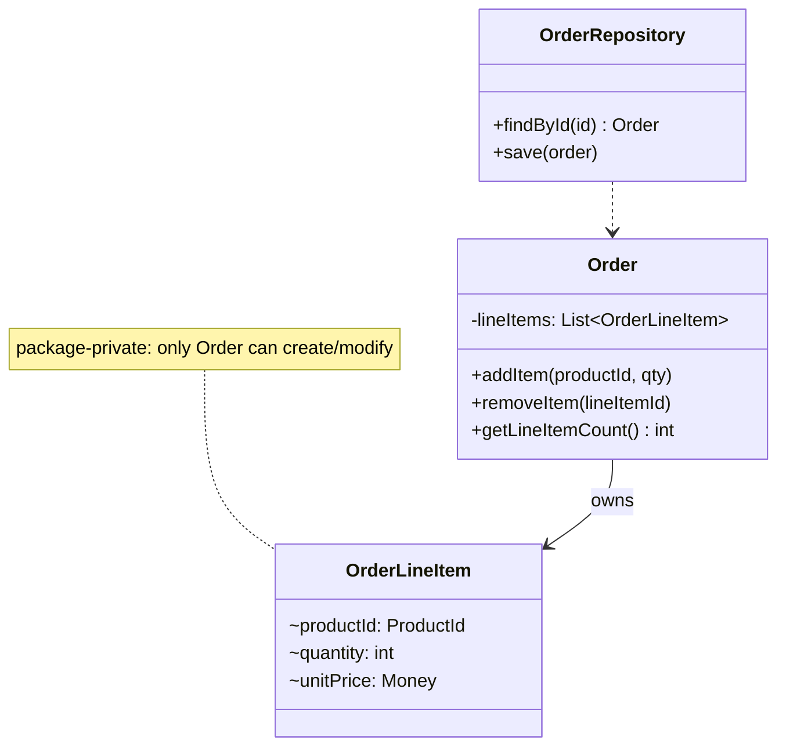
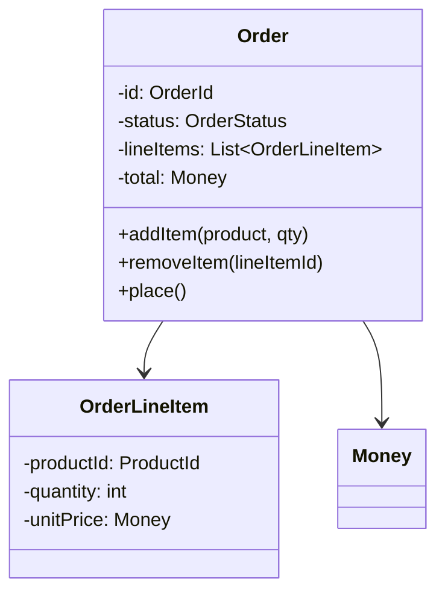
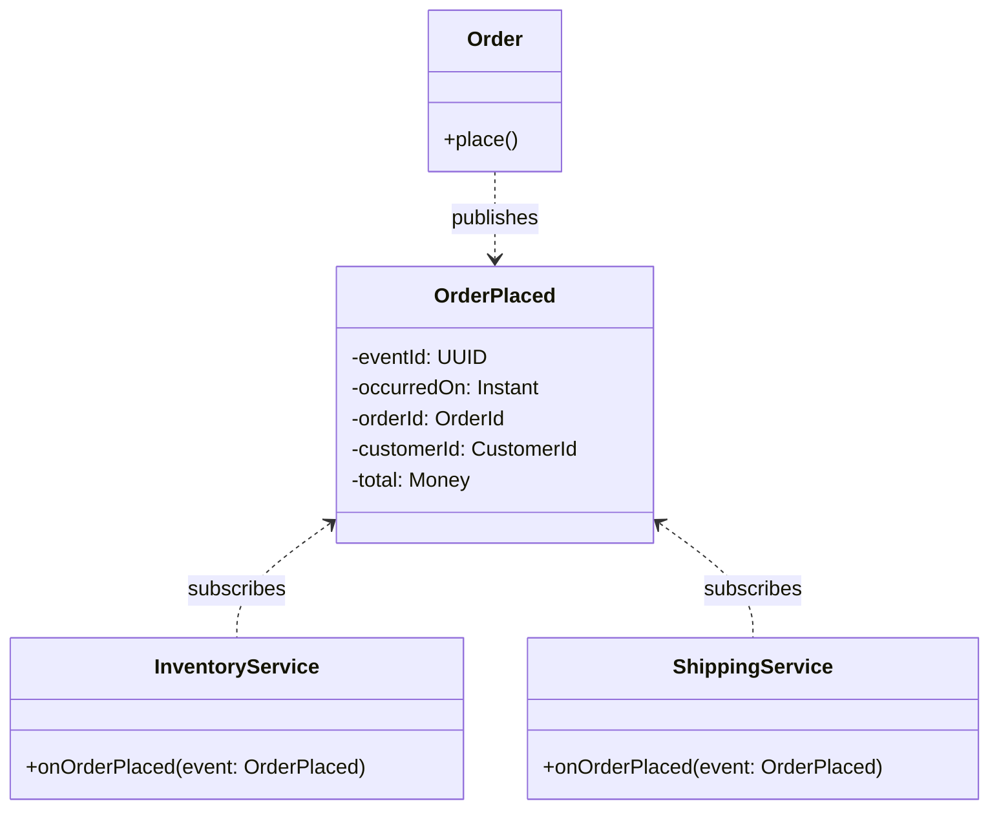
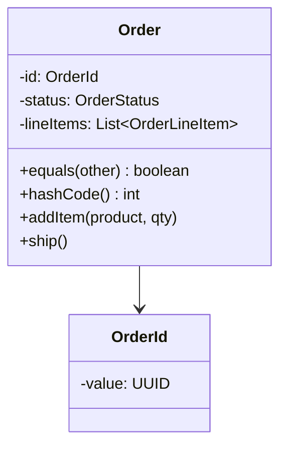
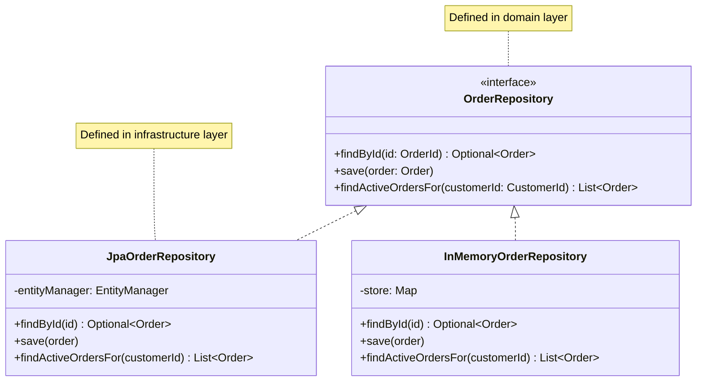
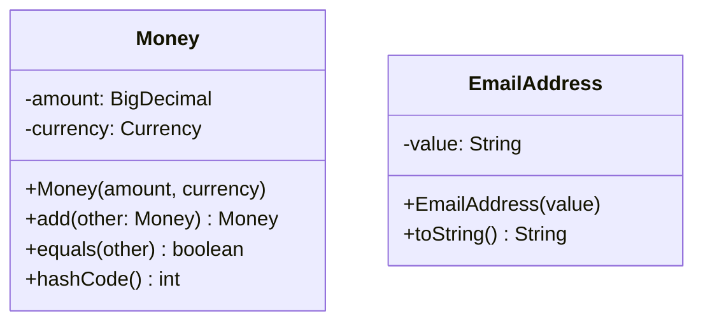

# .principles prime context — ddd
# Sections: Principle · Why it matters · Good practice

### DDD-AGGREGATE-ROOT — Aggregate Root

Every Aggregate has a single root Entity — the Aggregate Root — which is the only object through which external code may obtain references to or interact with the Aggregate's internals. Outside objects may hold references to the root but must not hold persistent references to internal Entities or Value Objects. All modifications to the Aggregate's state must go through the root, which is responsible for enforcing the Aggregate's invariants.

Why it matters:

If external code can directly access and modify internal objects within an Aggregate, it can bypass the invariant-enforcement logic concentrated in the root, leaving the Aggregate in an inconsistent state. The Aggregate Root serves as a gatekeeper that ensures every state change is validated against the business rules. Without this discipline, invariants erode and the consistency boundary becomes meaningless.

Good practice:



```java
// Violation — external code modifies internal entity directly
OrderLineItem item = order.getLineItems().get(0);
item.setQuantity(5);  // bypasses Order's invariant checks

// Correct — all mutations go through the Aggregate Root
order.updateLineItemQuantity(lineItemId, 5);  // root validates invariants
```

- Make internal Aggregate objects package-private or use access modifiers to prevent external code from reaching them directly
- Expose behavior on the Aggregate Root that delegates internally (e.g., `order.addLineItem(product, quantity)` instead of letting callers create and attach `LineItem` objects)
- Repositories should only provide methods to find and persist Aggregate Roots, never internal objects
- When external code needs information about an internal object, return a Value Object copy or a read-only projection rather than a live reference

### DDD-AGGREGATE — Aggregate

An Aggregate is a cluster of associated Entities and Value Objects that are treated as a single unit for the purpose of data changes. Each Aggregate defines a consistency boundary: invariants within the Aggregate are enforced synchronously with every transaction, while consistency across Aggregates is handled eventually. Aggregates should be designed to be as small as possible while still protecting the business invariants they encapsulate.

Why it matters:

Without clear consistency boundaries, systems either enforce too much transactional consistency (locking large object graphs, causing contention and poor scalability) or too little (allowing business rules to be violated). Well-designed Aggregates make concurrency manageable by limiting the scope of locks and transactions, and they make the domain model explicit about which invariants must hold at all times versus which can be temporarily relaxed.

Good practice:



- Keep Aggregates small — prefer single-Entity Aggregates and use references (by ID) to other Aggregates rather than direct object references
- Identify the true invariants the Aggregate must enforce and use those to determine what belongs inside the boundary
- Use eventual consistency and Domain Events to synchronize state between Aggregates
- Each Aggregate should be loadable and savable as a single atomic unit; design your persistence around this constraint

### DDD-BOUNDED-CONTEXT — Bounded Context

A Bounded Context is an explicit boundary within which a particular domain model applies. The same real-world concept may be represented differently in different Bounded Contexts — and that is intentional. Rather than forcing a single unified model across an entire system, define clear boundaries where each model is internally consistent, and establish explicit mappings (context maps) for how models relate across boundaries.

Why it matters:

Large systems that attempt to maintain a single, all-encompassing domain model inevitably produce a tangled "Big Ball of Mud" where every change risks unintended side effects across unrelated parts of the system. Bounded Contexts allow teams to evolve their models independently, reduce coupling between subsystems, and prevent one team's modeling choices from corrupting another's. Without explicit boundaries, model concepts become overloaded and lose their precision.

Good practice:

- Draw explicit boundaries around each model and define them in terms of team ownership, code modules, or deployable services
- Create a Context Map that documents the relationships between Bounded Contexts (e.g., Shared Kernel, Customer-Supplier, Conformist, Anti-Corruption Layer)
- Use separate model classes in each context even for the same real-world concept, with explicit translation at the boundary
- Align Bounded Contexts with team boundaries where possible to reduce coordination overhead

### DDD-DOMAIN-EVENT — Domain Event

A Domain Event is an immutable record of something meaningful that happened in the domain — expressed in the past tense and in the Ubiquitous Language (e.g., `OrderPlaced`, `PaymentReceived`, `InventoryReserved`). When something important occurs within one Bounded Context, it publishes a Domain Event that other Bounded Contexts can subscribe to and react to asynchronously. This decouples the contexts: the publisher does not need to know who the consumers are or what they do with the event.

Why it matters:

Direct synchronous calls between Bounded Contexts create tight coupling: the caller must know the callee's API, handle its failures, and coordinate transactions across boundaries. Domain Events replace this coupling with a loosely-coupled, asynchronous communication style that allows Bounded Contexts to evolve independently. They also provide an auditable history of what happened in the system, which supports debugging, analytics, and replaying state.

Good practice:



```java
// Violation — Order directly calls downstream services
class Order {
    void place() {
        inventory.reserve(this);    // tight coupling
        shipping.schedule(this);    // tight coupling
    }
}

// Correct — Order publishes an event; downstream contexts react
class Order {
    void place() {
        // ... business logic ...
        domainEvents.publish(new OrderPlaced(this.id, this.customerId, this.total));
    }
}
```

- Name events in the past tense using domain language: `OrderShipped`, `CustomerRegistered`, `SubscriptionRenewed`
- Make event objects immutable and include a unique event ID, a timestamp, and the minimal data consumers need to react
- Publish events as part of the same transaction that updates the Aggregate, using the Outbox Pattern or event-sourcing to guarantee delivery
- Design consumers to be idempotent — they should handle receiving the same event more than once without producing incorrect results

### DDD-ENTITY — Entity

An Entity is a domain object that is defined not by its attributes but by a thread of continuity and identity. Two Entities are the same if they share the same identity, regardless of whether their other attributes differ. Entities should have a clearly defined identity mechanism (such as a unique ID) and their equality should be based on that identity, not on the values of their fields.

Why it matters:

Confusing Entities with Value Objects leads to subtle bugs: objects that should be tracked by identity get compared by value (causing duplicates or lost updates), or objects that should be interchangeable by value get tracked by identity (causing unnecessary complexity). Correctly distinguishing Entities ensures that the system accurately reflects which domain concepts persist over time and maintain continuity through state changes.

Good practice:



- Give every Entity a clear, immutable identifier (UUID, database-generated ID, or natural business key)
- Implement `equals()` and `hashCode()` (or language equivalents) based solely on the identity field
- Keep Entities focused on identity, lifecycle, and the behaviors that require identity continuity
- Push attribute-heavy, identity-less concepts out of Entities and into Value Objects

### DDD-REPOSITORY — Repository

A Repository provides a collection-like interface for accessing Aggregates, encapsulating all the logic needed to store and retrieve domain objects from their underlying data store. The domain layer works with Repositories as if they were in-memory collections — adding, removing, and finding objects — without any knowledge of SQL, ORM configuration, API calls, or serialization details. This separation keeps domain logic pure and infrastructure-agnostic.

Why it matters:

When persistence logic leaks into the domain model, domain classes become coupled to specific databases, ORMs, or storage technologies. This makes the domain harder to test (requiring database setup for unit tests), harder to evolve (storage changes ripple through business logic), and harder to understand (domain concepts are obscured by infrastructure concerns). Repositories create a clean seam between the domain and its persistence infrastructure.

Good practice:



- Define Repository interfaces in the domain layer, with implementations in the infrastructure layer
- Design Repository interfaces around the Aggregate Root: one Repository per Aggregate type, with methods like `findById()`, `save()`, and domain-specific finders
- Return fully reconstituted domain objects from Repositories, not raw data structures or database rows
- Use Repository interfaces as the injection point for testing: swap real implementations with in-memory fakes to keep domain unit tests fast and infrastructure-free

### DDD-UBIQUITOUS-LANGUAGE — Ubiquitous Language

The language used in code — class names, method names, variable names, module names — should directly reflect the language that domain experts use to describe the business. This shared vocabulary, called the Ubiquitous Language, must be rigorously used in conversations, documentation, and code alike. When the code mirrors the domain language, developers and domain experts can communicate without translation, and the model becomes a living, executable specification of the business.

Why it matters:

When code uses a different vocabulary than the business, every conversation requires mental translation, misunderstandings accumulate, and the model drifts away from the domain it represents. Over time, the software becomes harder to extend correctly because developers no longer understand the real-world concepts behind the abstractions. A shared language catches domain misunderstandings at design time rather than in production.

Good practice:

- Name classes, methods, and variables using the exact terms domain experts use; if a term feels awkward in code, explore whether the model needs refinement rather than inventing a synonym
- Maintain a glossary of the Ubiquitous Language and refer to it during code reviews
- When domain experts introduce a new term or refine an existing one, rename the corresponding code elements to match
- Let naming inconsistencies trigger design discussions — they often reveal deeper modeling problems

### DDD-VALUE-OBJECT — Value Object

A Value Object represents a descriptive aspect of the domain that has no conceptual identity. Two Value Objects are equal if all of their attributes are equal — there is no separate notion of "which one" they are. Value Objects should be immutable: rather than modifying a Value Object, you replace it with a new instance. Common examples include monetary amounts, date ranges, addresses, coordinates, and measurements.

Why it matters:

Treating every domain concept as an Entity adds unnecessary complexity — identity management, lifecycle tracking, and mutable-state synchronization for objects that do not need any of it. Value Objects are simpler, safer, and more expressive. Their immutability eliminates aliasing bugs (where two references to the same mutable object cause unintended side effects), and their value-based equality makes them natural candidates for caching, sharing, and use as map keys.

Good practice:



```java
// Violation — primitive obsession
BigDecimal price = new BigDecimal("9.99");  // what currency? can be negative?
String email = "user@example.com";  // no validation, no semantics

// Correct — typed, immutable Value Objects
Money price = new Money(new BigDecimal("9.99"), Currency.USD);
EmailAddress email = new EmailAddress("user@example.com");  // validates on construction
Money total = price.add(tax);  // new instance, original unchanged
```

- Make Value Objects immutable — set all fields in the constructor and provide no setters
- Implement `equals()` and `hashCode()` based on all constituent attributes
- Provide domain-meaningful operations as methods on the Value Object (e.g., `Money.add(Money)`, `DateRange.overlaps(DateRange)`)
- Use Value Objects to replace primitive types wherever the domain assigns meaning to a value

### DDD-SPECIFICATION — Specification Pattern

Encapsulate a business rule or criterion in a separate Specification object with a single `isSatisfiedBy(candidate)` method. Specifications can be combined with logical operators (`and`, `or`, `not`) to build complex rules from simple named, testable domain objects.

Why it matters:

When selection criteria are expressed in ad-hoc query strings, boolean flags, or inline conditionals scattered across the codebase, business rules become invisible and duplicated. Specifications give business rules a name, a location, and a type — they can be tested, composed, and passed as arguments without leaking their implementation.

Good practice:

- Name specifications after the business rule they encode, using the Ubiquitous Language
- Implement `and`, `or`, and `not` as combinators on the base interface
- Keep each specification focused on one rule; combine rules through composition
- Use specifications in repositories (query translation), in domain services (validation), and in factories (eligibility)
