# .principles prime context — gof
# Sections: Principle · Why it matters · Good practice

### GOF-ABSTRACT-FACTORY — Abstract Factory Pattern

Provide an interface for creating families of related or dependent objects without specifying their concrete classes. Use Abstract Factory when a system must be independent of how its products are created, composed, and represented, and when it must work with one of several families of products at a time. The pattern ensures that objects from the same family are used together while keeping client code decoupled from any particular family's implementation.

Why it matters:

Without Abstract Factory, client code that creates related objects directly becomes tightly coupled to specific product classes and must be modified whenever a new product family is introduced. Mixing objects from incompatible families causes subtle bugs that are hard to detect at compile time.

Good practice:

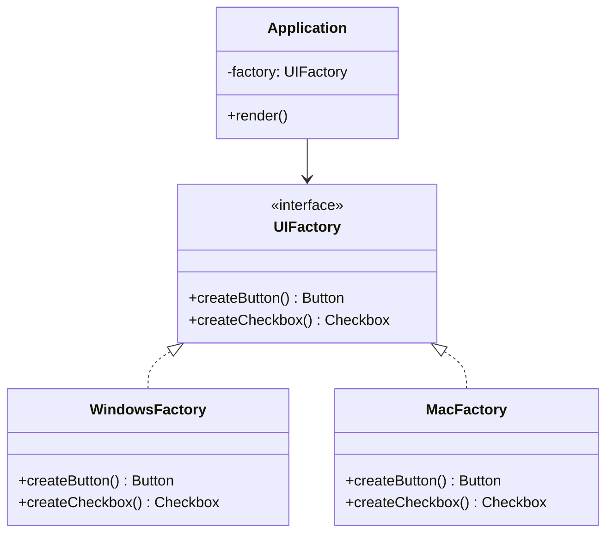
```mermaid
classDiagram
    class UIFactory {
        <<interface>>
        +createButton() Button
        +createCheckbox() Checkbox
    }
    class WindowsFactory {
        +createButton() Button
        +createCheckbox() Checkbox
    }
    class MacFactory {
        +createButton() Button
        +createCheckbox() Checkbox
    }
    UIFactory <|.. WindowsFactory
    UIFactory <|.. MacFactory
    class Application {
        -factory: UIFactory
        +render()
    }
    Application --> UIFactory
```

```java
// Violation — directly instantiates platform-specific products
Button btn = new WindowsButton();
Checkbox cb = new WindowsCheckbox();

// Correct — factory injected; client unaware of concrete family
UIFactory factory = resolveFactory(platform);  // WindowsFactory or MacFactory
Button btn = factory.createButton();
Checkbox cb = factory.createCheckbox();
```

- Define an abstract factory interface with a creation method for each product in the family
- Implement one concrete factory per product family, ensuring all products within a factory are compatible
- Pass the factory to client code via injection so the client never references concrete product classes
- Add new families by adding a new concrete factory without modifying existing client code

### GOF-ADAPTER — Adapter Pattern

Convert the interface of a class into another interface clients expect. Adapter lets classes work together that could not otherwise because of incompatible interfaces. Use it when you want to use an existing class but its interface does not match the one you need, or when you want to create a reusable class that cooperates with unrelated or unforeseen classes that do not necessarily have compatible interfaces.

Why it matters:

Without Adapter, integrating third-party libraries, legacy components, or independently developed modules requires modifying either the client or the supplier, breaking encapsulation and creating maintenance burdens. Each new integration point risks introducing changes that ripple through working code.

Good practice:

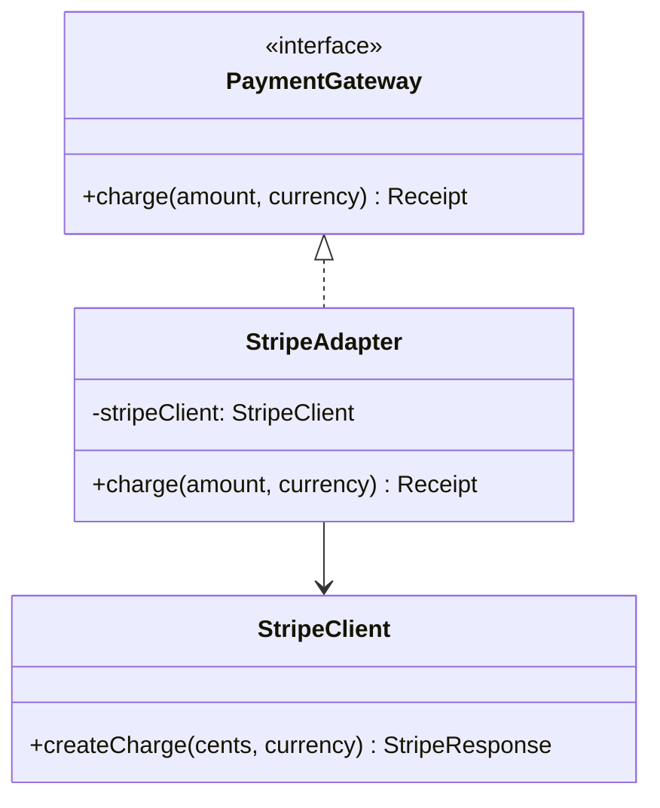
```mermaid
classDiagram
    class PaymentGateway {
        <<interface>>
        +charge(amount, currency) Receipt
    }
    class StripeAdapter {
        -stripeClient: StripeClient
        +charge(amount, currency) Receipt
    }
    class StripeClient {
        +createCharge(cents, currency) StripeResponse
    }
    PaymentGateway <|.. StripeAdapter
    StripeAdapter --> StripeClient
```

```java
// Violation — inline translation repeated at every call site
StripeClient stripe = new StripeClient();
StripeResponse r = stripe.createCharge(amount * 100, currency);

// Correct — adapter translates at the boundary; client uses the target interface
PaymentGateway gateway = new StripeAdapter(new StripeClient());
Receipt receipt = gateway.charge(amount, currency);
```

- Create an adapter class that implements the target interface and delegates to the adaptee
- Prefer object adaptation (composition) over class adaptation (multiple inheritance) for greater flexibility
- Keep the adapter thin: translate calls and data formats, but do not add business logic
- Use adapters at system boundaries (external services, legacy modules) to insulate the core domain from interface changes

### GOF-BRIDGE — Bridge Pattern

Decouple an abstraction from its implementation so that the two can vary independently. Use Bridge when you want to avoid a permanent binding between an abstraction and its implementation, when both the abstractions and their implementations should be extensible by subclassing, or when you see a class hierarchy that is growing in two orthogonal dimensions (e.g., shape types and rendering platforms). Bridge splits such a hierarchy into two separate hierarchies connected by composition.

Why it matters:

Without Bridge, combining multiple abstractions with multiple implementations leads to a combinatorial explosion of classes. A change in the implementation layer forces recompilation or modification of the abstraction layer and vice versa. The two dimensions of variation become entangled, making the system rigid and difficult to extend.

Good practice:

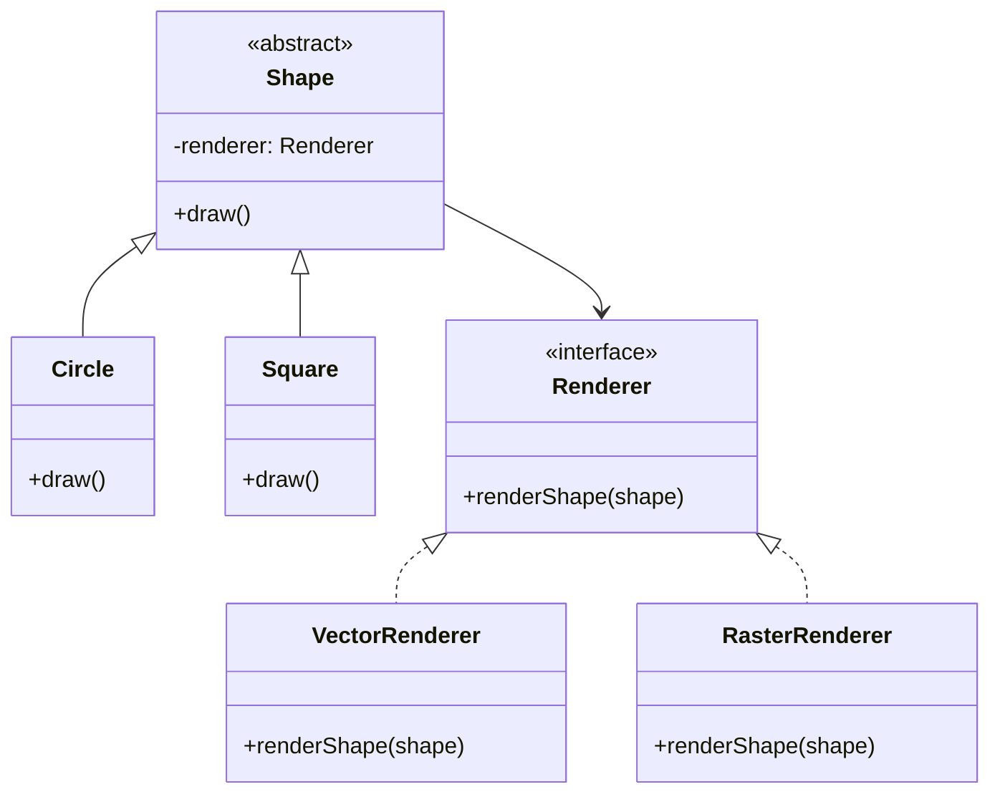
```mermaid
classDiagram
    class Shape {
        <<abstract>>
        -renderer: Renderer
        +draw()
    }
    class Circle {
        +draw()
    }
    class Square {
        +draw()
    }
    class Renderer {
        <<interface>>
        +renderShape(shape)
    }
    class VectorRenderer {
        +renderShape(shape)
    }
    class RasterRenderer {
        +renderShape(shape)
    }
    Shape <|-- Circle
    Shape <|-- Square
    Shape --> Renderer
    Renderer <|.. VectorRenderer
    Renderer <|.. RasterRenderer
```

```java
// Violation — 4 classes for 2 shapes × 2 renderers
class VectorCircle {}
class RasterCircle {}
class VectorSquare {}
class RasterSquare {}

// Correct — 2 shape classes + 2 renderer classes, combined via Bridge
Renderer r = new VectorRenderer();
Shape s = new Circle(r);
s.draw();  // delegates to renderer
```

- Define the abstraction's interface separately from the implementor's interface
- Hold a reference to the implementor inside the abstraction and delegate implementation-specific work through it
- Allow the implementor to be injected or swapped at runtime without changing the abstraction
- Extend each hierarchy independently: new abstractions do not require new implementors, and new implementors do not require new abstractions

### GOF-BUILDER — Builder Pattern

Separate the construction of a complex object from its representation so that the same construction process can create different representations. Use Builder when the algorithm for creating a complex object should be independent of the parts that make up the object and how they are assembled, or when the construction process must allow different representations for the object that is constructed. The pattern is especially valuable when an object requires many optional parameters or multi-step initialization.

Why it matters:

Without Builder, constructors accumulate long parameter lists or require numerous overloads, making call sites unreadable and error-prone. Complex construction logic becomes duplicated across every place the object is created, and adding a new variant means touching all those locations.

Good practice:

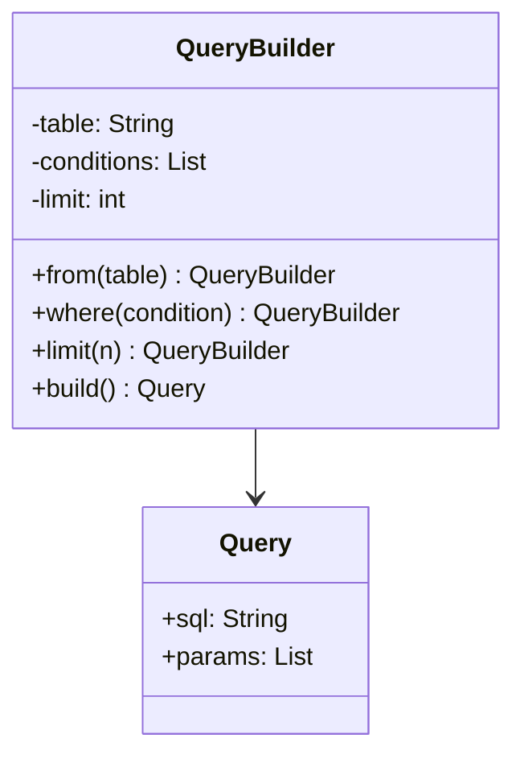
```mermaid
classDiagram
    class QueryBuilder {
        -table: String
        -conditions: List
        -limit: int
        +from(table) QueryBuilder
        +where(condition) QueryBuilder
        +limit(n) QueryBuilder
        +build() Query
    }
    class Query {
        +sql: String
        +params: List
    }
    QueryBuilder --> Query
```

```java
// Violation — telescoping constructor
Query q = new Query("users", "age > 18", null, 10, false);

// Correct — fluent builder; only set what you need
Query q = new QueryBuilder()
    .from("users")
    .where("age > 18")
    .limit(10)
    .build();
```

- Define a Builder interface with step-by-step methods for each part of the product
- Use a Director when the construction sequence itself is reusable across different builders
- Return the builder from each setter method to support a fluent, chainable API
- Make the product immutable once built; the builder holds mutable state only during construction

### GOF-CHAIN-OF-RESPONSIBILITY — Chain of Responsibility Pattern

Avoid coupling the sender of a request to its receiver by giving more than one object a chance to handle the request. Chain the receiving objects and pass the request along the chain until an object handles it. Use this pattern when multiple objects may handle a request and the handler is not known a priori, or when you want to issue a request to one of several objects without specifying the receiver explicitly.

Why it matters:

Without Chain of Responsibility, the sender must know exactly which object can handle a given request, creating rigid dependencies. Adding or reordering handlers requires modifying the sender, violating the open-closed principle and making the request-dispatching logic brittle and hard to extend.

Good practice:

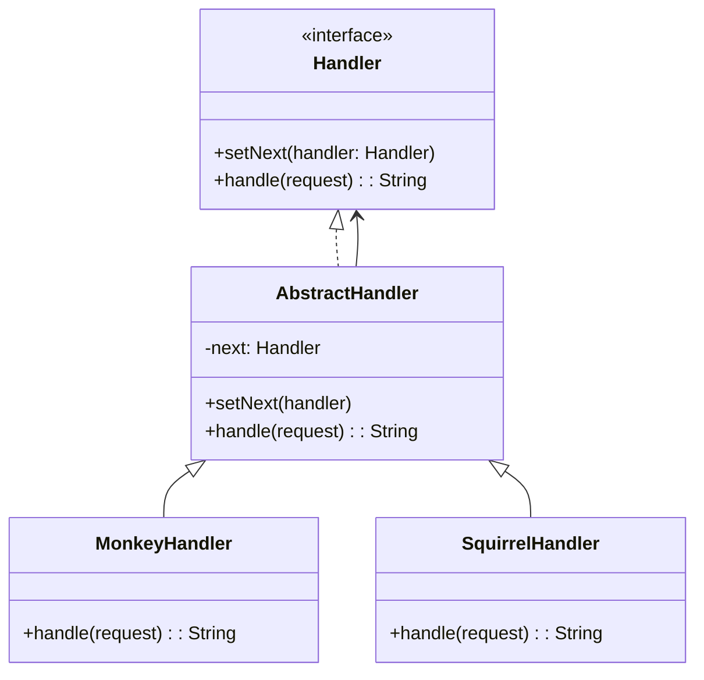
```mermaid
classDiagram
    class Handler {
        <<interface>>
        +setNext(handler: Handler)
        +handle(request): String
    }
    class AbstractHandler {
        -next: Handler
        +setNext(handler)
        +handle(request): String
    }
    class MonkeyHandler {
        +handle(request): String
    }
    class SquirrelHandler {
        +handle(request): String
    }
    Handler <|.. AbstractHandler
    AbstractHandler <|-- MonkeyHandler
    AbstractHandler <|-- SquirrelHandler
    AbstractHandler --> Handler
```

```java
// Violation — sender knows all possible handlers
if (request.equals("Nut")) squirrel.handle(request);
else if (request.equals("Banana")) monkey.handle(request);

// Correct — chain assembled externally; sender just calls handle()
monkey.setNext(squirrel).setNext(dog);
monkey.handle(request);
```

- Define a common handler interface with a method to process the request and a reference to a successor
- Let each handler decide whether to handle the request or forward it to the next handler in the chain
- Allow the chain to be assembled and reordered at runtime for flexibility
- Accept that a request may reach the end of the chain unhandled and design for that case explicitly

### GOF-COMMAND — Command Pattern

Encapsulate a request as an object, thereby letting you parameterize clients with different requests, queue or log requests, and support undoable operations. It decouples the object that invokes the operation from the one that knows how to perform it. Use Command when you need to issue requests without knowing anything about the operation being requested or the receiver of the request.

Why it matters:

Without Command, invokers are directly coupled to the specific operations they trigger, making it impossible to parameterize, queue, serialize, or undo actions generically. This rigidity prevents features like macro recording, transaction logging, and multi-level undo from being implemented cleanly.

Good practice:

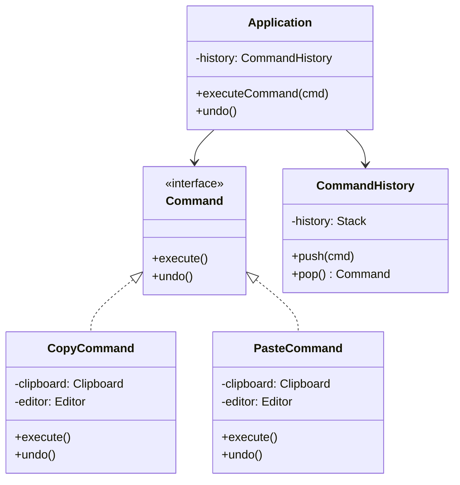
```mermaid
classDiagram
    class Command {
        <<interface>>
        +execute()
        +undo()
    }
    class CopyCommand {
        -clipboard: Clipboard
        -editor: Editor
        +execute()
        +undo()
    }
    class PasteCommand {
        -clipboard: Clipboard
        -editor: Editor
        +execute()
        +undo()
    }
    class CommandHistory {
        -history: Stack
        +push(cmd)
        +pop() Command
    }
    class Application {
        -history: CommandHistory
        +executeCommand(cmd)
        +undo()
    }
    Command <|.. CopyCommand
    Command <|.. PasteCommand
    Application --> CommandHistory
    Application --> Command
```

```java
// Violation — invoker calls domain method directly; no undo possible
button.onClick(() -> editor.copy());  // hard to generalize or undo

// Correct — encapsulate request; invoker just calls execute()
Command copy = new CopyCommand(editor, clipboard);
history.push(copy);
copy.execute();
// Undo:
history.pop().undo();
```

- Define a Command interface with an execute method and, when needed, an undo method
- Store the receiver and all parameters needed for execution inside the command object
- Use a command history stack to implement undo and redo
- Compose macro commands from sequences of simpler commands to support compound operations

### GOF-COMPOSITE — Composite Pattern

Compose objects into tree structures to represent part-whole hierarchies. Composite lets clients treat individual objects and compositions of objects uniformly. Use it when you want clients to be able to ignore the difference between compositions of objects and individual objects, such as in file systems, UI widget trees, organizational charts, or arithmetic expression trees where operations should apply recursively.

Why it matters:

Without Composite, client code must distinguish between leaf and container objects with conditional logic, leading to scattered type checks and duplicated handling code. Every time a new type of leaf or composite is added, all client code that discriminates between leaves and composites must be updated.

Good practice:

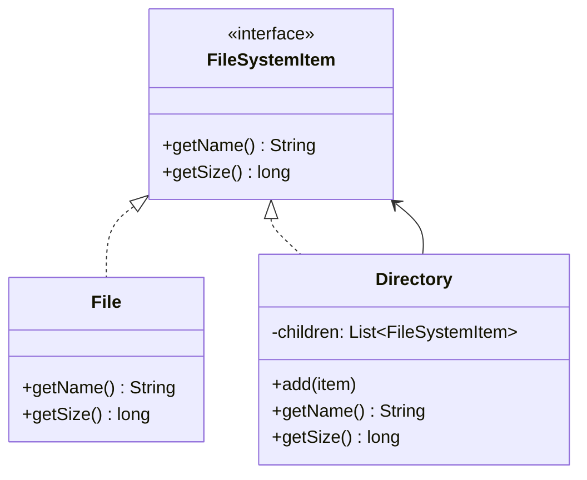
```mermaid
classDiagram
    class FileSystemItem {
        <<interface>>
        +getName() String
        +getSize() long
    }
    class File {
        +getName() String
        +getSize() long
    }
    class Directory {
        -children: List~FileSystemItem~
        +add(item)
        +getName() String
        +getSize() long
    }
    FileSystemItem <|.. File
    FileSystemItem <|.. Directory
    Directory --> FileSystemItem
```

```java
// Violation — client must check type at every step
if (item instanceof Directory) {
    for (FileSystemItem child : ((Directory) item).getChildren()) { ... }
} else {
    processFile((File) item);
}

// Correct — uniform interface; client never knows if it's a leaf or composite
FileSystemItem root = new Directory("root");
root.getSize();  // recursively sums children or returns file size
```

- Define a component interface shared by both leaf and composite objects, declaring operations that make sense for both
- Composite objects store child components and implement operations by delegating to each child
- Keep the component interface as narrow as possible; avoid forcing leaf classes to implement child-management methods they do not need
- Consider whether transparency (child management in the component interface) or safety (child management only in the composite) better fits your design

### GOF-COMPOSITION-OVER-INHERITANCE — Favor Composition over Inheritance

Favor object composition over class inheritance. Inheritance breaks encapsulation by exposing a subclass to the implementation details of its parent, creating tight coupling between them. Composition assembles behavior by delegating to objects that implement well-defined interfaces, making it possible to change behavior at runtime and keep each class focused on a single responsibility. Use inheritance only when there is a genuine "is-a" relationship and the subclass truly needs to extend, not merely reuse, the parent's behavior.

Why it matters:

Over-reliance on inheritance leads to deep, rigid class hierarchies where changes to a base class ripple unpredictably through all descendants. Testing becomes difficult because subclasses cannot be understood or exercised in isolation from their parents. Composition keeps components loosely coupled, independently testable, and open to recombination in ways inheritance hierarchies cannot support.

Good practice:

Identify the behavior that varies, encapsulate it behind an interface, and inject it via composition.

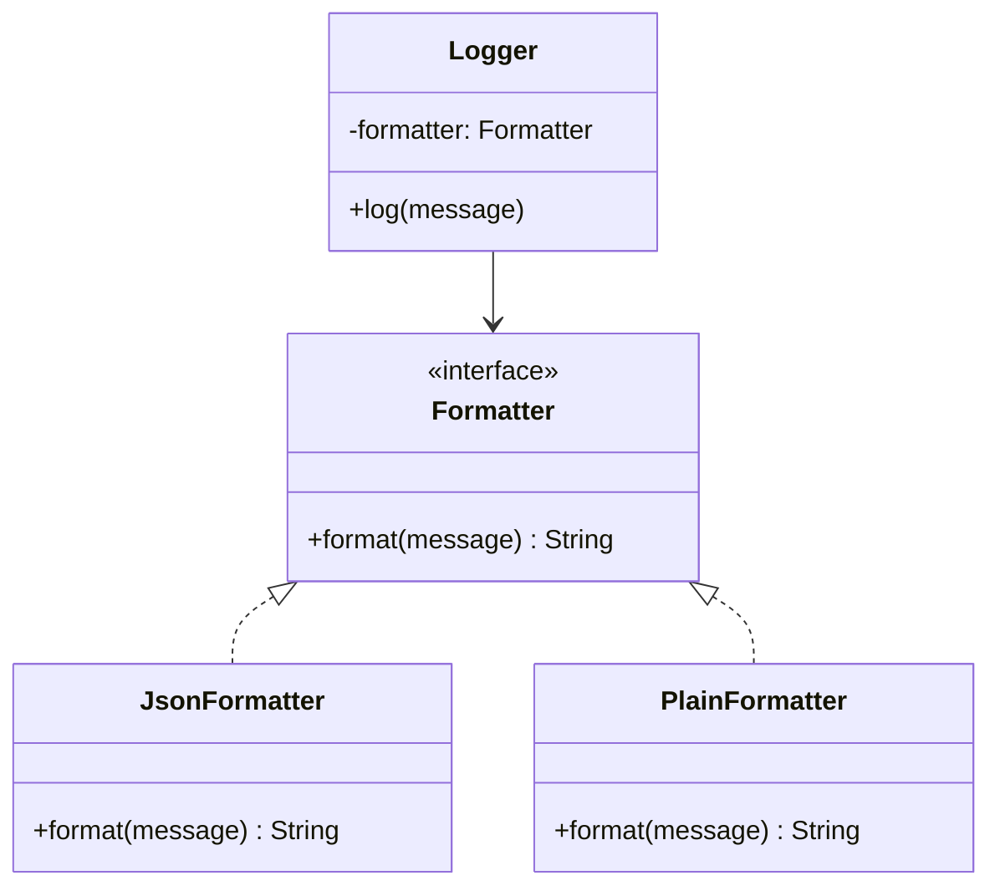
```mermaid
classDiagram
    class Logger {
        -formatter: Formatter
        +log(message)
    }
    class Formatter {
        <<interface>>
        +format(message) String
    }
    class JsonFormatter {
        +format(message) String
    }
    class PlainFormatter {
        +format(message) String
    }
    Logger --> Formatter
    Formatter <|.. JsonFormatter
    Formatter <|.. PlainFormatter
```

```java
// Violation — inheritance to reuse formatting behavior
class JsonLogger extends BaseLogger {
    @Override
    protected String format(String msg) { return "{\"msg\":\"" + msg + "\"}"; }
}

// Correct — compose with a Formatter strategy
class Logger {
    private final Formatter formatter;
    Logger(Formatter formatter) { this.formatter = formatter; }
    void log(String msg) { System.out.println(formatter.format(msg)); }
}
```

- Identify the behavior that varies and encapsulate it behind an interface
- Compose objects by injecting collaborators rather than subclassing to acquire their behavior
- Use inheritance only for genuine type hierarchies where substitutability (Liskov) holds
- Prefer small, focused interfaces that can be mixed via delegation

### GOF-DECORATOR — Decorator Pattern

Attach additional responsibilities to an object dynamically. Decorator provides a flexible alternative to subclassing for extending functionality. Use it when you need to add behavior to individual objects without affecting other objects of the same class, or when extension by subclassing is impractical because it would produce an explosion of subclasses to support every combination of features.

Why it matters:

Without Decorator, adding optional features or cross-cutting concerns (logging, caching, encryption, compression) to a class requires either modifying the class directly, violating the open-closed principle, or creating a subclass for every combination of features. This leads to class explosion and rigid hierarchies that cannot be recombined at runtime.

Good practice:

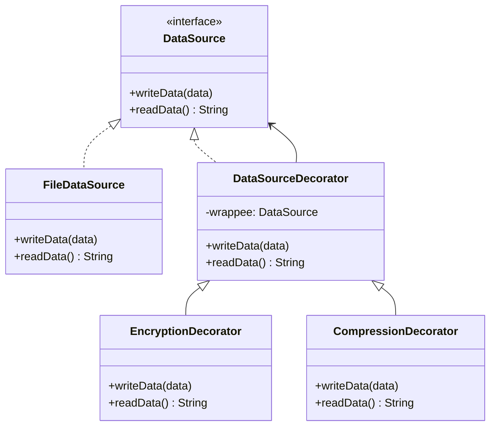
```mermaid
classDiagram
    class DataSource {
        <<interface>>
        +writeData(data)
        +readData() String
    }
    class FileDataSource {
        +writeData(data)
        +readData() String
    }
    class DataSourceDecorator {
        -wrappee: DataSource
        +writeData(data)
        +readData() String
    }
    class EncryptionDecorator {
        +writeData(data)
        +readData() String
    }
    class CompressionDecorator {
        +writeData(data)
        +readData() String
    }
    DataSource <|.. FileDataSource
    DataSource <|.. DataSourceDecorator
    DataSourceDecorator <|-- EncryptionDecorator
    DataSourceDecorator <|-- CompressionDecorator
    DataSourceDecorator --> DataSource
```

```java
// Violation — new subclass for every combination
class EncryptedCompressedFileDataSource extends FileDataSource { ... }

// Correct — stack decorators at runtime
DataSource source = new CompressionDecorator(
                        new EncryptionDecorator(
                            new FileDataSource("data.bin")));
source.writeData(payload);
```

- Define a component interface and have both the concrete component and the decorator implement it
- Each decorator holds a reference to a component and delegates core behavior to it, adding its own behavior before or after
- Stack decorators to combine features: `new Logging(new Caching(new Service()))` composes behavior without subclassing
- Keep each decorator focused on a single responsibility so they remain independently composable and testable

### GOF-FACADE — Facade Pattern

Provide a unified, simplified interface to a set of interfaces in a subsystem. Facade defines a higher-level interface that makes the subsystem easier to use without hiding the lower-level functionality from clients that need it. Use Facade when you want to layer your subsystems or when clients need a simple entry point to complex functionality.

Why it matters:

Without a Facade, clients become tightly coupled to the internal classes and interactions of a subsystem. This makes the subsystem harder to change, forces clients to understand implementation details they should not need to know, and creates a tangled web of dependencies across architectural boundaries.

Good practice:

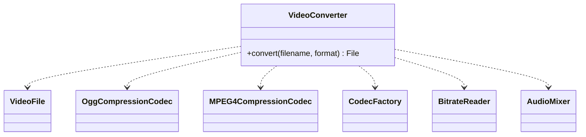
```mermaid
classDiagram
    class VideoConverter {
        +convert(filename, format) File
    }
    class VideoFile
    class OggCompressionCodec
    class MPEG4CompressionCodec
    class CodecFactory
    class BitrateReader
    class AudioMixer
    VideoConverter ..> VideoFile
    VideoConverter ..> OggCompressionCodec
    VideoConverter ..> MPEG4CompressionCodec
    VideoConverter ..> CodecFactory
    VideoConverter ..> BitrateReader
    VideoConverter ..> AudioMixer
```

```java
// Violation — client orchestrates subsystem directly
VideoFile file = new VideoFile(filename);
Codec codec = CodecFactory.extract(file);
VideoFile buffer = BitrateReader.read(file, codec);
VideoFile intermediate = BitrateReader.convert(buffer, codec);
File result = AudioMixer.fix(intermediate);

// Correct — Facade hides the complexity
File result = new VideoConverter().convert(filename, "mp4");
```

- Introduce a Facade that delegates to subsystem objects without adding business logic of its own
- Keep the underlying subsystem classes accessible for clients that need fine-grained control
- Use Facade to define clear entry points at each layer in a layered architecture
- Favor composition: the Facade holds references to subsystem objects rather than inheriting from them

### GOF-FACTORY-METHOD — Factory Method Pattern

Define an interface for creating an object, but let subclasses decide which class to instantiate. Factory Method defers instantiation to subclasses so that a class can delegate the responsibility of object creation without knowing the exact concrete type in advance. Use it when a class cannot anticipate the class of objects it must create, or when a class wants its subclasses to specify the objects it creates.

Why it matters:

Without Factory Method, a class that needs to create objects must hard-code the concrete class name, coupling itself directly to that implementation. Every new product type forces a change in the creator class. Factory Method eliminates this coupling, letting new product types be introduced by adding subclasses rather than modifying existing code.

Good practice:

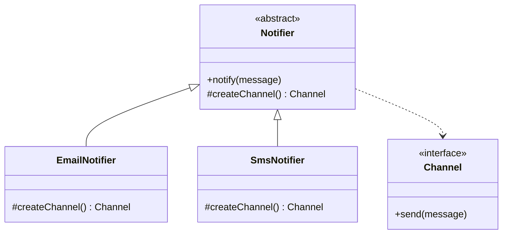
```mermaid
classDiagram
    class Notifier {
        <<abstract>>
        +notify(message)
        #createChannel() Channel
    }
    class EmailNotifier {
        #createChannel() Channel
    }
    class SmsNotifier {
        #createChannel() Channel
    }
    class Channel {
        <<interface>>
        +send(message)
    }
    Notifier <|-- EmailNotifier
    Notifier <|-- SmsNotifier
    Notifier ..> Channel
```

```java
// Violation — creator hard-codes the product
class Notifier {
    void notify(String msg) {
        EmailChannel ch = new EmailChannel();  // coupled to EmailChannel
        ch.send(msg);
    }
}

// Correct — factory method defers instantiation to subclass
abstract class Notifier {
    void notify(String msg) { createChannel().send(msg); }
    protected abstract Channel createChannel();
}
class EmailNotifier extends Notifier {
    protected Channel createChannel() { return new EmailChannel(); }
}
```

- Declare the factory method in the creator class as abstract or with a default implementation
- Each concrete creator subclass overrides the factory method to return the appropriate product
- Client code works with the creator and product through their abstract interfaces only
- Consider parameterized factory methods when the number of product variants is small and unlikely to grow

### GOF-FLYWEIGHT — Flyweight Pattern

Use sharing to support large numbers of fine-grained objects efficiently. Flyweight separates intrinsic state (shared and context-independent) from extrinsic state (context-dependent, supplied by the client) so that many objects can reuse the same intrinsic data. Use Flyweight when an application creates a very large number of similar objects and memory cost is a concern.

Why it matters:

Without Flyweight, applications that create thousands or millions of similar objects consume excessive memory and may become impractical to run. Duplicating identical state across every instance wastes resources and can push systems past their memory limits, especially in domains like text rendering, game maps, or particle systems.

Good practice:

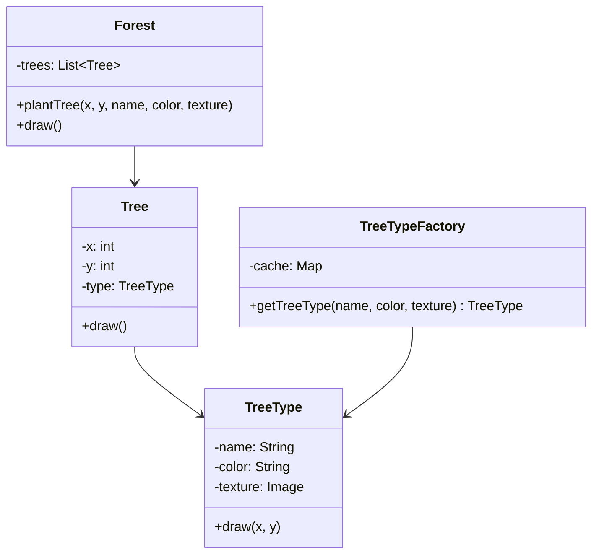
```mermaid
classDiagram
    class TreeType {
        -name: String
        -color: String
        -texture: Image
        +draw(x, y)
    }
    class TreeTypeFactory {
        -cache: Map
        +getTreeType(name, color, texture) TreeType
    }
    class Tree {
        -x: int
        -y: int
        -type: TreeType
        +draw()
    }
    class Forest {
        -trees: List~Tree~
        +plantTree(x, y, name, color, texture)
        +draw()
    }
    Tree --> TreeType
    Forest --> Tree
    TreeTypeFactory --> TreeType
```

```java
// Violation — each tree stores its own texture (megabytes duplicated)
class Tree { String name; String color; Image texture; int x; int y; }

// Correct — shared flyweight holds intrinsic state; tree holds only extrinsic (x, y)
TreeType type = TreeTypeFactory.getTreeType("Oak", "green", oakTexture);
Tree tree = new Tree(x, y, type);
```

- Identify and factor out intrinsic state into shared Flyweight objects managed by a Flyweight factory
- Pass extrinsic state to Flyweight methods as parameters rather than storing it in the shared object
- Use a factory or pool to ensure Flyweight instances are reused rather than duplicated
- Make Flyweight objects immutable to guarantee safe sharing across contexts

### GOF-INTERPRETER — Interpreter Pattern

Given a language, define a representation for its grammar along with an interpreter that uses the representation to interpret sentences in the language. Use Interpreter when you have a simple language to interpret, when efficiency is not critical, and when you can represent statements in the language as abstract syntax trees. Each grammar rule becomes a class; interpreting a sentence means traversing the tree of grammar objects.

Why it matters:

Without Interpreter, processing domain-specific expressions, rules, or queries typically requires hand-coded conditional logic scattered across the codebase. Interpreter makes each grammatical element explicit and extensible — adding a new expression type means adding a new class, not modifying existing parsing or evaluation logic.

Good practice:

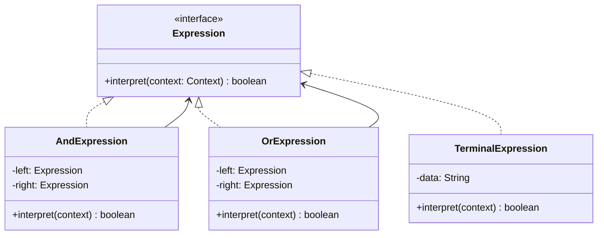
```mermaid
classDiagram
    class Expression {
        <<interface>>
        +interpret(context: Context) boolean
    }
    class AndExpression {
        -left: Expression
        -right: Expression
        +interpret(context) boolean
    }
    class OrExpression {
        -left: Expression
        -right: Expression
        +interpret(context) boolean
    }
    class TerminalExpression {
        -data: String
        +interpret(context) boolean
    }
    Expression <|.. AndExpression
    Expression <|.. OrExpression
    Expression <|.. TerminalExpression
    AndExpression --> Expression
    OrExpression --> Expression
```

```java
// Build and evaluate a simple rule: "John AND (Julie OR Robert)"
Expression isMale = new TerminalExpression("John");
Expression isFemale = new OrExpression(
    new TerminalExpression("Julie"),
    new TerminalExpression("Robert"));
Expression rule = new AndExpression(isMale, isFemale);

System.out.println(rule.interpret(new Context("John")));   // false
System.out.println(rule.interpret(new Context("Julie")));  // false
```

- Define an `Expression` interface with an `interpret(context)` method
- Map each grammar rule to a concrete class (terminal or non-terminal expression)
- Build the abstract syntax tree from grammar objects and call `interpret` to evaluate
- Prefer Interpreter for simple grammars; use a parser generator (ANTLR, PEG) for complex or performance-sensitive languages

### GOF-ITERATOR — Iterator Pattern

Provide a way to access the elements of an aggregate object sequentially without exposing its underlying representation. Extract traversal logic into a separate iterator object, allowing different traversal strategies over the same collection. Use Iterator when you need to traverse a collection without depending on its internal structure, or when you need to support multiple simultaneous or different-order traversals.

Why it matters:

Without Iterator, clients must know the internal structure of a collection to traverse it, creating tight coupling between traversal logic and data representation. Changing the collection's implementation forces changes in every piece of code that iterates over it, and supporting multiple traversal strategies becomes impractical.

Good practice:

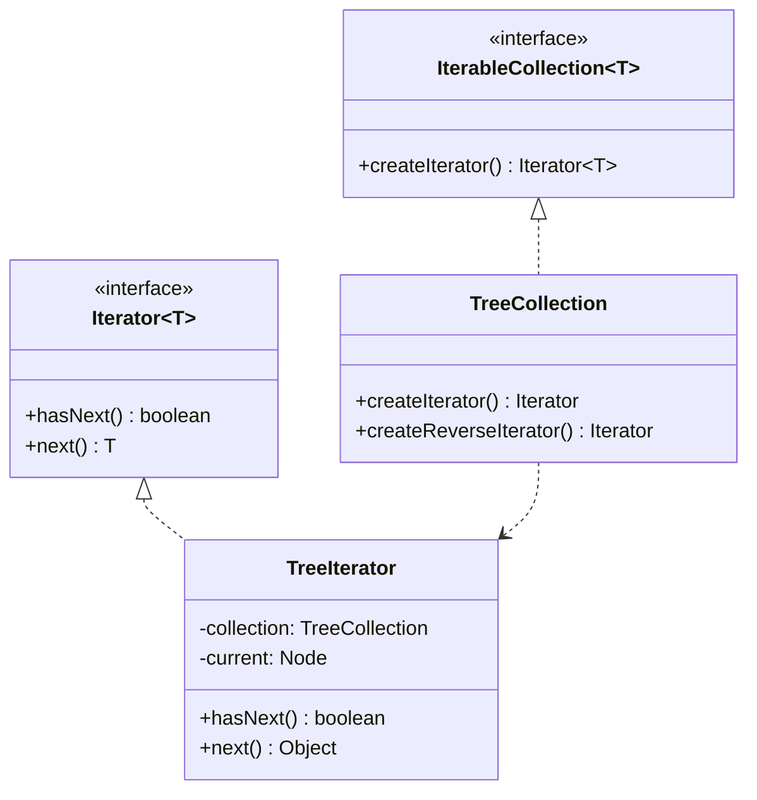
```mermaid
classDiagram
    class Iterator~T~ {
        <<interface>>
        +hasNext() boolean
        +next() T
    }
    class IterableCollection~T~ {
        <<interface>>
        +createIterator() Iterator~T~
    }
    class TreeCollection {
        +createIterator() Iterator
        +createReverseIterator() Iterator
    }
    class TreeIterator {
        -collection: TreeCollection
        -current: Node
        +hasNext() boolean
        +next() Object
    }
    IterableCollection <|.. TreeCollection
    Iterator <|.. TreeIterator
    TreeCollection ..> TreeIterator
```

```java
// Violation — client knows the tree's internal node structure
Node current = tree.getRoot();
while (current != null) { process(current); current = current.nextInOrder(); }

// Correct — iterate without knowing the tree's internals
Iterator<String> it = tree.createIterator();
while (it.hasNext()) { process(it.next()); }
```

- Define an Iterator interface with methods to access the current element and advance to the next
- Let each collection provide a factory method that creates an appropriate iterator for its structure
- Support multiple independent iterators over the same collection simultaneously
- Consider providing iterators for different traversal orders (e.g., depth-first, breadth-first, filtered)

### GOF-MEDIATOR — Mediator Pattern

Define an object that encapsulates how a set of objects interact. Mediator promotes loose coupling by keeping objects from referring to each other explicitly and lets you vary their interaction independently. Use Mediator when a set of objects communicate in well-defined but complex ways that result in interdependencies that are difficult to understand or maintain.

Why it matters:

Without Mediator, objects that must coordinate with one another develop direct many-to-many references, creating a tightly coupled network that is hard to understand, change, or reuse. Adding a new participant or modifying an interaction requires changes across multiple classes, and individual objects become difficult to reuse in isolation.

Good practice:

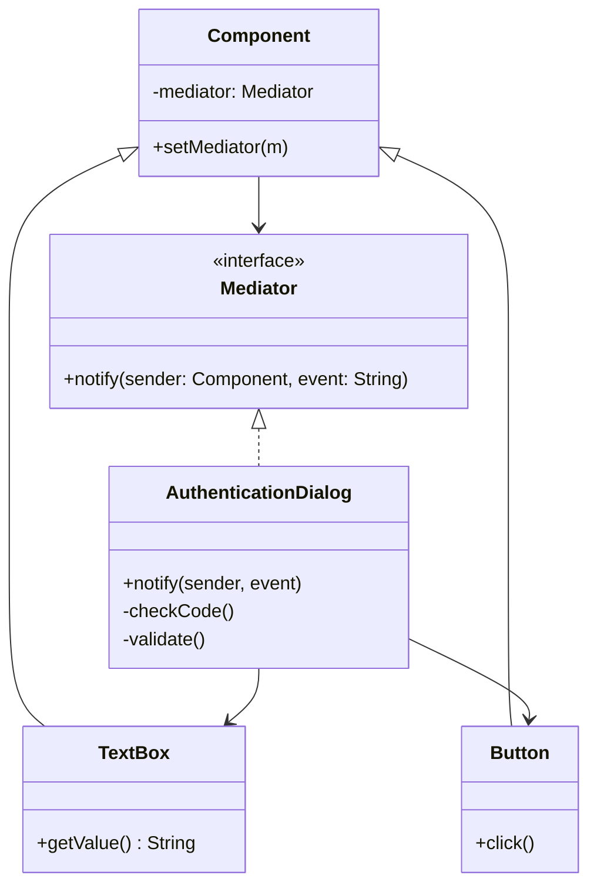
```mermaid
classDiagram
    class Mediator {
        <<interface>>
        +notify(sender: Component, event: String)
    }
    class AuthenticationDialog {
        +notify(sender, event)
        -checkCode()
        -validate()
    }
    class Component {
        -mediator: Mediator
        +setMediator(m)
    }
    class TextBox {
        +getValue() String
    }
    class Button {
        +click()
    }
    Mediator <|.. AuthenticationDialog
    Component <|-- TextBox
    Component <|-- Button
    Component --> Mediator
    AuthenticationDialog --> TextBox
    AuthenticationDialog --> Button
```

```java
// Violation — components call each other directly
loginButton.onClick(() -> {
    if (!loginField.isEmpty() && !passwordField.isEmpty()) {
        okButton.enable();
    }
});

// Correct — components notify the mediator; mediator decides what to do
loginButton.onClick(() -> mediator.notify(loginButton, "click"));
```

- Introduce a mediator object that all participants communicate through instead of directly with each other
- Have each participant (colleague) know only the mediator, not the other participants
- Centralize complex coordination protocols in the mediator to make them easier to understand and modify
- Keep individual colleague classes simple and focused on their own behavior, delegating coordination to the mediator

### GOF-MEMENTO — Memento Pattern

Capture and externalize an object's internal state without violating encapsulation, so that the object can be restored to this state later. The originator creates a memento containing a snapshot of its current state, and a caretaker holds the memento without examining or operating on its contents. Use Memento when you need to implement undo, checkpoints, or rollback mechanisms while preserving encapsulation.

Why it matters:

Without Memento, implementing undo or state restoration requires exposing an object's internal details to external code, violating encapsulation. This makes the originator's internals fragile and tightly coupled to the undo mechanism, and makes it difficult to change the object's representation without breaking the state-saving infrastructure.

Good practice:

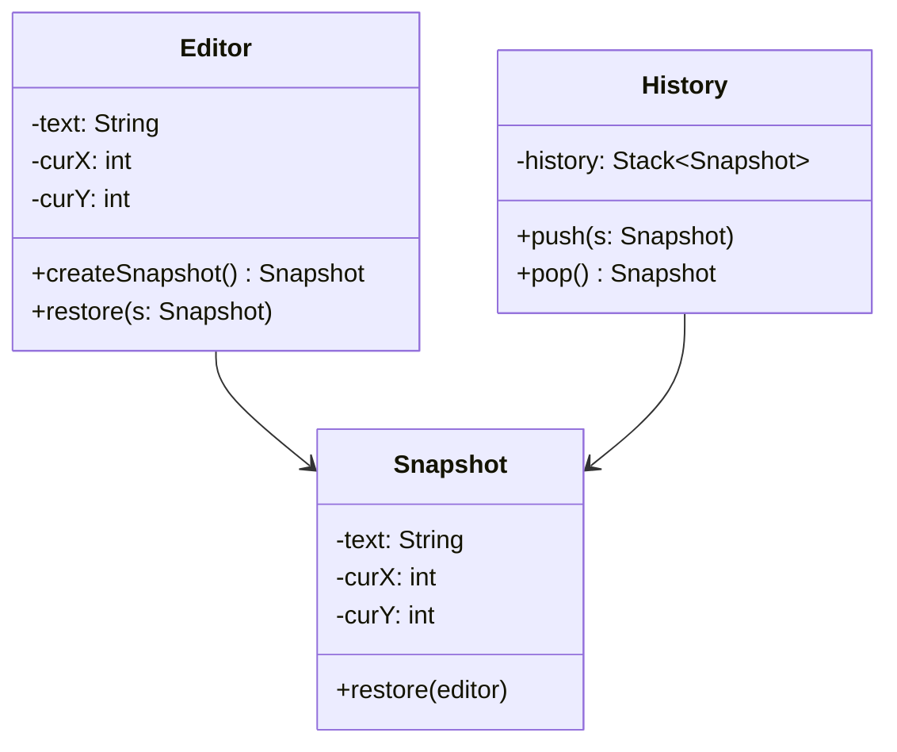
```mermaid
classDiagram
    class Editor {
        -text: String
        -curX: int
        -curY: int
        +createSnapshot() Snapshot
        +restore(s: Snapshot)
    }
    class Snapshot {
        -text: String
        -curX: int
        -curY: int
        +restore(editor)
    }
    class History {
        -history: Stack~Snapshot~
        +push(s: Snapshot)
        +pop() Snapshot
    }
    Editor --> Snapshot
    History --> Snapshot
```

```java
// Violation — caretaker accesses editor internals to save state
String savedText = editor.text;  // breaks encapsulation
int savedX = editor.curX;

// Correct — originator creates an opaque snapshot; caretaker just stores it
Snapshot snap = editor.createSnapshot();
history.push(snap);
// Later:
editor.restore(history.pop());
```

- Let only the originator create and restore from mementos, keeping internal state encapsulated
- Make the memento opaque to the caretaker — it stores mementos but never inspects or modifies their contents
- Use a narrow interface for the caretaker (store and retrieve) and a wide interface accessible only to the originator
- Store only the state delta when full snapshots are too expensive

### GOF-OBSERVER — Observer Pattern

Define a one-to-many dependency between objects so that when one object (the subject) changes state, all its dependents (observers) are notified and updated automatically. It decouples the subject from the concrete observers that depend on it. Use Observer when a change to one object requires changing an unknown or dynamic set of other objects, or when an object should notify others without making assumptions about who those others are.

Why it matters:

Without Observer, objects that need to stay consistent with one another must be tightly coupled, with the source of change explicitly calling each dependent. This makes it impossible to add new dependents without modifying the subject, creates rigid relationships, and causes inconsistencies when updates are missed.

Good practice:

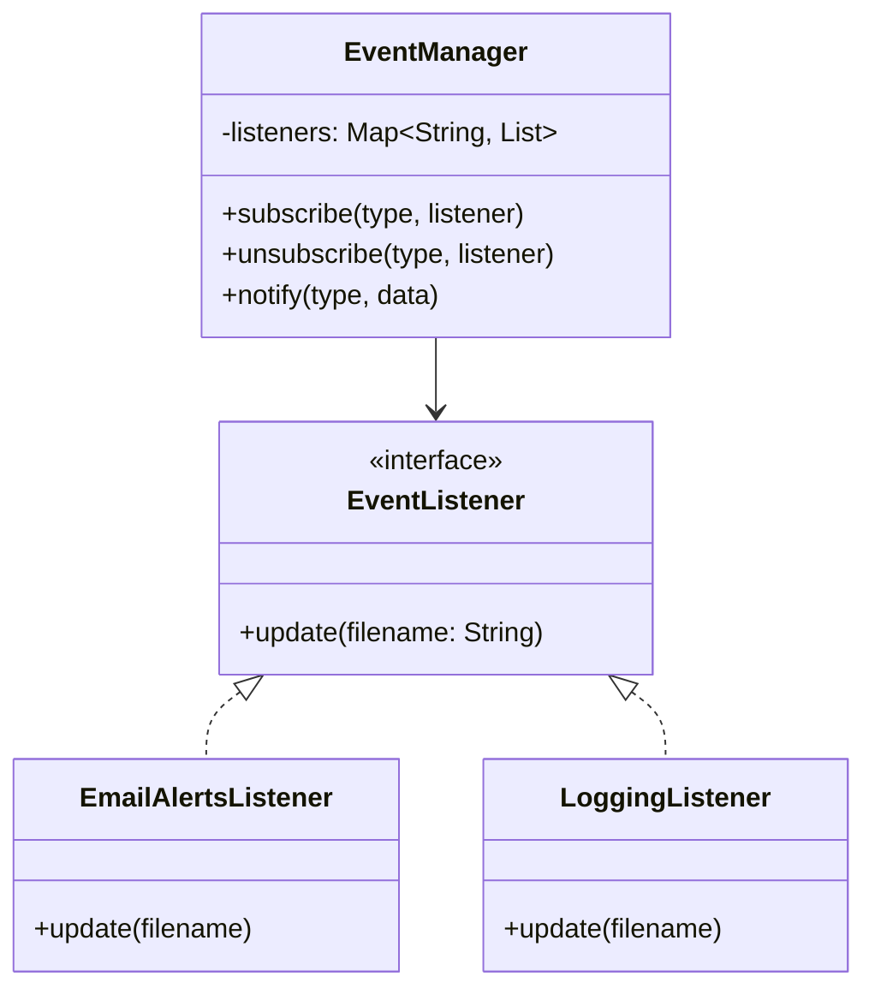
```mermaid
classDiagram
    class EventManager {
        -listeners: Map~String, List~
        +subscribe(type, listener)
        +unsubscribe(type, listener)
        +notify(type, data)
    }
    class EventListener {
        <<interface>>
        +update(filename: String)
    }
    class EmailAlertsListener {
        +update(filename)
    }
    class LoggingListener {
        +update(filename)
    }
    EventListener <|.. EmailAlertsListener
    EventListener <|.. LoggingListener
    EventManager --> EventListener
```

```java
// Violation — subject hard-codes its observers
class Editor {
    void save() {
        emailService.sendAlert(file);  // coupled to concrete observers
        logger.log(file);
    }
}

// Correct — observers register themselves; subject just notifies
editor.events.subscribe("open", logger);
editor.events.subscribe("save", emailAlerts);
editor.save();  // notifies all registered listeners generically
```

- Define a subject interface with methods to attach, detach, and notify observers
- Define an observer interface with an update method that the subject calls on state changes
- Let observers register and unregister dynamically at runtime
- Consider using a pull model (observers query the subject for details) or push model (subject sends change data) based on the specifics of the use case
- Manage observer lifecycle carefully to avoid dangling references and memory leaks

### GOF-PROGRAM-TO-INTERFACE — Program to an Interface, Not an Implementation

Declare variables, parameters, and return types using abstract interfaces rather than concrete classes. Clients should depend only on the abstract contract a collaborator fulfills, never on the specific class that implements it. This decouples the code that uses an object from the code that creates it, allowing implementations to be substituted without modifying the caller.

Why it matters:

When code depends on concrete types, every new implementation forces changes in the consumers. This makes the system rigid and difficult to test, because swapping in a mock, stub, or alternative implementation requires rewriting call sites. Programming to an interface confines the impact of change to the implementation side and keeps the rest of the system stable.

Good practice:

Program to the `Sorter` interface, not to `QuickSort`.

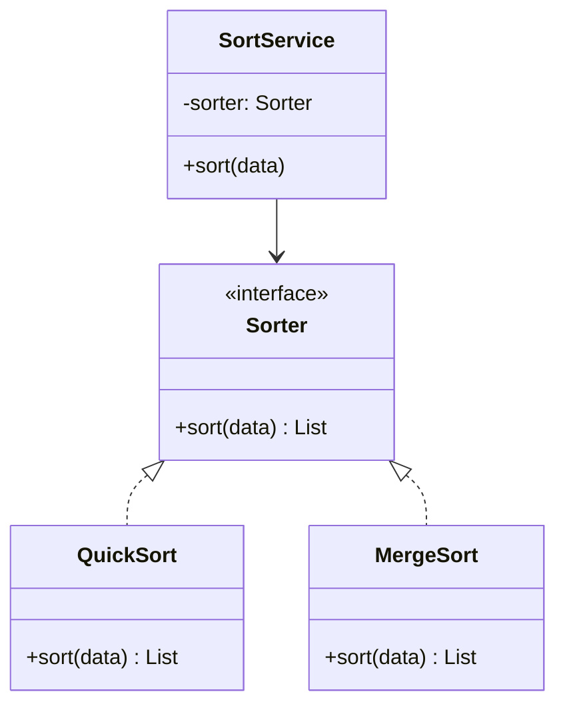
```mermaid
classDiagram
    class SortService {
        -sorter: Sorter
        +sort(data)
    }
    class Sorter {
        <<interface>>
        +sort(data) List
    }
    class QuickSort {
        +sort(data) List
    }
    class MergeSort {
        +sort(data) List
    }
    SortService --> Sorter
    Sorter <|.. QuickSort
    Sorter <|.. MergeSort
```

```java
// Violation — typed to a concrete class
QuickSort sorter = new QuickSort();
sorter.sort(data);

// Correct — typed to the interface; implementation injected
Sorter sorter = new QuickSort();  // or MergeSort, or a test double
sorter.sort(data);
```

- Define abstract interfaces or base types for every major role in the system
- Use factory methods or dependency injection to create concrete instances, keeping creation separate from use
- Ensure subtypes honor the contract of the interface they implement (Liskov substitutability)
- Write tests against the interface so that any conforming implementation can be verified with the same suite

### GOF-PROTOTYPE — Prototype Pattern

Specify the kinds of objects to create using a prototypical instance, and create new objects by copying this prototype. Use Prototype when a system should be independent of how its products are created, composed, and represented, and when the classes to instantiate are specified at runtime. The pattern is particularly useful when creating an object from scratch is expensive but copying an existing, properly configured instance is cheap.

Why it matters:

Without Prototype, adding new types of objects to a system often requires new classes or factory modifications. When object initialization is costly (complex state, database loads, deep hierarchies), repeatedly constructing from scratch wastes resources and duplicates setup logic. Prototype avoids these problems by cloning a ready-made instance.

Good practice:

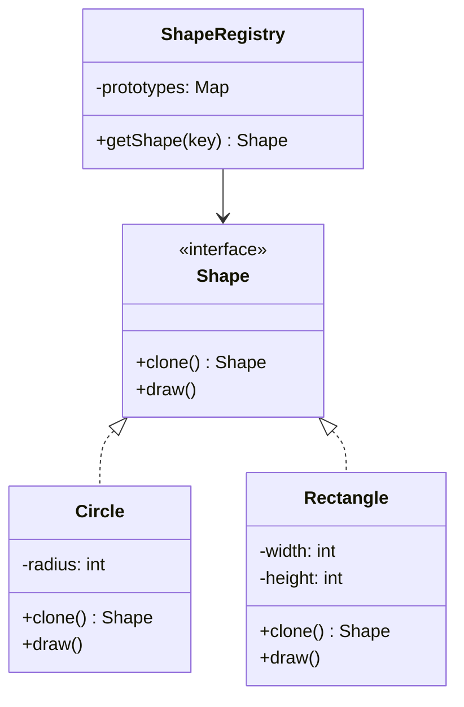
```mermaid
classDiagram
    class Shape {
        <<interface>>
        +clone() Shape
        +draw()
    }
    class Circle {
        -radius: int
        +clone() Shape
        +draw()
    }
    class Rectangle {
        -width: int
        -height: int
        +clone() Shape
        +draw()
    }
    class ShapeRegistry {
        -prototypes: Map
        +getShape(key) Shape
    }
    Shape <|.. Circle
    Shape <|.. Rectangle
    ShapeRegistry --> Shape
```

```java
// Correct — clone a pre-configured prototype instead of rebuilding
ShapeRegistry registry = new ShapeRegistry();
registry.register("circle", new Circle(10));

Shape s = registry.getShape("circle").clone();  // cheap copy, no re-init
```

- Implement a `clone` method on the prototype interface that performs a deep copy of the object's state
- Maintain a registry of prototypes that can be looked up by key and cloned on demand
- Be explicit about deep versus shallow copy semantics to avoid shared-state bugs
- Use Prototype when the number of object configurations is large or determined at runtime, making a class-per-variant approach impractical

### GOF-PROXY — Proxy Pattern

Provide a surrogate or placeholder for another object to control access to it. The proxy implements the same interface as the real subject, allowing it to be used transparently in its place. Common variants include remote proxies (representing objects in different address spaces), virtual proxies (creating expensive objects on demand), and protection proxies (controlling access based on permissions).

Why it matters:

Without Proxy, clients must handle concerns like lazy initialization, access control, logging, and remote communication directly, mixing infrastructure logic with business logic. This leads to duplicated cross-cutting code and makes it difficult to change how and when the real object is accessed.

Good practice:

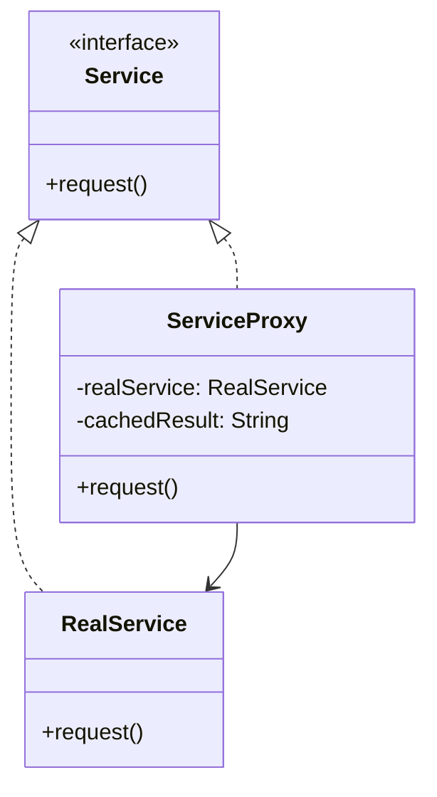
```mermaid
classDiagram
    class Service {
        <<interface>>
        +request()
    }
    class RealService {
        +request()
    }
    class ServiceProxy {
        -realService: RealService
        -cachedResult: String
        +request()
    }
    Service <|.. RealService
    Service <|.. ServiceProxy
    ServiceProxy --> RealService
```

```java
// Violation — eager, unguarded access to expensive resource
class Client {
    private DatabaseService db = new DatabaseService();  // slow init always
    void query() { db.execute(sql); }
}

// Correct — virtual proxy defers creation until actually needed
class DatabaseServiceProxy implements DatabaseService {
    private DatabaseService real;
    public ResultSet execute(String sql) {
        if (real == null) real = new RealDatabaseService();  // lazy init
        return real.execute(sql);
    }
}
```

- Give the proxy the same interface as the real subject so clients need not distinguish between them
- Use virtual proxies to defer costly creation until the object is actually needed
- Use protection proxies to enforce access rights in a single, consistent location
- Keep the proxy thin — delegate real work to the subject and limit the proxy to its cross-cutting concern

### GOF-SINGLETON — Singleton Pattern

Ensure a class has only one instance and provide a global point of access to it. Use Singleton when there must be exactly one instance of a class (e.g., a single connection pool, configuration registry, or logging facility), and when that instance must be accessible from a well-known access point. Apply this pattern sparingly: in most situations, dependency injection of a shared instance is a better alternative that provides the same "single instance" semantics without the drawbacks listed below.

Why it matters:

Without a controlled mechanism for unique instantiation, code may accidentally create multiple instances of something that should be shared (database connection pools, hardware drivers), leading to resource leaks or inconsistent state. However, overusing Singleton introduces hidden global state, makes unit testing difficult because the instance cannot be easily replaced with a test double, and creates tight coupling between the Singleton and every class that references it.

**Modern consensus:** Singleton is widely considered an anti-pattern when used as a substitute for dependency injection. Prefer injecting a shared instance through a DI container, reserving Singleton for cases where a global point of access is genuinely required.

Good practice:

```mermaid
classDiagram
    class ConnectionPool {
        -instance: ConnectionPool
        -ConnectionPool()
        +getInstance() ConnectionPool
        +getConnection() Connection
    }
```

```java
// Classic thread-safe Singleton (static holder idiom)
public class ConnectionPool {
    private ConnectionPool() {}
    private static class Holder {
        static final ConnectionPool INSTANCE = new ConnectionPool();
    }
    public static ConnectionPool getInstance() { return Holder.INSTANCE; }
}

// Preferred modern approach — inject as a shared instance via DI
// rather than calling ConnectionPool.getInstance() everywhere
@Bean
public ConnectionPool connectionPool() { return new ConnectionPool(); }
```

- Prefer dependency injection of a shared instance over direct Singleton access; reserve the pattern for cases where a single point of access is genuinely required by the domain
- If you do use Singleton, provide a way to reset or replace the instance in tests (e.g., an internal setter or scope-based override)
- Ensure thread-safe initialization (static holder idiom, `std::call_once`, synchronized block, or language-level guarantees)
- Keep the Singleton's responsibilities narrow; it should manage its own uniqueness, not accumulate unrelated logic

### GOF-STATE — State Pattern

Allow an object to alter its behavior when its internal state changes, making the object appear to change its class. Encapsulate state-specific behavior into separate state objects and delegate state-dependent requests to the current state object. Use State when an object's behavior depends on its state and it must change behavior at runtime depending on that state, especially when operations contain large conditional statements that depend on the object's state.

Why it matters:

Without State, state-dependent behavior is implemented through large conditional blocks that grow with every new state, becoming difficult to read, maintain, and extend. Adding a new state requires modifying every operation that has state-dependent behavior, spreading related logic across multiple methods and increasing the risk of errors.

Good practice:

```mermaid
classDiagram
    class TrafficLight {
        -state: State
        +change()
        +setState(s: State)
    }
    class State {
        <<interface>>
        +change(light: TrafficLight)
    }
    class RedState {
        +change(light)
    }
    class GreenState {
        +change(light)
    }
    class YellowState {
        +change(light)
    }
    State <|.. RedState
    State <|.. GreenState
    State <|.. YellowState
    TrafficLight --> State
```

```java
// Violation — monolithic switch on state field
void change() {
    switch (state) {
        case RED: state = GREEN; break;
        case GREEN: state = YELLOW; break;
        case YELLOW: state = RED; break;
    }
}

// Correct — each state handles its own transition
class RedState implements State {
    public void change(TrafficLight light) {
        light.setState(new GreenState());
    }
}
```

- Create a State interface with methods for each state-dependent operation
- Implement each state as a concrete class that encapsulates the behavior for that state
- Delegate state-dependent requests from the context to the current state object
- Define state transitions in the state objects themselves or in the context, keeping the transition logic explicit and localized
- Make state objects singletons or flyweights when they carry no instance-specific data

### GOF-STRATEGY — Strategy Pattern

Define a family of algorithms, encapsulate each one, and make them interchangeable. Strategy lets the algorithm vary independently from the clients that use it. Use Strategy when you need different variants of an algorithm, when an algorithm uses data that clients should not know about, or when a class defines many behaviors that appear as multiple conditional statements in its operations.

Why it matters:

Without Strategy, algorithm variants are embedded directly in the class that uses them, typically as conditional branches. This makes the class harder to understand and maintain, prevents reuse of individual algorithms, and requires modifying the class every time a new algorithm is added or an existing one changes.

Good practice:

```mermaid
classDiagram
    class RouteStrategy {
        <<interface>>
        +buildRoute(origin, dest) Route
    }
    class RoadStrategy {
        +buildRoute(origin, dest) Route
    }
    class PublicTransportStrategy {
        +buildRoute(origin, dest) Route
    }
    class WalkingStrategy {
        +buildRoute(origin, dest) Route
    }
    class Navigator {
        -strategy: RouteStrategy
        +setStrategy(s: RouteStrategy)
        +buildRoute(origin, dest) Route
    }
    RouteStrategy <|.. RoadStrategy
    RouteStrategy <|.. PublicTransportStrategy
    RouteStrategy <|.. WalkingStrategy
    Navigator --> RouteStrategy
```

```java
// Violation — routing algorithm embedded in Navigator with conditionals
Route buildRoute(String origin, String dest, String mode) {
    if ("car".equals(mode)) { /* road algorithm */ }
    else if ("bus".equals(mode)) { /* transit algorithm */ }
    else { /* walking algorithm */ }
}

// Correct — inject the strategy; Navigator delegates to it
navigator.setStrategy(new PublicTransportStrategy());
Route route = navigator.buildRoute("A", "B");
```

- Define a Strategy interface that all algorithm variants implement
- Let the context hold a reference to a Strategy and delegate algorithmic work to it
- Allow strategies to be swapped at runtime through setter injection or constructor injection
- Factor shared algorithm logic into a base class if strategies share common steps
- Prefer Strategy over subclassing the context when the variation is limited to a single aspect of behavior

### GOF-TEMPLATE-METHOD — Template Method Pattern

Define the skeleton of an algorithm in a method, deferring some steps to subclasses. Template Method lets subclasses redefine certain steps of an algorithm without changing the algorithm's structure. Use Template Method when you have an invariant algorithm structure with steps that vary across implementations, and when you want to centralize common behavior in a single place to avoid code duplication among subclasses.

Why it matters:

Without Template Method, subclasses that share a common algorithmic structure end up duplicating the skeleton code, leading to inconsistencies and maintenance burdens. Changes to the overall algorithm must be replicated across every subclass, and there is no enforcement that subclasses follow the intended sequence of steps.

Good practice:

```mermaid
classDiagram
    class DataMiner {
        +mine(path)
        -openFile(path)*
        -extractData()*
        -parseData()*
        -analyzeData()
        -sendReport()
    }
    class PDFDataMiner {
        -openFile(path)
        -extractData()
        -parseData()
    }
    class CSVDataMiner {
        -openFile(path)
        -extractData()
        -parseData()
    }
    DataMiner <|-- PDFDataMiner
    DataMiner <|-- CSVDataMiner
```

```java
// Violation — skeleton duplicated in every subclass
class PDFMiner {
    void mine() { openPDF(); extractPDF(); parsePDF(); analyze(); report(); }
}
class CSVMiner {
    void mine() { openCSV(); extractCSV(); parseCSV(); analyze(); report(); }
}

// Correct — skeleton in base class; only format-specific steps overridden
abstract class DataMiner {
    final void mine(String path) {  // template method — final to prevent override
        openFile(path); extractData(); parseData(); analyzeData(); sendReport();
    }
    protected abstract void openFile(String path);
    protected abstract void extractData();
    protected abstract void parseData();
    protected void analyzeData() { /* default analysis */ }
    protected void sendReport() { /* default report */ }
}
```

- Define the template method in the base class as a final or non-overridable method to lock down the algorithm structure
- Mark primitive operations (required steps) as abstract methods that subclasses must implement
- Provide hook methods with default (often empty) implementations for optional extension points
- Minimize the number of primitive operations a subclass must override to keep subclassing manageable
- Apply the Hollywood Principle: the base class calls subclass methods, not the other way around

### GOF-VISITOR — Visitor Pattern

Represent an operation to be performed on elements of an object structure. Visitor lets you define a new operation without changing the classes of the elements on which it operates. Use Visitor when you need to perform many distinct and unrelated operations on an object structure without polluting those classes, and when the object structure is stable but new operations are frequently added.

Why it matters:

Without Visitor, adding a new operation to a class hierarchy requires modifying every class in the hierarchy. This violates the open-closed principle when operations change frequently. Visitor externalizes operations into visitor objects, so adding a new operation is a matter of adding a new visitor class without touching the element classes.

Good practice:

```mermaid
classDiagram
    class Shape {
        <<interface>>
        +accept(v: Visitor)
    }
    class Circle {
        +radius: double
        +accept(v: Visitor)
    }
    class Rectangle {
        +width: double
        +height: double
        +accept(v: Visitor)
    }
    class Visitor {
        <<interface>>
        +visitCircle(c: Circle)
        +visitRectangle(r: Rectangle)
    }
    class AreaCalculator {
        +visitCircle(c: Circle)
        +visitRectangle(r: Rectangle)
    }
    class XMLExporter {
        +visitCircle(c: Circle)
        +visitRectangle(r: Rectangle)
    }
    Shape <|.. Circle
    Shape <|.. Rectangle
    Visitor <|.. AreaCalculator
    Visitor <|.. XMLExporter
    Shape ..> Visitor
```

```java
// Violation — each new operation requires modifying Circle and Rectangle
class Circle {
    double area() { return Math.PI * radius * radius; }
    String toXml() { return "<circle r='" + radius + "'/>"; }  // unrelated concerns
}

// Correct — element accepts a visitor; new operations = new visitor classes
class Circle implements Shape {
    public void accept(Visitor v) { v.visitCircle(this); }
}
class AreaCalculator implements Visitor {
    public void visitCircle(Circle c) { total += Math.PI * c.radius * c.radius; }
    public void visitRectangle(Rectangle r) { total += r.width * r.height; }
}
```

- Define a `Visitor` interface with a `visit` method for each concrete element type
- Each element class implements `accept(Visitor v)` and calls `v.visit(this)` (double dispatch)
- Add new operations by adding new Visitor implementations — no changes to element classes
- Use Visitor when the element hierarchy is stable and new operations are the common change; prefer other patterns if new element types are frequently added

### GOF-LAW-OF-DEMETER — Law of Demeter (Principle of Least Knowledge)

A method should only call methods on: (1) the object itself, (2) objects passed as parameters, (3) objects it creates locally, and (4) its direct component fields. Never call a method on an object returned by another call — "don't talk to strangers."

Why it matters:

Long method chains couple a caller to the internal structure of objects it has no business knowing about. If any intermediate object's structure changes, the caller breaks even though it has no direct relationship with those types. Violations produce fragile, tightly coupled code where changes ripple unexpectedly.

Good practice:

- Introduce a method on the intermediate object that provides what the caller needs, rather than exposing the chain
- `order.getPaymentCardNumber()` instead of `order.getPayment().getCreditCard().getNumber()`
- Ask: "does this class really need to know about the type returned by that getter?" If not, push the behaviour inward
- Law of Demeter violations often signal Feature Envy — move the behaviour to where the data lives

### GOF-NULL-OBJECT — Null Object Pattern

Instead of returning or passing `null` where a collaborator is optional, provide a do-nothing object that implements the same interface but takes no action. Callers treat the null object identically to a real object, eliminating conditional null checks throughout the codebase.

Why it matters:

Null references propagate NullPointerExceptions and defensive null checks throughout codebases. Every caller must check before calling; callers that forget create silent bugs. The Null Object pattern moves the "do nothing" decision into a dedicated class, making the contract explicit and the calling code clean.

Good practice:

- Define an interface for the optional collaborator
- Create a no-op implementation that performs no action (NoOpLogger, NoOpNotifier)
- Inject the null object when the feature is disabled or absent
- Prefer this over Optional<Collaborator> when the absent case is truly "do nothing"
