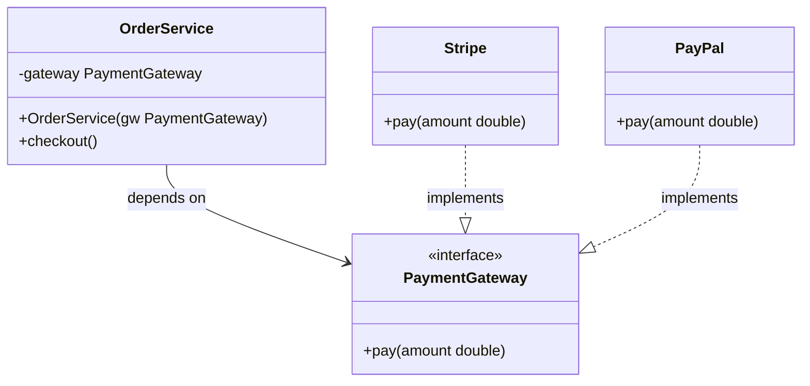
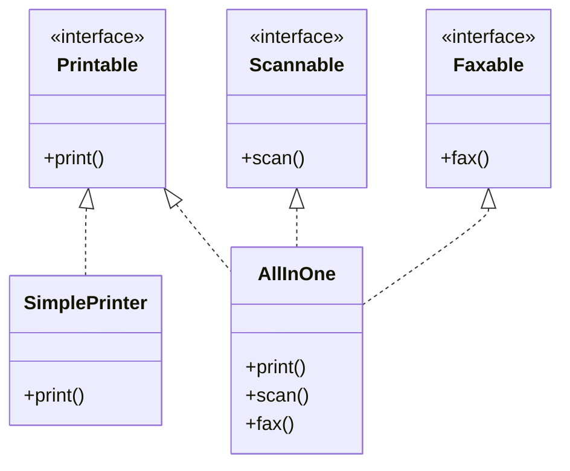
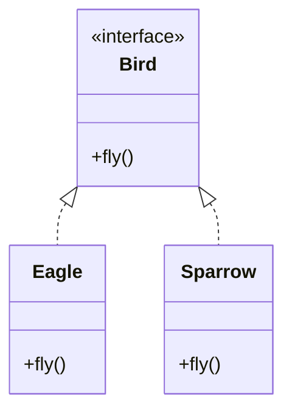
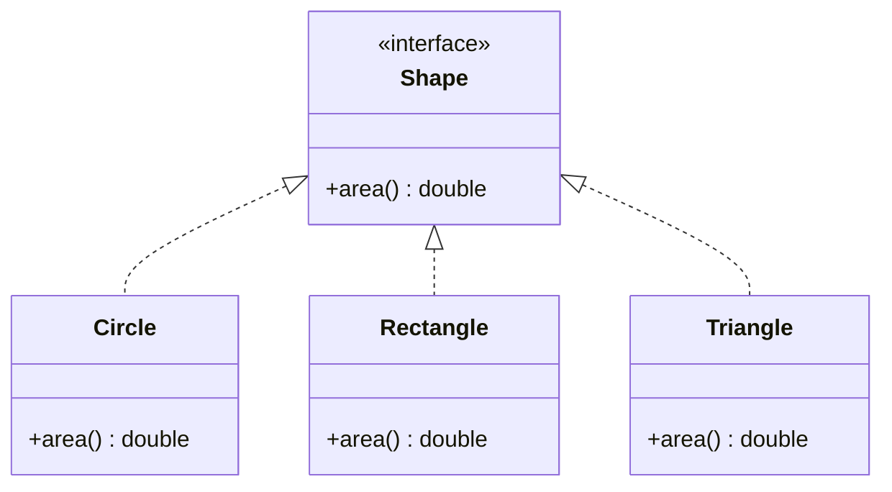
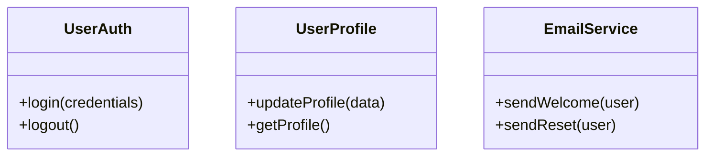

# .principles prime context — solid
# Sections: Principle · Why it matters · Good practice

### SOLID-DIP — Dependency Inversion Principle

High-level modules should not depend on low-level modules; both should depend on abstractions. Abstractions should not depend on details; details should depend on abstractions. Source code dependencies must point toward abstractions, not concrete implementations.

Why it matters:

When high-level policy directly instantiates or imports low-level detail (a specific database driver, a concrete HTTP client), the policy is coupled to that detail. Swapping the detail requires changing the policy. Testability suffers because tests cannot substitute a fake for the real dependency. Architectural layers collapse into a tangle.

Good practice:

`OrderService` depends on the `PaymentGateway` abstraction — not on `Stripe` or `PayPal` directly. Either implementation can be injected at runtime or swapped in tests.



```java
// Violation — OrderService locked to Stripe; untestable
class OrderService {
    void checkout(Order o) {
        Stripe stripe = new Stripe(); // hard dependency on concrete class
        stripe.charge(o.total());
    }
}

// Correct — depend on the abstraction; inject the detail
interface PaymentGateway {
    void pay(double amount);
}
class Stripe implements PaymentGateway {
    public void pay(double amount) { /* Stripe API call */ }
}
class PayPal implements PaymentGateway {
    public void pay(double amount) { /* PayPal API call */ }
}

class OrderService {
    private final PaymentGateway gateway;

    OrderService(PaymentGateway gw) { this.gateway = gw; } // inject at construction

    void checkout(Order o) { gateway.pay(o.total()); }
}

// Inject Stripe or PayPal at runtime; inject a fake in tests
new OrderService(new Stripe());
new OrderService(new PayPal());
new OrderService(new FakePaymentGateway()); // test double
```

- Use a dependency injection container or factory at the composition root — not inside business logic
- Define interfaces in the high-level module's package; let the low-level module implement them (the "plugin" architecture)

### SOLID-ISP — Interface Segregation Principle

Clients should not be forced to depend on interfaces they do not use. Large, general-purpose interfaces should be split into smaller, focused ones so that each client depends only on the methods it actually calls.

Why it matters:

Fat interfaces create phantom coupling: a class that uses only one method of a ten-method interface is recompiled (and risks change) whenever any of the other nine methods change. This couples unrelated clients and forces implementors to stub or throw for methods they do not need.

Good practice:

Split a fat interface into focused role interfaces. `SimplePrinter` implements only `Printable`; `AllInOne` implements all three — neither is forced to stub anything.



```java
// Violation — SimplePrinter forced to implement methods it doesn't use
interface Machine {
    void print();
    void scan();
    void fax();
}
class SimplePrinter implements Machine {
    public void print() { ... }
    public void scan()  { throw new UnsupportedOperationException(); } // forced stub
    public void fax()   { throw new UnsupportedOperationException(); } // forced stub
}

// Correct — each interface is a focused role
interface Printable { void print(); }
interface Scannable { void scan(); }
interface Faxable   { void fax(); }

class SimplePrinter implements Printable {
    public void print() { ... }
}
class AllInOne implements Printable, Scannable, Faxable {
    public void print() { ... }
    public void scan()  { ... }
    public void fax()   { ... }
}
```

- Define role interfaces: each interface represents one role a client expects
- In dynamic languages, use duck typing or structural protocols for the same effect

### SOLID-LSP — Liskov Substitution Principle

Subtypes must be substitutable for their base types without altering the correctness of the program. Any code that uses a reference to a base class must work correctly with any subclass instance, without needing to know the concrete type.

Why it matters:

Violations break the contract that polymorphism depends on. Callers are forced to add type checks, switch statements, or special-case logic for subtypes, negating the benefit of inheritance and introducing fragility whenever a new subtype is added.

Good practice:

Every subtype must honour the full contract of the base type. Both `Eagle` and `Sparrow` satisfy the `Bird` contract — `makeFly` works correctly with either, with no special-casing.



```java
// Violation — Penguin breaks the Bird contract
class Penguin extends Bird {
    @Override
    void fly() { throw new UnsupportedOperationException("Penguins can't fly"); }
}
void makeFly(Bird bird) {
    bird.fly(); // blows up for Penguin — LSP violated
}

// Correct — every Bird subtype honours fly()
interface Bird {
    void fly();
}
class Eagle implements Bird {
    public void fly() { /* soar */ }
}
class Sparrow implements Bird {
    public void fly() { /* flutter */ }
}

void makeFly(Bird bird) {
    bird.fly(); // works with any Bird
}
makeFly(new Eagle());   // OK
makeFly(new Sparrow()); // OK
```

- Prefer composition over inheritance when a subtype cannot honour the full base contract
- Write tests against the base type and run them against all subtypes (Liskov test suite pattern)
- Use the "is-substitutable-for" test, not just the "is-a" test, when modelling hierarchies

### SOLID-OCP — Open/Closed Principle

Software entities — classes, modules, functions — should be open for extension but closed for modification. New behaviour should be addable by writing new code, not by changing existing, proven code.

Why it matters:

Every time existing code is modified to add new behaviour, previously working functionality is at risk of regression. Systems that require source changes to accommodate new requirements accumulate risk with each change and resist safe deployment.

Good practice:

Define an abstraction, then add new behaviour by implementing it — the `Shape` interface never changes as new shapes are added.



```java
// Violation — must modify existing code for every new shape
double totalArea(List<Object> shapes) {
    double total = 0;
    for (Object s : shapes) {
        if (s instanceof Circle c)       total += Math.PI * c.radius * c.radius;
        else if (s instanceof Rectangle r) total += r.width * r.height;
        // add new shape? edit this method
    }
    return total;
}

// Correct — add a new shape without touching existing code
interface Shape {
    double area();
}
class Circle implements Shape {
    public double area() { return Math.PI * radius * radius; }
}
class Rectangle implements Shape {
    public double area() { return width * height; }
}
class Triangle implements Shape {
    public double area() { return 0.5 * base * height; }
}

double totalArea(List<Shape> shapes) {
    return shapes.stream().mapToDouble(Shape::area).sum();
}
```

- Apply the principle selectively — not all variation is worth abstracting; wait for the second change request before introducing an abstraction

### SOLID-SRP — Single Responsibility Principle

A module, class, or function should have one, and only one, reason to change. Each unit of code is responsible to a single actor — a single stakeholder or group of stakeholders who can require it to change.

Why it matters:

When a class serves multiple stakeholders, a change for one can inadvertently break behaviour that another depends on. Mixed responsibilities create fragile code where unrelated concerns are coupled together, making every change risky and every test combinatorial.

Good practice:

Split each responsibility into its own class. The diagram and code below show a monolithic `User` class refactored into three focused classes — each owned by a different stakeholder.



```java
// Violation — one class, three reasons to change
class User {
    void login(Credentials c) { ... }
    void updateProfile(ProfileData d) { ... }
    void sendWelcomeEmail() { ... }
}

// Correct — each class has exactly one reason to change
class UserAuth {
    void login(Credentials c) { ... }
}
class UserProfile {
    void updateProfile(ProfileData d) { ... }
}
class EmailService {
    void sendWelcome(User u) { ... }
}
```

- Use the "one sentence without 'and'" test: if you need "and" to describe the class, it has too many responsibilities
- Group code by reason-to-change, not by technical layer

