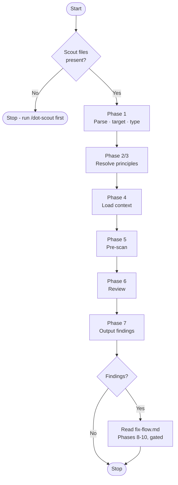

# Audit

> **⛔ PREREQUISITE - CHECK THIS BEFORE ANYTHING ELSE**
>
> Determine whether an explicit principle spec is present in `$ARGUMENTS`: ` --with `, one or more `@`-prefixed tokens, or ` on ` (space-on-space).
>
> If **no explicit spec** is present, `/dot-scout` must have run first: `.agents/principles-catalog/active.md` or `.agents/instructions/review.md` must exist. If neither does → **STOP. Respond only with:**
>
> > ⚠️ `/dot-audit` requires `/dot-scout` to have been run first.
> > Run `/dot-scout` to analyse the project and generate the principle files that this command needs, then retry.

Review a file, directory, or inline code against its activated principles. The core review runs in seven phases (1-7). Three optional gated phases (8-10, in `fix-flow.md`) handle fix, commit, and PR - each requires explicit user approval before entry.

The mechanical steps are scripts in `.agents/principles-catalog/bin/`; run each **once** and work from its output. Do not read `.context-*.md` files or `.principles` files by hand.



## Phase 1 - Parse Arguments, Resolve Input, and Detect Artifact Type

### Step 1 - Parse Arguments for Explicit Principle Spec

Check `$ARGUMENTS` for an explicit principle spec using this precedence:

1. **`--with <spec>`** - if `$ARGUMENTS` contains ` --with `, extract everything after `--with ` as the spec; the text before `--with ` is the target input.
2. **`@<group>` token** - if `$ARGUMENTS` contains one or more `@`-prefixed tokens, extract all `@`-prefixed tokens as the spec (space-joined); the remaining tokens form the target input.
3. **`<spec> on <target>`** - if `$ARGUMENTS` contains ` on ` (space-on-space), split on the first occurrence: left side is the spec, right side is the target input.
4. **No spec** - treat all of `$ARGUMENTS` as the target input (normal mode).

If an explicit spec was detected, record **principle-spec** and set **explicit-mode: true**. Otherwise set **explicit-mode: false**.

### Step 2 - Resolve Input

- Empty (explicit-mode false) → respond "What would you like me to review?" and stop.
- Empty (explicit-mode true) → use the current working directory as target.
- "current changes" (or similar) → the files from `git diff HEAD --name-only` (and untracked files); if there are none, `git diff HEAD~1 HEAD --name-only`.
- File path → that file.
- Directory path → list reviewable files with Glob; exclude binaries, lock files, `node_modules`, `vendor`, `dist`, `build`, `.git`, and build artifacts.
- Inline code or text → use it directly.

### Step 3 - Detect Artifact Type

Match the target file(s) against the type definitions in `.agents/principles-catalog/layers/artifact-types.yaml` by extension, filename or path pattern, in precedence order (infra before config for ambiguous YAML). Record the type: **`code`** | **`docs`** | **`config`** | **`infra`** | **`schema`** | **`pipeline`**. For a directory with mixed types use the most common one and note the mix.

### Step 4 - Git Context (only when needed)

Load git history only if the target is "current changes", or if a loaded principle entry in Phase 4 depends on change history. Then run, against the target: `git diff HEAD -- <target>` (if empty: `git diff HEAD~1 HEAD -- <target>`) and `git log --oneline -5 -- <target>`, and keep the results as `$GIT_DIFF` and `$GIT_LOG`. If git is unavailable or there is no history, use empty strings and review the snapshot only.

## Phase 2 - Resolve Principles

In normal mode first check that the generated files are current, and refresh them if not:

```
bash .agents/principles-catalog/bin/emit.sh --check || bash .agents/principles-catalog/bin/emit.sh
```

Then run **one** command for the target (use the directory that contains it):

```
bash .agents/principles-catalog/bin/resolve.sh --seed <type> <target-dir>                  # normal mode
bash .agents/principles-catalog/bin/resolve.sh --spec "<principle-spec>" <target-dir>       # explicit mode
```

The output is one record per line: `ACTIVE|ID|added-by|flags`, plus `EXCLUDED`, `REINSTATED`, `LOCK-OVERRIDE`, `WAIVED`, `EXPIRED`, `TRIMMED`, `GROUP`, `FILE` and `WARN` records. In explicit mode an unknown group or ID makes the script exit with status 3 and a message; relay it and stop.

- The **active set** is the `ACTIVE` IDs. `flags` = `locked` means the organization requires the principle.
- `WAIVED` principles are not reviewed; list them in the report. `LOCK-OVERRIDE` means a project tried to exclude a locked principle; report that as a finding with principle ID `GOVERNANCE-LOCK` (severity HIGH).
- `REINSTATED` means a deeper `.principles` file added back a principle that an outer file excluded; the principle is active and is reviewed. It is information, not a finding.
- Relay any `WARN` record (for example an unknown group) in the report.
- If the target directory contains deeper `.principles` files (`find <target-dir> -name .principles`), run `resolve.sh` for each of those directories too and review that subtree against its own set.

Record the source as `.principles hierarchy (N files)` (count the `FILE` records), or `explicit: <principle-spec>`.

## Phase 3 - Dynamic Detection (fallback)

**Only if explicit-mode is false AND the resolved set contains nothing beyond the seeded universal and stack Layer 1 principles** (the project has no `.principles` files).

Read `.agents/principles-catalog/layers/<detected-type>/layer-2-contexts.yaml` and activate **all** contexts whose signals appear in the target content; add their `activate` IDs to the active set. If `layer-3-risk-signals.yaml` exists, scan for its signals; for each matching category add its `elevate` IDs to an **elevated set** - violations of elevated principles are promoted one severity level (Low→Medium, Medium→High, High→Critical).

Record the source as `dynamic detection (<type> stack)`.

## Phase 4 - Load Principle Content

Run **one** command with every active ID (space-separated):

```
bash .agents/principles-catalog/bin/context.sh <ID> <ID> ...
```

It prints only the requested entries: each principle's statement and its **Violations to detect**. An ID marked "(no audit context in this catalog)" is reviewed from its summary in `.agents/principles-catalog/active.md` alone. Use this content in Phase 6.

## Phase 5 - Pre-Scan

**Output nothing during this phase.** Run **one** command; it executes every inspection pattern of the active principles against the target:

```
bash .agents/principles-catalog/bin/prescan.sh --ids <ID>,<ID>,... <target>
```

Output (the raw match is last because it may contain `|`):

- `HIT|ID|SEVERITY|description|file:line:match` - a candidate violation, for Phase 6 Step 1.
- `INSPECTED|ID|hits` - the principle has patterns (0 hits is a result, not an error).
- `SEMANTIC|ID` - no patterns; it needs reading, handled in Phase 6 Step 2.

Commands that fail or time out are skipped by the script. Group the hits by file: that is the **pre-scan manifest**.

## Phase 6 - Review

**Output nothing during this phase.**

### Reviewer Persona

You are a senior principal architect with 20+ years of experience. You have seen codebases rot from the same avoidable mistakes. You are direct, honest, and do not soften findings. You do not praise effort. You do not say "consider" when you mean "fix". You do not omit a finding because it feels impolite. If something violates a principle, you say so plainly and explain the concrete consequence of leaving it unfixed. You are not unkind, but you are not gentle either - your job is to make the code better, not to make the author feel better.

**What you do NOT report:**
- Purely stylistic or opinionated preferences where reasonable engineers disagree and no real harm results (e.g. formatting choices, naming style debates, brace placement).
- Theoretical violations with no plausible real-world consequence for this codebase.
- "Could be slightly better" observations - only report genuine problems.

If you cannot articulate a concrete, real consequence of leaving a finding unfixed, do not report it.

### Severity Calibration

- Upgrade `MEDIUM` → `HIGH` when the violation will demonstrably harm maintainability, testability, or correctness at scale.
- Do not downgrade a `HIGH` finding to `MEDIUM` to soften the report.
- Never omit a finding because the surrounding code is "otherwise good".
- Do not invent findings to appear thorough - fewer real findings is better than more opinionated ones.

### Step 1 - Guided Review (pre-scan hits)

For each file in the pre-scan manifest, read the file (or at minimum ±10 lines around each hit) and evaluate each hit against the principle's **Violations to detect** from Phase 4. **Confirm** → record a finding (use the severity hint as a starting point, adjust for context; elevated → promote one level). **Dismiss** → false positive, do not report.

### Step 2 - Semantic Review

Rank the active principles that have no inspection patterns by how directly they apply to this target:

1. **Security / reliability** - `OWASP-*`, `CODE-SEC-*`, `CODE-RL-*`, `SEC-ARCH-*` - highest priority when the target touches auth, payments, PII, concurrency, or public APIs.
2. **Structural integrity** - `SOLID-*`, `CLEAN-ARCH-*`, `DDD-*`, `GRASP-*` - when the target contains non-trivial business logic.
3. **Universal hygiene** - `CODE-CS-DRY`, `CODE-CS-KISS`, `CODE-CS-YAGNI`, `SIMPLE-DESIGN-REVEALS-INTENTION`, `CODE-DX-NAMING` - always apply.
4. **Context-specific** - everything else.

Spend proportionally more effort where the risk is higher, but do not skip lower-priority principles. Locked principles (`flags` = `locked`) are never optional.

Read every target file **once**, including the files from Step 1 (do not read a file a second time). Apply the semantic-only principles to it. Do not substitute grep or search tools for reading - read and understand each file's logic, structure, and intent.

For git-history-dependent principles (marked `Audit-scope: limited - git`), include `$GIT_DIFF` and `$GIT_LOG` as additional context. If both are empty, apply the principle as snapshot-only.

### Step 3 - Opportunistic Findings

If you see a clear violation of **any** active principle while reading (including inspected ones not flagged by pre-scan), record it as a finding.

### Recording Findings

For each violation record: principle ID, severity (Critical/High/Medium/Low, elevated → promote one level), absolute file path with forward slashes, line number, one sentence describing what is wrong, and a concrete fix grounded in the principle.

## Phase 7 - Output

**Step 1.** Write `audit-output.json` to the **repository root** (where `.git/` is) with this structure:

```json
{
  "findings": [
    {
      "severity":     "HIGH",
      "principle_id": "DOC-PURPOSE",
      "title":        "one-line description",
      "file":         "C:/absolute/path/to/file.md",
      "line":         42,
      "description":  "what is wrong",
      "fix":          "concrete fix"
    }
  ],
  "summary": {
    "critical": 0,
    "high": 1,
    "medium": 0,
    "low": 0,
    "active_principles": ["DOC-PURPOSE", "CODE-CS-DRY"],
    "locked_principles": [],
    "waived": [{ "principle_id": "CODE-CS-DRY", "until": "2026-12-31", "reason": "legacy API" }],
    "principle_source": ".principles hierarchy (2 files)",
    "artifact_type": "docs"
  }
}
```

- `severity`: `CRITICAL`, `HIGH`, `MEDIUM`, or `LOW`
- `file`: absolute path, forward slashes; `""` if unavailable
- `line`: integer; `0` if unavailable
- `findings`: `[]` if no issues found
- `locked_principles`: IDs with `flags` = `locked`; `waived`: the `WAIVED` records (empty lists if none)
- `principle_source`: `.principles hierarchy (N files)` | `dynamic detection (<type> stack)` | `explicit: <spec>`

**Step 2.** Output a compact text report grouped by severity. Use this exact template:

```
Audit complete - {N} findings.

🔴 Critical:

- `{absolute/file.ext}:{line}` [{PRINCIPLE-ID}] - {description}. → {fix}.

🟠 High:

- `{absolute/file.ext}:{line}` [{PRINCIPLE-ID}] - {description}. → {fix}.

🟡 Medium:

- `{absolute/file.ext}:{line}` [{PRINCIPLE-ID}] - {description}. → {fix}.

🔵 Low:

- `{absolute/file.ext}:{line}` [{PRINCIPLE-ID}] - {description}. → {fix}.

Summary: {critical} critical, {high} high, {medium} medium, {low} low
Artifact type: {detected-type}
Principle source: {source}
Waived: {ID until date - reason; ...}          (omit the line if none)

Generated: {absolute path}/audit-output.json
```

- Group findings by severity (Critical / High / Medium / Low). Omit empty severity groups.
- Use absolute file paths with forward slashes, wrapped in backticks.
- Principle ID in brackets: `[DOC-PURPOSE]`.
- One line per finding.
- If no findings: output `Audit complete - 0 findings.` followed by the Summary and Generated lines.

## Phases 8-10 - Fix, Commit, Pull Request (gated)

If there are no findings, stop here.

Otherwise read `.agents/skills/dot-audit/fix-flow.md` (next to this file) and follow it exactly. Phases 8-10 form a strict state machine: each gate requires explicit user approval, the default is always to ask, and identifying issues does **not** grant permission to fix them, fixing does not grant permission to commit, and committing does not grant permission to push or open a PR.

Re-audit (Phase 9, option 0) jumps back to Phase 5 using the same target and the principles already resolved in Phase 2; do not repeat Phases 1-4.
