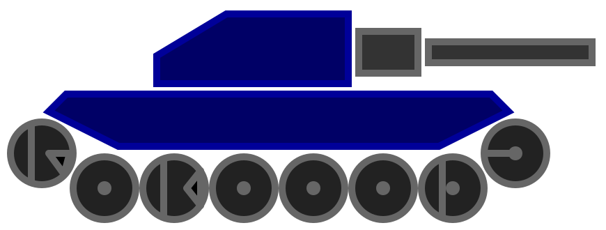

# Robocode Tank Royale

**Build the best - destroy the rest!**

## About

Robocode is a [programming game](https://en.wikipedia.org/wiki/Programming_game) where the goal is to code a bot in the
form of a virtual tank to compete against other bots in a virtual battle arena.

The player is the programmer of a bot, who will have no direct influence on the game him/herself. Instead, the player
must write a program with the logic for the brain of the bot.
The program contains instructions to the bot about how it should move, scan for opponent bots, fire its gun, and
how it should react to various events occurring during a battle.

The name **Robocode** is short for "Robot code," which originates from
the [original/first version]((https://robocode.sourceforge.io/)) of the game. **Robocode Tank Royale** is the next
evolution/version of the game, where bots can participate via the Internet/network. All bots run over a web socket.

The game aims to help you learn how to program and improve your programming skills, and have fun while doing it.
Robocode is also useful when studying or improving AI skills in a fast-running real-time game.

Robocode's battles take place on a "battlefield," where bots fight it out until only one is left, like
a [Battle Royale](https://en.wikipedia.org/wiki/Battle_royal) game. Hence, the name **Tank Royale**.

Note that Robocode contains no gore, blood, people, and politics. The battles are simply for the excitement of the
competition we appreciate so much.

## Example of a battle

## Documentation

Main page:
[Robocode Tank Royale Docs](https://robocode-dev.github.io/tank-royale/)

### Try it out

Please head over to [Getting Started](https://robocode-dev.github.io/tank-royale/tutorial/getting-started) if you are
new to Robocode or just need a brush-up.
Or continue to [My First Bot tutorial](https://robocode-dev.github.io/tank-royale/tutorial/my-first-bot.html) to learn
how to set up your first bot for Robocode Tank Royale.

An [Installation](https://robocode-dev.github.io/tank-royale/articles/installation.html) guide for installing the
[GUI application](https://robocode-dev.github.io/tank-royale/articles/gui.html) is available, as well the
[sample bots](https://robocode-dev.github.io/tank-royale/articles/installation.html#sample-bots) for demoing some
battles in Robocode without any need to code anything yourself (yet).

## Supported platforms

The Robocode game itself runs on Java 11 or newer and can run on these operating systems:

- Windows
- macOS
- Linux

These platforms are currently supported out of the box with the Bot APIs:

- Java
- .Net

Bots can (in theory) be written for _any_ platform and programming language, as long as they have access to a
[WebSocket](https://en.wikipedia.org/wiki/WebSocket) API, and also follow
the [protocol](https://github.com/robocode-dev/tank-royale/tree/master/schema/schemas#readme) needed for communicating
with the server.

However, these Bot APIs are provided that take care of all the communication with the server in the background, so you
only need to deal with the bot logic:

- [Bot API for the Java (JVM) platform](https://robocode-dev.github.io/tank-royale/api/apis.html#java-jvm)
- [Bot API for the .Net platform](https://robocode-dev.github.io/tank-royale/api/apis.html#net)

Both implementations are first-class citizens within Tank Royale, and more might follow in the future for other popular
platforms. Also, note that sample bots are provided for both APIs.

## Supported programming languages

Due to the current bot APIs for the JVM and .Net, Robocode (should be) able to support these programming languages with
the current Bot APIs:

- **Java (JVM) platform:** These (and more) programming languages are available:
    - [Java], [Groovy], [Kotlin], [Scala], [Jython], and [Clojure]

- **.Net platform:** These programming languages (and more) are available:
    - [C#], [F#], [Visual Basic], and [IronPython]

## Maintainer

[@flemming-n-larsen](https://github.com/flemming-n-larsen)

## License

[Apache License 2.0](LICENSE)

## Copyright

Copyright © 2022 [Flemming N. Larsen](https://github.com/flemming-n-larsen)

[Java]: https://docs.oracle.com/javase/tutorial/java/, "The Java Tutorials"

[Groovy]: https://groovy-lang.org/ "Groovy programming language"

[Kotlin]: https://kotlinlang.org/ "Kotlin programming language"

[Scala]: https://www.scala-lang.org/ "Scala programming language"

[Jython]: https://www.jython.org/ "Implementations of Python in Java"

[Clojure]: https://clojure.org/ "Clojure programming language"

[C#]: https://docs.microsoft.com/en-us/dotnet/csharp/ "C# documentation"

[F#]: https://docs.microsoft.com/en-us/dotnet/fsharp/ "F# documentation"

[Visual Basic]: https://docs.microsoft.com/en-us/dotnet/visual-basic/ "Visual Basic documentation"

[IronPython]: https://ironpython.net/ "Python programming language for .NET"

[Gradle]: https://gradle.org/ "Gradle Build Tool"
