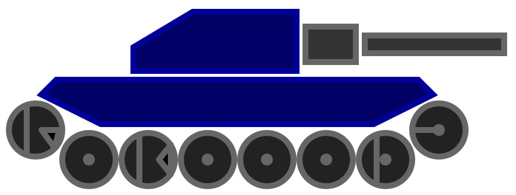
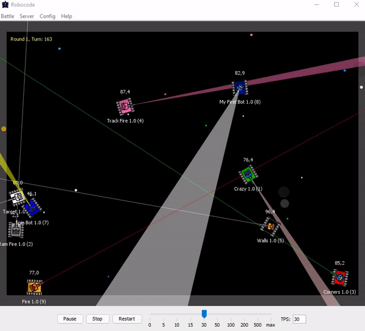

# Robocode Tank Royale



**Build the best – destroy the rest!**

## 🤖 About

Robocode is a [programming game](https://en.wikipedia.org/wiki/Programming_game) where the goal is to code a bot in the
form of a virtual tank that competes against other bots in a virtual battle arena.

The player writes a program that controls the bot’s movement, scanning, firing, and reactions to events during a battle.
All logic lives inside this program – you never control the bot directly.

The name **Robocode** is short for “Robot code” and comes from the original version
[here](https://robocode.sourceforge.io/).  
**Robocode Tank Royale** is the next evolution, where bots can play over the Internet via WebSocket.

This project aims to help you learn programming, improve AI skills in a fast‑running real‑time game,
and have fun while competing.

## ⚔️ Example of a battle



## 🌟 Explore More

| Resource | Why it matters | Link |
|----------|----------------|------|
| 📘 **The Book of Robocode** | The advanced companion to Tank Royale docs with deeper strategy content on movement, targeting, radar control, energy management, and competition-level tactics. | [Open the Book](https://book.robocode.dev/) |
| 🖥️ **Tank Royale Viewer** | A dedicated web-based viewer for showing live battles, analyzing recordings, and putting matches on big screens during competitions. | [Open the Viewer](https://github.com/jandurovec/tank-royale-viewer) |

### 📘 The Book of Robocode

Want to go beyond the fundamentals? [**The Book of Robocode**](https://book.robocode.dev/) is the advanced companion to
these docs and covers both Robocode and Robocode Tank Royale.

**Start here:**

- [Your First Bot](https://book.robocode.dev/getting-started/your-first-bot.html)
- [Radar & Scanning](https://book.robocode.dev/radar/radar-basics)
- [Targeting](https://book.robocode.dev/targeting/simple-targeting/head-on-targeting)
- [Movement & Evasion](https://book.robocode.dev/movement/basic/movement-fundamentals-goto)
- [Energy & Scoring](https://book.robocode.dev/energy-and-scoring/energy-as-a-resource)

### 🖥️ Tank Royale Viewer

Want to **visualize battles in style**? Check out the
**[Tank Royale Viewer](https://github.com/jandurovec/tank-royale-viewer)** — a web-based viewer for watching Robocode
Tank Royale matches in real time.

Created by [Jan Durovec](https://github.com/jandurovec), it is especially useful for:

- displaying live battles on big monitors during competitions
- analyzing recorded battles
- showcasing tournament and championship matches

## 📚 Documentation

Main page: [Robocode Tank Royale Docs](https://robocode-dev.github.io/tank-royale/)

### 🚀 Start here

| If you want to... | Start here |
|-------------------|------------|
| Install and run Tank Royale | [Installation guide](https://robocode-dev.github.io/tank-royale/articles/installation) |
| Learn the basics | [Getting Started](https://robocode-dev.github.io/tank-royale/tutorial/getting-started) |
| Build your first bot | [My First Bot](https://robocode-dev.github.io/tank-royale/tutorial/my-first-bot) |
| Learn advanced strategy | [The Book of Robocode](https://book.robocode.dev/) |
| Watch battles in a dedicated viewer | [Tank Royale Viewer](https://github.com/jandurovec/tank-royale-viewer) |
| Run battles headlessly from code | [Battle Runner API docs](https://robocode-dev.github.io/tank-royale/api/battle-runner) |

## 💻 Supported platforms

Robocode runs on Java 11 or newer and supports Windows, macOS, and Linux out of the box.  
Bot APIs are available for:

- **Python**
- **Java (JVM)**
- **.NET**
- **TypeScript / JavaScript**

Bots can be written in any language that can access a WebSocket API and follows the
[protocol](https://github.com/robocode-dev/tank-royale/tree/master/schema/schemas#readme).

The following Bot APIs provide full client implementations:

| Language              | API                                                                                        |
|-----------------------|--------------------------------------------------------------------------------------------|
| **Python**            | [Python Bot API](https://robocode-dev.github.io/tank-royale/api/python/)                   |
| **Java (JVM)**        | [Java/JVM Bot API](https://robocode-dev.github.io/tank-royale/api/apis.html#java-jvm)      |
| **.NET**              | [.NET Bot API](https://robocode-dev.github.io/tank-royale/api/apis.html#net)               |
| **TypeScript / JavaScript** | [TypeScript Bot API](https://robocode-dev.github.io/tank-royale/api/apis.html#typescript--javascript) |

Additional languages supported by the Java/JVM API:

- Java
- Groovy
- Kotlin
- Scala
- Jython
- Clojure

Supported .NET languages:

- C#
- F#
- Visual Basic
- IronPython

## ⚙️ Battle Runner API

The **Battle Runner API** lets you run battles programmatically from any JVM application — no GUI required.
Use it for automated testing, benchmarking, or building tournament systems.

```kotlin
BattleRunner.create { embeddedServer() }.use { runner ->
    val results = runner.runBattle(
        setup = BattleSetup.classic { numberOfRounds = 10 },
        bots  = listOf(BotEntry.of("/path/to/MyBot"), BotEntry.of("/path/to/EnemyBot"))
    )
    println("Winner: ${results.results.first().name}")
}
```

Available on Maven Central as `dev.robocode.tankroyale:robocode-tankroyale-runner`.
See the [Battle Runner API docs](https://robocode-dev.github.io/tank-royale/api/battle-runner) or the
[module README](runner/README.md) for full documentation.

## 🚧 Work in progress

- **Robocode API bridge for Tank Royale** – see the [robocode-api-bridge](https://github.com/robocode-dev/robocode-api-bridge) project.

## Thanks to the contributors

Huge thanks to every [contributor](https://github.com/robocode-dev/tank-royale/graphs/contributors) — you make this
project shine! 🙌

## 👨‍💻 Maintainer

[@flemming-n-larsen](https://github.com/flemming-n-larsen)

[](https://buymeacoffee.com/flemming.n.larsen)

## 📄 License

[Apache License 2.0](LICENSE)

## ©️ Copyright

Copyright © 2022 [Flemming N. Larsen](https://github.com/flemming-n-larsen)
