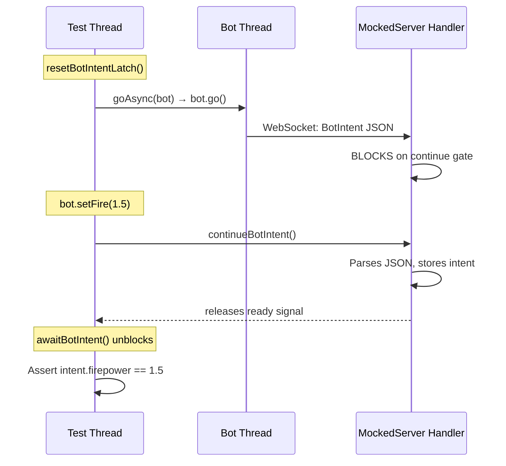

# Bot API Testing Guide

This guide covers the Tank Royale Bot API test infrastructure across all four
platforms (Java, C#, Python, TypeScript). After reading it you will be able to write
intent-capture tests from scratch and add shared cross-platform test cases.

---

## Prerequisites

| Concept | Where it lives |
|---------|---------------|
| MockedServer | `bot-api/java/src/test/.../MockedServer.java`, `bot-api/dotnet/.../MockedServer.cs`, `bot-api/python/.../mocked_server.py`, `bot-api/typescript/test/test_utils/MockedServer.ts` |
| AbstractBotTest | `bot-api/java/src/test/.../AbstractBotTest.java`, `bot-api/dotnet/.../AbstractBotTest.cs`, `bot-api/python/.../abstract_bot_test.py`, `bot-api/typescript/test/test_utils/AbstractBotTest.ts` |
| TestBot | Platform-specific inner class or helper created by `start()` / `Start()` / `start_bot()` / `MinimalBotClient` |

Every Bot API test answers one question: **"When I call method X on the bot,
does the BotIntent JSON sent to the server contain value Y?"** The test
infrastructure captures that intent via a semaphore-gated protocol described
below.

---

## 1. The Intent-Capture Protocol

All Bot API tests follow a five-step sequence:

```
Step 1: server.resetBotIntentLatch()     // Clear stale semaphore permits
Step 2: bot.setSomeValue(...)            // Set command values on the bot
Step 3: goAsync(bot)                     // Send intent from a non-bot thread
Step 4: server.continueBotIntent()       // Release the gate so handler parses intent
Step 5: awaitBotIntent()                 // Wait for intent-received event
```

The `executeCommand()` and `executeCommandAndGetIntent()` helpers in
AbstractBotTest encapsulate steps 1, 3, 4, and 5. Your test only provides
step 2 as a lambda or delegate.

### Why the gate exists

MockedServer's `handleBotIntent()` blocks on a semaphore **before** parsing the
intent JSON. This gives the test thread time to set up assertions before the
handler sends the next tick. Without the gate the handler would immediately send
the next tick, potentially triggering another intent before the test reads the
first one.

### Why `continueBotIntent()` is mandatory

If you forget this call, `handleBotIntent()` blocks forever, which causes the
bot thread to block in `waitForNextTurn()`, which causes the test to hang until
it times out.

---

## 2. Bot vs BaseBot in Tests

### Java and C# — BaseBot (no internal bot thread)

- The bot never sends automatic intents.
- An intent is sent only when the test explicitly calls `go()` via `goAsync()`.
- Pattern: set values → send intent → capture.

### Python — Bot (has an internal bot thread)

- The bot thread starts on round-start and sends a **pre-warm** intent
  automatically after receiving the first tick.
- `start_bot()` in `abstract_bot_test.py` drains this pre-warm intent so it
  does not interfere with your test.
- `start_and_prepare_for_fire()` drains a **second** automatic intent that
  fires after `set_bot_state_and_await_tick()`.
- After draining, the capture pattern is identical to Java and C#.

**Key rule:** When using `Bot` (Python), any action that causes the bot to
receive a tick triggers an automatic intent. You **must** drain these before
capturing the intent you care about.

---

## 3. MockedServer Gate Mechanism

The MockedServer uses two synchronisation primitives per platform:

| Purpose | Java | C# | Python | TypeScript |
|---------|------|-----|--------|------------|
| **Continue gate** | `botIntentContinue` (Semaphore) | `_botIntentContinueEvent` (AutoResetEvent) | `_bot_intent_continue_event` (threading.Event) | `continueEvent` (deferred) |
| **Ready signal** | `botIntentReady` (Semaphore) | `_botIntentEvent` (AutoResetEvent) | `_bot_intent_event` (threading.Event) | `readyEvent` (deferred) |

### Flow when a bot sends an intent

```
1. Bot calls go() → sendIntent() → WebSocket sends JSON
     → MockedServer handleBotIntent() fires
2. handleBotIntent() calls awaitBotIntentContinueOrFail()
     → BLOCKS on continue gate
3. Test thread calls continueBotIntent()
     → releases continue gate
4. Handler unblocks, parses JSON, stores intent
     → releases ready signal
5. Test thread's awaitBotIntent() acquires ready signal
     → test unblocks and reads the captured intent
```

### Resetting the gates

`resetBotIntentLatch()` / `ResetBotIntentEvent()` / `reset_bot_intent_event()`
drain **both** synchronisation primitives. Call this before each capture cycle to
clear stale permits left over from previous cycles.

---

## 4. Common Mistakes and Failure Modes

| Mistake | Symptom | Fix |
|---------|---------|-----|
| Forgot `continueBotIntent()` | Test hangs, times out | Always call before `awaitBotIntent()` |
| Forgot `resetBotIntentLatch()` | Captures stale intent from previous cycle | Always call before setting new command values |
| Called `go()` on test thread (not `goAsync()`) | `StopRogueThread` exception (BaseBot) or deadlock | Always use `goAsync(bot)` from test thread |
| Used `Bot` but didn't drain pre-warm intent | First captured intent has default values, not your commands | Call `start_bot()` which drains automatically (Python) |
| Set state with `setBotStateAndAwaitTick()` but forgot to drain Bot's auto-intent | Captured intent is the auto-response, not your command | Drain with `continueBotIntent()` + `awaitBotIntent()` after state change |

---

## 5. Canonical Code Examples

### Java (BaseBot — no auto-intent)

```java
@Test
void setFire_setsFirepower() {
    var bot = startAndPrepareForFire();

    // executeCommandAndGetIntent wraps:
    //   reset → command → continueBotIntent → awaitBotIntent
    var result = executeCommandAndGetIntent(() -> {
        bot.setFire(1.5);
        return null;
    });
    goAsync(bot);  // Send the intent

    assertThat(result.getIntent().getFirepower()).isEqualTo(1.5);
}
```

### C# (BaseBot — no auto-intent)

```csharp
[Test]
public void SetFire_SetsFirepower()
{
    var bot = StartAndPrepareForFire();

    var result = ExecuteCommandAndGetIntent(() => {
        bot.SetFire(1.5);
        return true;
    });
    GoAsync(bot);

    Assert.That(result.Intent.Firepower, Is.EqualTo(1.5));
}
```

### Python (Bot — has auto-intent, drained by start_bot())

```python
def test_set_fire_sets_firepower(self):
    bot = self.start_and_prepare_for_fire()

    result = self.execute_command_and_get_intent(lambda: bot.set_fire(1.5))
    self.go_async(bot)

    self.assertEqual(result.intent.firepower, 1.5)
```

---

## 6. AbstractBotTest Helper Cheat-Sheet

| Helper | Java | C# | Python | What it does |
|--------|------|-----|--------|-------------|
| Start bot | `start()` | `Start()` | `start_bot()` | Creates TestBot, starts in thread, waits for handshake |
| Start + prepare fire | `startAndPrepareForFire()` | `StartAndPrepareForFire()` | `start_and_prepare_for_fire()` | Start + set energy=100, gunHeat=0 |
| Start + await tick | `startAndAwaitTick()` | `StartAndAwaitTick()` | N/A | Start + wait for first tick |
| Send intent | `goAsync(bot)` | `GoAsync(bot)` | `go_async(bot)` | Call `bot.go()` in a tracked thread |
| Execute + capture | `executeCommandAndGetIntent(cmd)` | `ExecuteCommandAndGetIntent(cmd)` | `execute_command_and_get_intent(cmd)` | Reset → cmd → continue → await → return intent |
| Execute (no capture) | `executeCommand(cmd)` | `ExecuteCommand(cmd)` | `execute_command(cmd)` | Same flow but returns only the command result |
| Wait for condition | `awaitCondition(cond, ms)` | `AwaitCondition(cond, ms)` | `await_condition(cond, ms)` | Poll condition with timeout |
| Reset gates | `server.resetBotIntentLatch()` | `Server.ResetBotIntentEvent()` | `server.reset_bot_intent_event()` | Clear stale semaphore permits |
| Release gate | `server.continueBotIntent()` | `Server.ContinueBotIntent()` | `server.continue_bot_intent()` | Let handler parse intent |
| Wait for intent | `awaitBotIntent()` | `AwaitBotIntent()` | `await_bot_intent()` | Block until intent is captured |

---

## 7. IntentValidator and Shared Tests (Tier 1)

To ensure consistency across platforms, pure validation logic and physics calculations are extracted into `IntentValidator` (e.g., `IntentValidator.java`, `intent_validator.py`). This allows us to define test cases in shared JSON files that are executed by a `SharedTestRunner` on every platform.

### How to add a shared test case

1.  **Locate shared tests:** Go to `bot-api/tests/shared/`.
2.  **Choose a suite:**
    - `intent-validation.json`: For `setFire`, `setTurnRate`, etc.
    - `movement-physics.json`: For speed and distance calculations.
    - `botinfo-validation.json`: For `BotInfo` constructor checks.
    - `color-values.json`: For color parsing and constants.
3.  **Add a test definition:**
    ```json
    {
      "id": "TR-API-VAL-001x",
      "description": "Verify my new validation rule",
      "method": "setSomeValue",
      "args": [123],
      "expected": {
        "returns": true,
        "someField": 123
      }
    }
    ```
4.  **Run tests:** Run the `SharedTestRunner` (e.g., `SharedTestRunner.java` in Java or `test_shared.py` in Python) to verify your changes across all platforms simultaneously.

---

## 8. Component Architecture Overview

The following sequence diagram shows the interaction between the test thread,
the bot thread, and the MockedServer handler during a single intent-capture
cycle.



### Component roles

| Component | Role |
|-----------|------|
| **Test thread** | Orchestrates the capture cycle: resets gates, sets command values, releases the continue gate, and reads the captured intent. |
| **Bot thread** | Runs the bot's event loop. Calls `go()` (or `go()` is called on its behalf via `goAsync()`) which serialises the current command values to JSON and sends them over the WebSocket. |
| **MockedServer handler** | Receives the WebSocket message. Blocks on the continue gate, then parses the JSON, stores the intent, and signals the ready event so the test thread can proceed. |

---

## 9. Writing a New Test — Step by Step

1. **Choose the right base class.** Extend `AbstractBotTest` (Java/C#) or
   `AbstractBotTest` (Python). This gives you the MockedServer instance and all
   helpers.

2. **Start the bot.** Call `start()` / `start_bot()` for general tests. Call
   `startAndPrepareForFire()` / `start_and_prepare_for_fire()` when the test
   involves firing (sets energy to 100 and gun heat to 0).

3. **Set command values.** Call the method under test on the bot instance
   (e.g., `bot.setTurnRate(5)`).

4. **Capture the intent.** Wrap step 3 in a lambda and pass it to
   `executeCommandAndGetIntent()`. Then call `goAsync(bot)` to send the intent.

5. **Assert.** Read the captured `BotIntent` and verify the field you care
   about.

### Minimal Java example

```java
@Test
void setTurnRate_setsTurnRate() {
    var bot = startAndAwaitTick();

    var result = executeCommandAndGetIntent(() -> {
        bot.setTurnRate(5);
        return null;
    });
    goAsync(bot);

    assertThat(result.getIntent().getTurnRate()).isEqualTo(5.0);
}
```

### Minimal Python example

```python
def test_set_turn_rate_sets_turn_rate(self):
    bot = self.start_bot()

    result = self.execute_command_and_get_intent(lambda: bot.set_turn_rate(5))
    self.go_async(bot)

    self.assertEqual(result.intent.turn_rate, 5.0)
```

---

## 10. Debugging Hanging Tests

When a test hangs it almost always means one of the two gates was not released.
Use this checklist:

1. **Is `continueBotIntent()` called?** Search the test for
   `continueBotIntent` / `ContinueBotIntent` / `continue_bot_intent`. If it is
   missing, the handler is still blocked.

2. **Is `resetBotIntentLatch()` called before the capture cycle?** Without the
   reset, a leftover permit can cause `awaitBotIntent()` to return immediately
   with a stale intent, or the continue gate may already be released, causing a
   race.

3. **Is the bot using `Bot` (not `BaseBot`)?** If so, check whether every tick
   received by the bot has its automatic intent drained before you attempt your
   own capture.

4. **Is `goAsync()` used instead of `go()`?** Calling `go()` directly from the
   test thread will raise `StopRogueThread` on BaseBot or deadlock in some
   configurations.

5. **Thread dump.** If none of the above applies, take a thread dump. Look for
   threads blocked in `acquire()` (Java), `Wait()` (C#), or `wait()` (Python)
   inside the MockedServer. The stack trace will tell you which gate is stuck.
