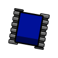
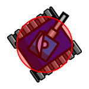

# Anatomy

## Tank parts

A bot consists of three individual parts:

- Body
- Gun
- Radar

## Body

The body carries the gun with the radar on top. The body is moving the bot forward and back, as well as turning left or
right. The body uses its tracks to move around.

## Gun

The gun is mounted on the body and is firing energy bullets. The gun can turn left or right.

## Radar

The radar is mounted on top of the gun and is scanning for other bots when turned. The radar can turn left or right. The
radar is only scanning and detecting bots when while turning. And it is only able to scan bots that are within the radar
sweep.

### Radar sweep

The radar sweep is a pie shape that starts from the center of the bot and has a fixed radius of 1200 units.

Two angles define the sides of the pie shape of the radar:

- **Start angle**: The current angle of the radar.
- **End angle**: The angle of the radar from the previous turn.

So the radar sweep is the delta angle going from the angle of the radar from the previous turn to the current turn.
Hence, if the current angle of the radar and the angle from the last turn is the same, then there is no radar sweep
being visualized as a line instead of a pie shape.

Beware! If the radar is not moving (meaning no radar sweep), the radar will not be scanning opponent bots, so make sure
the radar is kept busy.

## Center

The x,y coordinate of the bot is in the exact center of the bot. All parts of the bot is rotated around the center,
which is the local coordinate (0,0) seen from the bot´s perspective.

## Bot dimensions

The shape of the entire bot is a square with that span 36x36 units.

The center of the bot is at the x,y coordinate (18,18) compared to any of the bots "corners".

## Bounding circle

A **bounding circle** is being using for collision detection between a bot and another object like e.g. the wall, a
bullet, or another bot. The center of the bounding circle is the center of the bot at (18,18) having a radius that is 18
units in length.

## Collision detection

Using a bounding circle makes it easy to check if e.g. a bullet has hit a bot, as we just need to calculate the distance
between the bullet coordinate (xb, yb) and the x,y coordinate of the center of the bot
(xc, yc):

$d = distance (hypotenuse) = \sqrt{\Delta{x}^2 + \Delta{y}^2}$

Here Δx and Δy is the difference between the two coordinates i.e, the bot center and the bullet coordinate, on the x-
and y-axis, where Δx = |xc - xb|, and Δy = |yc - yb|.

If the _distance_ is lesser than the radius of the bot´s bounding circle, i.e. 18 units, then the bot has been hit by
the bullet.

> With the original Robocode a bounding square of 36x36 units is being used for detection if a bot is hit or not.  
> However, this bounding square is not being rotation with the rotation of the body.
> Hence, with Tank Royale a bounding circle is being used instead, which does not need to be rotated with the bot
> rotation.

### Quicker collision detection

So with the formula above we can determine if a point is within 18 units of the center of the bot. We can rewrite the
formula to get rid of the square root:

$d^2 = \Delta{x}^2 + \Delta{y}^2$

This means that we just need to calculate Δx2 + Δy2 and see if it is lesser than 324
(182) to see if the point is within the bounding circle.