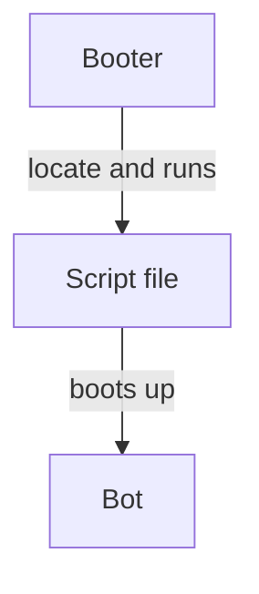

# Booter

## Introduction

A **booter** is provided to boot up bots on a local machine.

It comes built-in with the GUI for Robocode Tank Royale, but can also run as stand-alone as well, e.g. if no GUI is
being used.

The intention of the booter is to allow booting up bots for any ecosystem and programming language.
To make this possible, the booter uses script files that are responsible for starting up bots for specific programming
languages and systems. Hence, the booter needs to locate these script files for each bot, and thus makes use of a
filename convention to locate these.

Diagram showing how the booter boots up a bot:



## Root directories

A bot **root directory** is top-level directory which is a collection of **bot directories**. For example, the sample
bots is a collection of bot directories containing directories like:

```
[root directory]
├── Corners (a bot directory)
├── Crazy
├── Fire
├── MyFirstBot
...
```

Each of the directory names listed represents a **bot directory**.

Multiple root directories can be supplied to the booter. This could for example be bot root directories for separate
programming languages like for example Java and C#.

## Bot directories

A **bot directory** contains all files required to run a specific bot type and perhaps some metadata like a ReadMe file
etc. for the bot.

As minimum these files _must_ be available in a bot directory:

- Script for running the bot, i.e. a **sh** file (macOS and Linux) or **cmd** (Windows) file.
- [JSON config file] that describes the bot, and specify which game types it was designed for.

### Base filename

All bot files inside a bot directory must share the same common base filename, which _must_ match the filename of the
(parent) bot directory. Otherwise, the game will not be able to locate the bot file(s) as it is looking for filenames
matching the filename of the bot directory. All other files are ignored by the booter.

### Example of bot files

Here is an example of files contained in a bot directory. In this case the Java version of MyFirstBot:

* `MyFirstBot.java` is the Java source file containing the bot program.
* `MyFirstBot.json` is the JSON config file.
* `MyFirstBot.cmd` used for running the bot on Windows.
* `MyFirstBot.sh` used for running the bot on macOS and Linux.
* `ReadMe.md` is a ReadMe file used for instructions for how to run the bot.

## Script files

The booter will look for script files and look for some that match the OS it is running on. So for macOS and Linux the
booter will try to locate a shell script file (.sh file) with the name _BotName_.sh and with Windows the booter will try
to locate a command script file (.cmd file) with the name _BotName_.cmd.

The script should contain the necessary command for running a bot. For Java-based bots, the `java` command can be used
for running a bot, and for a .Net-based bot the `dotnet` command can be used for running the bot.

The assumption here is the command(s) used within the scripts are available on the local machine running the bots.
Hence, it is a good idea to provide a ReadMe file that describes the required commands that must be installed to run the
script for a bot if other people should be able to run the bot on their system.

## JSON config file

All bot directories must contain a [JSON] file, which is basically a description of the bot (or team).

For example, the bot MyFirstBot is accompanied by a **MyFirstBot.json** file.

MyFirstBot.json for .Net:

```json{2-7}
{
  "name": "My First Bot",
  "version": "1.0",
  "authors": [
    "Mathew Nelson",
    "Flemming N. Larsen"
  ],
  "description": "A sample bot that is probably the first bot you will learn about.",
  "homepage": "",
  "countryCodes": [
    "us",
    "dk"
  ],
  "platform": ".Net 6.0",
  "programmingLang": "C# 10.0",
  "initialPosition": "50,50, 90"
}
```

These fields are required:

* name
* version
* authors

The remaining fields are all optional, but recommended.

Meaning of each field in the JSON file:

- `name`: is the display name of the bot.
- `version`: is the version of the bot, where [SEMVER] is the recommended format, but not a requirement.
- `authors`: is a list containing the (full) name of the bot author(s). The name could be a nickname or handle.
- `description`: is a brief description of the bot.
- `homepage`: is a link to a web page for the bot.
- `countryCodes`: is a list containing [Alpha-2] country codes, representing the country of each author and/or bot.
- `platform`: is the platform required for running the bot, e.g. Java 17 or .Net 6.0.
- `programmingLang`: is the programming language used for programming the bot, e.g. C# or Kotlin.
- `gameTypes`: is a comma-separated list containing the [game types](game_types.md) that the bot is supporting, meaning
  that it should
  not play in battles with game types other than the listed ones. When this field is omitted, the bot will participate
  in any type of game.
- `initialPosition`: is a comma-separated string containing the starting x and y coordinate, and direction
  (body, gun, and radar) when the game begins in the format: x, y, direction. [^initial-start-position]

Note that `initialPosition` should only be used for debugging purposes where using the same starting position and
direction of the body, gun, and radar is convenient. You need to enable initial starting position using
the `--enable-initial-position` option with the [server].

### Escaping special characters

Note that some characters are reserved in [JSON] and _must_ be escaped within the JSON strings. Otherwise, the config
file for the bot cannot be read properly, and the bot might not boot.

- **Double quote** is replaced with `\"`
- **Backslash** to be replaced with `\\`
- **Newline** is replaced with `\n`
- **Carriage return** is replaced with `\r`
- **Tab** is replaced with `\t`
- **Form feed** is replaced with `\f`
- **Backspace** is replaced with `\b`

## Team directories

With Robocode, bots can be grouped together into teams. Teams are defined in a similar way as bots. Teams use
directories as well, where the name of the team directory is the same as team name, e.g., MyFirstTeam. And a JSON file
is needed to define the team.

MyFirstTeam.json:

```json{14-20}
{
  "name": "MyFirstTeam",
  "version": "1.0",
  "authors": [
    "Mathew Nelson",
    "Flemming N. Larsen"
  ],
  "description": "A sample team.\nMyFirstLeader scans for enemies,\nand orders the droids to fire.",
  "homepage": "",
  "countryCodes": [
    "us",
    "dk"
  ],
  "teamMembers": [
    "MyFirstLeader",
    "MyFirstDroid",
    "MyFirstDroid",
    "MyFirstDroid",
    "MyFirstDroid"
  ]
}
```

Notice the `teamMembers` field, which contains the name of each member bot. Each member must reside in a bot directory
next to the team directory so that the booter is able to locate the bots.

With the MyFirstTeam, the first listed member is MyFirstLeader, and then we have 4 more bots named MyFirstDroid.
This means that the team contains 5 members in total.

Note that most fields are the same as used for defining bots. But these fields are not used for teams:

- `countryCodes`
- `platform`
- `programmingLang`
- `gameTypes`
- `initialPosition`

Also note that only the JSON file is needed for defining the team.

[JSON config file]: #json-config-file "JSON config file"

[JSON]: https://fileinfo.com/extension/json "JSON (JavaScript Object Notation File)"

[SEMVER]: https://semver.org/ "Semantic Versioning 2.0.0"

[Alpha-2]: https://www.iban.com/country-codes "Alpha-2 country codes"

[server]: https://github.com/robocode-dev/tank-royale/tree/master/server#readme "Server"
