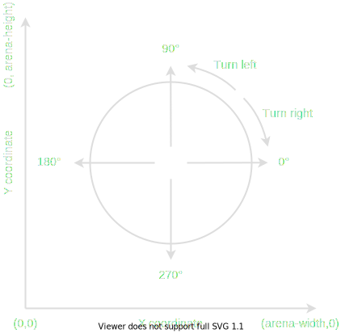

# Coordinates and Angles

## Coordinate system

Robocode uses the Cartesian coordinate system, which means that the (0, 0) coordinate is in the bottom-left corner of
the arena.

## Rotational direction system

Robocode Tank Royale uses the classic trigonometric functions for angles and directions. Hence, 0°/360° is east, 90° is
north, 180° is west, and 270° is south. When turning a bot to the right, the angle moves in the clockwise direction.

> Note this coordinate system differs from the original version of Robocode. With the original Robocode the 0° and 360°
> is to the north, and 90° is to the east. Therefore, the turning in the original Robocode was moving in the opposite
> direction. This change was made to the new version of Robocode to make it easier to use ordinary math.