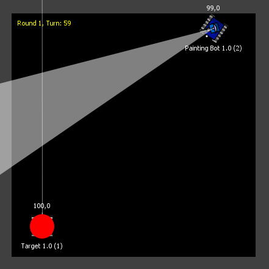

# Debugging

Here follows some information about [print debugging] your bot using print statements or a logging framework.

## Run your bot from the command line

One easy way to debug your bot is to run it from the command line and put some print statements into your code to write
out debugging information into the command line via stdin and/or stderr. With Java/JVM, you will typically use
[System.out.println()], [SLF4J] or [Log4j], and for .NET you'll typically use [Console.WriteLine()] or use [Logging].

To see how a bot is started up you can have a look at the sample bots and examine the script files. How your robot is
started depends on the programming language and platform you are using. But here follows some examples of what to write
in the command line or script file.

#### Java:

```shell
java -cp ../lib/* MyFirstBot.java
```

Here `../lib/*` assumes the `robocode-tankroyale-bot-api-x.y.z.jar` is located in the `lib` directory.

#### .NET

```shell
dotnet run
```

This assumes you have your project file in the directory where you run the `dotnet` command.

## Supply a server secret

Server authentication is **disabled by default** — bots can connect without any secret when running the GUI locally.
You only need to supply a secret if authentication has been explicitly enabled (via `enable-server-secrets=true` in
`server.properties` or the Server Options dialog).

When secrets are enabled, the `server.properties` file contains the generated key your bot must supply. Look for the
`bots-secrets` field:

```
bots-secrets=zDuQrkCLQU5VQgytofkNrQ
```

Set the `SERVER_SECRET` environment variable to that value before running your bot from the command line, e.g.:

#### Bash:

```bash
export SERVER_SECRET=s0m3R0bOc0dEs3crEt
```

#### Windows command prompt:

```shell
set SERVER_SECRET=s0m3R0bOc0dEs3crEt
```

You can put this into a script used for running your bot.

## How to join a new battle

**Step 1: Start server or new battle**

First, you need to start a server as your bot needs to join a server. You can do this from the GUI menu by starting a
server or a battle. When starting a new battle from the GUI, a server will automatically be started as well.

**Step 2: Start your bot from the command line**

Now you need to start your bot from the command line as described earlier.

**Step 3: Wait for your bot to show up in 'Joined Bots'**

On the dialog for selecting bots for the battle, you should see your bot show up under the 'Joined Bots' list. Add it to
the battle and add some other opponent bot(s) as well to start the battle.

**Step 4: Observe output in the command line**

Your print or logging information should be written out to the command line. If not, make sure to put the logging
information in the constructor or main method to make sure something is written out.

## Headless debugging with the Battle Runner

The GUI workflow above requires starting battles manually each test cycle. The
**[Battle Runner API](../api/battle-runner)** offers an alternative: run battles entirely from code, no GUI
needed. This is especially useful for repeated test cycles during bot development.

```java
try (var runner = BattleRunner.create(b -> b.embeddedServer())) {
    var results = runner.runBattle(
        BattleSetup.classic(s -> s.setNumberOfRounds(5)),
        List.of(BotEntry.of(botsDir + "/MyBot"), BotEntry.of(botsDir + "/SpinBot"))
    );
    System.out.println("Winner: " + results.getResults().get(0).getName());
}
```

The runner starts its own embedded server, manages bot processes, and returns results — no manual setup required.

### Intent diagnostics

When a bot misbehaves it can be hard to tell whether the bug is in your decision logic (what you _want_ to do)
or in the execution (what you _tell_ the server to do). Intent diagnostics captures the raw `bot-intent` message
your bot sends every turn — the exact `targetSpeed`, `turnRate`, `gunTurnRate`, and `firepower` values the
server receives:

```java
try (var runner = BattleRunner.create(b -> b.embeddedServer().enableIntentDiagnostics())) {
    runner.runBattle(setup, bots);
    var store = runner.getIntentDiagnostics();
    for (var ci : store.getIntentsForBot("MyBot")) {
        System.out.printf("r=%d t=%d speed=%s fire=%s%n",
                ci.getRoundNumber(), ci.getTurnNumber(),
                ci.getIntent().getTargetSpeed(), ci.getIntent().getFirepower());
    }
}
```

If your bot is supposed to fire on turn 10 but `firepower` is always `null`, the bug is in your bot code.
If `firepower` is set but the bullet never appears, the issue is elsewhere (e.g. gun heat).

See the [Battle Runner API](../api/battle-runner) for setup instructions and all available options.

## Graphical Debugging

Robocode features a Graphical Debugging tool that allows bots to draw objects on the battlefield. This is particularly
useful for visualizing scanned bot positions, enemy movement patterns, and virtual bullets. For instance, you can
determine if a virtual bullet would have hit an enemy if it were real, which helps in refining your targeting strategy.

For drawing objects in Robocode, the methods differ depending on the Bot API variant you're using:

- Java: Use the `getGraphics()` method, which returns a `java.awt.Graphics2D` instance for painting objects.
- .NET: Use the `Graphics` property, which provides a `System.Drawing.Graphics` compatible instance for drawing.

The sample bot, **PaintingBot**, showcases how to effectively use debugging graphics. Every tick, it paints a red circle
at the most recent location where it scanned another bot.



**Note:** Graphics are not painted immediately, but rather in the next turn. This delay occurs because:

1. The graphics must first be serialized as SVG and sent to the server.
2. The server then forwards the graphics to all observers (like the UI).
3. Finally, the UI paints the graphics on the battlefield.


[print debugging]: https://en.wikipedia.org/wiki/Debugging "Print debugging"

[System.out.println()]: https://www.geeksforgeeks.org/system-out-println-in-java/ "Print debugging in Java"

[Console.WriteLine()]: https://docs.microsoft.com/en-us/dotnet/api/system.console.writeline?view=net-6.0 "Print debugging in .NET"

[SLF4J]: https://www.slf4j.org/ "Simple Logging Facade for Java (SLF4J)"

[Log4j]: https://logging.apache.org/log4j/2.x/ "Apache Log4j 2"

[Logging]: https://docs.microsoft.com/en-us/dotnet/core/extensions/logging?tabs=command-line
