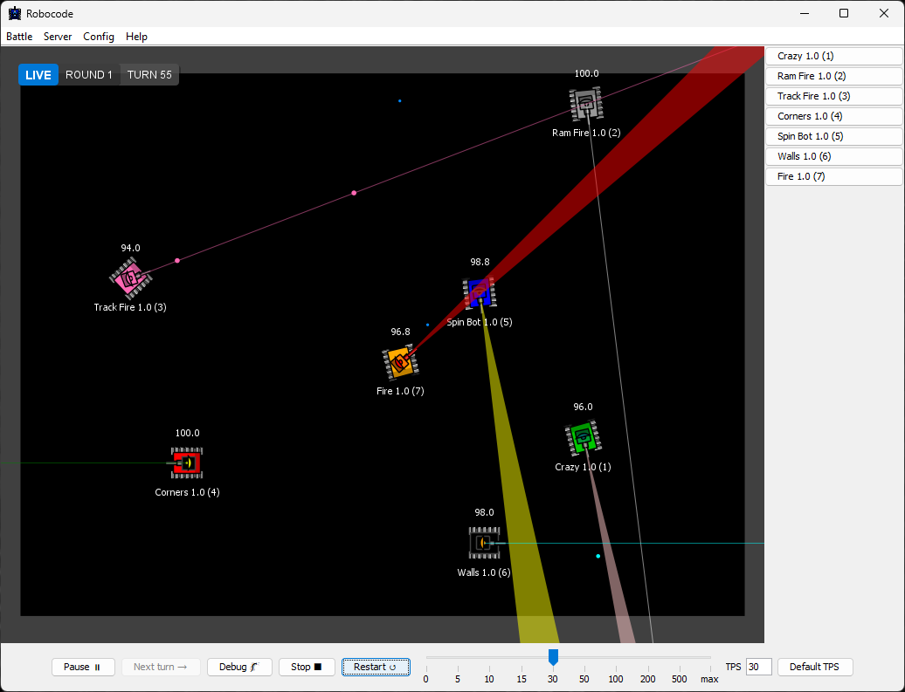
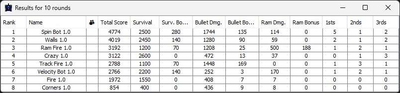
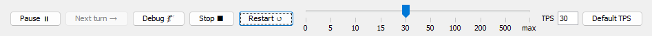
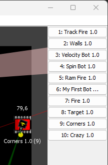
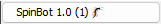
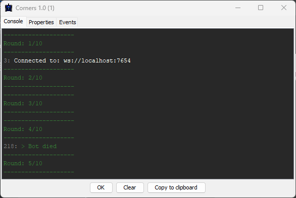
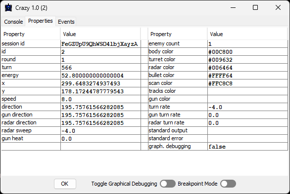
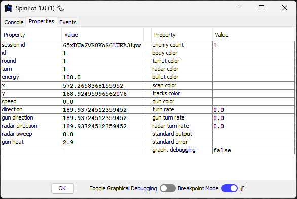
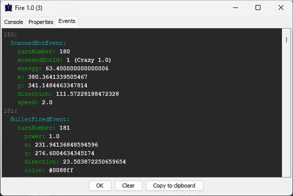

# Viewing battles and bot state

This guide covers the GUI features you use after a battle has started:

- watching the live arena
- controlling playback speed and debug stepping
- reading battle results
- inspecting bot console output, properties, and events

## Viewing the battle

When a battle begins, the GUI switches to the battle arena:

## Battle results

When the configured number of rounds has been played, the GUI shows the final ranking for each bot:

See [Scoring](scoring.md) for how ranks and score fields are calculated.

Use the control panel at the bottom to manage the battle:

Controls include:

- pause or resume the battle
- single-step through turns while paused
- stop or restart the battle
- adjust TPS (turns per second) with the slider, input field, or default button
- enable debug mode so each **Next Turn** click executes one complete turn and then pauses

Unlike regular pause, debug mode always lets the current turn finish before pausing.

## Viewing the bot console

The left side panel contains one button for each participating bot:

If a bot is connected with a debugger attached, its button shows a 🐛 indicator:

This indicates that breakpoint mode has been auto-enabled for that bot. The turn clock will suspend whenever the bot is
late delivering intent, which prevents missed turns while you step through code in an IDE.

Clicking a bot button opens its console window:

The **Console** tab shows stdout and stderr output from the bot. The [booter] redirects these streams when launching
local bots.

Output includes:

- Gray turn labels
- White standard output
- Red standard error
- Green game info messages

## Viewing the bot properties

The **Properties** tab displays real-time bot state information:

When the server supports breakpoint mode, a **Breakpoint Mode** 🐛 toggle appears alongside the debug graphics toggle.
Breakpoint mode suspends the turn clock for that bot whenever it is late delivering intent.

## Viewing the bot events

The **Events** tab shows all bot events for debugging:

Events include the turn number where they were observed. The exact timing can still vary slightly because of system load
or network latency.

[booter]: booter.md
