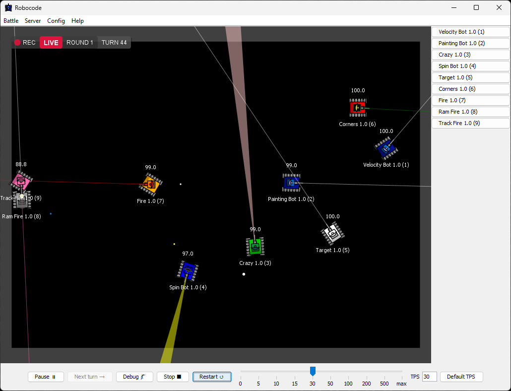
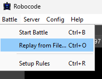
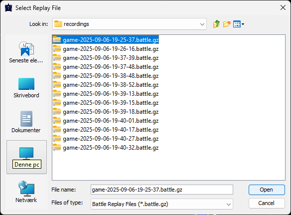
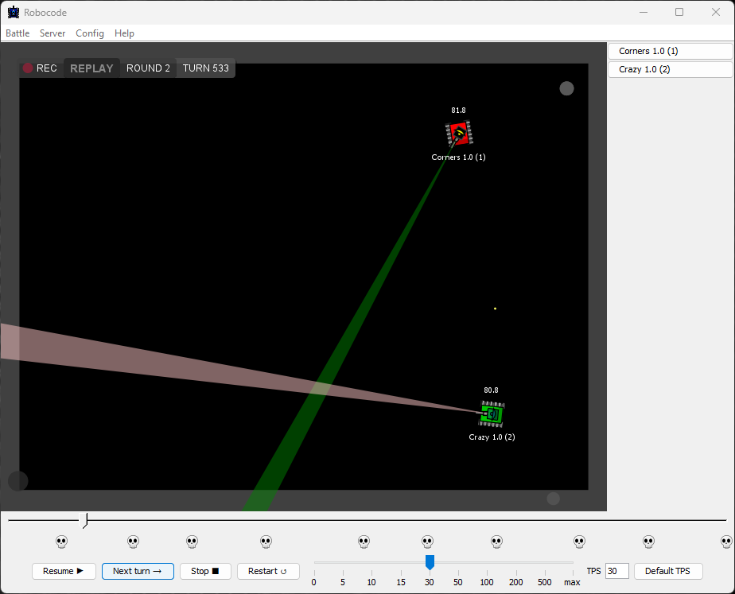

# Recording and replaying battles

The GUI can record battles automatically and replay saved recordings later.

## Recording battles

Enable auto-recording with the **Recording** toggle in the **Start Battle** dialog:

When enabled, each battle is saved to its own recording file in the `recordings` directory under your user data
directory.

- **Windows:** `%LOCALAPPDATA%\Robocode Tank Royale\recordings`
- **macOS:** `~/Library/Application Support/Robocode Tank Royale/recordings`
- **Linux:** `~/.config/robocode-tank-royale/recordings`

For more about user data locations and the recordings directory, see
[User data locations](user-data-locations.md).

## Replaying battles

Open recorded battles with **Battle → Replay from File...**:

The file dialog opens in the recordings directory within your user data folder.

Click **Open** to start playback:

The timeline shows battle progress and bot deaths, marked by skulls. Click anywhere on the timeline to jump directly to
that turn.

Replay controls match the live battle controls for pause or resume, stepping, and stopping.
