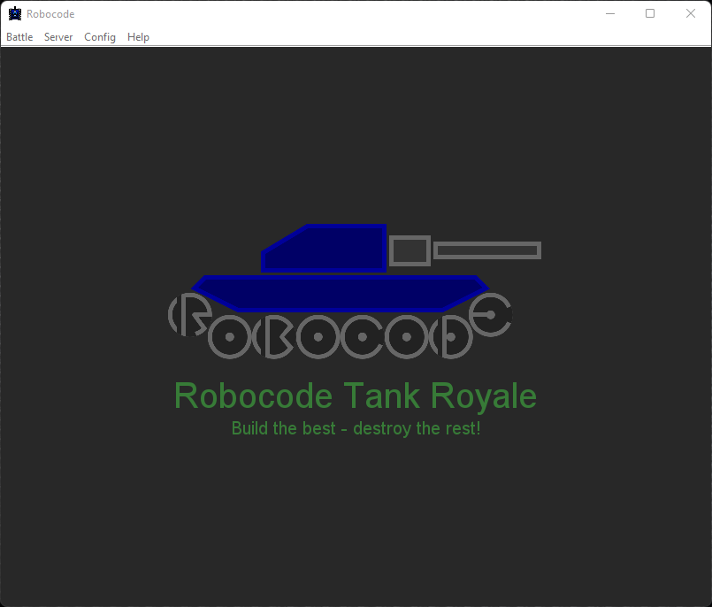

# The GUI

The **GUI** is the main desktop interface for Robocode Tank Royale. It helps you:

- connect to local or remote servers
- select bots and configure battles
- watch battles live and inspect bot state
- record battles and replay them later
- configure GUI, server, debug, and sound settings

Use this page as the entry point for the GUI documentation:

- [Setting up and starting a battle](gui-battle-setup.md)
- [Viewing battles and bot state](gui-battle-view.md)
- [Recording and replaying battles](gui-recording-and-replay.md)
- [Configuring the GUI](gui-configuration.md)

## Start window

When launching the GUI, you are greeted by the start window:

The menu bar at the top provides quick access to the main tasks, such as starting a new battle with `Ctrl+B`.

## Starting a battle

For battle setup, bot selection, booting local bots, and rule configuration, see
[Setting up and starting a battle](gui-battle-setup.md).

## Viewing the battle

For the live arena view, battle controls, and bot inspection tools, see
[Viewing battles and bot state](gui-battle-view.md).

## Recording

For auto-recording and replaying recorded battles, see
[Recording and replaying battles](gui-recording-and-replay.md#recording-battles).

## Replaying

For replay controls and replay file handling, see
[Recording and replaying battles](gui-recording-and-replay.md#replaying-battles).

## Setup Rules

For the game type selector and rule configuration dialog, see
[Setting up and starting a battle](gui-battle-setup.md#setup-rules).

## Local Server Log

For the local server log viewer and related server dialogs, see
[Configuring the GUI](gui-configuration.md#local-server-log).

## GUI Options

For language, UI scaling, console limits, and tank color mode, see
[Configuring the GUI](gui-configuration.md#gui-options).

## Server Options

For local server settings, secrets, and remote server connections, see
[Configuring the GUI](gui-configuration.md#server-options).

## Debug Options

For development and testing features such as initial bot position, see
[Configuring the GUI](gui-configuration.md#debug-options).

## Sound Options

For audio settings and sound effect controls, see
[Configuring the GUI](gui-configuration.md#sound-options).

## About box

For version, runtime, and support information shown in the About dialog, see
[Configuring the GUI](gui-configuration.md#about-box).
