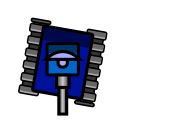

# What is Robocode?

## Introduction

Robocode is a [programming game] where the goal is to code a bot. The bot is a tank that must compete against other
tanks in a virtual battle arena.

The "player" of the game is the programmer (coder) of the bot, who will have no direct influence on the game while it is
running. Instead, the player ("Robocoder") must write a program that makes up the brain of the tank. The program (code)
tells how the tank must behave and react to events occurring in the battle arena.

The code should tell the tank how to move around on the battlefield and avoid getting shot by enemies while moving
around in different situations. And in the same time the tank must scan for enemy tanks by turning its radar, and fire
its gun towards enemy tanks.

All bots (tanks) gets a score and a placement depending on how well they performed on the battlefield. So the aim is to
get as high score and placement as possible.

## Purpose

The game is designed to help you learn how to program, improve your programming skills, and have fun while doing it.
Robocode is also useful when studying or improving [AI] in a fast-running real-time game.

Sometimes people lack something to get started with when learning how to code, or something to train AI skills
against. Robocode gives a clear purpose and goal to the programming. To develop a tank that can survive on the
battlefield, and defeat other enemy tanks.

Head over to [Getting Started](../tutorial/getting-started) to get started with Robocoding!

## The name "Robocode"

The name _Robocode_ originates from the [original version](https://robocode.sourceforge.io/) of the game and is a short
for "Robot code". With this new version, the world "bot" is used instead of "robot".

## The name "Tank Royale"

Robocode's battles take place on a battlefield, where small automated tank bots fight it out until only one is left
like a Battle Royale Game. Hence, the name _Tank Royale_.

> Please notice that Robocode contains no gore, no blood, no people, and no politics. The battles are simply for the
> excitement of the competition (sport) that we love so much.

### Example of a Robocode battle

[programming game]: https://en.wikipedia.org/wiki/Programming_game "Programming Game"

[AI]: https://en.wikipedia.org/wiki/Artificial_intelligence "AI: Artificial Intelligence"

[API]: ../api