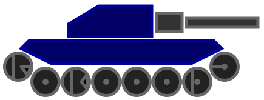

# Robocode Tank Royale

*Build the best - destroy the rest!*

## ✨ Welcome

Welcome to the Robocode docs. These docs are meant for people who are new to Robocode, as well as a reference guide to
various aspects of the Robocode Tank Royale programming game.

## 🚀 Get Started

On this page you can pick articles on the menu on the left side to read about various topics.

If you are new to Robocode, you should start with:

- the [Introduction](articles/intro) to Robocode, and
- read the [Getting Started](tutorial/getting-started), and then
- continue to [My First Bot](tutorial/my-first-bot) to create your first bot.

  
Advanced strategies

  <h2 class="book-spotlight__title">📘 The Book of Robocode</h2>
  

    Want to go beyond the fundamentals? <a href="https://book.robocode.dev/"><strong>The Book of Robocode</strong></a>
    is the advanced companion to these docs, covering movement, targeting, radar control, energy management, and
    competition-level tactics for both Robocode and Tank Royale.
  

  

    <a class="book-spotlight__button book-spotlight__button--primary" href="https://book.robocode.dev/">Open the Book</a>
    <a class="book-spotlight__button" href="https://book.robocode.dev/getting-started/your-first-bot.html">Start with the tutorial</a>
  

  

    <a href="https://book.robocode.dev/radar/radar-basics">Radar &amp; Scanning</a>
    <a href="https://book.robocode.dev/targeting/simple-targeting/head-on-targeting">Targeting</a>
    <a href="https://book.robocode.dev/movement/basic/movement-fundamentals-goto">Movement &amp; Evasion</a>
    <a href="https://book.robocode.dev/energy-and-scoring/energy-as-a-resource">Energy &amp; Scoring</a>
  

## 🗺️ Learning Roadmap

Robocode mastery is a journey from fundamentals to advanced competitive strategies. We've organized documentation into a
clear learning path:

### 🎯 Foundation (Start Here)

**Essential concepts everyone needs:**

1. [Introduction](articles/intro) - What is Robocode?
2. [Installation](articles/installation) - Set up your environment
3. [Getting Started](tutorial/getting-started) - Core concepts (rounds, turns, energy)
4. [My First Bot](tutorial/my-first-bot) - Create your first bot
5. [Anatomy of a Bot](articles/anatomy) - Understanding body, gun, and radar
6. [Coordinates and Angles](articles/coordinates-and-angles) - Arena coordinate system
7. [Physics](articles/physics) - Movement, rotation, and bullet mechanics

### 🔧 Intermediate Skills

**Build competent bots with solid fundamentals:**

- [Beyond the Basics](tutorial/beyond-the-basics) - Event handling and logic flow
- [Collision Mechanics](articles/collision-mechanics) - Wall/bot collision handling
- [Testing & Debugging Guide](articles/testing-guide) - Test strategies and debugging
- [Performance Optimization](articles/performance-optimization) - Write efficient code
- [Custom Game Setup](articles/custom-game-setup) - Configure battles and test scenarios
- [Team Strategies](articles/team-strategies) - Team communication and coordination basics

### 📚 Advanced Topics (The Book of Robocode)

**Ready for advanced competitive strategies?** These docs cover the fundamentals, while
[**The Book of Robocode**](https://book.robocode.dev/) takes you further into competition-level tactics:

- **[Radar & Scanning](https://book.robocode.dev/radar/radar-basics)** - Perfect locks, spinning radar, melee strategies
- **[Advanced Targeting](https://book.robocode.dev/targeting/simple-targeting/head-on-targeting)** - GuessFactor
  targeting, pattern matching, virtual guns
- **[Movement & Evasion](https://book.robocode.dev/movement/basic/movement-fundamentals-goto)** - Wave surfing,
  anti-gravity, bullet dodging
- **[Statistical Targeting](https://book.robocode.dev/targeting/statistical-targeting/guessfactor-targeting)** -
  Segmentation, statistics-based targeting
- **[Energy & Scoring](https://book.robocode.dev/energy-and-scoring/energy-as-a-resource)** - Strategic resource
  management

## 🖥️ Tank Royale Viewer

Want to **visualize battles in style**? Check out the
**[Tank Royale Viewer](https://github.com/jandurovec/tank-royale-viewer)**—an amazing and beautiful web-based viewer for
watching Robocode Tank Royale matches in real-time! Created by [Jan Durovec](https://github.com/jandurovec) (who also
built the Recorder for Tank Royale's replay feature), this tool brings your battles to life with an interactive, modern
interface.

Perfect for:
- 🏆 **Displaying live battles on big monitors** during competitions and tournaments
- 📊 Understanding bot strategies and showcasing championship matches

Ideal for spectators, broadcasters, and tournament organizers! ⚡

**Give the Tank Royale Viewer a try!**

## 🙏 Thanks to the contributors

Huge thanks to every [contributor](https://github.com/robocode-dev/tank-royale/graphs/contributors) — you make this
project shine! 🙌

## ☕ Support Robocode

If you are a fan of Robocode, you can support the project and me by buying some coffee 😊

## 💖 Thank you, JetBrains, for supporting Open Source

Thank you, JetBrains, for supporting non-commercial Open Source projects by providing licenses
for [Open Source development], including Robocode Tank Royale. :heart:

This project makes use of these great products from JetBrains for Java, Kotlin, C#, Python, and web development:

tools and technologies by JetBrains
  
used for Java API, Kotlin (game), and web development
  
used for C# API development
  
used for Python API development
  
used as primary language and for tooling

[Open Source development]: https://www.jetbrains.com/community/opensource/?utm_campaign=opensource&utm_content=approved&utm_medium=email&utm_source=newsletter&utm_term=jblogo#support
