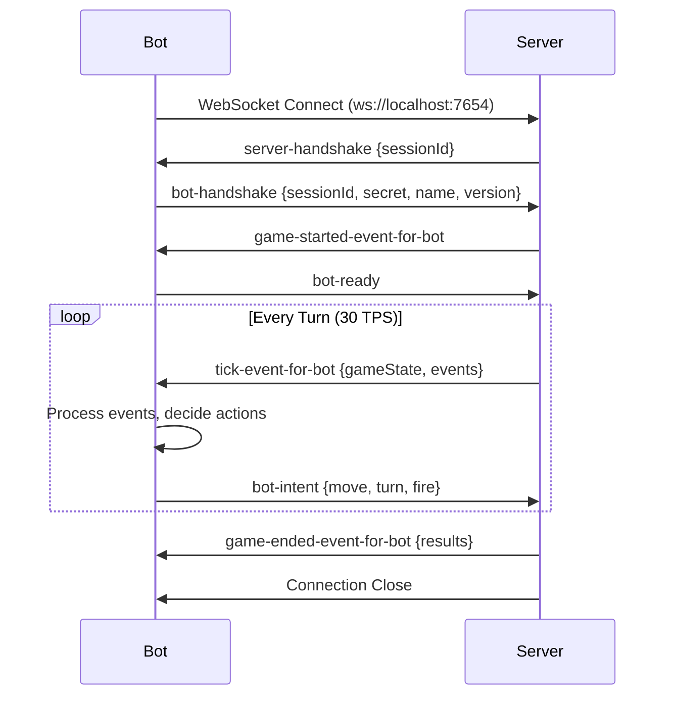

# ADR-0001: WebSocket Communication Protocol

**Status:** Accepted

**Date:** day-1 (documenting existing architecture)

**Decision Makers:** Architecture Team

---

## Context

Robocode Tank Royale is a real-time programming game where multiple bots battle simultaneously in an arena. The system needs a communication protocol that supports:

- **Real-time bidirectional communication** between server and bots
- **Multi-client support** — Multiple bots, observers, and controllers connecting simultaneously
- **Cross-platform compatibility** — Bots written in different languages (Java, .NET, Python)
- **Local and remote play** — Same protocol works for localhost and internet play
- **Low latency** — Game runs at 30 turns per second (TPS)
- **Event-driven messaging** — Tick events, bot intents, game state updates

### Options Considered

1. **WebSocket Protocol**
2. **HTTP REST API with polling**
3. **gRPC with bidirectional streaming**
4. **Custom TCP/UDP protocol**
5. **Message Queue (AMQP/MQTT)**

---

## Decision

We will use **WebSocket protocol with JSON messages** for all communication between the server and clients (bots, observers, controllers).

**Key Specifications:**
- Protocol: `ws://` (WebSocket)
- Default endpoint: `ws://localhost:7654`
- Message format: JSON
- Schema: Defined in `/schema/schemas/*.schema.yaml`
- Full-duplex: Server and clients can send messages independently

---

## Rationale

### Advantages of WebSocket

#### 1. **Full-Duplex Real-Time Communication**
- Server can push tick events to all clients simultaneously
- Clients can send intents/commands asynchronously
- No polling overhead — connections stay open
- Critical for 30 TPS game loop performance

#### 2. **Cross-Platform Standard**
- Native WebSocket support in all major languages:
  - Java: `java.net.http.WebSocket`
  - .NET: `System.Net.WebSockets`
  - Python: `websockets` library
- Well-documented APIs and extensive library ecosystem

#### 3. **Network-First Design**
- Same protocol for local and remote connections
- No special cases for localhost vs. internet play
- Simplifies testing (can connect from different machines)
- Future-proofs for cloud-hosted battles

#### 4. **Browser Compatibility**
- JavaScript/browser-based bots can connect directly
- Web-based observers/viewers work out of the box
- Enables web GUI without protocol translation

#### 5. **JSON Message Format**
- Human-readable for debugging
- Language-agnostic serialization
- Easy to evolve (add new fields without breaking clients)
- Schema validation via YAML definitions

#### 6. **Connection Management**
- Built-in connection lifecycle (open, message, error, close)
- Automatic reconnection strategies
- Heart beat/ping-pong for detecting disconnections

### Disadvantages and Mitigations

#### 1. **JSON Parsing Overhead**
- JSON parsing is slower than binary protocols
- **Mitigation:**
  - Performance acceptable at 30 TPS (measured: <10ms per tick)
  - Consider binary format (MessagePack) only if profiling shows bottleneck
  - Current scale (<100 bots) doesn't warrant optimization

#### 2. **Message Size**
- JSON is more verbose than binary formats
- **Mitigation:**
  - Tick events are ~5KB per bot (acceptable for LAN/internet)
  - Compression available (gzip) if needed
  - Partial game state sent to bots (full state only to observers)

#### 3. **Schema Evolution**
- Adding/removing fields requires coordination
- **Mitigation:**
  - Schema versioning in YAML files
  - Backward compatibility enforced via validation
  - Bot API versions track schema versions

#### 4. **WebSocket Library Quirks**
- Different languages have different WebSocket implementations
- **Mitigation:**
  - Abstract WebSocket handling in `WebSocketHandler` classes
  - Consistent API across Java, .NET, Python bot APIs
  - Automated integration tests validate protocol conformance

---

## Implementation

### Connection Flow



### Message Schema Example

**Server → Bot (Tick Event):**
```json
{
  "type": "tick-event-for-bot",
  "turnNumber": 42,
  "roundNumber": 1,
  "botState": {
    "energy": 100,
    "x": 350.5,
    "y": 250.3,
    "direction": 45,
    "gunDirection": 90,
    "radarDirection": 180,
    "speed": 8
  },
  "bulletStates": [...],
  "events": [
    {"type": "scanned-bot-event", "scannedBotId": 2, "energy": 80, ...}
  ]
}
```

**Bot → Server (Intent):**
```json
{
  "type": "bot-intent",
  "turnRate": 5,
  "gunTurnRate": 10,
  "radarTurnRate": 45,
  "targetSpeed": 8,
  "firepower": 3,
  "adjustGunForBodyTurn": true,
  "adjustRadarForGunTurn": true
}
```

### Java Bot API Example

```java
public class MyBot extends BaseBot {
    @Override
    public void run() {
        while (isRunning()) {
            setTurnRate(5);
            setTargetSpeed(8);
            setFire(3);
        }
    }
    
    @Override
    public void onScannedBot(ScannedBotEvent e) {
        fire(2);
    }
}

// Internally, BaseBot uses WebSocket:
// BaseBotInternals → WebSocketHandler → java.net.http.WebSocket
```

### Environment Configuration

Bots connect via environment variables:
```bash
BOT_NAME=MyBot
BOT_VERSION=1.0
SERVER_URL=ws://localhost:7654
SERVER_SECRET=my-secret-token
```

---

## Alternatives Considered

### HTTP REST with Polling

**Pros:**
- Simple to implement
- Well-understood
- No connection state

**Cons:**
- Polling introduces latency (incompatible with 30 TPS)
- High overhead (100+ requests per second per bot)
- Server can't push events

**Decision:** Rejected due to latency and overhead

---

### gRPC with Bidirectional Streaming

**Pros:**
- Efficient binary protocol (Protocol Buffers)
- Strong typing and code generation
- Good performance

**Cons:**
- Limited browser support (requires gRPC-Web proxy)
- More complex setup (protobuf compilation)
- Less human-readable for debugging
- HTTP/2 requirement complicates deployment

**Decision:** Rejected due to browser compatibility and complexity

---

### Custom TCP/UDP Protocol

**Pros:**
- Maximum performance
- Full control over wire format

**Cons:**
- High development cost (implement protocol, state management, reconnection)
- No browser support (requires native client)
- Cross-platform socket programming complexity
- Reinventing the wheel (WebSocket already solves this)

**Decision:** Rejected due to development cost and lack of browser support

---

### Message Queue (AMQP/MQTT)

**Pros:**
- Reliable message delivery
- Decoupling
- Pub/sub patterns

**Cons:**
- Requires broker (RabbitMQ, Mosquitto)
- Deployment complexity
- Overkill for direct client-server communication
- Added latency through broker
- No browser support without additional gateway

**Decision:** Rejected due to deployment complexity and unnecessary indirection

---

## Consequences

### Positive

- ✅ Real-time bidirectional communication at 30 TPS
- ✅ Cross-platform bot development (Java, .NET, Python, JavaScript)
- ✅ Network-first design (local and remote play identical)
- ✅ Browser-based clients possible (web GUI, observers)
- ✅ JSON message format is debuggable and evolvable
- ✅ Standard protocol with mature libraries
- ✅ Simple deployment (no broker/proxy required)

### Negative

- ❌ JSON parsing overhead vs. binary protocols
- ❌ Message size larger than binary formats
- ❌ Schema evolution requires coordination
- ❌ WebSocket library differences across languages

### Neutral

- Connection state management required (handled by libraries)
- Firewall/proxy considerations (WebSocket uses HTTP upgrade)

---

## Related Decisions

- **ADR-0002:** Cross-Platform Bot API Strategy
- **ADR-0003:** Real-Time Game Loop Architecture

---

## References

- [WebSocket Protocol RFC 6455](https://tools.ietf.org/html/rfc6455)
- [Schema Definitions](/schema/schemas/README.md)
- [Bot API Documentation](../../../docs/api/)
- [Server Implementation](/server/)

---

## Review and Updates

- **2026-02-11:** Initial documentation of existing architecture
- **Next Review:** When considering protocol changes or performance optimization

---

**Related Documentation:**
- [System Context Diagram](../c4-views/system-context.md)
- [Bot Connection Flow](../models/flows/bot-connection.md)
- [Message Schema](../models/message-schema/README.md)
- [Handshakes](../models/message-schema/handshakes.md)
