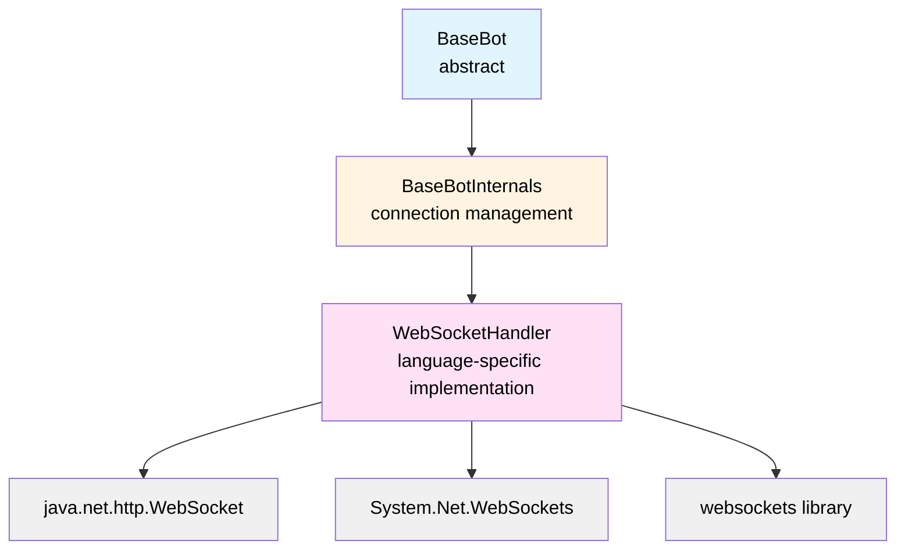

# ADR-0002: Cross-Platform Bot API Strategy

**Status:** Accepted

**Date:** day-1 (documenting existing architecture)

**Decision Makers:** Flemming N. Larsen

---

## Context

Robocode Tank Royale aims to be accessible to programmers using different languages and platforms. The original Robocode supported only Java, limiting its reach. We need a strategy to:

- Support multiple programming languages (Java, .NET/C#, Python, and potentially others)
- Maintain consistent bot behavior across platforms
- Avoid API divergence between language implementations
- Minimize maintenance burden of multiple codebases
- Ensure fair competition (no language gives unfair advantage)

### Options Considered

1. **Identical API implementation across languages**
2. **Single JVM-based API with language bindings**
3. **Language-specific idiomatic APIs**
4. **Code generation from shared specification**
5. **Single reference implementation only**

---

## Decision

We will implement **identical API structures across all supported languages**, with each API being a **symmetric translation** maintaining the same:
- Class/interface names and hierarchy
- Method signatures (adapted to language conventions)
- Event model and lifecycle
- Configuration and environment variables
- WebSocket protocol implementation

**Supported Languages:**
- Java (bot-api/java)
- .NET/C# (bot-api/dotnet)
- Python (bot-api/python)

---

## Rationale

### Advantages of Symmetric APIs

#### 1. **Consistent Bot Behavior**
- Same game logic across all languages
- No language-specific advantages or bugs
- Fair competition regardless of language choice
- Identical semantics reduce confusion when switching languages

#### 2. **Schema-Driven Design**
- All APIs map to same protocol schemas (`/schema/schemas/*.yaml`)
- Message format identical across languages
- Server doesn't care which language bot uses
- Guaranteed protocol compliance

#### 3. **Shared Architecture Pattern**



Each language follows this exact pattern.

#### 4. **Unified Event Model**
```java
// Java
public abstract class BaseBot {
    public void onScannedBot(ScannedBotEvent e) {}
    public void onHitByBullet(HitByBulletEvent e) {}
    public void onBulletHit(BulletHitEvent e) {}
    // ...
}
```

```csharp
// C#
public abstract class BaseBot {
    public virtual void OnScannedBot(ScannedBotEvent e) {}
    public virtual void OnHitByBullet(HitByBulletEvent e) {}
    public virtual void OnBulletHit(BulletHitEvent e) {}
    // ...
}
```

```python
# Python
class BaseBot:
    def on_scanned_bot(self, event: ScannedBotEvent):
        pass
    def on_hit_by_bullet(self, event: HitByBulletEvent):
        pass
    def on_bullet_hit(self, event: BulletHitEvent):
        pass
```

Method names adapted to language conventions (PascalCase → camelCase → snake_case) but signatures identical.

#### 5. **Consistent Configuration**
All APIs use identical environment variables:
```bash
BOT_NAME=MyBot
BOT_VERSION=1.0
BOT_AUTHOR=John Doe
SERVER_URL=ws://localhost:7654
SERVER_SECRET=my-secret
```

#### 6. **Parallel Documentation**
- Single tutorial translates easily to all languages
- Examples show equivalent code side-by-side
- Reduces learning curve when switching languages

### Disadvantages and Mitigations

#### 1. **Not Idiomatic**
- Java uses camelCase, Python prefers snake_case
- **Mitigation:**
  - Adapt naming to language conventions
  - Java: `setTurnRate()`, Python: `set_turn_rate()`
  - Core structure remains identical

#### 2. **Maintenance Burden**
- Changes must be replicated across 3+ codebases
- **Mitigation:**
  - Schema-driven development (change schema → update all APIs)
  - Automated integration tests validate consistency
  - Shared test scenarios across languages

#### 3. **Language-Specific Features**
- Can't leverage Python async/await, C# LINQ, Java streams optimally
- **Mitigation:**
  - Core API stays simple
  - Advanced users can access underlying WebSocket if needed
  - Focus on clarity over language-specific optimization

#### 4. **Different Type Systems**
- Java: strong static typing
- C#: strong static typing with nullable reference types
- Python: dynamic typing with optional type hints
- **Mitigation:**
  - Use explicit type definitions (Java/C# classes, Python dataclasses)
  - Schema validation catches type mismatches

---

## Implementation

### Common Interface: `IBaseBot`

All implementations provide this contract:

```java
public interface IBaseBot {
    // Lifecycle
    void run();
    
    // Movement
    void setTurnRate(double turnRate);
    void setTargetSpeed(double targetSpeed);
    
    // Gun
    void setGunTurnRate(double gunTurnRate);
    void setFire(double firepower);
    
    // Radar
    void setRadarTurnRate(double radarTurnRate);
    
    // Events
    void onScannedBot(ScannedBotEvent e);
    void onHitByBullet(HitByBulletEvent e);
    void onBulletHit(BulletHitEvent e);
    void onBulletMissed(BulletMissedEvent e);
    void onHitWall(HitWallEvent e);
    void onHitBot(HitBotEvent e);
    void onDeath(DeathEvent e);
    void onWon(WonEvent e);
    // ... more events
}
```

### WebSocket Abstraction

Each language implements `WebSocketHandler`:

**Java:**
```java
class WebSocketHandler {
    private final WebSocket webSocket;
    
    WebSocketHandler(URI serverUri) {
        this.webSocket = HttpClient.newHttpClient()
            .newWebSocketBuilder()
            .buildAsync(serverUri, new WebSocketListener())
            .join();
    }
}
```

**C#:**
```csharp
class WebSocketHandler {
    private readonly ClientWebSocket webSocket;
    
    WebSocketHandler(Uri serverUri) {
        webSocket = new ClientWebSocket();
        await webSocket.ConnectAsync(serverUri, CancellationToken.None);
    }
}
```

**Python:**
```python
class WebSocketHandler:
    def __init__(self, server_uri: str):
        self.websocket = None
        asyncio.run(self._connect(server_uri))
    
    async def _connect(self, uri: str):
        self.websocket = await websockets.connect(uri)
```

### Dependency Management

**Java:** `build.gradle`
```gradle
dependencies {
    implementation 'com.google.code.gson:gson:2.10.1'
    // WebSocket built into Java 11+
}
```

**.NET:** `TankRoyale.BotApi.csproj`
```xml
<ItemGroup>
    <PackageReference Include="Newtonsoft.Json" Version="13.0.3" />
    <!-- WebSocket built into .NET Core -->
</ItemGroup>
```

**Python:** `requirements.txt`
```
websockets>=12.0
```

---

## Alternatives Considered

### Single JVM-Based API with Bindings

**Pros:**
- Single codebase to maintain
- Guaranteed identical behavior
- Language bindings auto-generated

**Cons:**
- Requires JVM for all bots (huge dependency)
- Performance overhead for bindings
- Complex setup (JNI, P/Invoke)
- Not truly native

**Decision:** Rejected due to JVM dependency and complexity

---

### Language-Specific Idiomatic APIs

**Pros:**
- Each API feels natural in its language
- Leverage language-specific features
- Better developer experience

**Cons:**
- APIs diverge over time
- Difficult to maintain consistency
- Different semantics cause confusion
- Unfair advantages (async Python vs. sync Java)

**Decision:** Rejected due to maintenance burden and fairness concerns

---

### Code Generation from Specification

**Pros:**
- Single source of truth (schema)
- Automatic API generation
- Guaranteed consistency

**Cons:**
- Generated code is often ugly
- Hard to customize
- Tooling complexity
- Debugging generated code is difficult

**Decision:** Deferred; may revisit for future languages (Go, Rust)

---

### Single Reference Implementation (Java Only)

**Pros:**
- Minimal maintenance
- Focus on one language

**Cons:**
- Excludes non-Java developers
- Misses opportunity for broader community
- Less educational value

**Decision:** Rejected; multi-language support is core goal

---

## Consequences

### Positive

- ✅ Consistent bot behavior across languages
- ✅ Fair competition (no language advantage)
- ✅ Same learning materials work for all languages
- ✅ Schema-driven design prevents divergence
- ✅ Accessible to more developers

### Negative

- ❌ Maintenance burden (3+ codebases)
- ❌ Not fully idiomatic in each language
- ❌ Can't leverage advanced language features optimally
- ❌ Type system differences require careful handling

### Neutral

- Language-specific packaging (Maven, NuGet, PyPI)
- Separate documentation per language (but structurally identical)

---

## Related Decisions

- **ADR-0001:** WebSocket Communication Protocol
- **ADR-0003:** Real-Time Game Loop Architecture

---

## References

- [Bot API Java](/bot-api/java/)
- [Bot API .NET](/bot-api/dotnet/)
- [Bot API Python](/bot-api/python/)
- [Schema Definitions](/schema/schemas/)

---

**Related Documentation:**
- [Message Schema](../models/message-schema/README.md)
- [Events](../models/message-schema/events.md)
- [Intents](../models/message-schema/intents.md)
- [Bot Connection Flow](../models/flows/bot-connection.md)
- [Bot API Component Diagram](../c4-views/bot-api-component.md)
