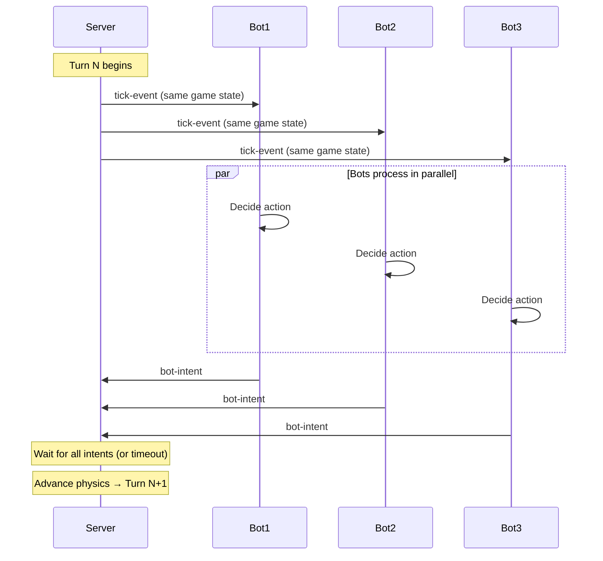
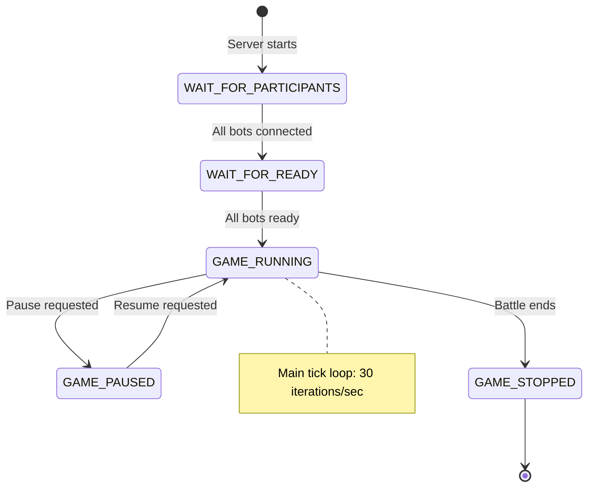

# ADR-0003: Real-Time Game Loop Architecture

**Status:** Accepted  
**Date:** 2026-02-11

---

## Context

Tank Royale is a real-time programming game where multiple bots battle simultaneously.

**Problem:** How to synchronize actions of multiple bots while ensuring deterministic, fair gameplay?

**Requirements:**
- Consistent frame rate (30 TPS target)
- Deterministic physics (reproducible results)
- Fair synchronization (all bots see same state)
- Handle bot timeouts gracefully
- Support pause/resume for debugging

---

## Decision

Use a **turn-based discrete tick loop** at **30 TPS** with:
- Server as authoritative game state manager
- Synchronous bot intent collection per tick  
- Strict timeout enforcement per bot
- Deterministic physics simulation

---

## Rationale

**Why tick-based loop:**
- ✅ **Deterministic**: Same inputs → same outputs (reproducible)
- ✅ **Fair synchronization**: All bots receive identical game state simultaneously
- ✅ **Timeout handling**: Bots can't stall the game (fixed deadline)
- ✅ **Predictable performance**: 30 TPS = ~33ms per turn budget
- ✅ **Network-friendly**: 30 TPS matches typical latency constraints

### Synchronization Pattern



**Alternatives rejected:**
- **Continuous real-time**: Non-deterministic, sync issues
- **Event-driven async**: Race conditions, unfair network advantages  
- **Lockstep sync**: One slow client stalls everyone
- **Hybrid tick+event**: Added complexity without clear benefit

---

## Implementation

### Game Loop State Machine



### Per-Tick Execution

```kotlin
fun executeTurn() {
    // 1. Send tick events to all bots (same game state)
    bots.forEach { it.sendTickEvent(gameState) }
    
    // 2. Collect intents with timeout (~30ms)
    val intents = bots.associateWith { bot ->
        try {
            bot.receiveIntent(timeout = botTimeoutMs)
        } catch (e: TimeoutException) {
            bot.sendSkippedTurnEvent()
            null // Late response
        }
    }
    
    // 3. Apply all valid intents to physics
    applyIntents(intents.filterNotNull())
    updatePhysics()
    checkCollisions()
    
    // 4. Maintain 30 TPS
    sleepToMaintainTPS()
}
```

**Configuration:**
```bash
java -jar server.jar --tps=30 --turn-timeout=30 --max-inactivity=30
```

---

## Consequences

- ✅ Deterministic physics (fair competition)  
- ✅ Timeout enforcement prevents game stalling
- ✅ Predictable performance (33ms per turn)
- ✅ Pause/resume support for debugging
- ✅ Replay system possible (record intents per turn)
- ❌ Fixed frame rate (can't exceed 30 TPS)
- ❌ Movement quantized to 33ms granularity
- ❌ Bot logic must complete within timeout

---

## References

- [Game Loop Patterns](https://gameprogrammingpatterns.com/game-loop.html)
- [Server Implementation](/server/)

