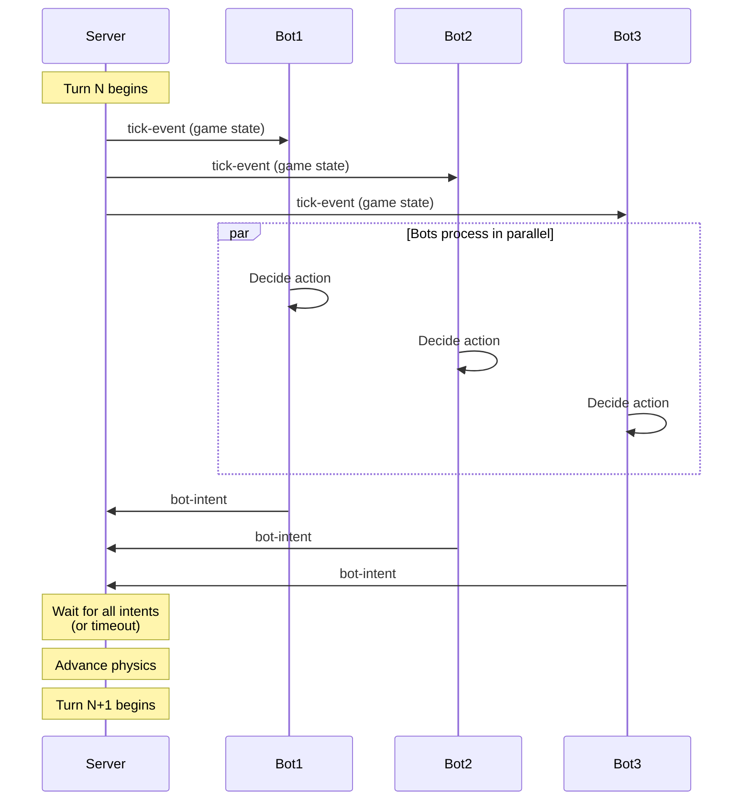
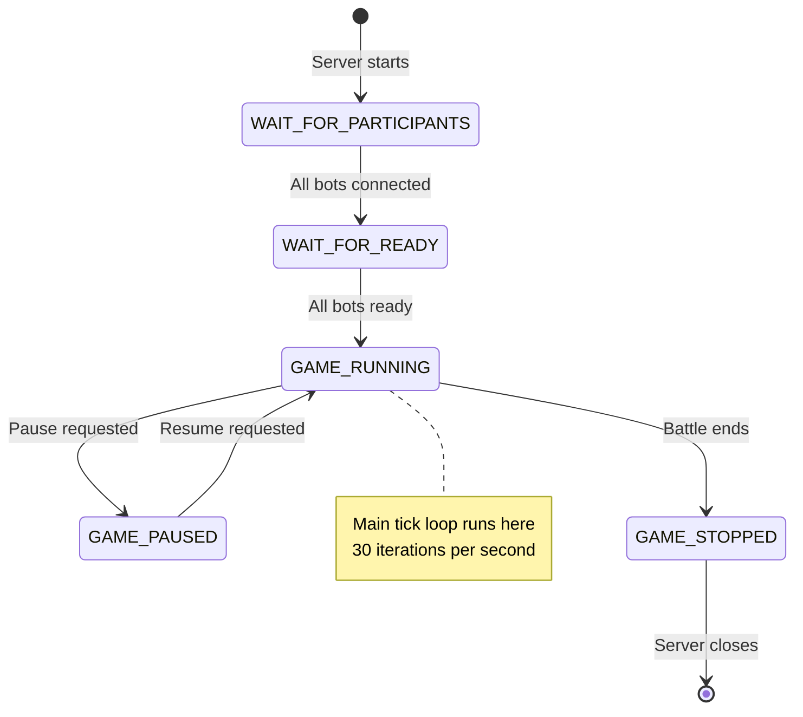
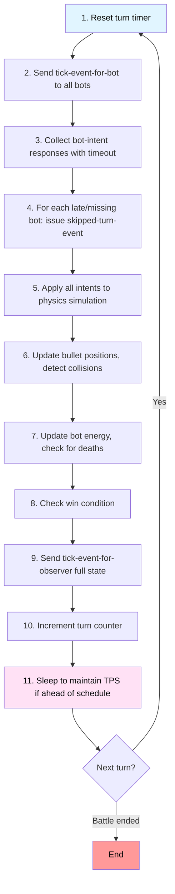

# ADR-0003: Real-Time Game Loop Architecture

**Status:** Accepted

**Date:** 2026-02-11 (documenting existing architecture)

**Decision Makers:** Flemming N. Larsen

---

## Context

Robocode Tank Royale is a real-time programming game where multiple bots battle simultaneously. The game must:

- Run at consistent frame rate (target: 30 turns per second)
- Synchronize actions of multiple bots
- Ensure deterministic game physics (reproducible results)
- Handle bot timeouts and late responses
- Support pause/resume for debugging
- Allow observers to watch battles in real-time

### Options Considered

1. **Turn-based discrete tick loop**
2. **Continuous real-time simulation**
3. **Lockstep synchronization**
4. **Event-driven asynchronous model**
5. **Hybrid tick + event system**

---

## Decision

We will use a **turn-based discrete tick loop** running at **30 TPS (turns per second)** with:
- Server as authoritative game state manager
- Synchronous bot intent collection per tick
- Strict timeout enforcement (per-bot)
- Deterministic physics simulation
- State machine for game lifecycle

---

## Rationale

### Advantages of Tick-Based Loop

#### 1. **Deterministic Physics**
- Game state advances in discrete steps
- Same inputs → same outputs (reproducible)
- Critical for fair competition and debugging
- Enables replay system and game validation

#### 2. **Synchronization**


All bots receive same game state at same time, ensuring fairness.

#### 3. **Timeout Handling**
- Each bot has fixed time to respond (configurable, default: ~30ms)
- Late/missing responses → `skipped-turn-event`
- Bot can't stall game (timeout enforced)
- Multiple consecutive skips → bot disqualified

#### 4. **Predictable Performance**
- 30 TPS = ~33ms per turn
- CPU budget per turn known
- Easy to optimize (profile per-tick execution)
- Consistent experience across hardware

#### 5. **Pause/Resume Support**
- Game state can be frozen between ticks
- Debugging: pause, inspect, resume
- No partial-tick state to manage
- Observer can step through turns

#### 6. **Network-Friendly**
- Tick rate (30 TPS) matches typical network latency (<30ms local, <100ms internet)
- Batched state updates per tick
- Predictable bandwidth (not bursty)

### Disadvantages and Mitigations

#### 1. **Fixed Frame Rate**
- Can't run faster than 30 TPS (even if hardware allows)
- **Mitigation:**
  - 30 TPS chosen as sweet spot (fast but playable)
  - Configurable TPS for testing (`--tps` flag)
  - Replay can run at higher speed

#### 2. **Granularity Limitations**
- Movement/rotation quantized to tick boundaries
- Fine-grained timing (milliseconds) not possible
- **Mitigation:**
  - 30 TPS = 33ms granularity (sufficient for gameplay)
  - Physics tuned for tick-based simulation

#### 3. **Bot Timeout Strictness**
- Slow bot logic can cause skipped turns
- **Mitigation:**
  - Timeout is generous (~30ms for simple logic)
  - Best practice: avoid blocking operations in bot
  - Warning system alerts bot to slow performance

#### 4. **CPU Usage**
- Server runs continuous loop (even if no action)
- **Mitigation:**
  - Sleep between ticks to yield CPU
  - Only update observers when state changes

---

## Implementation

### Game Loop State Machine



### Per-Tick Sequence



### Timeout Enforcement (Kotlin pseudocode)

```kotlin
class TurnExecutor(val tps: Int = 30) {
    val turnDurationMs = 1000 / tps  // 33ms at 30 TPS
    val botTimeoutMs = turnDurationMs * 0.9  // 30ms per bot
    
    fun executeTurn(bots: List<Bot>) {
        val turnStart = System.currentTimeMillis()
        
        // Send tick events
        bots.forEach { it.sendTickEvent(gameState) }
        
        // Collect intents with timeout
        val intents = bots.associateWith { bot ->
            try {
                bot.receiveIntent(timeout = botTimeoutMs)
            } catch (e: TimeoutException) {
                bot.sendSkippedTurnEvent()
                null
            }
        }
        
        // Advance physics
        applyIntents(intents.filterNotNull())
        updatePhysics()
        checkCollisions()
        
        // Maintain TPS
        val elapsed = System.currentTimeMillis() - turnStart
        val remaining = turnDurationMs - elapsed
        if (remaining > 0) {
            Thread.sleep(remaining)
        }
    }
}
```

### Configuration

```bash
# Server startup
java -jar robocode-tank-royale-server.jar \
    --port=7654 \
    --tps=30 \
    --turn-timeout=30 \
    --max-inactivity-turns=30
```

| Flag | Default | Description |
|------|---------|-------------|
| `--tps` | 30 | Turns per second |
| `--turn-timeout` | 30ms | Max time bot can take per turn |
| `--max-inactivity-turns` | 30 | Consecutive skips before disqualification |

---

## Alternatives Considered

### Continuous Real-Time Simulation

**Pros:**
- Smooth animation
- Higher precision
- More "realistic"

**Cons:**
- Non-deterministic (floating-point errors accumulate)
- Hard to reproduce battles
- Difficult to synchronize bots
- Network latency causes desync

**Decision:** Rejected due to non-determinism and sync issues

---

### Lockstep Synchronization

**Pros:**
- Perfect synchronization
- Used in RTS games (Age of Empires, StarCraft)

**Cons:**
- All clients must advance together
- One slow client stalls everyone
- Complex rollback on desync
- Overkill for server-authoritative game

**Decision:** Rejected; server-authoritative model is simpler

---

### Event-Driven Asynchronous Model

**Pros:**
- Maximum responsiveness
- No artificial turn boundaries
- Bots act immediately

**Cons:**
- Race conditions (order of events matters)
- Non-deterministic execution
- Hard to debug ("why did bot A win?")
- Network latency causes unfair advantages

**Decision:** Rejected due to non-determinism and unfairness

---

### Hybrid Tick + Event System

**Pros:**
- Tick for physics, async for bot logic
- Best of both worlds

**Cons:**
- Complex implementation
- Harder to reason about
- Still need timeout handling
- Doesn't solve core problems

**Decision:** Rejected; added complexity without clear benefit

---

## Consequences

### Positive

- ✅ Deterministic physics (reproducible battles)
- ✅ Fair synchronization (all bots see same state)
- ✅ Timeout enforcement prevents slow bots from stalling
- ✅ Predictable performance and CPU usage
- ✅ Pause/resume support for debugging
- ✅ Network-friendly (30 TPS matches typical latency)
- ✅ Replay system possible (record intents per turn)

### Negative

- ❌ Fixed frame rate (can't run faster than TPS)
- ❌ Quantized movement (33ms granularity)
- ❌ Continuous CPU usage (even when idle)
- ❌ Bot logic must complete within timeout

### Neutral

- TPS configurable but default (30) balances speed and playability
- Physics tuned specifically for tick-based simulation
- Observer experience depends on TPS (higher = smoother but harder to follow)

---

## Performance Considerations

### Profiling Data (100 bots, 30 TPS)

| Phase | Time (avg) | Notes |
|-------|-----------|-------|
| Send tick events | 5ms | WebSocket broadcast |
| Collect intents | 25ms | Wait for bot responses |
| Physics simulation | 3ms | Position updates, collisions |
| Observer updates | 2ms | Send full game state |
| **Total** | **35ms** | Target: 33ms (slightly over) |

**Optimizations implemented:**
- Spatial indexing for collision detection (O(n log n) → O(n))
- Incremental state updates for observers (send deltas)
- Connection pooling for WebSocket
- Parallel intent collection (non-blocking)

---

## Related Decisions

- **ADR-0001:** WebSocket Communication Protocol
- **ADR-0002:** Cross-Platform Bot API Strategy

---

## References

- [Game Loop Patterns](https://gameprogrammingpatterns.com/game-loop.html)
- [Deterministic Simulation](https://gafferongames.com/post/deterministic_lockstep/)
- [Server Implementation](/server/)

---

**Related Documentation:**
- [Turn Execution Flow](../models/flows/turn-execution.md)
- [Battle Lifecycle Flow](../models/flows/battle-lifecycle.md)
- [Events](../models/message-schema/events.md)
- [Intents](../models/message-schema/intents.md)
- [State Objects](../models/message-schema/state.md)
- [Server Component Diagram](../c4-views/server-component.md)
