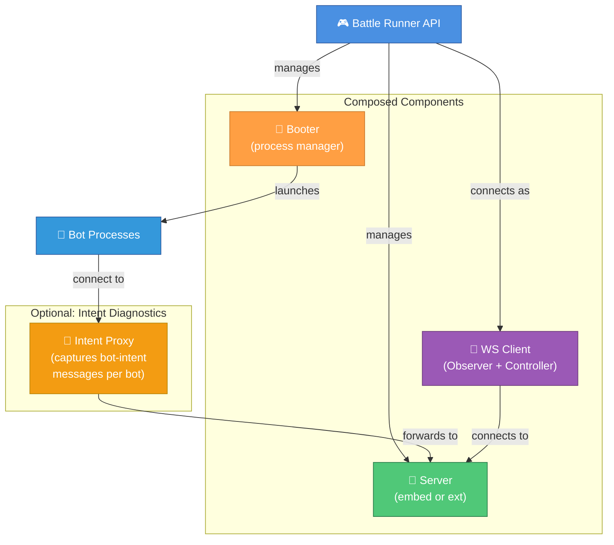

# ADR-0024: Battle Runner API

**Status:** Proposed  
**Date:** 2026-02-28

---

## Context

Tank Royale provides a GUI application for running battles interactively, but lacks a programmatic API for executing
battles from code. Classic Robocode offered a `Control` API (`RobocodeEngine`) that allowed users to start a server,
select bots, run battles, configure rules, and receive results — all without launching a GUI.

This gap impacts several use cases:

- **Integration/service testing** — No way to run end-to-end battles in automated tests and assert on results
- **Robocode API Bridge testing** — The [classic Robocode bridge](https://github.com/robocode-dev/robocode-api-bridge)
  supports legacy robots from classic Robocode. Currently tested manually, but needs automated, repeatable battle runs
  across many legacy bots to verify compatibility
- **Bot development** — Developers must launch the full GUI to test their bots
- **Tournament systems** — Tank Royale itself will not ship tournament/competition management (ADR-0023), but the
  Battle Runner is the explicit foundation for 3rd-party tournament tools to be built on top — exactly as the
  `RobocodeEngine` / Control API served this role in classic Robocode (e.g. RoboRumble). This is a deliberate goal.
- **Education** — Instructors want scriptable battle execution for courses and automated grading
- **Benchmarking** — Comparing bot performance across versions requires repeatable, automated battle runs

Currently, the only way to orchestrate battles programmatically is to manually wire up WebSocket connections to the
Server as both Observer and Controller, manage the Booter process, and handle all protocol details — a significant
barrier to entry.

**Problem:** How should Tank Royale provide programmatic battle execution without duplicating existing component logic
or conflicting with the established architecture?

---

## Decision

Create a new top-level module **`runner`** (artifact: `robocode-tankroyale-battle-runner`) that provides a
high-level **Battle Runner API** — a Java/Kotlin library published to Maven Central.

### Architecture: Orchestration Over Duplication

The Battle Runner API **composes** existing components rather than reimplementing them:



When intent diagnostics are enabled, bots connect to the proxy (via `SERVER_URL` env var) instead of directly to the
server. The proxy transparently forwards all messages while capturing `bot-intent` messages per bot per turn.

| Concern | How Battle Runner Handles It |
|---------|----------------------------|
| **Server lifecycle** | Embeds server JAR in classpath; extracts and launches via `java -jar` (same as GUI), OR connects to an external server |
| **Bot launching** | Embeds booter JAR in classpath; extracts and launches via `java -jar` to spawn bot processes |
| **Battle control** | Connects as Controller role (start, stop, pause, resume) |
| **Event observation** | Connects as Observer role (receives full tick events, game results) |
| **Intent diagnostics** | Optional WS proxy captures raw `bot-intent` messages per bot — no server changes needed |
| **Rule configuration** | Exposes typed API for arena size, number of rounds, gun cooling rate, etc. |
| **Results** | Returns structured `BattleResults` after battle completion (per-bot scores, ranks, damage) |
| **Recording** | Optionally records battles in GZIP ND-JSON format for replay and analysis |

### API Surface (Conceptual)

The API is implemented in Kotlin but designed to be equally ergonomic from Java. All public factory methods use
`@JvmStatic` for direct static access, and `Consumer<Builder>` overloads are provided alongside Kotlin DSL lambdas
to avoid `Unit.INSTANCE` boilerplate in Java (see Decision 15).

**Kotlin:**

```kotlin
// Create and configure a battle runner
BattleRunner.create { embeddedServer() }.use { runner ->
    val bots = listOf(BotEntry.of("bots/MyBot"), BotEntry.of("bots/SampleBot"))

    // Run a battle synchronously — blocks until complete, returns results
    val results = runner.runBattle(
        setup = BattleSetup.classic { numberOfRounds = 5 },
        bots  = bots
    )
    results.results.forEach { r -> println("${r.name}: rank=${r.rank} score=${r.totalScore}") }

    // Run multiple battles on the same server instance (no restart between battles)
    repeat(1000) { i ->
        val r = runner.runBattle(BattleSetup.classic(), bots)
        println("Battle $i: winner=${r.results.first().name}")
    }
}
```

**Java:**

```java
// Create and configure a battle runner
try (var runner = BattleRunner.create(b -> b.embeddedServer())) {
    var bots = List.of(BotEntry.of("bots/MyBot"), BotEntry.of("bots/SampleBot"));

    // Run a battle synchronously — blocks until complete, returns results
    var results = runner.runBattle(
        BattleSetup.classic(s -> s.setNumberOfRounds(5)),
        bots
    );
    for (var r : results.getResults()) {
        System.out.printf("%s: rank=%d score=%d%n", r.getName(), r.getRank(), r.getTotalScore());
    }

    // Run multiple battles on the same server instance (no restart between battles)
    for (int i = 0; i < 1000; i++) {
        var r = runner.runBattle(BattleSetup.classic(), bots);
        System.out.printf("Battle %d: winner=%s%n", i, r.getResults().get(0).getName());
    }
}
```

The `BattleRunner` itself manages lifecycle (create, close, embedded server, booter). The `observer` and `controller`
properties return focused objects that map directly to the Observer and Controller WebSocket roles (ADR-0007). The
convenience method `runBattle()` combines both for the common "run and get results" use case. When
`enableIntentDiagnostics()` is set, the Battle Runner inserts a transparent WebSocket proxy between bots and server
to capture raw `bot-intent` messages — available after battle completion via `runner.intentDiagnostics`.

### Key Design Choices

1. **Module name: `runner`** — Follows the short naming convention of existing modules (`server`, `booter`, `recorder`,
   `gui`). Not "control" (conflicts with existing Controller role in ADR-0007), not "remote" (implies network-only).
   The API is called "Battle Runner" but the module directory is simply `runner`.

2. **Public library from day one** — Published to Maven Central alongside the Bot API. This enables third-party
   tournament systems, educational tools, and CI/CD integrations.

3. **Java/Kotlin reference implementation first** — Follows ADR-0004 (Java as reference). Cross-platform ports
   (Python, .NET) can follow the same pattern as Bot API (ADR-0003).

4. **Dual WebSocket roles as separate API objects** — `runner.observer` returns an Observer with event listeners;
   `runner.controller` returns a Controller with battle commands. This maps directly to ADR-0007's role separation
   at the API level — the `BattleRunner` manages lifecycle, while Observer and Controller have focused,
   single-responsibility interfaces. The convenience `runBattle()` method combines both for the common use case.

5. **Embedded server and booter artifacts** — In embedded mode, the Battle Runner bundles the Server and Booter JAR
   artifacts inside its own JAR — the same approach used by the GUI module. At build time, the shrunken server and
   booter JARs are copied into the classpath resources. At runtime, they are extracted to temp files and launched via
   `java -jar`. This ensures version consistency (server, booter, and runner are always from the same release) and
   zero-config usage — users add a single Maven dependency and everything works. In external mode, no embedded
   artifacts are needed since the user points to an already-running server.

6. **Embedded + external server modes** — Embedded mode starts a server in-process for zero-config usage (testing,
   scripting). External mode connects to a running server for shared/remote scenarios.

6. **Synchronous-first API** — `runBattle()` blocks until completion and returns results. Async variants available for
   real-time event streaming. This matches the most common use case (run battle, get results).

7. **Game type presets** — Battle configuration uses the existing game type preset system (see
   [ADR-0025](./0025-game-type-presets-and-rule-configuration.md)): `classic`, `melee`, `1v1`, and `custom`. Selecting
   a preset provides sensible defaults; individual parameters can be overridden. The simplest API call is
   `runBattle(GameType.CLASSIC)`.

8. **Event delivery via Event\<T\> system** — Reuses the existing event infrastructure from ADR-0022, providing
   consistent patterns across the codebase.

9. **Max-speed by default (TPS = -1)** — Programmatic battle execution should run as fast as possible. There is no
   need for TPS throttling without a GUI rendering frames. The server's TPS is set to `-1` (unlimited) by default.
   TPS control is intentionally omitted — if a user wants to observe battles visually, they should use the GUI.

10. **Intent diagnostics via WebSocket proxy** — The observer protocol deliberately does NOT include raw bot intents,
    and we will not extend it for this purpose. Instead, the Battle Runner optionally interposes a lightweight
    **WebSocket proxy** between bots and the server. The Booter sets `SERVER_URL` to the proxy address; bots connect
    to the proxy; the proxy forwards all messages transparently to the real server while capturing `bot-intent`
    messages per bot per turn. This approach:
    - Requires **no server changes** and **no observer protocol changes**
    - Works for **all Bot APIs** (Java, Python, .NET, custom) since it operates at the wire protocol level
    - Is **language-agnostic** — any bot that speaks the WebSocket protocol is captured
    - Stores intents **in memory per bot** for the current battle, accessible like battle results
    - Is **opt-in** — disabled by default to avoid the proxy hop in performance-sensitive scenarios

11. **Optional battle recording** — The core GZIP ND-JSON file writer (`GameRecorder`) is extracted from the `recorder`
    module into `lib/common`. The Battle Runner pipes its observer events through this shared writer when recording is
    enabled. This avoids depending on the full `recorder` module (which includes its own WebSocket client and CLI) while
    producing recordings identical to the standalone Recorder — playable in the GUI and compatible with existing tooling.

12. **Server reuse across battles** — The embedded server stays running across multiple sequential battles by default.
    Running 1000 battles of 10 rounds each does NOT restart the server between battles — only the bot processes and
    battle lifecycle are reset. This avoids unnecessary overhead and is the expected default for benchmarking and
    tournament scenarios.

13. **Value-class configuration validation** — Configuration parameters use value classes (e.g. `ArenaSize`,
    `RoundCount`, `GameType`) that validate invariants at construction time. Invalid configuration fails fast when
    building the runner or battle config — not when starting a battle. This eliminates the need for a separate
    "dry run" validation mode.

14. **Typed intent diagnostics** — Intent data is exposed as deserialized Kotlin/Java objects, not raw JSON strings.
    End users of the API should never deal with JSON. The intent model should reuse or extend existing types from
    `lib/common` (matching the server's `BotIntent` structure) to avoid duplication.

15. **Java-friendly API surface** — Although the Battle Runner is implemented in Kotlin, it is a public Maven Central
    library consumed by both Kotlin and Java clients (Java 11+). Each factory method uses a three-overload pattern:
    (a) a `@JvmSynthetic` Kotlin DSL lambda-with-receiver (`Builder.() -> Unit`) — hidden from Java to prevent
    ambiguity; (b) a `@JvmStatic` no-arg overload returning preset defaults; (c) a `@JvmStatic` overload accepting
    `java.util.function.Consumer<Builder>` for Java callers. This avoids both `Companion` object access and
    `return Unit.INSTANCE;` boilerplate in Java. Builder methods with Kotlin default parameters (e.g.,
    `embeddedServer(port = 0)`) use `@JvmOverloads` to generate no-arg overloads. Kotlin `var` properties on builders
    naturally compile to `getX()`/`setX()` accessors that Java callers use idiomatically.

---

## Rationale

### Why a Separate Module (Not Embedded in GUI or Server)

- ✅ **Single Responsibility** — GUI handles visualization; Battle Runner handles programmatic execution
- ✅ **Minimal dependency footprint** — Users who just want to run battles don't need Swing/AWT
- ✅ **Independent versioning** — Can evolve separately from GUI release cadence
- ✅ **Testability** — The module itself can be tested without GUI infrastructure

### Why Orchestration (Not a New Server Mode)

- ✅ **No code duplication** — Reuses Server, Booter, and protocol as-is
- ✅ **Consistency** — Battles run identically whether via GUI or Battle Runner
- ✅ **Simplicity** — No new server-side code needed; all logic is client-side orchestration
- ✅ **Composability** — Users can mix and match (e.g., Battle Runner + external server)

### Why "Battle Runner" Name

| Candidate | Rejected Because |
|-----------|-----------------|
| Control API | Conflicts with existing "Controller" role (ADR-0007) — would create confusion |
| Remote API | Implies network/online usage; this is primarily local orchestration |
| Engine API | Suggests it IS the engine; it's an orchestrator OF the engine |
| Battle Manager | "Manager" is overloaded in OOP contexts |
| **Battle Runner** | ✅ Clear purpose, no naming conflicts, action-oriented |

---

## Alternatives Considered

### Alternative 1: Extend the GUI with a Headless Mode

Add a `--headless` flag to the GUI application that skips rendering but runs battles.

**Rejected because:**

- Still requires the full GUI module and its dependencies (Swing, rendering code)
- Hard to consume as a library — it's an application, not an API
- Configuration would be via CLI flags rather than a type-safe API
- Doesn't enable programmatic event handling or result inspection

### Alternative 2: Provide Raw WebSocket Client Libraries Only

Publish low-level Observer and Controller client libraries; let users wire up battles themselves.

**Rejected because:**

- Too much boilerplate for common use cases (start server, boot bots, run battle, get results)
- Users must understand the full WebSocket protocol and message sequencing
- No abstraction over Booter process management
- Raises the barrier to entry significantly

### Alternative 3: Embed Battle Execution Logic Directly (No Server)

Create an API that runs the physics engine directly, bypassing WebSocket entirely.

**Rejected because:**

- Duplicates server logic — violates DRY
- Battles would behave differently from "real" battles (different code paths)
- Breaks the network-first architecture (ADR-0009)
- Loses the ability to connect remote bots

---

## Consequences

### Positive

- ✅ **True integration testing** — The Battle Runner executes battles _exactly_ as the game is intended to run: real
  Server, real Booter, real bot processes, real WebSocket protocol. The GUI is just an observer and controller on top of
  these same components — meaning Battle Runner tests exercise the identical code paths as a real game. This is the only
  way to do integration tests that match actual gameplay.
- ✅ **Programmatic battle execution** — Run battles from JUnit, scripts, CI/CD pipelines
- ✅ **Robocode API Bridge validation** — Automated testing of legacy bot compatibility across many bots consistently
- ✅ **Third-party enablement** — Tournament systems, educational tools, and analyzers can be built on top
- ✅ **Developer experience** — Faster bot iteration without launching GUI
- ✅ **Platform completeness** — Fills the gap between low-level protocol and high-level GUI

### Negative

- ⚠️ **New module to maintain** — Adds to the monorepo's build and release surface
- ⚠️ **Server startup overhead** — Embedded mode requires spinning up a WebSocket server (mitigated: it's fast)
- ⚠️ **Process management complexity** — Booter spawns OS processes; cleanup on failure needs care
- ⚠️ **API stability commitment** — Public Maven Central artifact means backward compatibility obligations

### Future Enhancements

- 🔮 **GUI Bot Console — Intent Tab** — The GUI's bot console currently shows observed events (stdout, stderr) for each
  bot. Once the Intent Diagnostics WS proxy is implemented, the GUI could add an "Intents" tab to the bot console that
  displays the raw `bot-intent` messages as they are sent to the server. This would give developers real-time visibility
  into what their bot is requesting (target speed, turn rates, fire power, etc.) alongside the observed outcomes — a
  powerful debugging aid. The proxy component should be designed as a reusable library so the GUI can integrate it
  independently of the Battle Runner API.

---

## References

- [ADR-0005: Independent Deployable Components](./0005-independent-deployable-components.md) — Battle Runner composes
  these components
- [ADR-0007: Client Role Separation](./0007-client-role-separation.md) — Battle Runner acts as Observer + Controller
- [ADR-0009: WebSocket Communication Protocol](./0009-websocket-communication-protocol.md) — Underlying communication
- [ADR-0022: Event System for GUI Decoupling](./0022-event-system-gui-decoupling.md) — Event delivery pattern reused
- [ADR-0023: Platform Scope](./0023-robocode-tank-royale-platform-scope.md) — Tank Royale will not ship
  tournament tooling itself, but the Battle Runner is the explicit enabler for 3rd-party tournament systems to be
  built on top (analogous to the `RobocodeEngine` / Control API in classic Robocode)
- [ADR-0025: Game Type Presets](./0025-game-type-presets-and-rule-configuration.md) — Preset system used for battle
  configuration
- [Protocol Sequence Diagrams](../../../schema/schemas/README.md) — Mermaid diagrams covering handshakes (bot, observer,
  controller), game startup, turn loop, game ending, and controller commands (pause, resume, stop, next-turn, change-tps)
- Classic Robocode [`robocode.control`](https://robocode.sourceforge.io/docs/robocode/robocode/control/package-summary.html) — Inspiration for this API
- [Robocode API Bridge](https://github.com/robocode-dev/robocode-api-bridge) — Legacy bot compatibility layer, key
  consumer for automated testing
