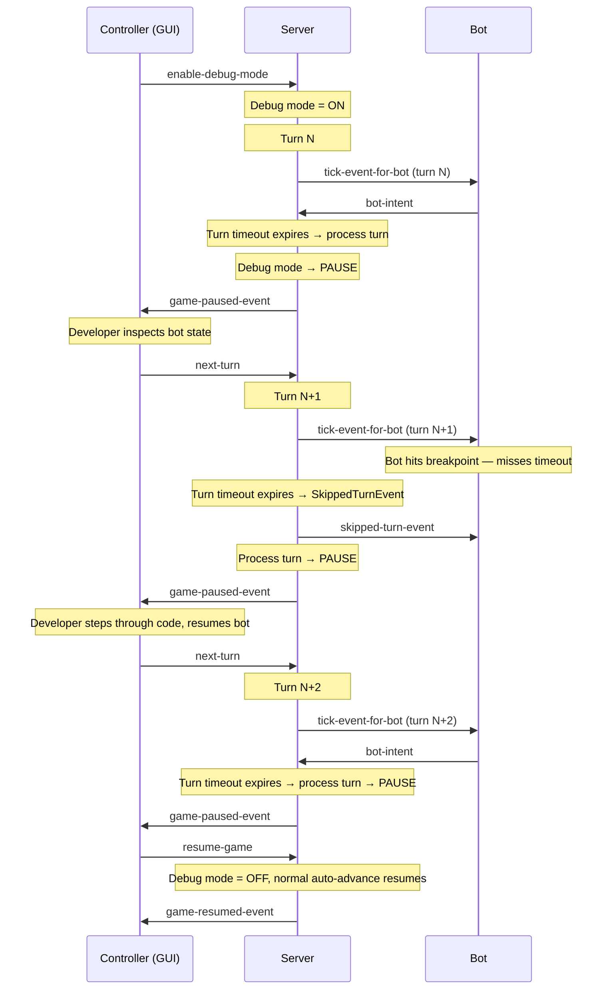

# ADR-0033: Server Debug Mode

**Status:** Accepted  
**Date:** 2026-04-07

---

## Context

When a bot developer wants to debug their bot turn-by-turn — inspecting state, checking event handlers, verifying strategy — there's no server-side support for it. The server always auto-advances to the next turn after the turn timeout expires, so the developer can't pause between turns to inspect what happened.

**Existing mechanisms:**

- **Pause/resume/step** — Controllers can pause the game, step one turn, and resume. However, the current `next-turn` command doesn't pause again after the step completes — it simply resumes the game loop. There's no "step and stay paused" mode.
- **TPS = 0** — Pauses the game, but this pauses *before* collecting intents, not *after*. It stops the game loop entirely rather than letting turns complete one at a time.

**What's needed:** A server mode where turns execute normally (bots must deliver intents within the turn timeout), but the server pauses after each turn instead of auto-advancing. The controller drives each turn step.

---

## Decision

Add a **debug mode** to the server that changes the turn advancement behavior: after each turn's timeout expires and the turn is processed, the server pauses and waits for a controller `next-turn` command before advancing.

### Debug Mode Behavior

```
Normal mode:  tick → wait for intents → timeout → process turn → tick → wait → timeout → ...
Debug mode:   tick → wait for intents → timeout → process turn → PAUSE → [controller: next-turn] → tick → ...
```

In debug mode:

1. **Server sends tick events** to bots as normal.
2. **Bots must deliver intents within the turn timeout** — no change to timing rules. Bots that miss the deadline receive `SkippedTurnEvent` as usual.
3. **When the turn timeout expires**, the server processes the turn (physics, collisions, events) and then **pauses** instead of auto-advancing.
4. **Controller steps to the next turn** by sending `next-turn` — the server sends the next tick events, collects intents, and pauses again after processing.
5. **Controller can resume** with `resume-game` to exit debug mode and return to normal auto-advancing.

### Sequence Diagram



### Key Behaviors

1. **Turn timeout still enforced** — bots get no special treatment. `SkippedTurnEvent` fires as normal if a bot misses the deadline.
2. **Inactivity rules still apply** — inactivity counter increments, damage applied per normal rules.
3. **Pause happens after turn processing** — the developer sees the completed turn state (events, positions, damage) before deciding to step.
4. **Resume exits debug mode** — `resume-game` returns to normal auto-advancing behavior.
5. **Observers see pauses** — `game-paused-event` is sent to observers and controllers after each turn.

---

## Protocol Changes

### 1. `server-handshake` — Add `features` object

```yaml
features:
  description: Server capabilities advertised to clients.
  type: object
  properties:
    debugMode:
      description: >
        Whether the server supports debug mode (pause-after-every-turn).
        If false or absent, the server will ignore enable/disable debug
        mode requests.
      type: boolean
```

Extensible pattern — future capabilities can be added as properties without schema changes.

### 2. New message: `enable-debug-mode`

```yaml
$id: enable-debug-mode.schema.yaml
description: >
  Sent by a controller to put the server into debug mode.
  In debug mode, the server pauses after each turn instead of
  auto-advancing to the next turn.
extends:
  $ref: message.schema.yaml
```

### 3. New message: `disable-debug-mode`

```yaml
$id: disable-debug-mode.schema.yaml
description: >
  Sent by a controller to take the server out of debug mode.
  The server returns to normal auto-advancing behavior.
  Also triggered implicitly by resume-game.
extends:
  $ref: message.schema.yaml
```

### 4. `game-paused-event-for-observer` — Add `pauseCause` field

```yaml
pauseCause:
  description: >
    The reason the game was paused.
    "pause" — a controller sent pause-game explicitly.
    "debug_step" — the server paused after completing a turn in debug mode.
    "breakpoint" — the server paused waiting for a bot's intent in breakpoint mode (ADR-0034).
  type: string
  enum:
    - pause
    - debug_step
    - breakpoint
```

Both debug mode and breakpoint mode (ADR-0034) reuse `game-paused-event-for-observer`. The `pauseCause` field lets controllers display the correct UI state (e.g. "Paused — debug step" vs. "Paused — waiting for bot X").

**Backwards compatibility:** Optional field. Old controllers ignore it.

### 5. Existing messages — no other changes

- `next-turn` — already exists, already means "advance one turn". In debug mode, the server pauses again after that turn.
- `pause-game` / `resume-game` — unchanged. `resume-game` implicitly disables debug mode.
- `game-resumed-event-for-observer` — unchanged.
- `skipped-turn-event` — unchanged, still fires when bots miss the timeout.

---

## Rationale

### Why debug mode is a server state (not a modified pause)?

Debug mode and pause are related but distinct:

| Aspect | Pause (`pause-game`) | Debug mode |
|--------|---------------------|------------|
| **When it pauses** | Immediately | After each turn completes |
| **Turn processing** | Stops | Continues normally |
| **Bot intents** | Not collected | Collected with normal timeout |
| **Advance** | `next-turn` runs one turn | `next-turn` runs one turn and re-pauses |
| **Exit** | `resume-game` | `resume-game` (or `disable-debug-mode`) |

Pause stops everything. Debug mode lets turns execute but pauses between them. They compose: you can pause a debug-mode game, and resuming returns to debug mode (pause-after-turn), not to full auto-advance.

### Why `enable-debug-mode` / `disable-debug-mode` messages (not a toggle)?

Explicit enable/disable is clearer than a toggle, avoids state confusion in multi-controller scenarios, and makes the protocol self-documenting.

### Why `features` in server handshake?

The controller needs to know if the server supports debug mode before showing UI controls. A `features` object in the handshake is extensible — future capabilities can be advertised the same way.

### Why not extend `pause-game` with a mode parameter?

Pause and debug mode have different semantics (see table above). Overloading `pause-game` with a mode would blur the distinction and complicate the server's state machine.

---

## Implementation Strategy

### Server (`GameServer.kt`)

1. Add `debugMode: Boolean` flag to `GameLifecycleManager`.
2. In the turn timeout handler (`onNextTurn()`): after processing the turn, check `debugMode`. If true, call `pauseGame()` instead of scheduling the next turn.
3. `handleNextTurn()` (step): process one turn, then pause again if `debugMode` is true.
4. `handleResumeGame()`: set `debugMode = false`, resume normal auto-advance.
5. New handlers: `handleEnableDebugMode()`, `handleDisableDebugMode()`.

### Connection / Schema

- Add `EnableDebugMode` and `DisableDebugMode` to the message type enum.
- Add `features` to `ServerHandshake` model.
- Create `enable-debug-mode.schema.yaml` and `disable-debug-mode.schema.yaml`.

### GUI (Controller)

- Read `features.debugMode` from server handshake → enable/disable debug controls.
- Add a "Debug" toggle or button that sends `enable-debug-mode` / `disable-debug-mode`.
- When debug mode is active, show "Step" button prominently (sends `next-turn`).
- Show turn state after each pause so the developer can inspect what happened.

### Bot APIs

- No changes. Bots are unaware of debug mode.

---

## Alternatives Considered

### A. Bot-declared debug mode with auto-detection

Bot detects debugger (JDWP, `Debugger.IsAttached`, `sys.gettrace()`) and declares `debugMode: true` in handshake. Server suspends timeouts for that bot.

**Rejected** — Mixes bot and controller roles. The bot doesn't control the server. The controller does. Additionally, [issue #204](https://github.com/robocode-dev/tank-royale/issues/204) proposed that the bot be informed if its request was accepted — this is not applicable under the chosen architecture. The bot never requests anything; it only reports facts (see ADR-0035). Informing the bot of server state it didn't ask for would violate the same role boundary.

### B. TPS = 0 as debug mode

Just set TPS to 0 and use step.

**Rejected** — TPS=0 pauses the game loop entirely. It doesn't collect intents or process turns. Debug mode needs turns to execute normally, just one at a time.

### C. Infinite turn timeout in debug mode

Remove the turn timeout when debug mode is active so bots can take as long as they want.

**Rejected** — The turn timeout is fundamental to the game rules. Debug mode should not change game behavior, only the auto-advance between turns.

---

## Consequences

### Positive

- **Turn-by-turn debugging** — developers can step through the game one turn at a time, inspecting state after each turn.
- **Game rules unchanged** — turn timeout, `SkippedTurnEvent`, inactivity penalties all work normally. Debug mode only affects auto-advance.
- **No bot-side changes** — existing bots work without modification.
- **Backwards compatible** — `features` and new messages are additive. Old controllers ignore them, old servers ignore the new messages.
- **Extensible** — `features` object supports future capability advertisement.

### Negative

- **Breakpoints still cause skipped turns without ADR-0034** — debug mode alone does not protect a bot that hits a breakpoint mid-turn. The turn timeout still fires, and the bot receives `SkippedTurnEvent`. This is addressed by ADR-0034 (Breakpoint Mode), which adds per-bot breakpoint protection on top of debug mode.
- **New messages** — two new message types (`enable-debug-mode`, `disable-debug-mode`) added to the protocol.

### Neutral

- Debug mode composes with pause: pausing a debug-mode game works, resuming returns to debug mode.
- No changes to `game-setup`, game rules, or bot-intent schemas.

---

## Related Decisions

- **ADR-0007:** Client Role Separation — controllers control the server, bots play
- **ADR-0012:** Turn Timing Semantics — turn timeout and two-phase timing model
- **ADR-0011:** Real-Time Game Loop Architecture — game loop that debug mode interrupts
- **ADR-0006:** Schema-Driven Protocol Contracts — schema changes follow this pattern

## References

- [GitHub Issue #204](https://github.com/robocode-dev/tank-royale/issues/204) — Original feature request
- [Battle Lifecycle Flow](../models/flows/battle-lifecycle.md#manual-pause) — Pause/resume/step sequences
