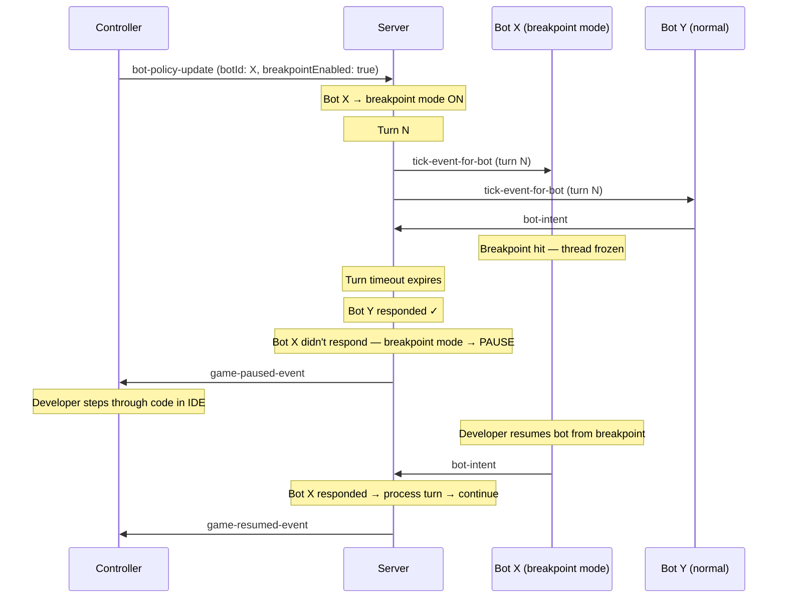
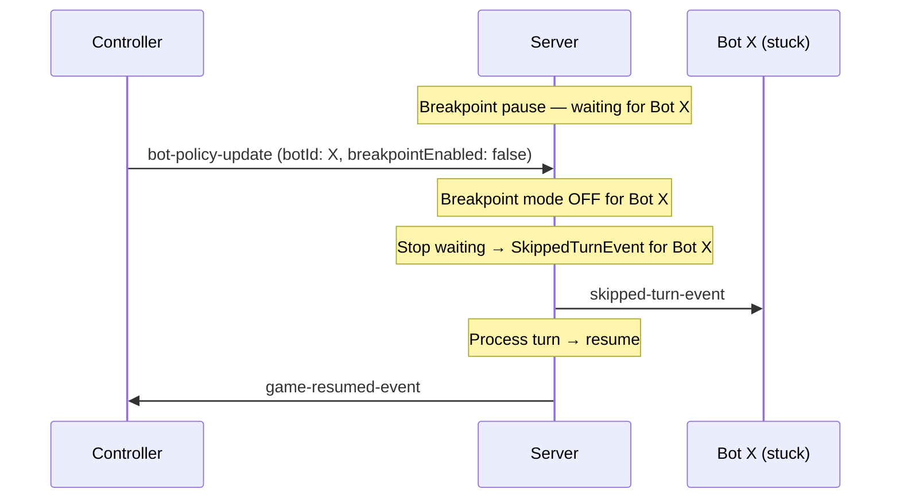
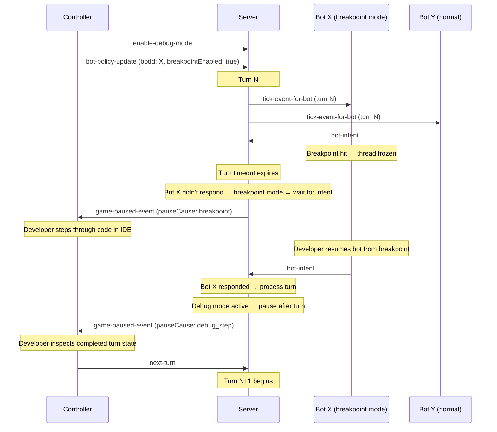

# ADR-0034: Breakpoint Mode

**Status:** Proposed  
**Date:** 2026-04-07

---

## Context

ADR-0033 introduces **server debug mode** — the server pauses after every turn, letting a developer step through the game turn-by-turn from a controller. This supports post-turn inspection but doesn't help when a bot hits a breakpoint *during* a turn: the bot thread freezes, the turn timeout expires, and the bot receives a `SkippedTurnEvent`.

**The problem:** A developer sets a breakpoint inside `onScannedBot()`. The server sends a tick, the bot's event handler runs, the breakpoint fires, the bot thread freezes. The bot can't send its intent. The turn timeout expires. `SkippedTurnEvent`. The developer's debugging session has altered the game behavior — exactly the problem described in [issue #204](https://github.com/robocode-dev/tank-royale/issues/204).

**What's needed:** A per-bot mode where the server waits for that bot's intent instead of skipping it, so mid-turn breakpoints don't disrupt the game.

---

## Decision

Add **breakpoint mode** as a per-bot policy that a controller can toggle via `bot-policy-update`. When a bot with breakpoint mode enabled misses the turn timeout, the server pauses and waits for that bot's intent instead of issuing a `SkippedTurnEvent`.

### Breakpoint Mode Behavior

```
Normal:          timeout expires, bot didn't respond → SkippedTurnEvent → advance
Breakpoint mode: timeout expires, bot didn't respond → server PAUSES → waits for intent → continues
```

In detail:

1. **Controller enables breakpoint mode for bot X** — sends `bot-policy-update` with `breakpointEnabled: true`.
2. **Server sends tick events** as normal. All bots must deliver intents within the turn timeout.
3. **Other bots that miss the timeout** still receive `SkippedTurnEvent` — breakpoint mode is per-bot.
4. **Bot X hits a breakpoint and misses the timeout** — the server pauses instead of skipping. Other bots' intents (if received) are held.
5. **Developer inspects state, resumes the bot** — the bot continues from the breakpoint and sends its intent.
6. **Server receives bot X's intent** — the server processes the turn and continues (or re-pauses if debug mode from ADR-0033 is also active).

### Sequence Diagram



### Disabling Breakpoint Mode

When a controller sends `bot-policy-update` with `breakpointEnabled: false` for bot X:

- **If the server is NOT in a breakpoint pause:** Simply clears the flag. Bot X is no longer protected — future timeout misses produce `SkippedTurnEvent` as normal.
- **If the server IS in a breakpoint pause waiting for bot X:** The server stops waiting, issues `SkippedTurnEvent` for bot X (it missed the timeout), processes the turn, and resumes.

This gives the controller a recovery mechanism if a bot is stuck (crashed, not actually at a breakpoint). The developer can uncheck the breakpoint toggle in the UI to unblock the game.



### Composition with Debug Mode (ADR-0033)

Breakpoint mode and debug mode are independent and composable:

| Debug mode | Breakpoint mode | Behavior |
|-----------|----------------|----------|
| OFF | OFF | Normal — auto-advance, timeout enforced, missed timeout → `SkippedTurnEvent` |
| ON | OFF | Timeout enforced, missed timeout → `SkippedTurnEvent`. Server pauses after each turn — controller must send `next-turn` to advance. |
| OFF | ON (bot X) | Auto-advance. If bot X misses timeout → server pauses and waits for its intent (no skip for bot X). Other bots that miss timeout still get `SkippedTurnEvent`. |
| ON | ON (bot X) | Timeout enforced for all bots. If bot X misses timeout → server waits for its intent (no skip). Server pauses after each turn regardless. |

The typical debugging workflow uses both: debug mode for turn-by-turn stepping, breakpoint mode for the bot being debugged so mid-turn breakpoints don't cause skips.

The sequence below illustrates the combined `debugMode=ON, breakpointMode=ON` case — the most realistic debugging workflow:



---

## Protocol Changes

### 1. `bot-policy-update` — Add `breakpointEnabled` field; relax `debuggingEnabled` to optional

```yaml
# bot-policy-update.schema.yaml — new optional field
breakpointEnabled:
  description: >
    Flag specifying if breakpoint mode is enabled for the bot.
    When enabled, the server pauses instead of issuing a SkippedTurnEvent
    if this bot misses the turn timeout. The server waits for the bot's
    intent before processing the turn.
  type: boolean
```

This extends the existing message alongside `debuggingEnabled` (debug graphics). The controller already sends per-bot policy updates — breakpoint mode is another policy.

`debuggingEnabled` is also relaxed from **required** to **optional** in this ADR. Previously a controller had to send both `botId` and `debuggingEnabled` on every update, making it impossible to send a `breakpointEnabled`-only update without also asserting the debug graphics state. Making both fields optional (with `botId` as the only required field) lets controllers set policies independently.

**Backwards compatibility:**
- `breakpointEnabled` is new and optional. Old controllers don't send it; server defaults to `false`.
- Relaxing `debuggingEnabled` to optional is a schema loosening: old controllers that always send it remain valid. New controllers that omit it leave the field unchanged on the server.
- Old servers ignore unknown fields.

### 2. `server-handshake` `features` — Add `breakpointMode`

```yaml
# Inside the features object from ADR-0033
breakpointMode:
  description: >
    Whether the server supports per-bot breakpoint mode.
    If false or absent, the server ignores breakpointEnabled
    in bot-policy-update messages.
  type: boolean
```

Controllers check this before showing breakpoint UI controls.

### 3. `game-paused-event-for-observer` — Reuses `pauseCause` from ADR-0033

ADR-0033 adds a `pauseCause` field (`"pause"`, `"debug_step"`, `"breakpoint"`) to `game-paused-event-for-observer`. Breakpoint pauses use `pauseCause: "breakpoint"`, letting the controller display "Paused — waiting for *BotName* (breakpoint)" instead of a generic pause message.

### 4. Existing messages — no other changes

- `game-resumed-event-for-observer` — reused for breakpoint resume (auto-resume when bot intent arrives, or when breakpoint mode is disabled while paused).
- `skipped-turn-event` — still fires for non-breakpoint bots that miss the timeout.
- `bot-intent` — unchanged. The bot just sends its intent when it resumes from the breakpoint.

---

## Rationale

### Why per-bot (not global)?

In a multi-bot battle, only the bot being debugged should get breakpoint protection. Other bots that miss the timeout are genuinely slow or broken — they should still get `SkippedTurnEvent`.

### Why via `bot-policy-update` (not a new message)?

`bot-policy-update` already exists for per-bot debug policy (graphics). Breakpoint mode is another per-bot debug policy. Reusing the same message keeps the protocol simple and the controller implementation consistent.

### Why no "breakpoint-hit" message from the bot?

When a bot hits a real IDE breakpoint, the bot thread is frozen by the debugger. The bot API can't execute code or send messages. The server can't rely on the bot announcing its breakpoint — it must infer it from "breakpoint mode enabled AND intent not received within timeout."

### Why the server pauses (not just extends the timeout)?

If the server just extended the timeout silently, other bots would keep receiving ticks and processing while the debugged bot is frozen. This gives non-debugged bots extra wall-clock time (even though no game turns advance). Pausing ensures all bots are in the same state — no bot gets an advantage.

### Why the server auto-resumes when the intent arrives?

Manual resume would require the developer to switch from their IDE to the controller after every breakpoint. Auto-resume on intent is seamless: hit breakpoint → debug → continue in IDE → bot sends intent → game continues.

---

## Implementation Strategy

### Server

1. **`ParticipantRegistry`** — Add `breakpointEnabledMap: ConcurrentHashMap<BotId, Boolean>` alongside existing `debugGraphicsEnableMap`.
2. **`GameServer.handleBotPolicyUpdate()`** — Handle `breakpointEnabled` field, store in registry.
3. **Turn timeout handler** — When timeout expires and a non-responding bot has breakpoint mode enabled:
   - Don't send `SkippedTurnEvent` to that bot.
   - Pause the game (`lifecycleManager.pauseGame()`).
   - Track that we're in a "breakpoint pause" waiting for bot X.
4. **`GameServer.handleBotIntent()`** — If game is in breakpoint pause and the awaited bot sends its intent:
   - Process the turn.
   - Auto-resume (or stay paused if debug mode from ADR-0033 is active).
5. **Multiple breakpoint bots** — If several bots have breakpoint mode enabled and multiple miss the timeout, the server waits for all of them before processing the turn.

#### Server Configuration

Breakpoint mode support can be disabled for tournaments via configuration:

**Configuration file** (`server.properties`):
```
# Enable/disable breakpoint mode support (default: true)
# Set to false for tournaments
breakpointModeSupported=false
```

**CLI flags:**
- `--breakpoint-mode` — enable breakpoint mode (default)
- `--no-breakpoint-mode` — disable breakpoint mode

When `breakpointModeSupported` is false:
- `features.breakpointMode` is set to `false` in the server handshake
- The server ignores `breakpointEnabled` in `bot-policy-update` messages
- Auto-enable for bots with debugger attached (ADR-0035) is skipped

### GUI (Controller)

- Read `features.breakpointMode` from server handshake → show/hide breakpoint controls.
- Add a "Breakpoint" toggle per bot in the bot list panel (alongside existing debug graphics toggle).
- When breakpoint pause occurs, show "Paused — waiting for *BotName* (breakpoint)" in the battle view.

### Bot APIs

- No changes. The bot is completely unaware of breakpoint mode.

---

## Alternatives Considered

### A. Bot-declared breakpoint mode via handshake

Bot sends `breakpointMode: true` in `bot-handshake`.

**Rejected** — The bot handshake is sent once at connection time. The developer may want to toggle breakpoint mode on/off during a game. Also violates role separation: controllers control the server, not bots.

### B. Watchdog thread in bot API that sends "breakpoint-hit"

Bot API spawns a monitoring thread that detects the bot thread is stuck and sends a message.

**Rejected** — Complex, unreliable (how long to wait before declaring "stuck"?), and unnecessary. The server can infer the breakpoint from the missed timeout + policy flag.

### C. Suspend all timeouts globally in debug mode

When debug mode (ADR-0033) is active, no bot ever gets `SkippedTurnEvent`.

**Rejected** — Too broad. If multiple bots are in a battle and only one is being debugged, the others should still be held to timeouts. Per-bot granularity is important.

### D. Debugger auto-detection in bot API

Bot API detects debugger (JDWP, `Debugger.IsAttached`, `sys.gettrace()`) and automatically requests breakpoint mode.

**Rejected as primary mechanism** — the bot shouldn't request server behavior changes. However, this could be a future convenience: the bot API detects a debugger attached and logs a hint ("Tip: enable breakpoint mode for this bot in the controller UI").

---

## Consequences

### Positive

- **Mid-turn breakpoints work** — developers can set breakpoints in event handlers, `run()`, or anywhere in bot code. The server waits instead of skipping.
- **Per-bot granularity** — only the debugged bot gets breakpoint protection. Other bots play normally.
- **No bot-side changes** — existing bots work without modification. The bot never knows about breakpoint mode.
- **Reuses existing patterns** — `bot-policy-update` for the toggle, `game-paused-event` for the pause, `features` for capability advertisement.
- **Composable with debug mode** — ADR-0033 (turn-by-turn stepping) + ADR-0034 (breakpoint protection) together provide a complete debugging experience.
- **Controller-agnostic** — works with any controller (GUI, TUI, CLI, test harness).

### Negative

- **One bot can block the game** — a bot with breakpoint mode enabled that crashes (instead of hitting a breakpoint) will pause the game indefinitely. Mitigation: the controller can disable breakpoint mode or stop the game.
- **Java late-attach not auto-detected** — if a developer starts a Java bot without a debugger and attaches one after the bot has already connected, the `bot-handshake` will have reported `debuggerAttached: false` (see ADR-0035). The controller won't auto-enable breakpoint mode. The developer must either restart the bot in debug mode or set `ROBOCODE_DEBUG=true` and restart.
- **Protocol extension** — new field in `bot-policy-update`, new feature flag in server handshake, `pauseCause` field in `game-paused-event`. All backwards compatible but increases protocol surface.

### Neutral

- Breakpoint mode has no effect on game outcomes when not triggered — a bot that always responds within the timeout behaves identically with or without breakpoint mode.
- Inactivity counter does not increment during a breakpoint pause (the turn hasn't advanced).

---

## Related Decisions

- **ADR-0033:** Server Debug Mode — pause-after-every-turn, `features` in server handshake
- **ADR-0007:** Client Role Separation — controllers manage per-bot policies
- **ADR-0012:** Turn Timing Semantics — turn timeout mechanics

## References

- [GitHub Issue #204](https://github.com/robocode-dev/tank-royale/issues/204) — Original feature request
- [`bot-policy-update` schema](../../schema/schemas/bot-policy-update.schema.yaml) — Existing per-bot policy message
