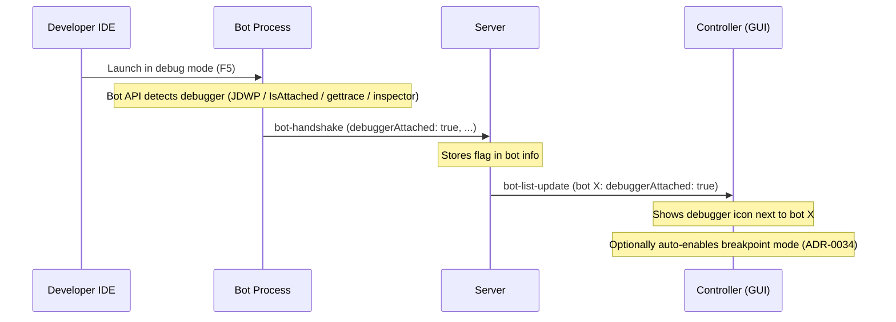

# ADR-0035: Bot API Debugger Detection

**Status:** Proposed  
**Date:** 2026-04-07

---

## Context

ADR-0033 and ADR-0034 add server-side debug mode and per-bot breakpoint mode, controlled by a controller (GUI, TUI, etc.). The developer must manually enable breakpoint mode for their bot from the controller UI.

[Issue #204](https://github.com/robocode-dev/tank-royale/issues/204) proposes that the bot API should auto-detect when a debugger is attached and signal this to the server, so the controller can respond automatically — e.g., showing a debugger indicator, prompting the developer, or auto-enabling breakpoint mode.

**The bot doesn't request anything.** It reports a fact: "a debugger is attached to my process." The controller decides what to do with that information. This preserves the role separation from ADR-0007.

---

## Decision

Each Bot API detects debugger attachment using the **de facto standard mechanism for its language** and includes a `debuggerAttached: true` flag in the `bot-handshake`. The server forwards this to controllers via `bot-list-update` (since `bot-info` extends `bot-handshake`). Controllers can use it to surface UI hints or auto-enable breakpoint mode.

### Detection Mechanisms

#### Java — JDWP Agent Detection

```java
import java.lang.management.ManagementFactory;

boolean isDebuggerAttached() {
    return ManagementFactory.getRuntimeMXBean()
        .getInputArguments().stream()
        .anyMatch(arg -> arg.contains("jdwp"));
}
```

- **What it detects:** Any JDWP-based debugger — IntelliJ IDEA, Eclipse, VS Code (Java Debug Adapter), remote debugging over socket. All Java debuggers use the JDWP agent.
- **Standard:** De facto standard. Java has no `Debugger.IsAttached` equivalent. JVM argument inspection is used by Spring Boot, Gradle, and other frameworks for the same purpose.
- **Late-attach:** Not detected. JVM arguments are fixed at startup. A debugger attached via `jcmd` after startup won't appear. This is acceptable — the typical workflow is launching in debug mode from the IDE.
- **False positives:** None in practice. Only debug-related tooling injects the `jdwp` agent.

#### C# / .NET — `Debugger.IsAttached`

```csharp
using System.Diagnostics;

bool IsDebuggerAttached() => Debugger.IsAttached;
```

- **What it detects:** Any managed debugger — Visual Studio, VS Code (vsdbg), JetBrains Rider, remote debuggers via the .NET debugging protocol.
- **Standard:** Official .NET API. The gold standard across all languages — purpose-built for this exact use case.
- **Late-attach:** Detected. Property updates dynamically when a debugger attaches or detaches after process start.
- **Cross-platform:** Works on .NET Framework, .NET Core, .NET 5 through .NET 9+.
- **False positives:** Does not trigger for profilers or native-only debuggers (e.g., WinDbg without managed extensions).

#### Python — Trace Function Detection

```python
import sys

def is_debugger_attached() -> bool:
    if sys.gettrace() is not None:
        return True
    return "debugpy" in sys.modules or "pydevd" in sys.modules
```

- **What it detects:** Any trace-function-based debugger — debugpy (VS Code), pydevd (PyCharm, IntelliJ), pdb (standard library). All Python debuggers install a trace function via `sys.settrace()`.
- **Standard:** `sys.gettrace()` is the standard mechanism. The module checks (`debugpy`, `pydevd`) supplement it for cases where the trace function is installed lazily.
- **Late-attach:** Detected. `sys.gettrace()` reflects current state. When debugpy's `listen()` + late-attach connects, the trace function appears.
- **False positives:** `coverage.py` and some profilers also set a trace function. The module checks help disambiguate — if `sys.gettrace()` is set but neither `debugpy` nor `pydevd` is loaded, it may be a profiler. For our purposes, erring on the side of detection is acceptable (the flag is informational, not behavioral).
- **`sys.monitoring` (Python 3.12+):** Modern low-overhead replacement for `sys.settrace()` used by coverage/profiling tools. Debuggers still use `sys.settrace()` as of 2025. Not useful for debugger detection yet.

#### TypeScript / Node.js — V8 Inspector

```typescript
import inspector from 'node:inspector';

function isDebuggerAttached(): boolean {
    return inspector.url() !== undefined;
}
```

- **What it detects:** Any V8 Inspector protocol debugger — VS Code, Chrome DevTools, WebStorm. All use the same V8 Inspector protocol. Detects `--inspect`, `--inspect-brk`, and programmatic `inspector.open()`.
- **Standard:** Official Node.js API (`node:inspector` module). Purpose-built for inspector/debugger detection.
- **Late-attach:** Detected. `inspector.url()` returns `undefined` when no debugger is connected and a WebSocket URL when one is. Updates dynamically.
- **Deno:** No equivalent runtime API as of 2025. Deno supports `--inspect` but doesn't expose an `inspector.url()` equivalent. Falls back to the environment variable override (see below).
- **Browser:** No reliable detection mechanism exists. Not applicable — browser-based bots would use the environment variable.

### Environment Variable Override

All Bot APIs also check:

```
ROBOCODE_DEBUG=true
```

This serves as:
- **Manual override** when auto-detection doesn't work (Deno, unusual debugger setups).
- **Explicit opt-in** for environments where the auto-detection has false positives.
- **Cross-language consistency** — one mechanism that works everywhere.

**Priority order:** Environment variable > auto-detection. If `ROBOCODE_DEBUG=true` is set, `debuggerAttached` is `true` regardless of auto-detection. If `ROBOCODE_DEBUG=false` is set, auto-detection is overridden to `false`.

### Handshake Flow



---

## Protocol Changes

### 1. `bot-handshake` — Add `debuggerAttached` field

```yaml
# bot-handshake.schema.yaml — new optional field
debuggerAttached:
  description: >
    Indicates that a debugger is attached to the bot process.
    Auto-detected by the Bot API. Informational only — does not change
    server behavior. Controllers may use this to surface UI hints or
    auto-enable breakpoint mode (ADR-0034).
  type: boolean
```

**Backwards compatibility:** Optional field. Old servers ignore it. Old bots don't send it.

### 2. No other protocol changes

Since `bot-info` extends `bot-handshake`, the `debuggerAttached` field automatically appears in `bot-list-update` messages sent to controllers and observers. No changes to `bot-info`, `bot-list-update`, or any other schema needed.

---

## Rationale

### Why report in the handshake (not per-turn)?

- The handshake is sent once at connection time. For Java and Node.js, debugger state is known at startup and doesn't change. For C# and Python, it can change (late-attach), but the handshake value covers the typical case: launching in debug mode from the IDE.
- Per-turn reporting (in `bot-intent`) would add overhead for a signal that rarely changes.
- If late-attach detection is needed in the future, a separate `bot-status-update` message could be added without changing the handshake.

### Why informational only (bot doesn't request behavior changes)?

- **Role separation (ADR-0007):** The bot plays the game. The controller controls the server. The bot reports facts; the controller acts on them.
- **Security:** A malicious bot claiming `debuggerAttached: true` has no effect on server behavior. The controller still decides whether to enable breakpoint mode.
- **Simplicity:** No negotiation, no accept/reject, no server-side configuration needed.

### Why per-language detection (not just the environment variable)?

- **Zero-configuration experience:** The developer just clicks "Debug" in their IDE. The bot API detects it. The GUI shows it. No flags to set.
- **Environment variable is the fallback**, not the primary mechanism. Most developers will never need it.
- **Each language has an established mechanism** — using the standard API for each platform is more reliable and idiomatic than relying solely on an env var.

---

## Implementation Strategy

### Bot APIs (all four)

Each Bot API adds:

1. **Debugger detection function** using the language-specific mechanism described above.
2. **Environment variable check** for `ROBOCODE_DEBUG`.
3. **Set `debuggerAttached`** in the `BotHandshake` message before sending.
4. **Log message** when debugger detected: `"Debugger detected. Consider enabling breakpoint mode for this bot in the controller."`

### Server

- Add `debuggerAttached` field to the `BotHandshake` model. Store it alongside other bot info.
- No behavior changes — the field is stored and forwarded, nothing more.

### GUI (Controller)

- Read `debuggerAttached` from `bot-list-update`.
- Show a visual indicator (e.g., bug icon) next to bots with debugger attached.
- Optionally: auto-enable breakpoint mode (ADR-0034) for those bots, or show a prompt.

### Schema

- `bot-handshake.schema.yaml` — add optional `debuggerAttached: boolean`.

---

## Alternatives Considered

### A. Environment variable only (no auto-detection)

Rely solely on `ROBOCODE_DEBUG=true`.

**Rejected as primary mechanism** — requires manual setup, easy to forget, poor developer experience. Kept as override/fallback.

### B. Periodic polling in bot API (for late-attach)

Bot API periodically checks debugger state and sends updates.

**Rejected** — over-engineered for the common case (launch in debug mode). Adds complexity and message traffic. Can be revisited if late-attach becomes a strong requirement.

### C. Bot requests breakpoint mode directly

Bot sends `requestBreakpointMode: true` and server enables it.

**Rejected** — violates role separation (ADR-0007). The bot shouldn't control server behavior. The controller decides.

---

## Consequences

### Positive

- **Zero-configuration debugging** — developer launches in debug mode, GUI detects it and can auto-enable breakpoint mode.
- **Cross-platform** — each Bot API uses its language's standard mechanism, plus a universal env var fallback.
- **Informational only** — no server behavior changes, no security implications, no negotiation.
- **Minimal protocol change** — one optional field in an existing message.
- **Composable** — feeds into ADR-0034 (breakpoint mode) naturally.

### Negative

- **Java and Deno don't detect late-attach** — if the debugger is attached after the bot connects, the handshake already said `false`. Mitigation: this covers the primary workflow (launch in debug mode); env var override handles edge cases.
- **Python false positives** — coverage tools may trigger detection. Mitigation: informational only, no behavioral consequence. The controller can always disable breakpoint mode.

### Neutral

- The `debuggerAttached` flag has no effect without a controller acting on it. Standalone servers or headless runners simply ignore it.
- Future Bot APIs for new languages add their platform's detection mechanism and get the same behavior.

---

## Related Decisions

- **ADR-0034:** Breakpoint Mode — per-bot timeout suspension, controlled by controller
- **ADR-0033:** Server Debug Mode — pause-after-every-turn
- **ADR-0007:** Client Role Separation — bot reports, controller decides

## References

- [GitHub Issue #204](https://github.com/robocode-dev/tank-royale/issues/204) — Original feature request
- [Java ManagementFactory](https://docs.oracle.com/en/java/javase/21/docs/api/java.management/java/lang/management/ManagementFactory.html) — JVM argument inspection
- [.NET Debugger.IsAttached](https://learn.microsoft.com/en-us/dotnet/api/system.diagnostics.debugger.isattached) — Official .NET API
- [Python sys.gettrace](https://docs.python.org/3/library/sys.html#sys.gettrace) — Trace function inspection
- [Node.js inspector](https://nodejs.org/api/inspector.html) — V8 Inspector API
