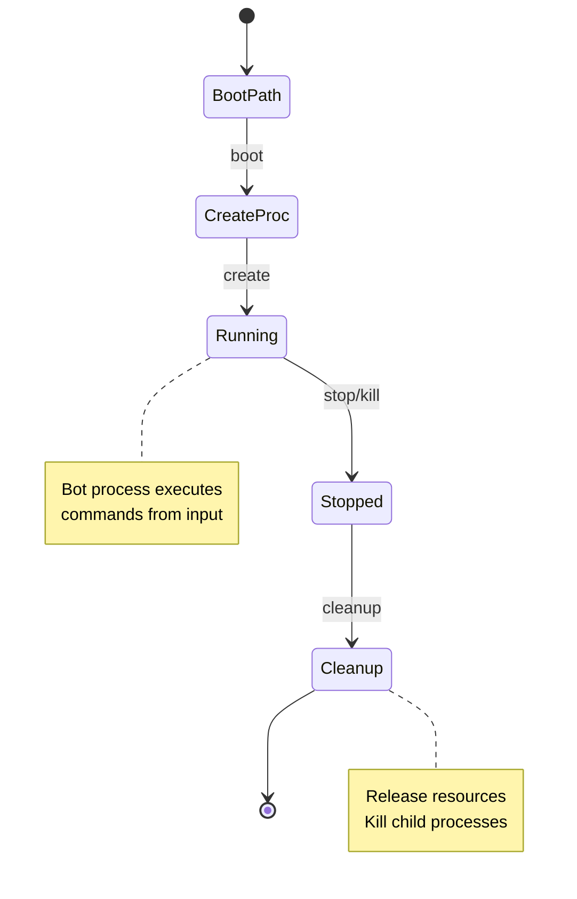
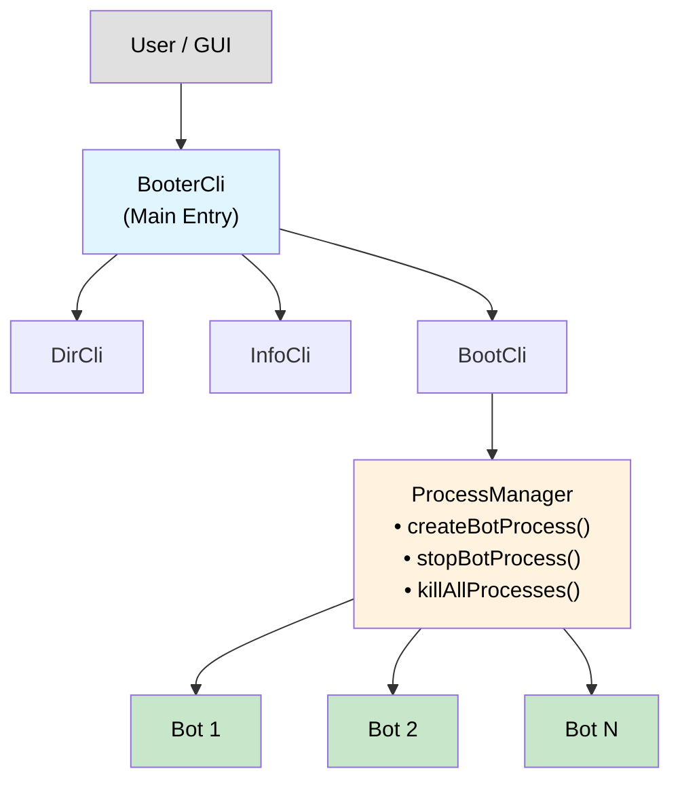

# Booter Components View

**Level:** C4 Model - Level 3 (Component Architecture)

**Parent:** [Booter Container](./container.md)

**DSL Source:** [Structurizr DSL](./structurizr-dsl/booter-components.dsl)

## Architecture Diagram


---

## Overview

The **Booter Components View** is the third level of the C4 model that zooms into the Booter to reveal its internal architecture. The Booter is an **independent artifact** published to Maven Central that can be run standalone via CLI or embedded within the GUI for convenience.

This diagram shows the internal structure of the Booter:
- **BooterCli** — Command-line interface with subcommands
- **ProcessManager** — Creates and manages bot processes
- **BootEntry Model** — Represents bootable bot configurations
- **Directory Scanner** — Discovers bots in file system directories

---

## Deployment Modes

The Booter operates in two primary modes:

| Mode | Description | Entry Point |
|------|-------------|-------------|
| **Standalone CLI** | Run independently from command line | `java -jar booter.jar` |
| **Embedded in GUI** | Launched by GUI for local battles | GUI invokes Booter programmatically |

> **Note:** Whether standalone or embedded, the Booter is the same artifact with identical functionality.

---

## Architecture Overview

### 1️⃣ Command-Line Interface

**BooterCli** 🖥️
- **Technology:** Kotlin + Clikt (CLI framework)
- **Type:** CLI entry point
- **Responsibility:**
  - Parses command-line arguments
  - Routes to subcommands (dir, info, boot)
  - Provides help and usage information
- **Subcommands:**
  - `dir` — List bot directories
  - `info` — Show bot information from directories
  - `boot` — Start bot processes

**BootCli** 🚀
- **Technology:** Kotlin + Clikt
- **Type:** Subcommand
- **Responsibility:**
  - Boots bots from specified paths
  - Starts interactive command loop for runtime control
  - Handles `boot <path>` and `stop <pid>` commands
- **Key Methods:**
  - `boot()` — Main entry point for booting bots
  - `processCommandLineInput()` — Interactive command loop
  - `handleCommand()` — Route boot/stop commands

**DirCli** 📁
- **Technology:** Kotlin + Clikt
- **Type:** Subcommand
- **Responsibility:**
  - Lists available bot directories
  - Outputs JSON-formatted bot directory paths
- **Use Case:** Discovery of available bots in configured directories

**InfoCli** ℹ️
- **Technology:** Kotlin + Clikt
- **Type:** Subcommand
- **Responsibility:**
  - Displays detailed bot information
  - Reads bot configuration files (JSON)
  - Shows bot name, version, authors, description

---

### 2️⃣ Process Management

**ProcessManager** ⚙️
- **Technology:** Kotlin + Java Process API
- **Type:** Core component
- **Responsibility:**
  - Creates and tracks bot processes
  - Manages process lifecycle (start, stop, kill)
  - Handles graceful shutdown via shutdown hooks
  - Supports concurrent process management
- **Key Features:**
  - Thread-safe process tracking (`ConcurrentSkipListMap`)
  - Cross-platform process termination (Windows, macOS, Linux)
  - Process tree termination (kills child processes)
- **Key Methods:**
  - `createBotProcess()` — Launch a bot from directory path
  - `stopBotProcess()` — Stop a specific bot by PID
  - `killAllProcesses()` — Terminate all managed processes
  - `registerShutdownHook()` — Cleanup on JVM exit

**Process Lifecycle:**


---

### 3️⃣ Bot Model

**BootEntry** 📦
- **Technology:** Kotlin data classes
- **Type:** Model
- **Responsibility:**
  - Represents a bootable bot configuration
  - Contains bot metadata (name, version, command)
  - Provides platform-specific boot commands
- **Properties:**
  - `name` — Bot display name
  - `version` — Bot version string
  - `platform` — Target platform (JVM, .NET, Python, etc.)
  - `command` — Shell command to execute bot

**DirBootEntry** 📂
- **Technology:** Kotlin data class
- **Type:** Model
- **Responsibility:**
  - Represents a bot discovered from directory
  - Extends BootEntry with directory path information
- **Properties:**
  - Inherits from BootEntry
  - `dir` — Directory path containing the bot

**IBootEntry** 🔌
- **Technology:** Kotlin interface
- **Type:** Contract
- **Responsibility:**
  - Defines common interface for boot entries
  - Enables polymorphic handling of different bot types

---

### 4️⃣ Directory Scanning

**Directory Command** 🔍
- **Technology:** Kotlin + Java NIO
- **Type:** Utility component
- **Responsibility:**
  - Scans configured bot directories
  - Discovers valid bot configurations
  - Reads `*.json` bot configuration files
- **Discovery Process:**
  1. Read configured bot directories (from CLI args or config)
  2. Scan each directory for bot subdirectories
  3. Look for bot configuration files (JSON)
  4. Parse and validate bot metadata
  5. Return list of bootable entries

---

## Component Interaction Flow



---

## Interactive Command Protocol

When running in interactive mode, the Booter accepts commands via stdin:

| Command | Arguments | Description |
|---------|-----------|-------------|
| `boot` | `<path>` | Boot a bot from the specified directory path |
| `stop` | `<pid>` | Stop a running bot by process ID |
| `quit` | - | Exit the Booter and terminate all processes |

**Example Session:**
```
$ java -jar booter.jar boot
boot /path/to/my-bot
stopped 12345
boot /path/to/another-bot
quit
```

---

## Technology Stack

| Component | Technology |
|-----------|-----------|
| **Language** | Kotlin (JVM) |
| **CLI Framework** | Clikt |
| **Process Management** | Java Process API |
| **File System** | Java NIO |
| **Concurrency** | ConcurrentSkipListMap |
| **Build** | Gradle |
| **Artifact** | JAR (published to Maven Central) |

---

## Related Documentation

- **[Container View (L2)](./container.md)** — High-level container relationships
- **[Server Components (L3)](./server-components.md)** — Server internals
- **[GUI Components (L3)](./gui-components.md)** — GUI internals
- **[Recorder Components (L3)](./recorder-components.md)** — Recording system internals


