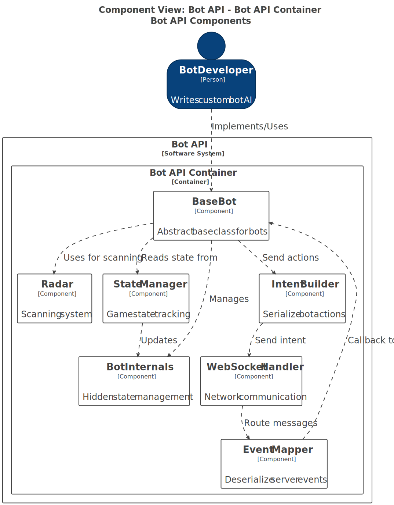
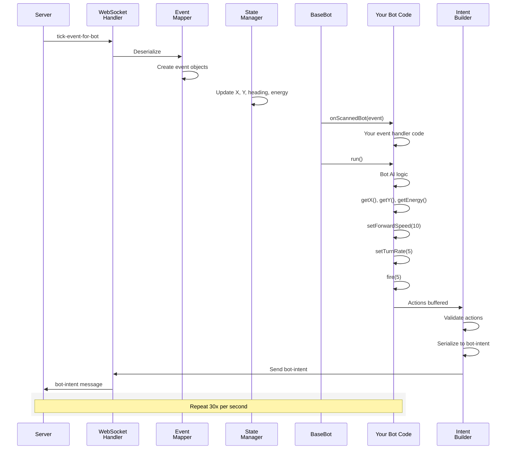
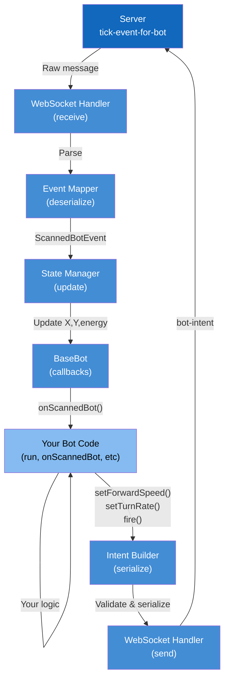

# Bot API Components View

**Level:** C4 Model - Level 3 (Component Architecture)

**Parent:** [Bot API Containers](./container.md)

**DSL Source:** [Structurizr DSL](./structurizr-dsl/bot-api-components.dsl)

## Architecture Diagram




---

## Overview

The **Bot API Components View** is the third level of the C4 model that zooms into the Bot API libraries to reveal their internal architecture. This view shows how bot developers write custom bots, how the API handles WebSocket communication, and how game events are mapped to bot callbacks.

This diagram shows the structure common to all Bot API implementations (Java, Python, .NET, WASM):
- **BaseBot** — Base class that developers extend
- **BotInternals** — Hidden internal state management
- **WebSocket Handler** — Network communication with a game server
- **Event Mapper** — Deserialize game events to API events
- **Intent Builder** — Serialize bot actions to game intents
- **Radar** — Scanning and opponent detection
- **State Manager** — Bot energy, position, status

---

## Architecture Overview

The Bot API follows a **symmetric multi-language design** with **symmetric naming conventions per language**:

### 1️⃣ Bot Base Class

**BaseBot** 🤖
- **Responsibility:**
  - Provides abstract base class/interface for custom bots
  - Manages bot lifecycle (initialization, shutdown)
  - Calls lifecycle hooks and event callbacks
  - Maintains internal state reference
  - Provides public API methods
- **Visibility:** Public API (for bot developers)
- **Language Variants:**
  - **Java:** `public abstract class BaseBot`
  - **Python:** `class BaseBot` with abstract methods
  - **.NET:** `public abstract class BaseBot`
  - **WASM:** `export class BaseBot`
- **Lifecycle Methods:**
  - `onReady()` — Called when battle is about to start
  - `run()` — Main turn loop (bot developers override)
  - `onStop()` — Called when battle ends
- **Event Callbacks:**
  - `onScannedBot(event)` — Radar detected opponent
  - `onHitByBullet(event)` — Was hit
  - `onBulletHitBot(event)` — My bullet hit
  - `onBulletMissed(event)` — My bullet missed
  - `onHitWall(event)` — Hit arena boundary
  - `onHitBot(event)` — Bot-bot collision
  - `onDeath(event)` — Bot eliminated
  - `onWon(event)` — Battle won
  - `onGameStarted(event)` — Battle started
  - `onGameEnded(event)` — Battle ended
- **Action Methods (bot developers call these):**
  - `setTurnRate(degrees)` — Rotate heading
  - `setForwardSpeed(units)` — Move forward/backward
  - `fire(firepower)` — Fire bullet
  - `scan()` — Scan for opponents
- **State Properties (read-only):**
  - `getX()`, `getY()` — Position
  - `getHeading()` — Facing direction
  - `getEnergy()` — Current energy
  - `getSpeed()` — Current speed
  - `getStatus()` — Bot state (RUNNING, DEAD, WON)

---

### 2️⃣ Internal State Management

**BotInternals** 🔒
- **Responsibility:**
  - Hidden from bot developers (package-private/internal)
  - Manages actual bot state
  - Stores connection reference
  - Buffers events
  - Manages request/response lifecycle
- **Visibility:** Internal (not exposed to bot developers)
- **Managed State:**
  - Bot position (x, y)
  - Bot heading (degrees)
  - Current speed, turn rate
  - Current energy level
  - Gun heat (cooldown between shots)
  - Radar state (heading, width, distance)
  - Latest scan result
  - Event queue for callbacks
  - Battle state (running, over, paused)
  - Game configuration (arena size, max turns, etc.)
- **Key Methods (internal only):**
  - `setState()` — Update from server tick event
  - `queueEvent()` — Buffer event for callback
  - `getPendingActions()` — Get what bot wants to do
  - `setAction()` — Record bot's action (move/turn/fire)

---

### 3️⃣ WebSocket Communication

**WebSocket Handler** 🌐
- **Responsibility:**
  - Manages WebSocket connection to the game server
  - Handles connection lifecycle
  - Sends messages (handshake, intents)
  - Receives messages (tick events, broadcasts)
  - Converts between binary/JSON formats
  - Thread management (receiver thread, sender thread)
- **Connection Phases:**
  - **Connect:** Open WebSocket to server
  - **Handshake:** Exchange bot metadata (name, version)
  - **Ready:** Wait for battle start signal
  - **Running:** Bidirectional tick/intent exchange
  - **Disconnect:** Clean shutdown
- **Message Types Sent (to server):**
  - `bot-handshake` — Bot info, version, capabilities
  - `bot-intent` — Turn rate, speed, firepower
- **Message Types Received (from server):**
  - `server-handshake` — Session ID, battle info
  - `tick-event-for-bot` — Bot-specific game state
  - Game events (scanned, hit, etc.)
  - `game-ended-event` — Battle finished
- **Threading:**
  - **Receiver thread:** Listens for incoming messages, dispatches to Event Mapper
  - **Sender thread:** Buffers outgoing intents, sends periodically
- **Error Handling:**
  - Reconnection with exponential backoff
  - Connection timeouts
  - Message serialization errors

---

### 4️⃣ Event Processing

**Event Mapper** 📥
- **Responsibility:**
  - Deserializes incoming server messages to API event objects
  - Converts server event format (JSON/binary) to language-specific events
  - Queues events for callback execution
  - Handles event ordering and timing
- **Deserialization Flow:**
  1. WebSocket Handler receives raw message
  2. Event Mapper deserializes JSON/binary
  3. Creates appropriate event object (ScannedBotEvent, HitByBulletEvent, etc.)
  4. Populates event fields from message
  5. Queues for BaseBot callback
- **Event Types Handled (12 total):**
  - `ScannedBotEvent` — Radar scan result
  - `BulletFiredEvent` — Gun fired
  - `HitByBulletEvent` — Received damage
  - `BulletHitBotEvent` — My bullet scored hit
  - `BulletMissedEvent` — My bullet missed
  - `HitWallEvent` — Wall collision
  - `HitBotEvent` — Bot collision
  - `BotDeathEvent` — Eliminated
  - `BotWonEvent` — Battle won
  - `SkippedTurnEvent` — Timeout/skipped
  - `GameStartedEvent` — Battle started
  - `GameEndedEvent` — Battle finished
- **Event Timing:**
  - Events queued in order received
  - Callbacks execute in turn sequence
  - Callbacks run before next `run()` iteration

---

### 5️⃣ Action Serialization

**Intent Builder** 📤
- **Responsibility:**
  - Serializes bot actions to server message format
  - Converts language-specific actions to protocol format
  - Buffers actions within a turn
  - Validates action constraints (energy, cooling, etc.)
- **Serialization Flow:**
  1. Bot calls `setForwardSpeed()`, `setTurnRate()`, `fire()`
  2. Intent Builder records these actions in BotInternals
  3. Intent Builder validates constraints
  4. When turn time expires, serializes to `bot-intent` message
  5. WebSocket Handler sends to server
- **Action Buffering:**
  - Bot can set multiple actions per turn
  - Intent Builder consolidates to single message
  - Only latest values are sent (last call wins)
- **Constraints Enforced:**
  - Firepower between 0 and max energy
  - Speed within [-10, 10] units/turn
  - Turn rate within [-90, 90] degrees/turn
  - Gun cooldown enforcement
- **Message Format:**
  ```json
  {
    "turnRate": degrees,
    "targetSpeed": units,
    "firepower": 0 (if not firing)
  }
  ```

---

### 6️⃣ Radar & Scanning

**Radar** 📡
- **Responsibility:**
  - Manages scanning for opponent bots
  - Tracks scan results from server
  - Provides scanned bot information to bot developer
  - Tracks radar field of view (direction, width, distance)
- **Scanning Model:**
  - Radar scans forward in a cone (default 60° wide, 1200 units far)
  - Returns list of detected opponents
  - Each opponent has: position, heading, speed, energy
  - Radar updates once per turn
- **API Methods:**
  - `scan()` — Perform scan in current direction (costs energy)
  - `setRadarHeading()` — Point radar in direction
  - `getScannedBots()` — Get last scan result
  - `hasScannedAnything()` — Check if radar found bots
- **Scan Result Type (ScannedBotEvent):**
  - Other bot's X, Y position
  - Other bot's heading, speed
  - Other bot's energy
  - Distance to other bot
  - Bearing angle to other bot
- **Limitations (Fairness):**
  - Bots don't get full game state (only what they scan)
  - Radar has range and FOV limitations
  - Radar costs energy to operate
  - Promotes strategic gameplay

---

### 7️⃣ Game State Management

**State Manager** 🎮
- **Responsibility:**
  - Maintains current game state in BotInternals
  - Updates from incoming tick events
  - Provides read-only access to bot developers
  - Tracks state changes over time
- **Managed State:**
  - **Position:** Current X, Y coordinates
  - **Heading:** Facing direction (0-360°)
  - **Speed:** Current velocity
  - **Energy:** Current health/energy (0-100)
  - **Gun Heat:** Gun cooldown timer
  - **Status:** PENDING, RUNNING, DEAD, WINNER
  - **Battle Status:** WAIT, READY, RUNNING, OVER
  - **Statistics:** Damage dealt, kills, deaths
- **Update Cycle:**
  1. WebSocket Handler receives tick event
  2. State Manager extracts values
  3. Updates BotInternals fields
  4. Event callbacks execute with updated state
  5. Next `run()` iteration sees fresh state
- **Access Methods:**
  - `getX()`, `getY()` — Position
  - `getHeading()` — Direction
  - `getEnergy()` — Health
  - `getStatus()` — Current state
  - All read-only from bot perspective

---

## Component Interactions

### Typical Turn Execution (Bot Perspective)



---

## Data Flow Diagram



---

## Multi-Language Implementation

All languages implement the **same interface** with **language-specific naming**:

| Feature | Java | Python | .NET | WASM |
|---------|------|--------|------|------|
| Base Class | `BaseBot` | `BaseBot` | `BaseBot` | `BaseBot` |
| Turn Method | `run()` | `run()` | `Run()` | `run()` |
| Move Forward | `setForwardSpeed()` | `set_forward_speed()` | `SetForwardSpeed()` | `setForwardSpeed()` |
| Set Turn | `setTurnRate()` | `set_turn_rate()` | `SetTurnRate()` | `setTurnRate()` |
| Fire | `fire()` | `fire()` | `Fire()` | `fire()` |
| Event Handler | `onScannedBot()` | `on_scanned_bot()` | `OnScannedBot()` | `onScannedBot()` |
| Get Energy | `getEnergy()` | `get_energy()` | `GetEnergy()` | `getEnergy()` |
| Get Position | `getX()`, `getY()` | `get_x()`, `get_y()` | `GetX()`, `GetY()` | `getX()`, `getY()` |

---

## Example Bot Implementation (Pseudo-code)

```java
// Java example (similar in Python, .NET, WASM)

public class MyBot extends BaseBot {
    @Override
    public void run() {
        // Called once per turn (default is 30 TPS)

        // Read current state
        double x = getX();
        double y = getY();
        double energy = getEnergy();
        double heading = getHeading();
        
        // Bot AI logic
        if (energy > 50) {
            // Move forward
            setForwardSpeed(5);
            
            // Rotate
            setTurnRate(2);
            
            // Scan for enemies
            scan();
            
            // Fire if detected anything
            if (hasScannedAnything()) {
                fire(3);
            }
        } else {
            // Low energy - retreat
            setForwardSpeed(-3);
            setTurnRate(0);
        }
    }
    
    @Override
    public void onScannedBot(ScannedBotEvent event) {
        // Called when radar detects opponent
        double enemyX = event.getX();
        double enemyY = event.getY();
        double distance = event.getDistance();
        
        // Your response logic
        System.out.println("Enemy at distance: " + distance);
    }
    
    @Override
    public void onHitByBullet(HitByBulletEvent event) {
        // Called when hit by bullet
        double damage = event.getDamage();
        System.out.println("Hit! Damage: " + damage);
    }
}
```

---

## Key Design Principles

| Principle | Rationale | Benefit |
|-----------|-----------|---------|
| **Abstract BaseBot** | Single interface for all implementers | Consistent API across languages |
| **Hidden BotInternals** | State management isolated | Prevents accidental state corruption |
| **Event-Driven** | Callbacks for all game events | Natural control flow, easy to reason about |
| **Per-Turn Actions** | Buffered/consolidated actions | Prevents race conditions, fair play |
| **Energy Costs** | Movement and scanning cost energy | Strategic gameplay depth |
| **Radar Model** | Limited perception | Fairness, prevents information leakage |
| **Read-Only State** | Bots can't change state directly | Prevents cheating |
| **Symmetric APIs** | Same naming across languages | Easier cross-language learning |

---

## Related Documentation

- **[Container View (L2)](./container.md)** — Bot API container overview
- **[Server Components (L3)](./server-components.md)** — Server-side architecture
- **[GUI Components (L3)](./gui-components.md)** — GUI internals
- **[Booter Components (L3)](./booter-components.md)** — Booter internals
- **[Recorder Components (L3)](./recorder-components.md)** — Recorder internals
- **[System Context (L1)](./system-context.md)** — High-level system view


