# Container View

**Level:** C4 Model - Level 2 (System Decomposition)

**DSL Source:** [Structurizr DSL](./structurizr-dsl/container.dsl)

## Architecture Diagram


---

## Overview

The **Tank Royale Container View** illustrates the complete container architecture at Level 2 of the C4 model. This view shows the major deployable units and their relationships.

### Containers

| Container | Type | Artifact | Description |
|-----------|------|----------|-------------|
| **Server** | CLI Application | JAR (Maven Central) | Battle orchestration and physics engine |
| **GUI** | Desktop Application | JAR (Maven Central) | Visualization, control, and configuration |
| **Booter** | CLI Application | JAR (Maven Central) | Bot process launcher and manager |
| **Recorder** | CLI Application | JAR (Maven Central) | Game event recorder for playback |
| **Java Bot API** | Library | JAR (Maven Central) | Bot development library for Java |
| **Python Bot API** | Library | PyPI Package | Bot development library for Python |
| **.NET Bot API** | Library | NuGet Package | Bot development library for C# |

> **Important:** Server, GUI, Booter, and Recorder are **independent artifacts** published to Maven Central. Each can be run standalone via CLI. The GUI embeds the other three for convenience, but they are separate deployable units.

---

## Container Relationships

```mermaid
graph TD
    BotDev["👤 Bot Developer"]
    APIs["📚 Bot APIs<br/>Java / Python / .NET<br/>Libraries for bot development"]
    Server["⚙️ Server<br/>Runs battles in real-time<br/>Manages game state"]
    GUI["🖥️ GUI<br/>Visualizes battles<br/>Control & Configuration"]
    Booter["🚀 Booter<br/>Launches bots<br/>Process Manager"]
    Recorder["🎥 Recorder<br/>Records games<br/>ND-JSON Writer"]
    FileSystem["💾 File System<br/>Replays, configs, bot directories, recordings"]
    
    BotDev -->|Uses| APIs
    APIs -->|WebSocket<br/>Bot intents & state| Server
    Server -->|WebSocket<br/>Control commands| GUI
    Server -->|WebSocket<br/>Bot handshake| Booter
    Server -->|WebSocket<br/>Game events| Recorder
    GUI -->|Read/Write| FileSystem
    Booter -->|Read| FileSystem
    Booter -->|Launch/Manage| FileSystem
    Recorder -->|Write| FileSystem
    
    style BotDev fill:#08427b,color:#fff
    style APIs fill:#438dd5,color:#000
    style Server fill:#438dd5,color:#000
    style GUI fill:#438dd5,color:#000
    style Booter fill:#438dd5,color:#000
    style Recorder fill:#438dd5,color:#000
    style FileSystem fill:#1168bd,color:#fff
```



---

## Containers

### Server ⚙️

- **Technology:** Kotlin (JVM)
- **Artifact:** `robocode-tank-royale-server.jar`
- **Responsibility:** Battle orchestration in real-time, physics simulation, rule enforcement
- **Communication:** WebSocket server (default port: 7654)
- **Details:** [Server Components (L3)](./server-components.md)

### GUI 🖥️

- **Technology:** Kotlin + Java Swing
- **Artifact:** `robocode-tank-royale-gui.jar`
- **Responsibility:** Battle visualization, configuration, replay viewer
- **Communication:** WebSocket client to Server
- **Embedded Components:** Can embed Server, Booter, Recorder for convenience
- **Details:** [GUI Components (L3)](./gui-components.md)

### Booter 🚀

- **Technology:** Kotlin (JVM)
- **Artifact:** `robocode-tank-royale-booter.jar`
- **Responsibility:** Launch and manage bot processes from directories
- **Communication:** Reads bot directories, launches bot processes
- **Details:** [Booter Components (L3)](./booter-components.md)

### Recorder 🎥

- **Technology:** Kotlin (JVM)
- **Artifact:** `robocode-tank-royale-recorder.jar`
- **Responsibility:** Record game events to ND-JSON files for playback
- **Communication:** WebSocket observer connection to Server
- **Details:** [Recorder Components (L3)](./recorder-components.md)

### Bot APIs 🤖

Libraries for building bots in multiple languages:

| API | Technology | Package | Details |
|-----|------------|---------|---------|
| **Java** | Java 11+ | JAR (Maven Central) | [Bot API Components (L3)](./bot-api-components.md) |
| **Python** | Python 3.10+ | PyPI | [Bot API Components (L3)](./bot-api-components.md) |
| **.NET** | C# (.NET 6+) | NuGet | [Bot API Components (L3)](./bot-api-components.md) |

---

## Deployment Modes

### Standalone Mode

Each container runs independently:

```bash
# Start server
java -jar robocode-tank-royale-server.jar

# Start booter to launch bots
java -jar robocode-tank-royale-booter.jar boot /path/to/bots

# Start recorder
java -jar robocode-tank-royale-recorder.jar --url=ws://localhost:7654

# Start GUI (connects to running server)
java -jar robocode-tank-royale-gui.jar
```

### Embedded Mode (GUI)

The GUI can embed Server, Booter, and Recorder for a seamless local experience:

```mermaid
graph TB
    GUI["🖥️ GUI<br/>Desktop Interface"]
    
    subgraph Embedded["Embedded Components (same JAR artifacts)"]
        Server["⚙️ Embedded Server<br/>Battle Orchestration<br/>in real-time"]
        Booter["🚀 Embedded Booter<br/>Bot Launcher<br/>Process Manager"]
        Recorder["🎥 Embedded Recorder<br/>Game Event Recorder<br/>ND-JSON Writer"]
    end
    
    GUI -->|Embeds| Embedded
    
    style GUI fill:#438DD5,color:#000
    style Server fill:#85BBF0,color:#000
    style Booter fill:#85BBF0,color:#000
    style Recorder fill:#85BBF0,color:#000
    style Embedded fill:#E8F4F8,color:#000
```



> The embedded components are the **same artifacts** with the same functionality—just loaded within the GUI process for convenience.


| From | To | Protocol | Purpose |
|------|----|----------|---------|
| Bot API | Server | WebSocket | Bot intents, game state |
| GUI | Server | WebSocket | Control commands, game state |
| Recorder | Server | WebSocket | Observer events for recording |
| Booter | File System | File I/O | Read bot directories |
| Recorder | File System | File I/O | Write ND-JSON recordings |

---

## Technology Stack

| Component | Technology                        |
|-----------|-----------------------------------|
| **Server** | Kotlin (JVM)                      |
| **GUI** | Kotlin + Java Swing               |
| **Booter** | Kotlin (JVM)                      |
| **Recorder** | Kotlin (JVM)                      |
| **Java Bot API** | Java 11+                          |
| **Python Bot API** | Python 3.10+                      |
| **.NET Bot API** | C# (.NET 6+)                      |
| **Protocol** | WebSocket                         |
| **Message Format** | JSON                              |
| **Game Loop** | Default 30 TPS (33.33ms per turn) |

---

## Related Documentation

- **[System Context (L1)](./system-context.md)** — High-level system boundaries
- **[Server Components (L3)](./server-components.md)** — Internal Server architecture
- **[GUI Components (L3)](./gui-components.md)** — Internal GUI architecture
- **[Booter Components (L3)](./booter-components.md)** — Internal Booter architecture
- **[Recorder Components (L3)](./recorder-components.md)** — Internal Recorder architecture
- **[Bot API Components (L3)](./bot-api-components.md)** — Bot API structure

