# GUI Components View

**Level:** C4 Model - Level 3 (Component Architecture)

**Parent:** [GUI Container](./container.md)

**DSL Source:** [Structurizr DSL](./structurizr-dsl/gui-components.dsl)

## Architecture Diagram

```mermaid
graph TB
    subgraph Rendering["🎮 Rendering & Visualization"]
        Arena["Battle Arena<br/>Java 2D Graphics<br/>real-time rendering"]
    end

    subgraph Control["🎛️ Control & Interaction"]
        ControlPanel["Control Panel<br/>Start, Stop, Pause<br/>TPS Adjustment"]
        BotSelector["Bot Selector<br/>Browse & Select Bots<br/>Filters & Search"]
        ConfigMgr["Config Manager<br/>Arena Settings<br/>Game Rules"]
    end

    subgraph Communication["🔗 Game Communication"]
        ServerConn["Server Connection<br/>WebSocket Client<br/>TPS Updates"]
    end

    subgraph Persistence["📹 Replay & Persistence"]
        ReplayViewer["Replay Viewer<br/>Play/Pause/Scrub<br/>Export Videos"]
    end

    subgraph Embedded["📦 Embedded Components"]
        EmbedServer["Embedded Server<br/>Local Game Instance"]
        EmbedBooter["Embedded Booter<br/>Launch Local Bots"]
        EmbedRecorder["Embedded Recorder<br/>Record Battles"]
    end

    Control --> ServerConn
    ServerConn --> Communication
    Communication --> Embedded
    Embedded --> Arena
    Arena --> Rendering
    ReplayViewer --> Persistence
    ReplayViewer -.-> Arena

    style Arena fill:#FCE4EC,stroke:#C2185B,stroke-width:2px,color:#000
    style ControlPanel fill:#E1F5FF,color:#000
    style BotSelector fill:#E1F5FF,color:#000
    style ConfigMgr fill:#E1F5FF,color:#000
    style ServerConn fill:#F3E5F5,stroke:#6A1B9A,stroke-width:2px,color:#000
    style ReplayViewer fill:#FFF3E0,color:#000
    style EmbedServer fill:#FFE0B2,color:#000
    style EmbedBooter fill:#E8F5E9,color:#000
    style EmbedRecorder fill:#FCE4EC,color:#000
```

---

## Overview

The **GUI Components View** is the third level of the C4 model that zooms into the GUI to reveal its internal architecture. This view shows how the user interface is organized, how components interact with the Server, and how battles are visualized and controlled.

This diagram shows the structure of the GUI:
- **Battle Arena** — Renders tanks, bullets, and explosions in real-time
- **Control Panel** — Start, stop, pause, and adjust game speed
- **Bot Selector** — Browse and select bots for battles
- **Server Connection** — WebSocket client communicating with the game server
- **Replay Viewer** — Load and playback recorded battles
- **Config Manager** — Manage arena settings and game rules
- **Embedded Booter** — Launch local bots via the Booter module
- **Embedded Server** — Run game server instance locally

---

## Architecture Overview

The GUI follows a **component-based architecture** with **separation of concerns** for rendering, control, and game integration:

### 1️⃣ Rendering & Visualization

**Battle Arena** 🎮
- **Technology:** Java Swing Graphics
- **Type:** Visual component
- **Responsibility:**
  - Renders tanks, bullets, walls, and explosions
  - Updates in real-time
  - Interpolates movement between server ticks
  - Displays battle statistics overlay
  - Handles zoom and pan controls
- **Input:** Game state updates from Server Connection
- **Output:** Screen graphics, mouse/keyboard input to Control Panel

---

### 2️⃣ Control & Interaction

**Control Panel** 🎛️
- **Technology:** Java Swing UI Controls
- **Type:** Control component
- **Responsibility:**
  - Provides buttons for Start, Stop, Pause battles
  - Allows TPS adjustment and time scaling
  - Displays battle status and statistics
  - Manages game configuration options
- **Interaction:**
  - User clicks and commands
  - Sends control signals to Server Connection
  - Receives status updates from embedded server

**Bot Selector** 🤖
- **Technology:** Java Swing Table/List Components
- **Type:** Selection component
- **Responsibility:**
  - Displays available bots from file system
  - Allows selection of bots for next battle
  - Filters and searches bot library
  - Shows bot metadata and descriptions
- **Interaction:**
  - User selections trigger Embedded Booter
  - Manages bot initialization

**Config Manager** ⚙️
- **Technology:** Java Swing Configuration UI
- **Type:** Configuration component
- **Responsibility:**
  - Manages arena size, walls, and obstacles
  - Configures game rules (timeout, energy, etc.)
  - Saves and loads configuration profiles
  - Provides presets for different game modes
- **Interaction:**
  - Applies settings to Embedded Server
  - Persists to file system

---

### 3️⃣ Game Communication

**Server Connection** 🔗
- **Technology:** WebSocket (Tyrus/native WebSocket API)
- **Type:** Network component
- **Responsibility:**
  - Maintains WebSocket connection to game server
  - Sends control commands (start, stop, pause, resume)
  - Receives game state updates
  - Handles connection lifecycle and reconnection
  - Deserializes game events to API objects
- **Connection Targets:**
  - Local Embedded Server (localhost:7654)
  - Remote game server (configurable host:port)
- **Message Rate:** 30 messages/second from server

---

### Embedded Components (Optional Integration)

The GUI can optionally embed the **independent artifacts** (Server, Booter, Recorder) for a seamless local experience. These are the same artifacts available via CLI—just loaded within the GUI process for convenience.

> **Note:** Embedded components are NOT sub-components of the GUI. They are independent containers that happen to be embedded. See their respective L3 views for internal architecture.

**Embedded Server** 📡
- **Artifact:** Same as standalone `robocode-tank-royale-server.jar`
- **Mode:** In-process execution for local battles
- **Details:** [Server Components (L3)](./server-components.md)

**Embedded Booter** 🚀
- **Artifact:** Same as standalone `robocode-tank-royale-booter.jar`
- **Mode:** Launches bot processes for local battles
- **Details:** [Booter Components (L3)](./booter-components.md)

**Embedded Recorder** 🎥
- **Artifact:** Same as standalone `robocode-tank-royale-recorder.jar`
- **Mode:** Records local battles automatically
- **Details:** [Recorder Components (L3)](./recorder-components.md)

---

### 4️⃣ Replay & Persistence

**Replay Viewer** 📹
- **Technology:** Swing timer-based animation
- **Type:** Replay component
- **Responsibility:**
  - Loads recorded battle files
  - Plays back battles with controls (play/pause/scrub)
  - Supports variable playback speed
  - Renders replay frames using Battle Arena
  - Exports replay videos
- **Data Source:** Battle records from file system

---

## Component Interaction Flow

```mermaid
graph TD
    A["👤 User Input<br/>Clicks, Keyboard"] --> B["🎛️ Control Components<br/>Control Panel / Bot Selector / Config Manager"]
    B --> C["🔗 Server Connection<br/>WebSocket Client"]
    C --> D{"Server Type"}
    D -->|Local| E["📡 Embedded Server<br/>In-process Game Instance"]
    D -->|Remote| F["🌐 Remote Server<br/>Network Connection"]
    E --> G["📊 Game State Updates"]
    F --> G
    G --> H["🎮 Battle Arena<br/>Rendering in real-time<br/>Interpolation & Smoothing"]
    H --> I["🖥️ Screen Output<br/>Visual Feedback to User"]
```

---

## Key Design Patterns

| Pattern | Component | Purpose |
|---------|-----------|---------|
| **MVC** | Battle Arena + Control Panel | Separation of UI logic and rendering |
| **Observer** | Server Connection → Battle Arena | Reactive updates on game state |
| **Facade** | Embedded Server | Simplifies local game instance management |
| **Strategy** | Config Manager | Supports multiple game rule presets |
| **Proxy** | Server Connection | Abstracts local vs. remote server |

---

## Cross-References

- **[Container View (L2)](./container.md)** — GUI container overview
- **[System Context (L1)](./system-context.md)** — High-level system view
- **[Server Components (L3)](./server-components.md)** — Server internals
- **[Booter Components (L3)](./booter-components.md)** — Booter internals
- **[Recorder Components (L3)](./recorder-components.md)** — Recorder internals
- **[Bot API Components (L3)](./bot-api-components.md)** — Bot API structure
