# Recorder Components View

**Level:** C4 Model - Level 3 (Component Architecture)

**Parent:** [Recorder Container](./container.md)

**DSL Source:** [Structurizr DSL](./structurizr-dsl/recorder-components.dsl)

## Architecture Diagram


---

## Overview

The **Recorder Components View** is the third level of the C4 model that zooms into the Recorder to reveal its internal architecture. The Recorder is an **independent artifact** published to Maven Central that can be run standalone via CLI or embedded within the GUI for convenience.

This diagram shows the internal structure of the Recorder:
- **RecorderCli** — Command-line interface for starting recordings
- **RecordingObserver** — WebSocket client that connects as game observer
- **GameRecorder** — Writes game events to ND-JSON files

---

## Deployment Modes

The Recorder operates in two primary modes:

| Mode | Description | Entry Point |
|------|-------------|-------------|
| **Standalone CLI** | Run independently from command line | `java -jar recorder.jar` |
| **Embedded in GUI** | Used by GUI for recording battles | GUI invokes Recorder programmatically |

> **Note:** Whether standalone or embedded, the Recorder is the same artifact with identical functionality.

---

## Architecture Overview

### 1️⃣ Command-Line Interface

**RecorderCli** 🖥️
- **Technology:** Kotlin + Clikt (CLI framework)
- **Type:** CLI entry point
- **Responsibility:**
  - Parses command-line arguments
  - Configures server connection parameters
  - Starts the recording observer
- **CLI Options:**
  - `-u, --url=<url>` — Server WebSocket URL (default: `ws://localhost:7654`)
  - `-s, --secret=<secret>` — Server authentication secret (optional)
  - `-d, --dir=<dir>` — Output directory for recordings

**Example Usage:**
```bash
# Connect to local server
java -jar recorder.jar

# Connect to remote server with authentication
java -jar recorder.jar --url=ws://192.168.1.100:7654 --secret=mysecret

# Specify output directory
java -jar recorder.jar --dir=/recordings
```

---

### 2️⃣ WebSocket Observer

**RecordingObserver** 👁️
- **Technology:** Kotlin + WebSocket client library
- **Type:** Network component
- **Responsibility:**
  - Establishes WebSocket connection to game server
  - Performs observer handshake with server
  - Receives game events in real-time
  - Filters events for recording
  - Manages connection lifecycle
- **Key Features:**
  - Automatic reconnection handling
  - Event type filtering (only records relevant events)
  - Graceful connection closure
- **Key Methods:**
  - `start()` — Connect to server and begin observing
  - `onMessage()` — Handle incoming WebSocket messages
  - `handleServerHandshake()` — Complete observer authentication

**Event Filtering:**

The RecordingObserver filters events to capture only gameplay-relevant data:

| Event Category | Events | Recorded? |
|---------------|--------|-----------|
| **Start Recording** | `GameStartedEventForObserver` | ✅ Yes |
| **End Recording** | `GameAbortedEvent`, `GameEndedEventForObserver` | ✅ Yes |
| **Game Events** | `RoundStartedEventForObserver`, `RoundEndedEventForObserver`, `TickEventForObserver` | ✅ Yes |
| **Control Events** | Pause, Resume, etc. | ❌ No |

---

### 3️⃣ File Recording

**GameRecorder** 📼
- **Technology:** Kotlin + Java I/O + GZIP compression
- **Type:** Persistence component
- **Responsibility:**
  - Writes game events to ND-JSON format
  - Compresses output with GZIP
  - Manages file naming with timestamps
- **Output Format:**
  - **File Name:** `game-{timestamp}.battle.gz`
  - **Format:** ND-JSON (Newline-Delimited JSON)
  - **Compression:** GZIP
- **Key Methods:**
  - `record()` — Write a single event to file
  - `close()` — Flush and close the output file

**ND-JSON Format:**
```json
{"type":"GameStartedEventForObserver","gameSetup":{...},"participants":[...]}
{"type":"RoundStartedEventForObserver","roundNumber":1}
{"type":"TickEventForObserver","turnNumber":1,"botStates":[...],"bulletStates":[...]}
{"type":"TickEventForObserver","turnNumber":2,"botStates":[...],"bulletStates":[...]}
...
{"type":"RoundEndedEventForObserver","roundNumber":1,"results":[...]}
{"type":"GameEndedEventForObserver","numberOfRounds":5,"results":[...]}
```

---

## Component Interaction Flow

```mermaid
graph TD
    A["Server<br/>(WebSocket at port 7654)"]
    B["RecordingObserver<br/>• Connects as observer<br/>• Filters relevant events<br/>• Routes events to GameRecorder"]
    C["GameRecorder<br/>• Writes ND-JSON format<br/>• GZIP compression<br/>• Timestamped file names"]
    D["File System<br/>game-2026-02-11-14-30-00.battle.gz"]
    
    A -->|WebSocket<br/>Observer Mode| B
    B --> C
    C --> D
```



---

## Recording Lifecycle


| State | Description |
|-------|-------------|
| **Connecting** | Establishing WebSocket connection to server |
| **Observing** | Connected, waiting for game to start |
| **Recording** | Actively recording game events to file |
| **Finalizing** | Writing final events, closing file |

---

## Observer Handshake

The Recorder connects to the server as an **observer** (not a bot or controller):

1. **Connect:** RecordingObserver opens WebSocket connection
2. **Receive ServerHandshake:** Server sends its handshake with session info
3. **Send ObserverHandshake:** Recorder identifies itself as observer
4. **Authenticated:** Server accepts observer connection
5. **Receive Events:** Server broadcasts all game events to observer


---

## Technology Stack

| Component | Technology |
|-----------|-----------|
| **Language** | Kotlin (JVM) |
| **CLI Framework** | Clikt |
| **WebSocket** | Custom WebSocket client (lib/client) |
| **Serialization** | kotlinx.serialization (JSON) |
| **Compression** | Java GZIP |
| **Logging** | SLF4J |
| **Build** | Gradle |
| **Artifact** | JAR (published to Maven Central) |

---

## File Output Details

**Naming Convention:**
- Pattern: `game-{yyyy-MM-dd-HH-mm-ss}.battle.gz`
- Example: `game-2026-02-11-14-30-00.battle.gz`

**Compression:**
- Algorithm: GZIP
- Typical compression ratio: 10-20x reduction

**Compatibility:**
- Files can be loaded by GUI Replay Viewer
- ND-JSON format allows streaming reads
- GZIP supported by all major platforms

---

## Related Documentation

- **[Container View (L2)](./container.md)** — High-level container relationships
- **[Server Components (L3)](./server-components.md)** — Server internals
- **[GUI Components (L3)](./gui-components.md)** — GUI internals (Replay Viewer)
- **[Booter Components (L3)](./booter-components.md)** — Bot process management


