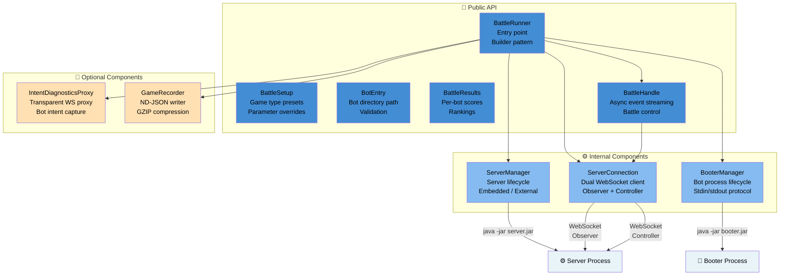
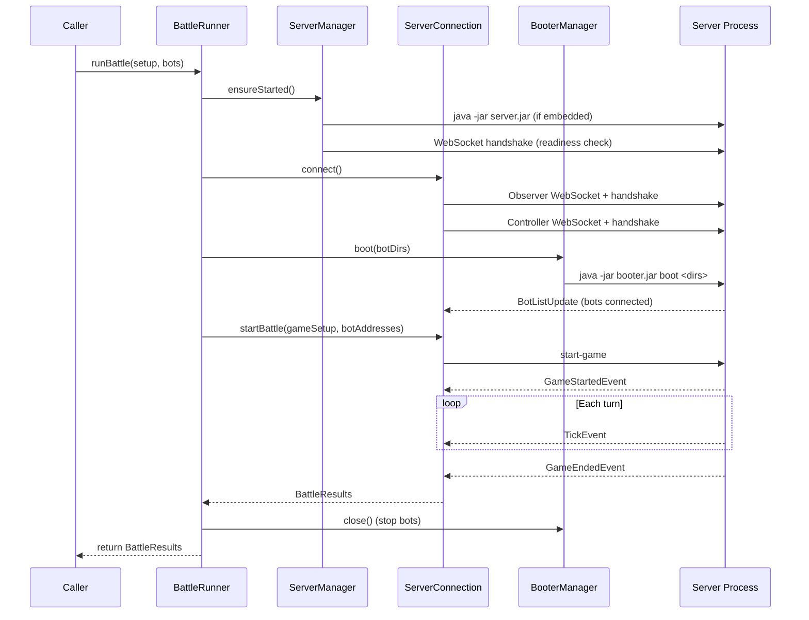
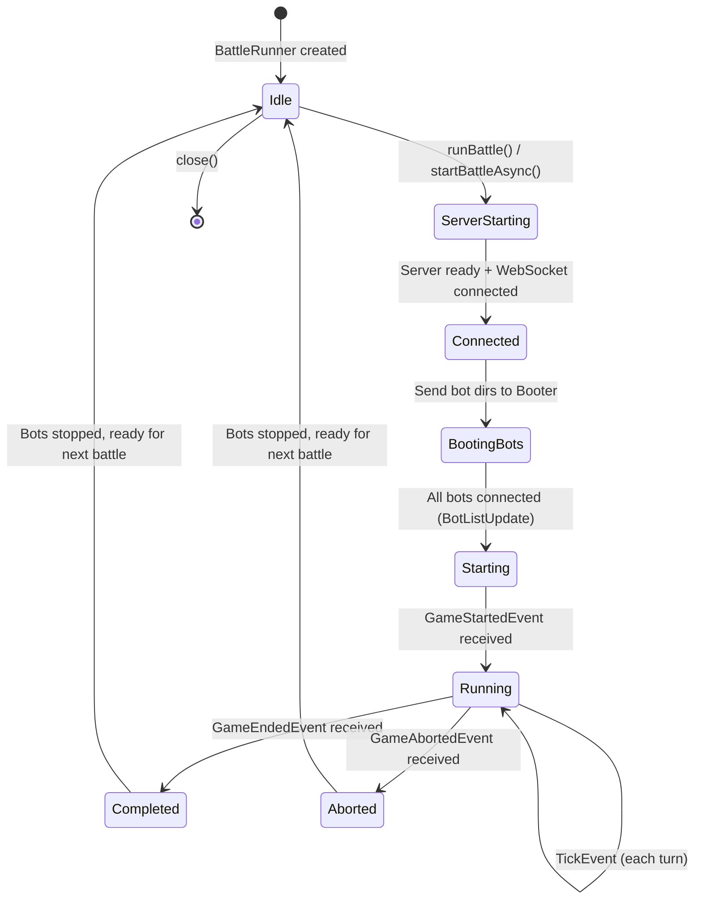

# Runner Components View

**Level:** C4 Model - Level 3 (Component Architecture)

**Parent:** [Runner Container](./container.md)

## Architecture Diagram

---

## Overview

The **Runner Components View** is the third level of the C4 model that zooms into the Battle Runner to reveal its internal architecture. The Runner is a **library** published to Maven Central that provides a programmatic API for running battles without a GUI.

The Runner composes existing Tank Royale components (Server, Booter) rather than embedding game logic. It orchestrates battles by:
1. Managing a server process (embedded or external)
2. Launching bot processes via the Booter
3. Controlling the battle via dual WebSocket connections (Observer + Controller)
4. Collecting results and delivering events to the caller

---

## Public API Components

### BattleRunner 🔷

- **Type:** Entry point / Facade
- **Responsibility:**
  - Creates and manages all internal components
  - Provides `runBattle()` (synchronous) and `startBattleAsync()` (event-driven) methods
  - Implements `AutoCloseable` for deterministic cleanup
  - Registers JVM shutdown hook as fallback
  - Reuses server across multiple battles
- **Configuration:**
  - Builder pattern with Kotlin DSL and Java Consumer support
  - Server mode: embedded (dynamic or fixed port) or external (user-provided URL)
  - Optional: intent diagnostics, battle recording
- **Key Methods:**
  - `create(block)` / `create(configurer)` — Factory methods
  - `runBattle(setup, bots)` — Synchronous battle execution
  - `startBattleAsync(setup, bots)` — Async battle execution returning `BattleHandle`
  - `close()` — Graceful shutdown of all resources

### BattleSetup 📋

- **Type:** Configuration data class
- **Responsibility:**
  - Immutable battle configuration derived from game type presets
  - Presets: `classic` (800×600), `melee` (1000×1000), `oneVsOne` (800×600, exactly 2), `custom`
  - All parameters overridable via builder
- **Parameters:** arena dimensions, participant limits, number of rounds, gun cooling rate, inactivity timeout, turn timeout, ready timeout

### BotEntry 🤖

- **Type:** Value class
- **Responsibility:**
  - Identifies a bot by file system directory path
  - Validates directory existence at construction time
  - Full configuration validation (presence of `<dir-name>.json`) at battle-start time

### BattleResults / BotResult 📊

- **Type:** Result data classes
- **Responsibility:**
  - Structured battle results returned after completion
  - Per-bot scores ordered by final ranking
  - Fields: rank, totalScore, survival, bulletDamage, ramDamage, killBonuses, firstPlaces, etc.

### BattleHandle ⏯️

- **Type:** Async battle control handle
- **Responsibility:**
  - Returned by `startBattleAsync()` for real-time event observation
  - Typed event properties: `onTickEvent`, `onRoundStarted`, `onRoundEnded`, `onGameStarted`, `onGameEnded`, `onGameAborted`, `onGamePaused`, `onGameResumed`
  - Control methods: `pause()`, `resume()`, `stop()`, `nextTurn()`
  - `awaitResults()` blocks until battle completion
  - Must be closed to release bot processes and allow subsequent battles

---

## Internal Components

### ServerManager ⚙️

- **Type:** Process lifecycle manager
- **Responsibility:**
  - Manages embedded server process or validates external server reachability
  - Extracts bundled server JAR from classpath to temp file
  - Launches via `java -jar server.jar --port=<port> --controller-secrets=<secret> --bot-secrets=<secret> --tps=-1`
  - Dynamic port allocation (bind `ServerSocket(0)`, read port, close, pass to server)
  - Server readiness detection: WebSocket handshake with retries (10 attempts, 500ms interval)
  - Graceful shutdown: send `quit` to stdin, wait 2s, `destroyForcibly()` if needed
  - Server reuse: keeps process alive between battles
  - Generates random AES secrets for controller and bot authentication

### BooterManager 🚀

- **Type:** Process lifecycle manager
- **Responsibility:**
  - Manages the Booter process for launching and stopping bot processes
  - Extracts bundled Booter JAR from classpath to temp file
  - Launches via `java -Dserver.url=<url> -Dserver.secret=<secret> -jar booter.jar boot <dirs...>`
  - Parses stdout: `<pid>;<directory>` lines for booted bots, `stopped <pid>` / `lost <pid>` for status
  - Sends stdin commands: `boot <dir>`, `stop <pid>`, `quit`
  - Validates bot directories before passing to Booter
  - Bot path validation: checks `<dir-name>/<dir-name>.json` exists
  - Graceful shutdown: send `quit`, wait 2s, `destroyForcibly()` if needed

### ServerConnection 🔗

- **Type:** Network component
- **Responsibility:**
  - Maintains dual WebSocket connections to the server (Observer + Controller)
  - Observer connection: receives all game events (ticks, round start/end, game start/end, bot list updates)
  - Controller connection: sends battle commands (start, stop, pause, resume, next turn)
  - Performs handshake protocol for both roles (send session-id + secret)
  - Deserializes JSON messages into typed Kotlin objects via kotlinx.serialization
  - Per-instance events (not global singletons) to support concurrent connections
  - Fires raw observer messages for optional recording support
- **Events dispatched:**
  - `onBotListUpdate`, `onGameStarted`, `onGameEnded`, `onGameAborted`
  - `onGamePaused`, `onGameResumed`, `onRoundStarted`, `onRoundEnded`
  - `onTickEvent`, `onTpsChanged`, `onRawObserverMessage`

---

## Optional Components

### IntentDiagnosticsProxy 🔍

- **Source:** `lib/intent-diagnostics` (reusable library)
- **Type:** Network component (opt-in)
- **Responsibility:**
  - Transparent WebSocket proxy between bots and server
  - Captures `bot-intent` messages per bot per turn in memory
  - Bots connect to proxy URL (set via `SERVER_URL` env var) instead of server directly
  - Forwards all messages transparently — no impact on game behavior
  - Disabled by default to avoid extra network hop latency
- **API:** `IntentStore` for querying captured intents

### GameRecorder 📼

- **Source:** `lib/common` (shared library)
- **Type:** Persistence component (opt-in)
- **Responsibility:**
  - Writes game events to ND-JSON format with GZIP compression
  - Triggered by raw observer messages from ServerConnection
  - Starts recording on `GameStartedEventForObserver`, stops on `GameEndedEventForObserver`
  - Output: `game-<timestamp>.battle.gz` files compatible with GUI Replay Viewer
  - Disabled by default; enabled via builder config with output path

---

## Battle Orchestration Flow

---

## Battle Lifecycle

| State | Description |
|-------|-------------|
| **Idle** | Runner created, server may be running, no battle in progress |
| **ServerStarting** | Starting embedded server or validating external server |
| **Connected** | Observer + Controller WebSocket connections established |
| **BootingBots** | Booter launching bot processes, waiting for connections |
| **Starting** | `start-game` sent, waiting for `GameStartedEvent` |
| **Running** | Battle in progress, receiving tick events |
| **Completed** | Battle finished, results available |
| **Aborted** | Battle aborted (insufficient bots, error) |

---

## Key Design Patterns

| Pattern | Component | Purpose |
|---------|-----------|---------|
| **Builder** | BattleRunner, BattleSetup | Fluent configuration with Kotlin DSL + Java Consumer |
| **Facade** | BattleRunner | Hides Server, Booter, WebSocket complexity |
| **Observer** | ServerConnection → BattleHandle | Event-driven game state delivery |
| **Proxy** | IntentDiagnosticsProxy | Transparent message interception |
| **Template Method** | ServerManager | Embedded vs external server strategies |
| **AutoCloseable** | All managers | Deterministic resource cleanup |

---

## Technology Stack

| Component | Technology |
|-----------|-----------|
| **Language** | Kotlin (JVM) |
| **WebSocket** | Java 11 `java.net.http.WebSocket` |
| **Serialization** | kotlinx.serialization (JSON) |
| **Process Management** | `ProcessBuilder` + stdin/stdout protocol |
| **Compression** | Java GZIP (for recordings) |
| **Build** | Gradle (fat JAR with embedded Server + Booter) |
| **Artifact** | JAR (published to Maven Central) |

---

## Cross-References

- **[Container View (L2)](./container.md)** — High-level container relationships
- **[Server Components (L3)](./server-components.md)** — Server internals
- **[Booter Components (L3)](./booter-components.md)** — Booter internals
- **[Recorder Components (L3)](./recorder-components.md)** — Recorder internals (shared GameRecorder)
- **[GUI Components (L3)](./gui-components.md)** — GUI internals (similar orchestration pattern)
- **[Bot API Components (L3)](./bot-api-components.md)** — Bot API structure
