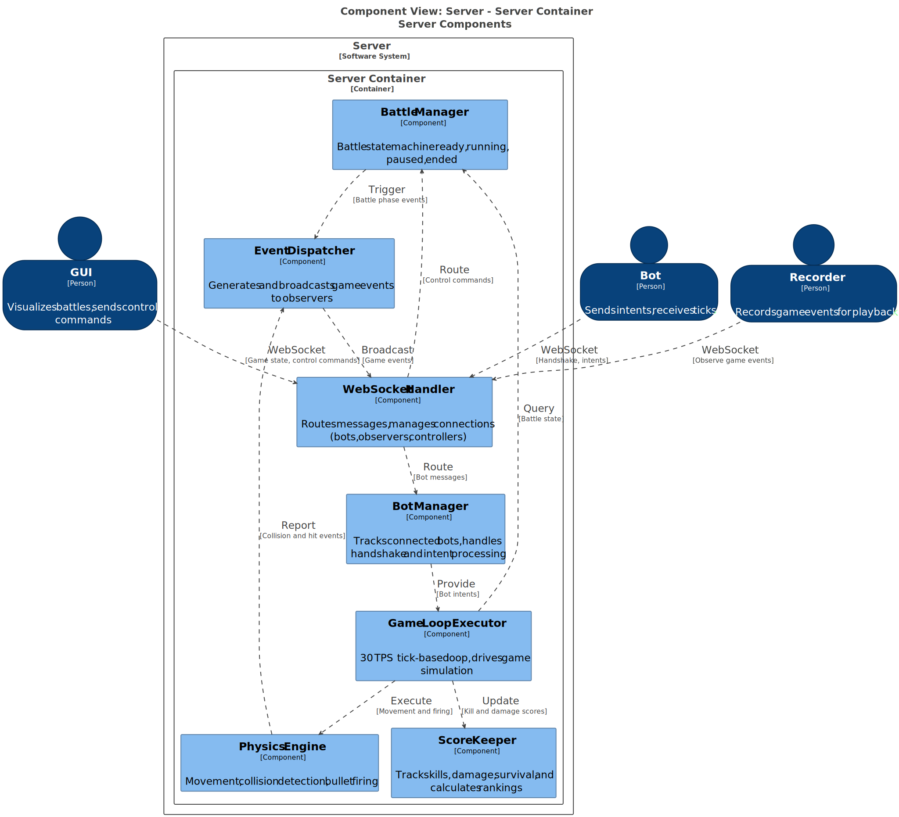
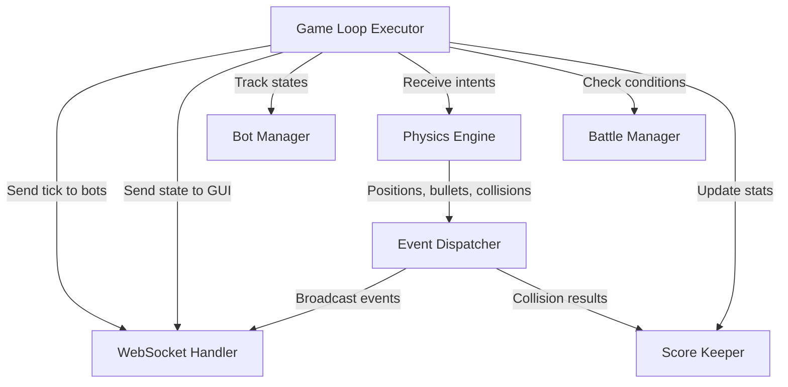
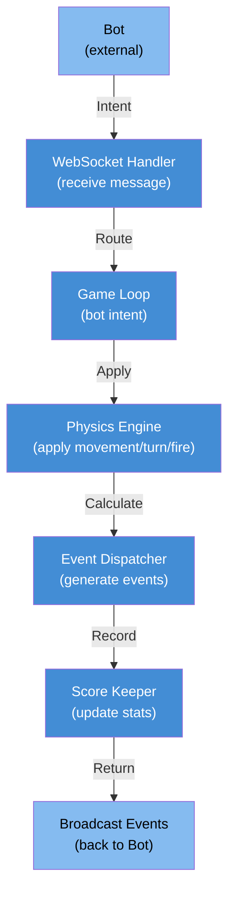
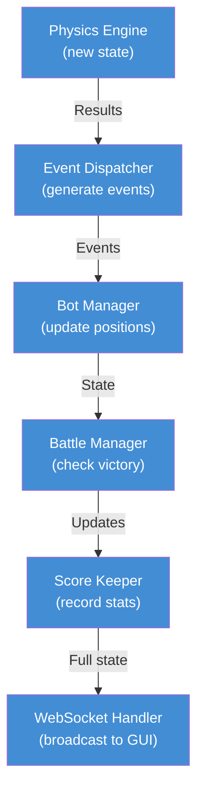

# Server Components View

**Level:** C4 Model - Level 3 (Component Architecture)

**Parent:** [Server Container](./container.md)

**DSL Source:** [Structurizr DSL](./structurizr-dsl/server-components.dsl)

## Architecture Diagram

---

## Overview

The **Server Components View** is the third level of the C4 model that zooms into the Server to reveal its internal architecture. This view shows how the game loop is structured, how WebSocket messages are routed, and how the physics and event systems interact.

This diagram shows the internal structure of the Server:
- **WebSocket Handler** — Manages incoming connections and route messages
- **Game Loop Executor** — Runs the tick-based engine
- **Physics Engine** — Simulates movement, collision detection, firing
- **Event Dispatcher** — Generates and broadcasts game events
- **Battle Manager** — Maintains battle state machine and orchestration
- **Bot Manager** — Tracks connected bots and their state
- **Score Keeper** — Calculates and maintains battle statistics

---

## Architecture Overview

### 1️⃣ Network & Message Handling

**WebSocket Handler** 🔌
- **Responsibility:**
  - Accepts WebSocket connections from GUI and bots
  - Routes incoming messages to appropriate handlers
  - Broadcasts game state updates to connected clients
  - Manages connection lifecycle (connect, authenticate, disconnect)
- **Input:** WebSocket messages (binary or JSON)
- **Output:** Game ticks, game state, events
- **Key Methods:**
  - `onConnect()` — Handle new connection
  - `onMessage()` — Route message to handler
  - `onDisconnect()` — Clean up connection
  - `broadcast()` — Send to all observers/bots
- **Concurrency:** Thread-pool for concurrent connections

---

### 2️⃣ Core Game Loop

**Game Loop Executor** ⏱️
- **Responsibility:**
  - Runs deterministic in a tick-based loop
  - Coordinates all per-turn operations
  - Ensures consistent turn ordering
  - Manages turn timeouts and skipped turns
- **Frequency:** 30 iterations per second (strict timing)
- **Key Phases per Turn:**
  1. Reset timers
  2. Send tick events to all bots (async)
  3. Wait for bot responses (~30ms timeout)
  4. Collect bot intents (move, turn, firepower)
  5. Enforce timeouts for slow bots
  6. Update game state (→ Physics Engine)
  7. Check for collisions
  8. Generate events
  9. Update scores
  10. Prepare the next frame
  11. Sleep to maintain a specific TPS rate, e.g., 30 TPS
- **Key Methods:**
  - `tick()` — Execute one turn
  - `runGameLoop()` — Main loop with timing
  - `enforceTimeout()` — Handle slow bots
  - `sleep()` — Maintain frame rate

---

### 3️⃣ Physics Simulation

**Physics Engine** 🧮
- **Responsibility:**
  - Simulates bot movement and rotation
  - Updates bullet positions
  - Performs collision detection
  - Calculates energy/damage effects
  - Enforces arena boundaries
- **Input:** Bot intents (movement, turn, firepower)
- **Output:** Updated positions, collision events
- **Algorithms:**
  - **Movement:** `position += velocity × Δt`
  - **Rotation:** `heading += turnRate × Δt`
  - **Firing:** `bullet = new Bullet(position, heading, speed, firepower)`
  - **Collisions:** Check 4 types (bot-wall, bot-bot, bullet-wall, bullet-bot)
  - **Energy:** Energy decreases with movement speed, energy cost of firing
- **Key Methods:**
  - `updatePositions()` — Bot movement
  - `updateRotations()` — Bot turning
  - `updateBullets()` — Bullet movement
  - `detectCollisions()` — All collision types
  - `calculateDamage()` — Hit effects

---

### 4️⃣ Event Generation & Broadcasting

**Event Dispatcher** 📢
- **Responsibility:**
  - Generates game events based on physics results
  - Maintains event queue per-turn
  - Broadcasts events to relevant bots
  - Handles event callbacks
- **Event Types (12 total):**
  - `ScannedBotEvent` — Another bot detected by radar
  - `BulletFiredEvent` — Bot fired a bullet
  - `HitByBulletEvent` — Bot was hit by bullet
  - `BulletHitBotEvent` — Bullet hit a bot
  - `BulletMissedEvent` — Bullet missed all targets
  - `HitWallEvent` — Bot/bullet hit arena wall
  - `HitBotEvent` — Bot-bot collision
  - `BotDeathEvent` — Bot died (0 energy)
  - `BotWonEvent` — Bot won the battle
  - `SkippedTurnEvent` — Bot didn't respond in time
  - `GameStartedEvent` — Battle started
  - `GameEndedEvent` — Battle ended
- **Visibility Model:**
  - **Bot-specific events:** Only affected bot receives
  - **Broadcast events:** All bots receive (scanned, bullets fired, deaths)
  - **GUI events:** Full game state every frame
- **Key Methods:**
  - `generateEvents()` — Create events from physics
  - `queueEvent()` — Add to per-turn queue
  - `broadcastEvent()` — Send to relevant parties
  - `executeCallbacks()` — Trigger bot event handlers

---

### 5️⃣ Battle State Management

**Battle Manager** 🎮
- **Responsibility:**
  - Manages overall battle state machine
  - Tracks phase transitions (WAIT_FOR_PARTICIPANTS → READY → RUNNING → ENDED)
  - Handles victory conditions
  - Manages battle configuration and rules
  - Coordinates battle lifecycle
- **States:**
  - **WAIT_FOR_PARTICIPANTS** — Waiting for bots to join
  - **WAIT_FOR_READY** — Waiting for all bots ready confirmation
  - **GAME_RUNNING** — Battle in progress (game loop running)
  - **GAME_ENDED** — Battle finished, results computed
- **Victory Conditions:**
  - **Last bot standing:** Only one bot with energy > 0
  - **Maximum turns reached:** Highest energy wins
  - **Time limit exceeded:** Score-based winner
- **Key Methods:**
  - `startBattle()` — Initialize and start
  - `endBattle()` — Finalize and compute results
  - `checkVictoryConditions()` — Determine winner
  - `getPhaseName()` — Current state
- **Interaction:**
  - Receives intents from Game Loop
  - Sends events through Event Dispatcher
  - Updates Score Keeper with results

---

### 6️⃣ Bot Connection Management

**Bot Manager** 🤖
- **Responsibility:**
  - Tracks connected bots
  - Manages bot state (PENDING, RUNNING, DEAD, WINNER)
  - Validates bot handshakes
  - Handles bot disconnections
  - Maps bot IDs to connections
- **Bot Info Tracked:**
  - Bot ID, name, team
  - Energy, health, status
  - Position, heading, speed
  - Radar state (last scan)
  - Bullets fired
  - Connection reference (for sending messages)
- **Key Methods:**
  - `registerBot()` — Handle new bot connection
  - `unregisterBot()` — Handle bot disconnect
  - `updateBotState()` — Update position/energy
  - `getBotById()` — Lookup bot
  - `getAllBots()` — List active bots
  - `sendTickToBot()` — Send game state to bot

---

### 7️⃣ Battle Statistics Tracking

**Score Keeper** 📊
- **Responsibility:**
  - Tracks scores, kills, deaths, damage
  - Calculates statistics per-turn and per-battle
  - Generates leaderboards
  - Persists results to database
- **Metrics per Bot:**
  - **Survival time:** Turns alive
  - **Damage dealt:** Total damage output
  - **Damage taken:** Total damage taken
  - **Kills:** Number of bot eliminations
  - **Deaths:** Number of times eliminated
  - **Accuracy:** Bullets hit / bullets fired
  - **Energy efficiency:** Damage per energy spent
  - **Final rank:** 1st, 2nd, 3rd, etc.
- **Key Methods:**
  - `recordKill()` — Bot eliminated opponent
  - `recordDeath()` — Bot was eliminated
  - `recordDamage()` — Damage dealt
  - `computeStatistics()` — Calculate metrics
  - `getFinalScores()` — Battle results
  - `saveToDB()` — Persist to database

---

## Component Interactions

### Per-Turn Sequence (30 iterations/second)

---

## Data Flow

### Turn-Based Input Flow

### State Update Flow

---

## Key Design Patterns

| Pattern | Usage | Benefit |
|---------|-------|---------|
| **Game Loop** | Main tick-based execution | Deterministic, reproducible, fair |
| **Event-Driven** | Physics generates events | Loose coupling, extensibility |
| **State Machine** | Battle phases | Clear transitions, predictable behavior |
| **Observer Pattern** | Event broadcasting | Multiple clients receive updates |
| **Timeout Pattern** | Bot response timing | Fault tolerance, fair play |
| **Thread Pool** | Concurrent connections | Scalability, non-blocking I/O |

---

## Concurrency & Threading

### Multi-Threaded Design

- **Main Loop Thread:** Tick-based game loop (deterministic)
- **WebSocket Thread Pool:** Handle client connections (non-blocking)
- **Event Dispatch:** Single-threaded per battle (deterministic)
- **Thread Safety:** Locks on shared state (bot positions, energy)

### Determinism Maintenance

- Single-threaded game loop (no race conditions)
- All randomness seeded for reproducibility
- Same inputs always produce same outputs
- Enables replay system and fair games

---

## Performance Characteristics

| Component | Bottleneck | Optimization |
|-----------|-----------|--------------|
| **Physics Engine** | CPU (collision detection) | Spatial indexing, narrow-phase optimization |
| **Event Dispatcher** | Memory (event queue) | Object pooling, batch processing |
| **WebSocket Handler** | Network I/O | Async I/O, compression |
| **Bot Manager** | Lookup speed | Hash table by bot ID |
| **Score Keeper** | Database writes | Async persistence |

---

## Related Documentation

- **[Container View (L2)](./container.md)** — Server container overview
- **[GUI Components (L3)](./gui-components.md)** — GUI internals
- **[Booter Components (L3)](./booter-components.md)** — Booter internals
- **[Recorder Components (L3)](./recorder-components.md)** — Recorder internals
- **[Bot API Components (L3)](./bot-api-components.md)** — Bot API internals
- **[System Context (L1)](./system-context.md)** — High-level system view

