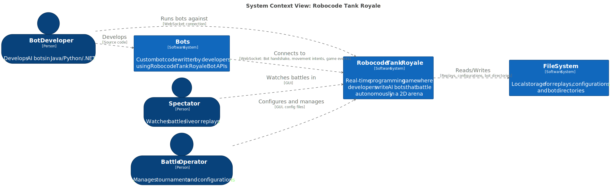
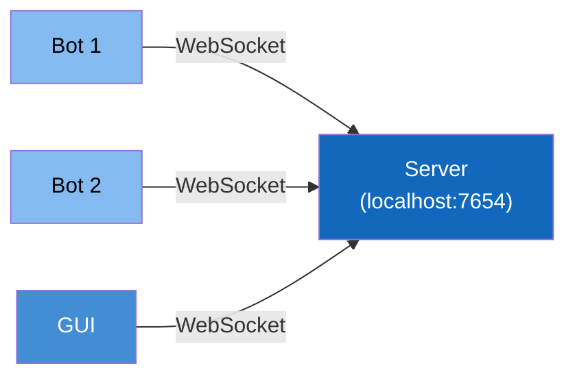
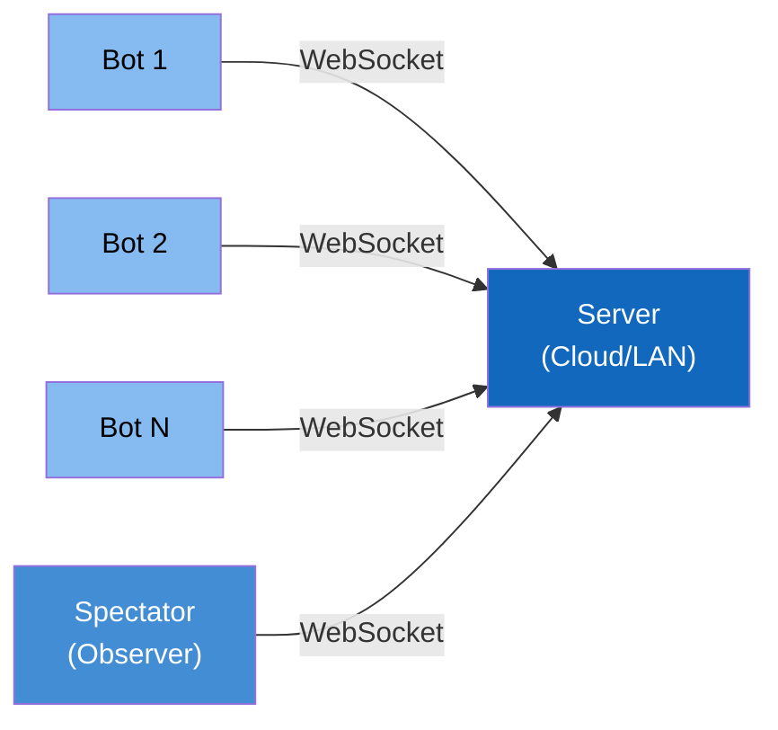

# System Context Diagram

**Level:** C4 Model - Level 1 (System Context)

**DSL Source:** [Structurizr DSL](./structurizr-dsl/system-context.dsl)

## Architecture Diagram

---

## System Scope

**Robocode Tank Royale** is a real-time programming game platform where:
- Bot developers write code controlling virtual tanks
- Tanks battle autonomously in a 2D arena
- Server enforces game rules and physics
- GUI visualizes battles for spectators
- Cross-platform support (Windows, macOS, Linux)

### Core Capabilities

| Capability | Description                                   |
|-----------|-----------------------------------------------|
| **Bot Development** | Multi-language APIs for creating tank bots    |
| **Battle Orchestration** | Server manages game state, physics, and rules |
| **Real-Time Visualization** | GUI renders battles in real time |
| **Game Configuration** | Customizable rules, arenas, and bot selection |
| **Replay System** | Record and playback battles |
| **Game Support** | Multiple bots compete in rounds |

---

## Key Actors

### 1. **Bot Developer** 👨‍💻

**Role:** Develops the game logic for one to multiple bots that compete in battles

**Activities:**
- Write bot logic in a preferred language (Java, C#, Python) or using the WebSocket directly (own API).
- Test bot behavior locally
- Debug bot strategy and performance
- Participate in games and competitions

**Interaction:**
- Writes code using Bot API
- Runs bot which connects to a server via WebSocket
- Observes battle results in GUI

**Skill Level:** Beginner to advanced programmers

---

### 2. **Spectator** 👀

**Role:** Watches battles for entertainment or learning

**Activities:**
- View live battles in GUI
- Analyze bot strategies
- Learn from successful bots
- Enjoy battles as entertainment

**Interaction:**
- Uses GUI
- No code development required

---

### 3. **Battle Operator** ⚙️

**Role:** Configures and manages the game server

**Activities:**
- Start/stop game server
- Configure game rules (arena size, turn timeout, etc.)
- Select bots for battles
- Set up games
- Monitor server performance

**Interaction:**
- Command-line flags and config files
- GUI for battle setup
- Server logs for monitoring

---

## System Boundaries

### Inside Tank Royale System

**Server:**
- WebSocket listener for client connections
- Game loop running at 30 TPS per default (can be adjusted)
- Physics simulation (movement, collisions, bullets)
- Rule enforcement (energy, damage, death)
- Event broadcasting to clients

**GUI:**
- Java Swing-based desktop application
- Real-time battle visualization
- Battle configuration interface
- Replay viewer
- Bot selection and management

**Bot APIs:**
- Java API (bot-api/java)
- .NET API (bot-api/dotnet)
- Python API (bot-api/python)
- Consistent interface across languages
- WebSocket communication layer

### Outside the System

**Bots:**
- Custom code written by developers
- Uses Bot API libraries
- Executes independently (separate process)
- Connects to server at runtime

---

## Communication Patterns

| From | To | Protocol | Purpose |
|------|----|---------|---------| 
| **Bot** → **Server** | WebSocket | JSON messages | Send bot intents (move, fire, etc.) |
| **Server** → **Bot** | WebSocket | JSON messages | Send tick events and game state |
| **GUI** → **Server** | WebSocket | JSON messages | Observe battle, send commands |
| **Server** → **GUI** | WebSocket | JSON messages | Stream game state updates |
| **Bot Developer** → **Bot** | - | Code | Implements bot logic |

---

## Technology Stack

| Component | Technology                |
|-----------|---------------------------|
| **Server** | Kotlin, JVM, Java 11+     |
| **GUI** | Kotlin, Java Swing |
| **Bot API (Java)** | Java 11+ |
| **Bot API (.NET)** | .NET Core 8+, C# |
| **Bot API (Python)** | Python 3.8+ |
| **Protocol** | WebSocket, JSON |
| **Schema** | YAML (schema definitions) |

---

## Deployment Context

### Local Development

All components running on localhost (127.0.0.1) – ideal for development and testing.

### Remote Game

Bots and observers can be on any machine with network access to the server-enabled distributed games.

---

## External Dependencies

### None (Self-Contained System)

Tank Royale is designed to be **zero-dependency** in terms of external services:
- ✅ No cloud services required
- ✅ No database (battles are ephemeral)
- ✅ No authentication service (optional secret-based auth)
- ✅ Runs fully offline (localhost)

This design choice ensures:
- Easy setup for beginners
- No operational complexity
- Privacy (no data leaves the local network)
- Game reliability (no internet required)

---

## Next Steps in Architecture

**Ready to dive deeper?**
- **[👉 Container View](./container.md)** — Explore internal components and their relationships
- **[👉 Server Component View](./server-component.md)** — Understand server internals
- **[👉 Bot API Component View](./bot-api-component.md)** — Learn bot API structure

---

## Related Documentation

- **[ADR-0001: WebSocket Protocol](../adr/0001-websocket-communication-protocol.md)** — Why WebSocket was chosen
- **[ADR-0002: Cross-Platform Bot APIs](../adr/0002-cross-platform-bot-api-strategy.md)** — Multi-language support strategy
- **[ADR-0003: Game Loop Architecture](../adr/0003-realtime-game-loop-architecture.md)** — Real-time tick system
- **[Battle Lifecycle Flow](../models/flows/battle-lifecycle.md)** — How battles progress
- **[Bot Connection Flow](../models/flows/bot-connection.md)** — Bot connection sequence

