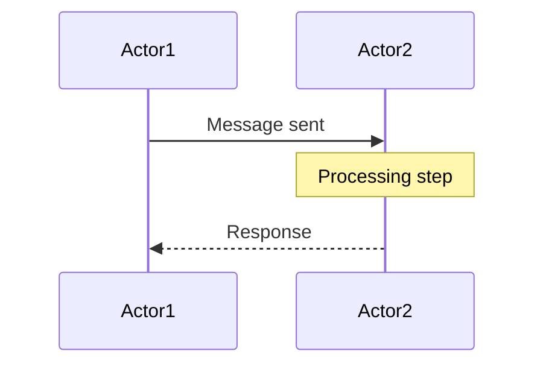

# Business Flows

This directory contains documentation of key business processes and their interactions with domain entities.

## What are Business Flows?

Business flows document **how entities interact through processes**:
- **Sequences** — Step-by-step process execution
- **Actors** — Entities and external systems involved
- **Messages** — Data exchanged between actors
- **Timing** — When events occur (especially important for 30 TPS game loop)
- **Error Handling** — What happens when things go wrong

Business flows answer: **"How does the system execute key processes?"**

---

## Core Flows

### Battle Lifecycle Flow
**[→ battle-lifecycle.md](./battle-lifecycle.md)**

The complete journey of a battle from creation to completion:
- **Phases:** WAIT_FOR_PARTICIPANTS → WAIT_FOR_READY → GAME_RUNNING → GAME_ENDED
- **Key Events:** Bot joins, all bots ready, game starts, victory condition
- **Duration:** From handshake to game end
- **Actors:** Bot, Server, Controller (optional)

**Use When:** Understanding battle progression, state transitions, timing

---

### Bot Connection Flow
**[→ bot-connection.md](./bot-connection.md)**

How a bot connects to the server and initializes for battle:
- **Sequence:** WebSocket connect → Handshakes → Validation → Ready
- **Messages:** server-handshake, bot-handshake, game-started-event, bot-ready
- **Timing:** Connection through game start
- **Actors:** Bot, Server

**Use When:** Implementing bot connection logic, debugging handshake issues

---

### Turn Execution Flow
**[→ turn-execution.md](./turn-execution.md)**

The per-turn sequence at 30 TPS (turns per second):
- **Frequency:** 30 times per second = ~33ms per turn
- **Sequence:** 15-step turn execution at authoritative server
- **Messages:** tick-event-for-bot, tick-event-for-observer, bot-intent
- **Timing:** Strict turn timeout enforcement
- **Actors:** Server, Bot, Observers

**Use When:** Understanding game loop, physics updates, event generation, timing constraints

---

## Flow Diagram Format

All flows use **Mermaid sequence diagrams**:



## Message Exchange Format

All flows reference **actual WebSocket messages** from `/schema/schemas/`:

```json
{
  "type": "message-type-name",
  "field1": "value1",
  "field2": "value2"
}
```

## Timing Diagrams

Critical for 30 TPS system. Flows include:
- Turn sequence with millisecond precision
- Timeout boundaries
- Event ordering constraints

---

## Related Documentation

- **[Message Schema](../message-schema/)** — WebSocket message contracts
- **[ADRs](../../adr/)** — Design decisions about flow architecture
- **[C4 Views](../../c4-views/)** — Component interactions
- **[Schema Definitions](/schema/schemas/)** — Actual message formats (YAML)

---

## Index

| Flow | Status | Purpose |
|------|--------|---------|
| [Battle Lifecycle](./battle-lifecycle.md) | ✅ | Battle state progression |
| [Bot Connection](./bot-connection.md) | ✅ | Bot initialization |
| [Turn Execution](./turn-execution.md) | ✅ | Per-turn game loop (30 TPS) |

---

**Last Updated:** 2026-02-11
