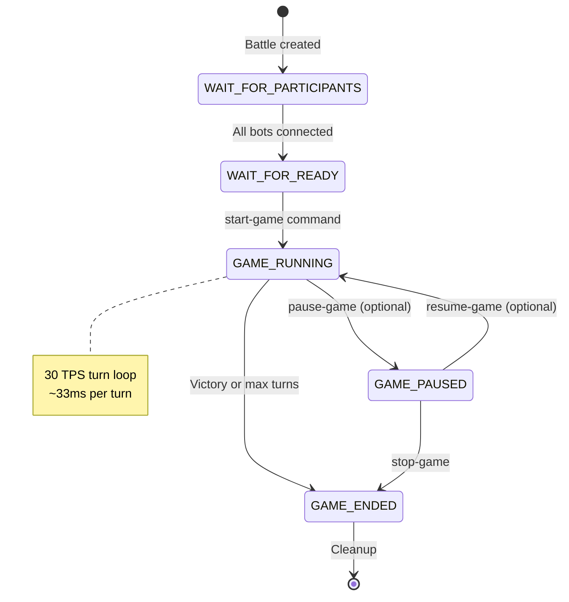
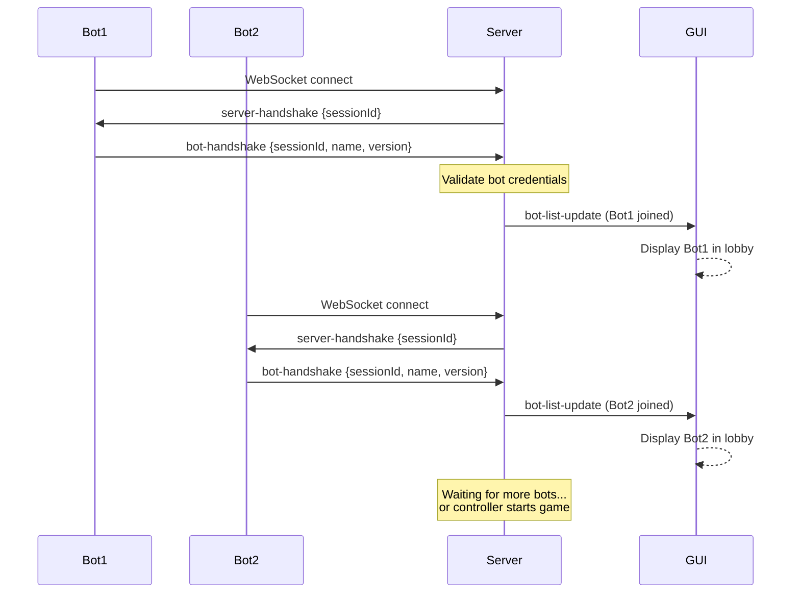
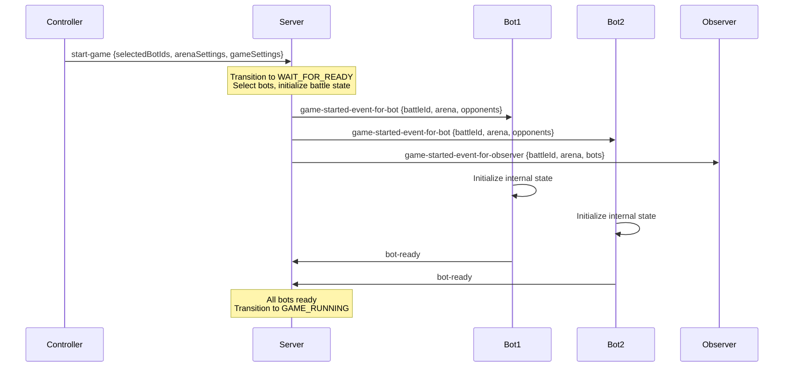
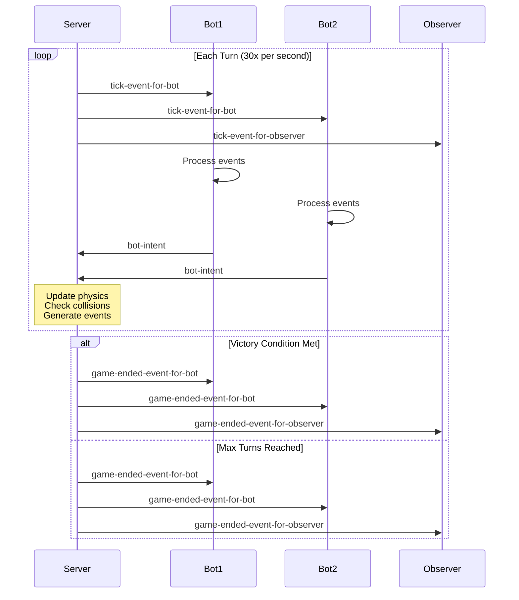
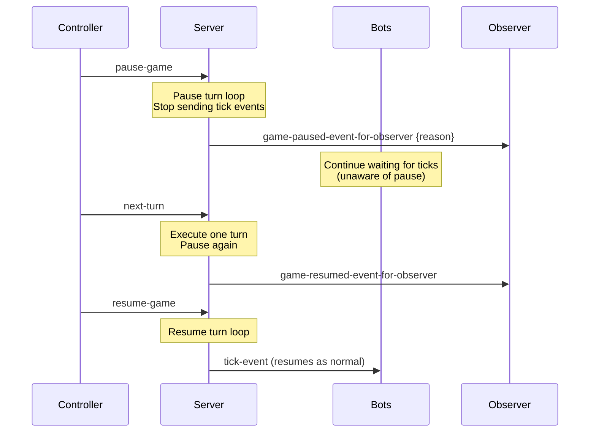
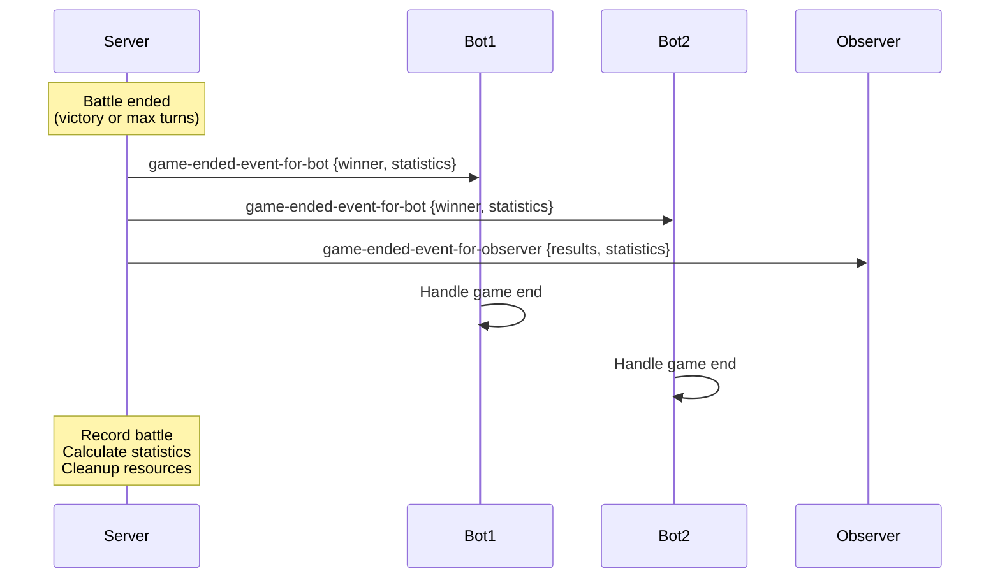
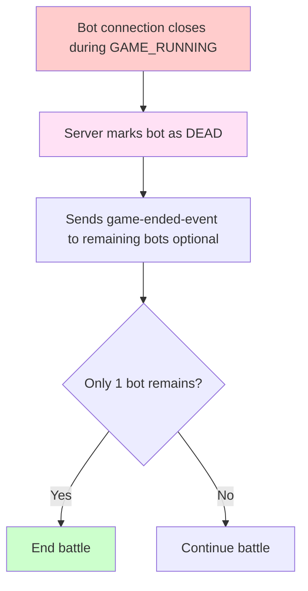
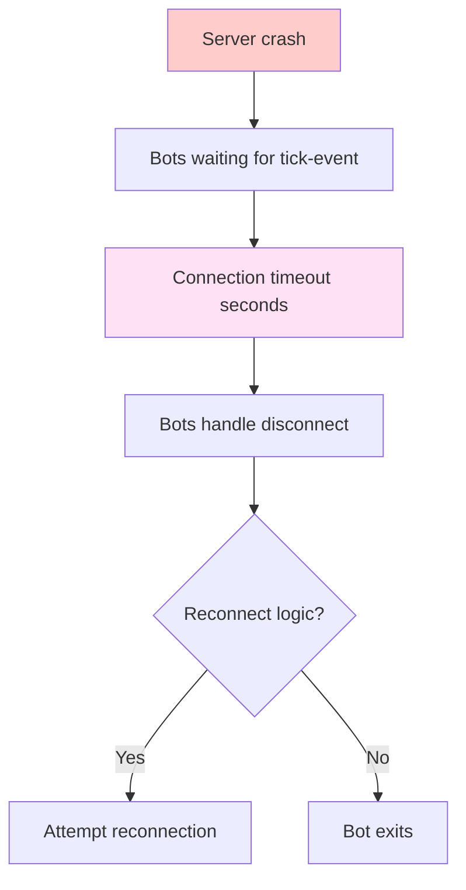

# Battle Lifecycle Flow

This flow describes the complete journey of a battle from creation through completion.

## Overview

A battle progresses through four distinct phases:



---

## Phase 1: WAIT_FOR_PARTICIPANTS

**Duration:** Variable (seconds to minutes)  
**Goal:** Collect all bots that will participate in battle

### Sequence Diagram



### Key Steps

1. **Bot Connects**
   - Bot initiates WebSocket connection
   - Server accepts connection

2. **Server Handshake**
   ```json
   {
     "type": "server-handshake",
     "sessionId": "uuid-session-123"
   }
   ```

3. **Bot Handshake**
   ```json
   {
     "type": "bot-handshake",
     "sessionId": "uuid-session-123",
     "name": "MyBot",
     "version": "1.0",
     "authors": ["John Doe"],
     "secret": "optional-secret-token",
     "gameTypes": ["1v1", "melee", "team"]
   }
   ```

4. **Server Validation**
   - Check sessionId matches
   - Verify optional secret
   - Validate bot name/version format
   - Add bot to available bots list

5. **Lobby Update**
   - Server sends `bot-list-update` to GUI
   - GUI displays available bots for battle selection

### Exit Condition

Move to **WAIT_FOR_READY** when:
- Minimum bots available (typically 2)
- Controller sends `start-game` command

---

## Phase 2: WAIT_FOR_READY

**Duration:** Very short (seconds)  
**Goal:** Notify selected bots that battle is starting

### Sequence Diagram



### Key Steps

1. **Start Game Command**
   ```json
   {
     "type": "start-game",
     "selectedBotIds": ["uuid-bot-1", "uuid-bot-2"],
     "arenaSettings": {
       "width": 800,
       "height": 600
     },
     "gameSettings": {
       "maxTurns": 10000,
       "turnTimeout": 30,
       "tps": 30
     }
   }
   ```

2. **Game Started Event (to Bot)**
   ```json
   {
     "type": "game-started-event-for-bot",
     "battleId": "uuid-battle-123",
     "opponents": [
       {
         "botId": "uuid-bot-2",
         "name": "OpponentBot",
         "version": "2.0"
       }
     ],
     "arena": {
       "width": 800,
       "height": 600
     }
   }
   ```

3. **Game Started Event (to Observer)**
   ```json
   {
     "type": "game-started-event-for-observer",
     "battleId": "uuid-battle-123",
     "bots": [
       {"id": "uuid-bot-1", "name": "Bot1"},
       {"id": "uuid-bot-2", "name": "Bot2"}
     ],
     "arena": {"width": 800, "height": 600}
   }
   ```

4. **Bot Initialization**
   - Bot receives game-started-event
   - Initializes strategy, state, variables
   - Prepares sensors and weapons

5. **Bot Ready Notification**
   ```json
   {
     "type": "bot-ready",
     "battleId": "uuid-battle-123"
   }
   ```

6. **Server Waits for All Ready**
   - Collects bot-ready from all bots
   - Timeout if any bot doesn't respond
   - Once all ready: transition to GAME_RUNNING

### Exit Condition

Move to **GAME_RUNNING** when all selected bots send `bot-ready`

---

## Phase 3: GAME_RUNNING

**Duration:** Variable (seconds to minutes)  
**TPS:** 30 turns per second (~33ms per turn)  
**Goal:** Execute battle until victory condition

### High-Level Sequence



### Turn Loop Details

**See [Turn Execution Flow](./turn-execution.md)** for 15-step per-turn sequence

Key points:
- 30 turns per second = 33.33ms per turn
- Each turn: tick event → intent collection → physics → event generation
- Strict timeout (bot gets ~30ms to respond)
- Late/missing intents result in skipped-turn-event

### Victory Detection

**Condition 1: Last Bot Alive**
```
On each turn:
  alive_count = count(bots where status == RUNNING)
  
  if alive_count == 1:
    winner = last alive bot
    transition to GAME_ENDED
```

**Condition 2: Max Turns Reached**
```
if turn_number >= max_turns:
  winner = bot with highest energy
  transition to GAME_ENDED
```

### Optional: Pause/Resume



---

## Phase 4: GAME_ENDED

**Duration:** Seconds (cleanup)  
**Goal:** Distribute results and clean up battle

### Sequence Diagram



### Game Ended Event (for Bot)

```json
{
  "type": "game-ended-event-for-bot",
  "winner": {
    "botId": "uuid-bot-1",
    "name": "WinningBot"
  },
  "yourResult": "WINNER",
  "numberOfRounds": 1,
  "numberOfTurns": 2500
}
```

### Game Ended Event (for Observer)

```json
{
  "type": "game-ended-event-for-observer",
  "battleId": "uuid-battle-123",
  "winner": {
    "botId": "uuid-bot-1",
    "name": "WinningBot"
  },
  "results": [
    {
      "botId": "uuid-bot-1",
      "name": "Bot1",
      "finalEnergy": 42.5,
      "result": "WINNER",
      "kills": 1
    },
    {
      "botId": "uuid-bot-2",
      "name": "Bot2",
      "finalEnergy": 0,
      "result": "DEAD",
      "kills": 0
    }
  ],
  "statistics": {
    "duration": 2500,
    "totalTurns": 2500,
    "totalBulletsFired": 1250,
    "totalCollisions": 87
  }
}
```

### Cleanup Steps

1. **Record Results**
   - Store battle outcome
   - Archive battle statistics
   - Log participant results

2. **Calculate Statistics**
   - Final energy levels
   - Damage dealt/taken
   - Bullets fired/hit
   - Collision counts

3. **Distribute Results**
   - Send to bots
   - Send to observers
   - Send to controller

4. **Free Resources**
   - Close bot connections (optional)
   - Clean up battle state
   - Release memory

---

## Error Handling

### Bot Disconnects During Battle



### Server Issues



---

## Timeline Example

```mermaid
gantt
    title Battle Timeline Example
    dateFormat ss
    axisFormat %S
    
    section Connection Phase
    Bot 1 connects           :00, 1s
    Bot 2 connects           :05, 1s
    
    section Setup Phase
    Controller sends start-game :10, 5s
    Bots ready               :15, 5s
    
    section Battle Phase
    Game starts, first tick  :20, 3s
    Turn 0 executes         :23, 33ms
    Turn 1 executes         :milestone, 56
    Turn 2 executes         :milestone, 90
    Battle continues        :90, 4930s
    
    section End Phase
    Turn 2500 executes      :milestone, 5453
    game-ended-event sent   :5455, 5s
    Battle cleaned up       :5460, 40s
```



**Note:** Battle runs at 30 TPS for ~84 seconds (2500 turns)

---

## Related Documentation

- **[Turn Execution Flow](./turn-execution.md)** — Detailed per-turn sequence
- **[Bot Connection Flow](./bot-connection.md)** — Phase 1 (WAIT_FOR_PARTICIPANTS)
- **[Message Schema](../message-schema/README.md)** — WebSocket message contracts
- **[Events](../message-schema/events.md)** — Event message definitions
- **[Commands](../message-schema/commands.md)** — Controller command definitions
- **[ADR-0003: Game Loop](../../adr/0003-realtime-game-loop-architecture.md)** — Design rationale

---

**Last Updated:** 2026-02-11
