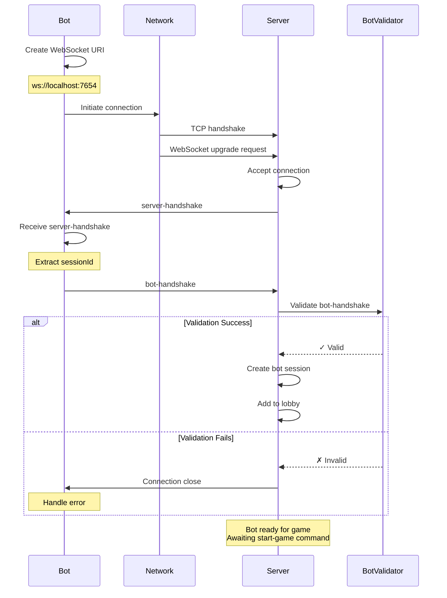
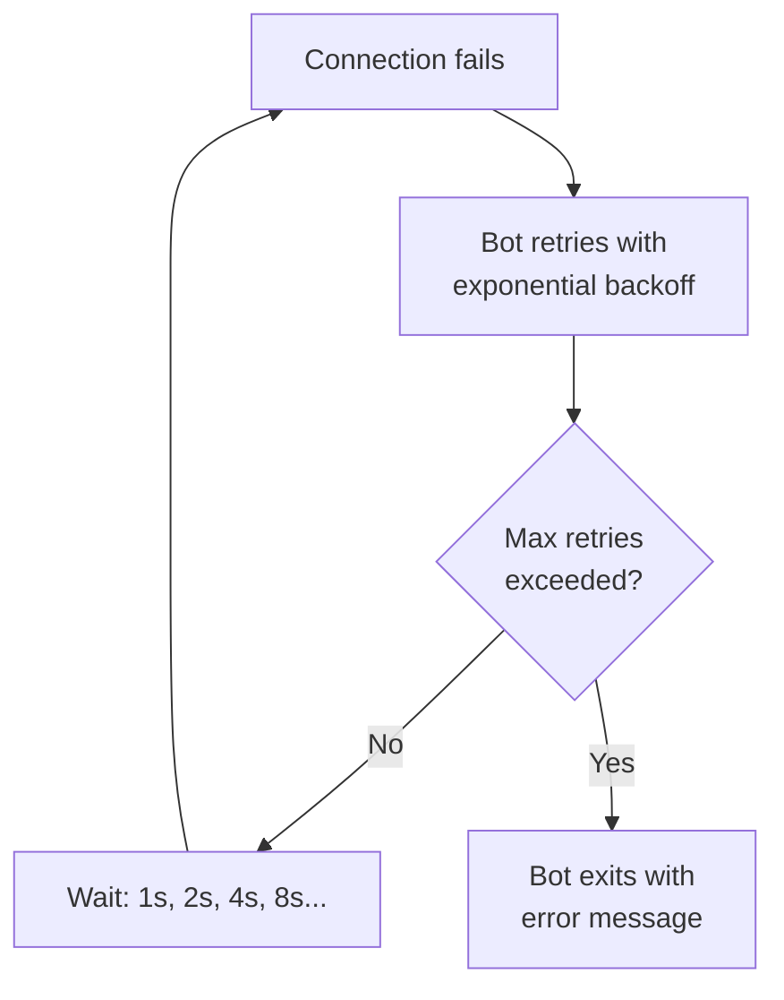
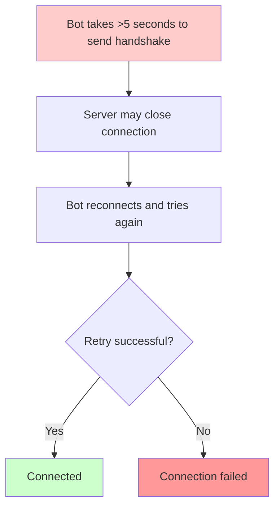
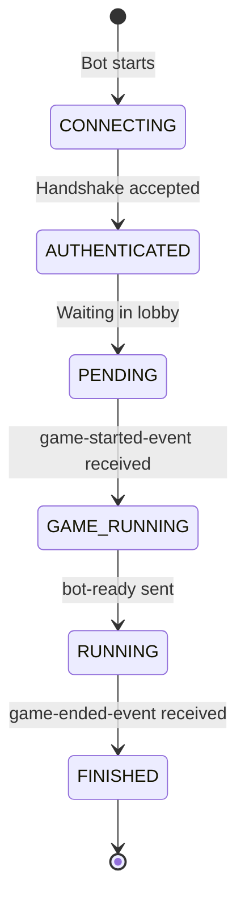
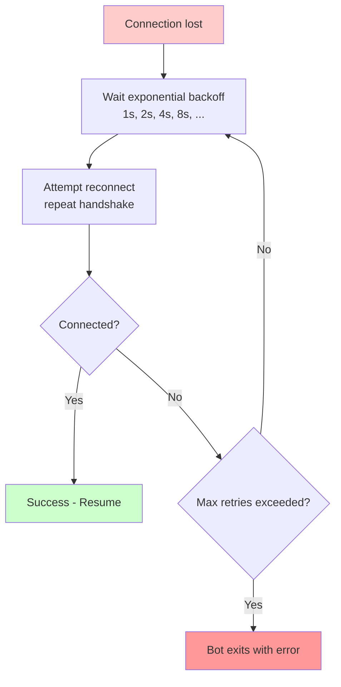
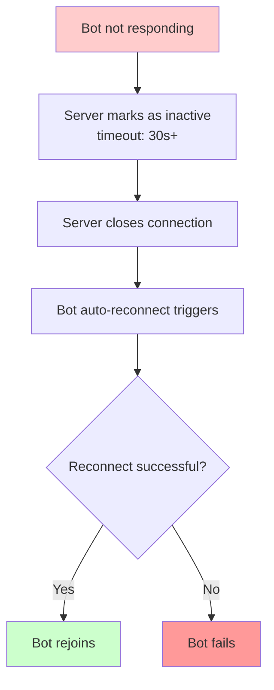
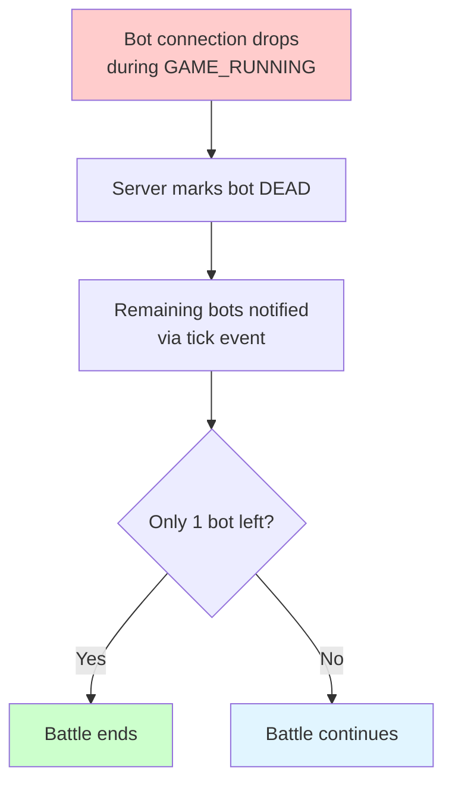

# Bot Connection Flow

This flow describes how a bot establishes connection and readiness for battle.

## Overview

Bot connection is a critical first step. The sequence ensures secure, validated connection and proper initialization.

## Complete Sequence Diagram



---

## Step-by-Step Details

### 1. Bot Preparation

**File:** Bot configuration via environment variables

```bash
BOT_NAME=MyBot
BOT_VERSION=1.0
BOT_AUTHOR=John Doe
SERVER_URL=ws://localhost:7654
SERVER_SECRET=optional-secret-token
```

**Code:** Bot initializes WebSocket handler

```java
// Java example
BaseBotInternals internals = new BaseBotInternals(
    botName,
    botVersion,
    serverUrl,
    serverSecret
);
internals.start();
```

---

### 2. WebSocket Connection

**TCP Handshake → HTTP Upgrade to WebSocket**

```
Client → Server: GET /ws HTTP/1.1
                 Upgrade: websocket
                 Connection: Upgrade
                 Sec-WebSocket-Key: ...
                 Sec-WebSocket-Version: 13

Server → Client: HTTP/1.1 101 Switching Protocols
                 Upgrade: websocket
                 Connection: Upgrade
                 Sec-WebSocket-Accept: ...
```

**Duration:** <10ms (locally)  
**Timeout:** 5-10 seconds (configurable)

### Error Handling



---

### 3. Server Handshake

**Server → Bot** (immediate, automatic)

```json
{
  "type": "server-handshake",
  "sessionId": "550e8400-e29b-41d4-a716-446655440000"
}
```

**What Happens:**
- Server generates unique sessionId
- Sends to bot immediately upon connection
- Bot must validate this against next message

**Timing:** <1ms (synchronous)

---

### 4. Bot Handshake (Authentication)

**Bot → Server** (must happen quickly)

```json
{
  "type": "bot-handshake",
  "sessionId": "550e8400-e29b-41d4-a716-446655440000",
  "name": "MyBot",
  "version": "1.0",
  "authors": ["John Doe", "Jane Smith"],
  "secret": "optional-secret-token",
  "gameTypes": ["1v1", "melee", "team"],
  "variant": "default"
}
```

**Fields:**

| Field | Type | Required | Description |
|-------|------|----------|-------------|
| `sessionId` | string | ✅ | Must match server-handshake |
| `name` | string | ✅ | Bot name (1-50 chars) |
| `version` | string | ✅ | Bot version (1-20 chars) |
| `authors` | array | ✅ | Bot authors |
| `secret` | string | ❌ | Optional secret for auth |
| `gameTypes` | array | ✅ | Supported game types |
| `variant` | string | ❌ | Bot variant (for variants) |

**Timing:** Should happen within 1-5 seconds

### Error: Slow Handshake



---

### 5. Server Validation

**Server Checks:**

1. **Session ID Match**
   ```
   if bot.sessionId != server.sessionId:
     reject "Invalid session"
   ```

2. **Name/Version Format**
   ```
   if not valid_name(bot.name):
     reject "Invalid bot name"
   
   if not valid_version(bot.version):
     reject "Invalid version"
   ```

3. **Optional Secret Check**
   ```
   if server.requires_secret and not bot.secret:
     reject "Secret required"
   
   if server.requires_secret and bot.secret != expected:
     reject "Invalid secret"
   ```

4. **Game Types Support**
   ```
   if no overlap(bot.gameTypes, server.gameTypes):
     reject "No compatible game types"
   ```

### Validation Outcomes

**✅ Success:**
- Server accepts bot
- Adds to lobby
- Sends `bot-list-update` to GUI
- Bot enters PENDING state (waiting for game-started-event)

**❌ Failure:**
- Server closes connection
- Bot receives error (optional)
- Bot should retry or exit gracefully

---

### 6. Bot Readiness States



| State | Description | Next Action |
|-------|-------------|-------------|
| **CONNECTING** | Establishing WebSocket | Handshake |
| **AUTHENTICATED** | Connection validated | Wait in lobby |
| **PENDING** | In lobby, awaiting game start | Receive game-started-event |
| **GAME_RUNNING** | Game started, initializing | Send bot-ready |
| **RUNNING** | Active in battle | Send intents each turn |
| **FINISHED** | Game ended | Disconnect or reconnect |

---

## Connection Details

### Network Configuration

**Default Endpoint:**
```
ws://localhost:7654
```

**Customizable via:**
```bash
SERVER_URL=ws://game-server.example.com:8080
```

**Latency Requirements:**
- Local (localhost): <5ms typical
- LAN: <50ms typical
- Internet: <100ms typical
- Remote: Depends on geography

### Handshake Timing

```
Step 1: TCP connect          0-10ms
Step 2: WebSocket upgrade    0-5ms
Step 3: server-handshake     <1ms
Step 4: bot-handshake        50-200ms (bot processing)
Step 5: Validation           1-5ms
Step 6: Accept/Reject        <1ms

Total: ~50-220ms typical
```

---

## Connection Recovery

### Reconnection Strategy

**Client-Side Reconnection:**



### Server-Side Timeout



### Mid-Battle Disconnection



---

## Security Considerations

### Optional Secret Authentication

**Server Configuration:**
```
--bot-secret=my-secret-token
```

**Bot Sends:**
```json
{
  "type": "bot-handshake",
  "sessionId": "...",
  "secret": "my-secret-token",
  ...
}
```

**Server Validates:**
```java
if (!botSecret.equals(configuredSecret)) {
  closeConnection("Authentication failed");
}
```

### Session ID Purpose

- **Ensures correct pairing** — Bot uses the sessionId server provided
- **Prevents replay attacks** — Each connection has unique sessionId
- **Session tracking** — Server can manage multiple connections

---

## Example: Java Bot Connection

```java
public class MyBot extends BaseBot {
    
    public MyBot(String name, String version) {
        super(name, version);
    }
    
    public static void main(String[] args) {
        MyBot bot = new MyBot("MyBot", "1.0");
        
        // BaseBotInternals handles:
        // 1. WebSocket connection
        // 2. server-handshake receiving
        // 3. bot-handshake sending
        // 4. Validation and error handling
        
        bot.start();  // Blocking - waits for connection
    }
    
    @Override
    public void run() {
        // This is called after successful connection
        // Bot is now in PENDING state, waiting for game
        while (isRunning()) {
            setTurnRate(5);
            setTargetSpeed(8);
        }
    }
}
```

---

## Example: Python Bot Connection

```python
from robocode_tank_royale.bots import BaseBot

class MyBot(BaseBot):
    pass

if __name__ == '__main__':
    bot = MyBot(
        name="MyBot",
        version="1.0",
        authors=["John Doe"]
    )
    
    # BaseBotInternals (in BaseBot) handles:
    # 1. WebSocket connection
    # 2. Message exchange and validation
    # 3. Event/intent serialization
    
    bot.start()  # Blocking
```

---

## Troubleshooting

### Connection Refused

**Symptom:** `Connection refused` or `refused to connect`

**Causes:**
- Server not running
- Wrong address/port
- Firewall blocking

**Solution:**
```bash
# Check server is running
curl ws://localhost:7654

# Check port is open
netstat -an | grep 7654
```

### Handshake Timeout

**Symptom:** Connection hangs during handshake

**Causes:**
- Bot takes too long to respond
- Network latency too high
- Bot code blocking

**Solution:**
- Reduce processing in handshake
- Increase timeout (server config)
- Check network connectivity

### Authentication Failed

**Symptom:** Server closes connection immediately after bot-handshake

**Causes:**
- Invalid sessionId (bug in bot code)
- Wrong secret token
- Invalid name/version format

**Solution:**
- Verify sessionId is stored and sent correctly
- Check secret matches server configuration
- Validate name/version format

---

## Related Documentation

- **[Battle Lifecycle Flow](./battle-lifecycle.md)** — Battle phases including WAIT_FOR_PARTICIPANTS
- **[Turn Execution Flow](./turn-execution.md)** — What happens after game starts
- **[Handshakes](../message-schema/handshakes.md)** — Handshake message schemas
- **[Events](../message-schema/events.md)** — Event message schemas
- **[ADR-0001: WebSocket Protocol](../../adr/0001-websocket-communication-protocol.md)** — Protocol design
- **[ADR-0002: Cross-Platform Bot APIs](../../adr/0002-cross-platform-bot-api-strategy.md)** — API design

---

**Last Updated:** 2026-02-11
