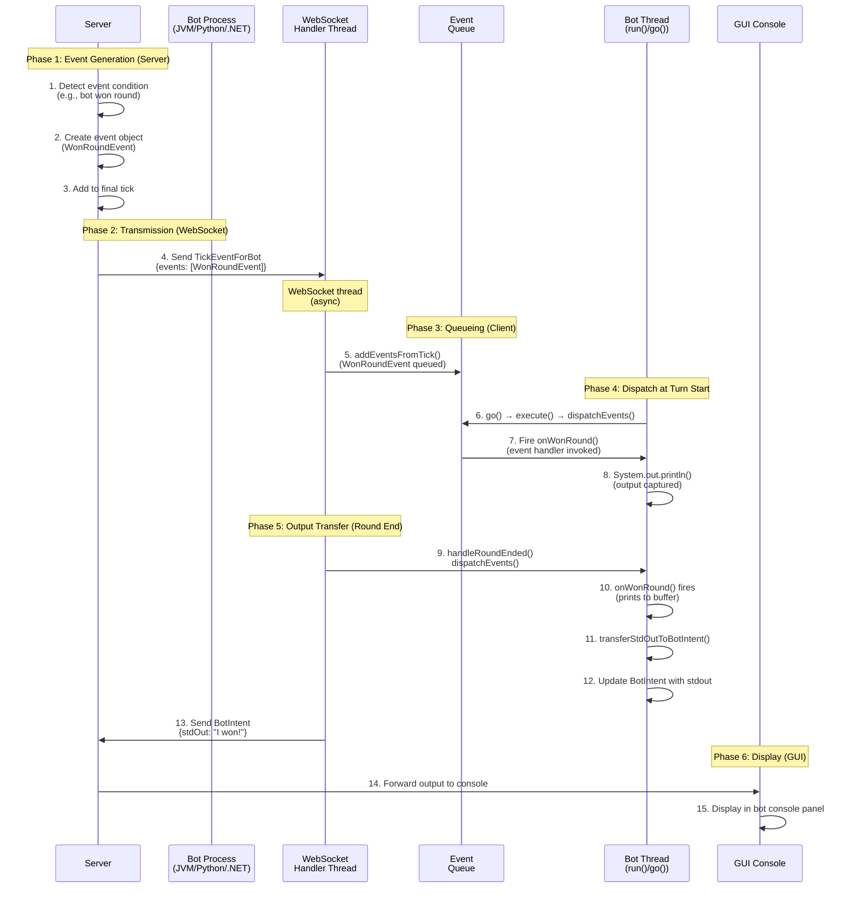
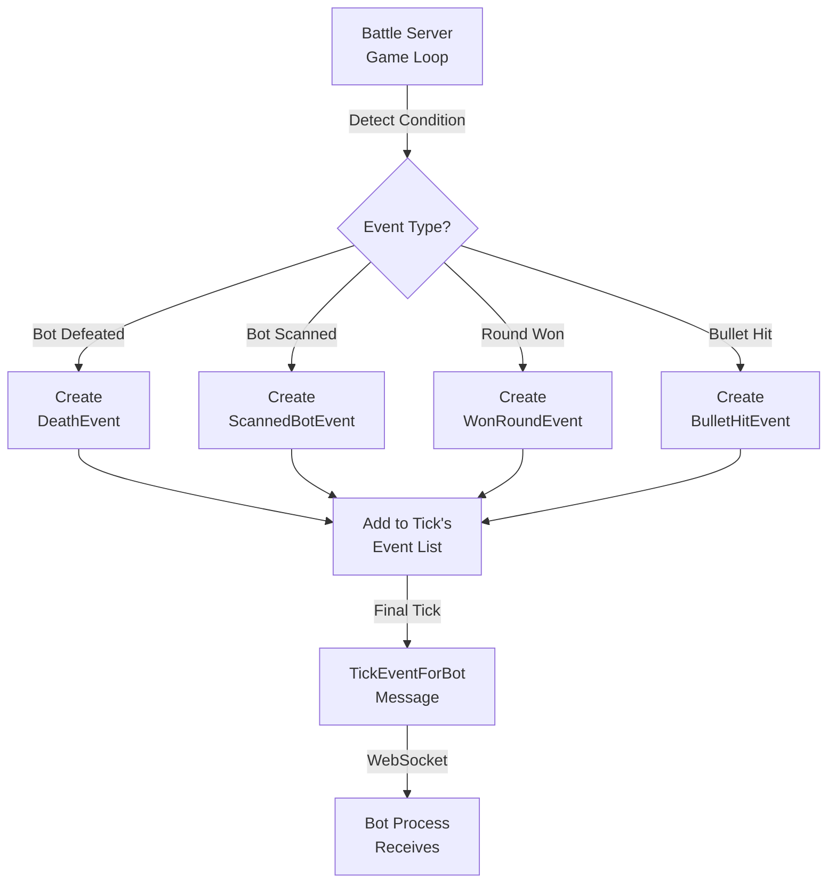
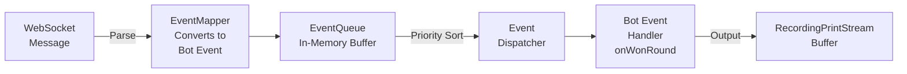
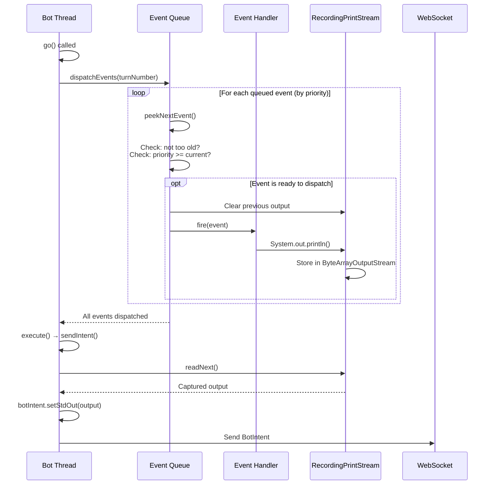
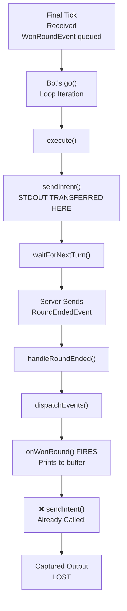
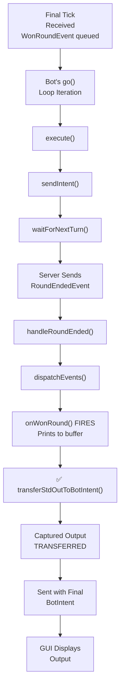
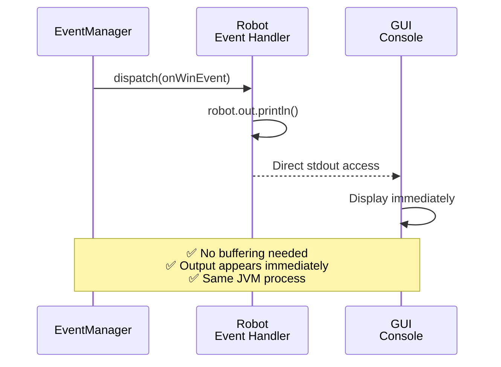
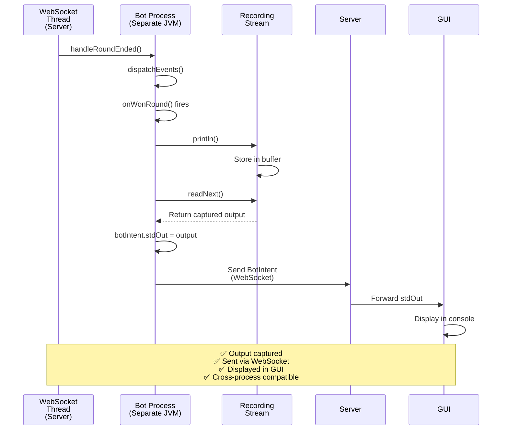
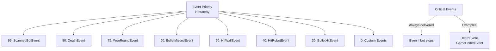
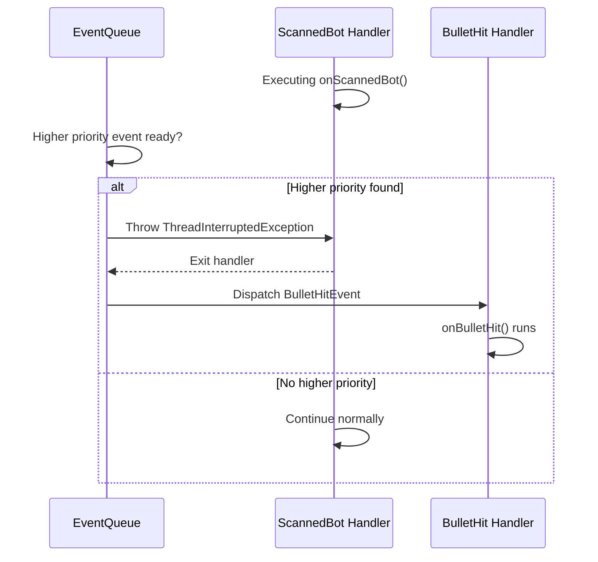

# Event Handling Flow

This document explains how events (like `WonRoundEvent`, `ScannedBotEvent`, etc.) are generated, queued, dispatched, and handled in Tank Royale Bot APIs across Java, Python, and C#.

## Overview

**System:** Distributed multi-process event system  
**Platforms:** Java (reference), Python, C# (.NET)  
**Key Concept:** Events are generated server-side, transmitted via WebSocket, queued client-side, and dispatched to bot handlers  
**Critical Issue:** Output from event handlers must be explicitly captured and transferred

---

## Event Lifecycle (Complete Flow)



---

## Event Generation (Server-Side)

### Where Events Are Created

Events originate from server physics/battle logic:



### Example: WonRoundEvent Generation

```json
{
  "type": "WonRoundEvent",
  "turnNumber": 127
}
```

This is embedded in the final tick:

```json
{
  "type": "TickEventForBot",
  "roundNumber": 1,
  "turnNumber": 127,
  "botState": { ... },
  "bulletStates": [ ... ],
  "events": [
    {
      "type": "WonRoundEvent",
      "turnNumber": 127
    }
  ]
}
```

---

## Client-Side Event Queue Management

### Event Queue Architecture



### Queue Implementation (All Platforms)

| Component | Java | Python | C# |
|-----------|------|--------|-----|
| Recording | `RecordingPrintStream` | `RecordingTextWriter` | `RecordingTextWriter` |
| Queue | `EventQueue` (synchronized) | `EventQueue` (threadsafe) | `EventQueue` (locked) |
| Dispatch | `dispatchEvents()` | `dispatch_events()` | `DispatchEvents()` |
| Transfer | `transferStdOutToBotIntent()` | `_transfer_std_out_to_bot_intent()` | `TransferStdOutToBotIntent()` |

---

## Event Dispatch Flow (Per Turn)

### Standard Turn Dispatch



---

## Critical: Round End Event Dispatch

### The Problem (Before Fix)



### The Solution (After Fix)



### Implementation (All 3 Platforms)

**Java:**
```java
private void handleRoundEnded(JsonObject jsonMsg) {
    ...
    baseBotInternals.dispatchEvents(turnNumber);        // Fire onWonRound
    baseBotInternals.transferStdOutToBotIntent();       // ✅ Transfer captured output
    ...
}
```

**Python:**
```python
async def handle_round_ended(self, json_msg: Dict[Any, Any]):
    ...
    self.event_queue.dispatch_events(turn_number)       # Fire on_won_round
    self._transfer_std_out_to_bot_intent()             # ✅ Transfer captured output
    ...
```

**C#:**
```csharp
private void HandleRoundEnded(string json)
{
    ...
    DispatchEvents(turnNumber);                        // Fire OnWonRound
    TransferStdOutToBotIntent();                       // ✅ Transfer captured output
    ...
}
```

---

## Comparison: Tank Royale vs Classic Robocode

### Classic Robocode (Single Process)



### Tank Royale (Multi-Process)



### Behavioral Parity

| Aspect | Classic | Tank Royale | Match? |
|--------|---------|-------------|--------|
| Event fires | ✅ onWinEvent | ✅ onWonRound | ✅ Yes |
| Output captured | ✅ Direct stdout | ✅ RecordingStream | ✅ Yes |
| Output location | GUI console | GUI console | ✅ Yes |
| Consistency | 100% | 100% (after fix) | ✅ Yes |
| Timing | Synchronous | Async via WebSocket | ⚠️ Different mechanism |

---

## Event Priority System

All events have numeric priorities (0-100). Higher priority events interrupt lower priority ones:

### Standard Priorities



### Interrupt Behavior

When a higher-priority event fires during a lower-priority handler:



---

## Output Capture Mechanism

### RecordingPrintStream (Java)

```java
public class RecordingPrintStream extends PrintStream {
    private final ByteArrayOutputStream byteArrayOutputStream = new ByteArrayOutputStream();
    private final PrintStream printStream = new PrintStream(byteArrayOutputStream);

    @Override
    public void write(byte[] buffer, int offset, int length) {
        synchronized (this) {
            super.write(buffer, offset, length);           // Write to original stdout
            printStream.write(buffer, offset, length);     // Also record in memory
        }
    }

    public String readNext() {
        synchronized (this) {
            String output = byteArrayOutputStream.toString(UTF_8);
            byteArrayOutputStream.reset();                 // Clear for next transfer
            return output;
        }
    }
}
```

### RecordingTextWriter (Python/C#)

Similar pattern:
1. Writes go to **both** original stdout AND in-memory buffer
2. `read_next()` / `ReadNext()` returns and clears buffer
3. Thread-safe synchronization prevents race conditions

---

## Event Queue Lifecycle

### Full Lifecycle Diagram


---

## Troubleshooting Guide

### Symptom: Event handler not called

**Check:** Is event in the final tick?
```json
{
  "type": "TickEventForBot",
  "events": [
    { "type": "WonRoundEvent" }  // ← Check this is present
  ]
}
```

**Check:** Is EventQueue receiving the event?
```java
EventQueue.addEvent(wonRoundEvent);  // Verify called
```

**Check:** Is dispatchEvents() being called after round ends?
```java
// Should be called in handleRoundEnded()
baseBotInternals.dispatchEvents(turnNumber);
```

### Symptom: Output missing from GUI

**Before Fix:** Output was lost because `transferStdOutToBotIntent()` wasn't called after event handlers fired.

**After Fix:** Output should be transferred in `handleRoundEnded()`:
```java
dispatchEvents(turnNumber);                    // Fire handlers
transferStdOutToBotIntent();                   // ← Transfer their output
```

### Symptom: Output appears in terminal but not GUI

**Cause:** Terminal shows raw stdout (inherited from bot process), but GUI receives output via WebSocket BotIntent.

**Solution:** Ensure `transferStdOutToBotIntent()` captures RecordingStream buffer and includes it in BotIntent.

---

## Related Documentation

- **[Turn Execution Flow](./turn-execution.md)** — Per-turn game loop (when events are dispatched)
- **[Battle Lifecycle Flow](./battle-lifecycle.md)** — When round ends and events fire
- **[Bot Connection Flow](./bot-connection.md)** — Event handler setup during initialization
- **[Message Schema: Events](../message-schema/events.md)** — Event message contracts
- **[ADR-0011: Realtime Game Loop](../../adr/0011-realtime-game-loop-architecture.md)** — Design decisions about event timing
- **[ADR-0012: Turn Timing Semantics](../../adr/0012-turn-timing-semantics.md)** — Exact timing semantics

---

## Key Takeaways

1. **Events are generated server-side** and transmitted as part of TickEventForBot
2. **Client-side queue** handles ordering, priority, and interruption logic
3. **Output is buffered** by RecordingPrintStream/RecordingTextWriter
4. **Transfer happens per-turn** in `sendIntent()` during normal turns
5. **Round-end requires special handling** — events fire after last `sendIntent()`
6. **Fix ensures consistency** across Java, Python, and C#

---

**Last Updated:** 2026-02-28  
**Status:** ✅ Complete (includes WonRoundEvent stdout capture fix)
