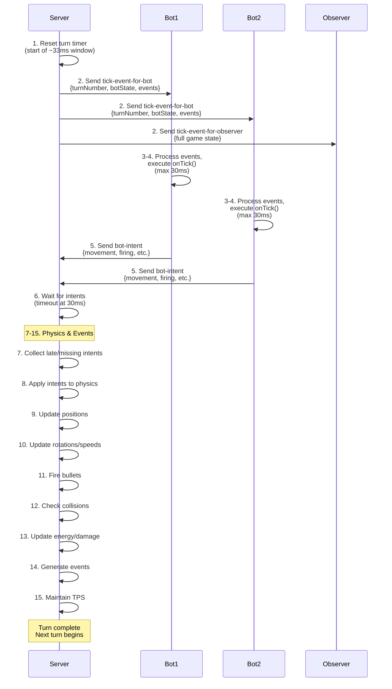
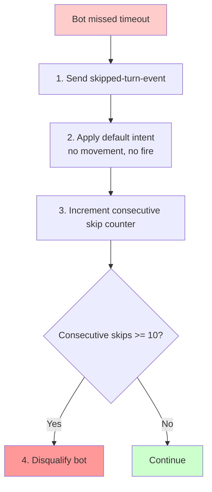
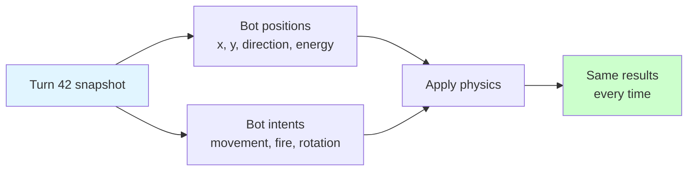
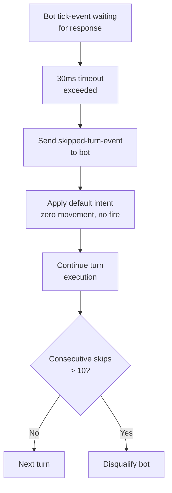
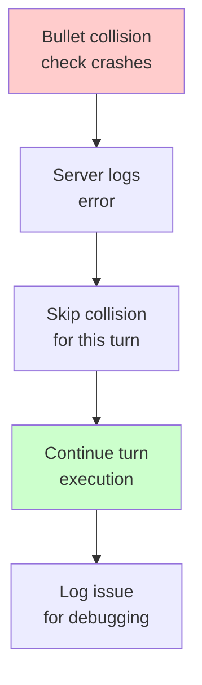

# Turn Execution Flow

This is the **core game loop** — the 15-step sequence executed 30 times per second.

## Overview

**System:** Authoritative server-based game loop  
**Speed:** 30 TPS (turns per second) = ~33ms per turn  
**Participants:** Server (authoritative), Bots (clients), Observers (viewers)

The server is the single source of truth for all game state.

---

## Per-Turn Sequence (15 Steps)



---

## Detailed Steps

### Step 1: Reset Turn Timer

**Purpose:** Ensure consistent ~33ms turn duration  
**Action:** Record turn start time

```java
long turnStartMs = System.currentTimeMillis();
long turnDurationMs = 1000 / tps;  // 33ms @ 30 TPS
long botTimeoutMs = (long)(turnDurationMs * 0.9);  // 30ms for bot
```

### Step 2: Send Tick Events

**Server → Clients** (broadcast all at once for fairness)

#### Tick Event for Bot

```json
{
  "type": "tick-event-for-bot",
  "roundNumber": 1,
  "turnNumber": 42,
  "botState": {
    "id": "uuid-bot-1",
    "x": 150.5,
    "y": -75.3,
    "direction": 45.0,
    "gunDirection": 90.0,
    "radarDirection": 180.0,
    "energy": 85.5,
    "speed": 4.0
  },
  "bulletStates": [
    {
      "id": "uuid-bullet-1",
      "x": 175.5,
      "y": -50.3,
      "direction": 45.0,
      "speed": 17.5,
      "damage": 8.0
    }
  ],
  "events": [
    {
      "type": "scanned-bot",
      "scannedBotId": "uuid-bot-2",
      "energy": 60.0,
      "distance": 150.0,
      "bearing": 90.0,
      "speed": 3.0
    },
    {
      "type": "bullet-hit",
      "bulletId": "uuid-bullet-1",
      "targetBotId": "uuid-bot-2",
      "damage": 8.0
    }
  ]
}
```

**What Bot Receives:**
- Its own full state (position, energy, directions)
- Its own bullets
- **Only** events relevant to this bot (scanned by radar, hit by bullet, etc.)

**Fairness:** All bots receive events simultaneously (no advantage to order)

#### Tick Event for Observer

```json
{
  "type": "tick-event-for-observer",
  "roundNumber": 1,
  "turnNumber": 42,
  "bots": [
    {
      "id": "uuid-bot-1",
      "name": "Bot1",
      "x": 150.5,
      "y": -75.3,
      "direction": 45.0,
      "energy": 85.5,
      "status": "RUNNING"
    },
    {
      "id": "uuid-bot-2",
      "name": "Bot2",
      "x": -200.0,
      "y": 100.0,
      "direction": 270.0,
      "energy": 60.0,
      "status": "RUNNING"
    }
  ],
  "bullets": [
    {
      "id": "uuid-bullet-1",
      "ownerBotId": "uuid-bot-1",
      "x": 175.5,
      "y": -50.3,
      "direction": 45.0,
      "speed": 17.5
    }
  ]
}
```

**What Observer Receives:**
- **Full** game state (all bots, all bullets)
- Used for GUI rendering and debugging

**Timing:** ~1-5ms to broadcast all tick events

### Steps 3-4: Bot Processing

**Bot → Bot Internal Processing**

```java
// In BaseBot.run() thread or event handler
@Override
public void onTick() {
    // Call onScannedBot() for each scanned bot event
    for (ScannedBotEvent e : events) {
        if (e instanceof ScannedBotEvent) {
            onScannedBot((ScannedBotEvent)e);
        }
    }
    
    // Call other event handlers
    for (Event e : events) {
        if (e instanceof HitByBulletEvent) {
            onHitByBullet((HitByBulletEvent)e);
        }
        // ... etc
    }
    
    // Bot logic: decide actions
    setTurnRate(calculateTurn());
    setTargetSpeed(calculateSpeed());
    setGunTurnRate(calculateGunTurn());
    setFire(calculateFirepower());
}
```

**What Must Complete:**
- Process all events
- Execute onTick()
- Compute bot intent
- **All within 30ms timeout**

**Timeout Prevention:**
- No blocking I/O
- No sleep()
- No infinite loops
- Fast logic only

### Step 5: Send Bot Intent

**Bot → Server** (must arrive before timeout)

```json
{
  "type": "bot-intent",
  "turnRate": 5.0,
  "gunTurnRate": 10.0,
  "radarTurnRate": 45.0,
  "targetSpeed": 8.0,
  "firepower": 2.5,
  "adjustGunForBodyTurn": true,
  "adjustRadarForGunTurn": true,
  "rescan": false,
  "bodyColor": "0xFF0000",
  "bulletColor": "0x00FF00",
  "radarColor": "0x0000FF"
}
```

**Fields:**

| Field | Range | Description |
|-------|-------|-------------|
| `turnRate` | ±180 | Body rotation rate (degrees/turn) |
| `gunTurnRate` | ±180 | Gun rotation rate (degrees/turn) |
| `radarTurnRate` | ±180 | Radar rotation rate (degrees/turn) |
| `targetSpeed` | -8 to 8 | Desired movement speed |
| `firepower` | 0.1-3.0 | Bullet firepower (0 = no fire) |
| `adjustGunForBodyTurn` | bool | Compensate gun for body turn |
| `adjustRadarForGunTurn` | bool | Compensate radar for gun turn |
| `rescan` | bool | Force radar rescan |
| Colors | Hex | Debug visualization colors |

**Timing:** Bot has ~30ms from tick-event to send intent

### Step 6: Wait for Intents (Timeout)

**Server Waits** with strict timeout

```java
long startWait = System.currentTimeMillis();

for (Bot bot : bots) {
    try {
        Intent intent = bot.receiveIntent(timeoutMs);
        storeIntent(bot, intent);
    } catch (TimeoutException e) {
        // Bot didn't respond in time
        bot.markSkippedTurn();
        bot.sendSkippedTurnEvent();
        
        // Use last known intent or default (zero)
        useDefaultIntent(bot);
    }
}
```

**Timeout Enforcement:**
- Per-bot timeout: ~30ms (configurable)
- Server waits max 30ms for all intents
- After timeout: use default intent (move=0, turn=0, fire=0)

### Step 7: Handle Late/Missing Intents

**Bot Penalizing**



**Skipped Turn Event**

```json
{
  "type": "skipped-turn-event",
  "reason": "timeout",
  "turnNumber": 42
}
```

### Step 8: Apply Intents to Physics

**Server-Side Physics Simulation**

```java
for (Bot bot : bots) {
    Intent intent = intents.get(bot);
    
    // Step 8a: Update rotations
    bot.direction += intent.turnRate;
    bot.gunDirection += intent.gunTurnRate;
    bot.radarDirection += intent.radarTurnRate;
    
    // Normalize angles to 0-360
    bot.direction = normalize(bot.direction);
    bot.gunDirection = normalize(bot.gunDirection);
    bot.radarDirection = normalize(bot.radarDirection);
}
```

### Step 9: Update Positions

**Movement Mechanics**

```java
for (Bot bot : bots) {
    Intent intent = intents.get(bot);
    
    // Accelerate towards target speed
    bot.speed = lerpSpeed(bot.speed, intent.targetSpeed);
    
    // Calculate movement vector
    float dx = bot.speed * cos(bot.direction);
    float dy = bot.speed * sin(bot.direction);
    
    // Update position
    bot.x += dx;
    bot.y += dy;
}
```

**Speed Limits:**
- Max forward: +8 units/turn
- Max backward: -8 units/turn
- Acceleration: Limited by physics

### Step 10: Update Rotations/Speeds

Already handled in steps 8-9. Verify angles are normalized.

### Step 11: Fire Bullets

**Bullet Generation**

```java
for (Bot bot : bots) {
    Intent intent = intents.get(bot);
    float firepower = intent.firepower;
    
    if (firepower > 0 && bot.energy >= firepower) {
        // Create bullet
        Bullet bullet = new Bullet();
        bullet.ownerBotId = bot.id;
        bullet.x = bot.x;
        bullet.y = bot.y;
        bullet.direction = bot.gunDirection;
        bullet.firepower = firepower;
        
        // Bullet speed = 20 - (3 * firepower)
        // Low firepower = fast bullet
        // High firepower = slow bullet, high damage
        bullet.speed = 20 - (3 * firepower);
        
        // Cost energy
        bot.energy -= firepower;
        bot.bulletsFired++;
        
        // Fire event
        fireEvent(new BulletFiredEvent(bullet));
    }
}
```

**Firepower ↔ Speed Trade-off:**

| Firepower | Speed | Damage | Cost |
|-----------|-------|--------|------|
| 0.1 | 19.7 | 0.4 | 0.1 energy |
| 1.0 | 17.0 | 4.0 | 1.0 energy |
| 2.0 | 14.0 | 8.0 | 2.0 energy |
| 3.0 | 11.0 | 12.0 | 3.0 energy |

### Step 12: Check Collisions

**Multiple Collision Types**

#### Collision Detection

```java
// Bullet with wall
for (Bullet bullet : bullets) {
    if (isOutsideArena(bullet.x, bullet.y)) {
        bullet.alive = false;
        fireEvent(new BulletMissedEvent(bullet));
    }
}

// Bullet with bot
for (Bullet bullet : bullets) {
    for (Bot bot : bots) {
        if (distance(bullet, bot) < COLLISION_RADIUS) {
            bot.energy -= bullet.firepower * 4;  // 4x damage multiplier
            bullet.alive = false;
            fireEvent(new BulletHitBotEvent(bullet, bot));
        }
    }
}

// Bot with wall
for (Bot bot : bots) {
    if (!isWithinBounds(bot.x, bot.y)) {
        // Clamp to arena
        bot.x = clamp(bot.x, -arena.width/2, arena.width/2);
        bot.y = clamp(bot.y, -arena.height/2, arena.height/2);
        fireEvent(new HitWallEvent(bot));
    }
}

// Bot with bot
for (int i = 0; i < bots.size(); i++) {
    for (int j = i+1; j < bots.size(); j++) {
        Bot bot1 = bots.get(i);
        Bot bot2 = bots.get(j);
        
        if (distance(bot1, bot2) < 2*BOT_RADIUS) {
            // Collide: separate bots
            separate(bot1, bot2);
            fireEvent(new HitBotEvent(bot1, bot2));
            fireEvent(new HitBotEvent(bot2, bot1));
        }
    }
}
```

### Step 13: Update Energy & Check Deaths

```java
// Apply movement cost
for (Bot bot : bots) {
    float movementCost = abs(bot.speed) * MOVEMENT_COST_FACTOR;
    bot.energy -= movementCost;
    
    if (bot.energy < 0) {
        bot.energy = 0;
    }
}

// Check for deaths
for (Bot bot : bots) {
    if (bot.energy <= 0 && bot.status == RUNNING) {
        bot.status = DEAD;
        fireEvent(new BotDeathEvent(bot));
    }
}
```

### Step 14: Generate Events

**Per-Turn Event Generation**

#### Radar Scanning

```java
for (Bot bot : bots) {
    if (bot.status != RUNNING) continue;
    
    // Scan in radar direction (±45° cone)
    for (Bot other : bots) {
        if (other == bot || other.status != RUNNING) continue;
        
        float bearing = calculateBearing(bot, other);
        float radarAngle = bot.radarDirection;
        
        if (isWithinScan(bearing, radarAngle)) {
            float distance = distance(bot, other);
            float energy = other.energy;
            float speed = other.speed;
            
            fireEvent(new ScannedBotEvent(
                bot, other, bearing, distance, energy, speed
            ));
        }
    }
}
```

#### All Event Types (per turn, as applicable)

- `scanned-bot-event` — Radar detects bot
- `bullet-fired-event` — Bot fired bullet
- `bullet-hit-bot-event` — Bullet hits bot
- `hit-by-bullet-event` — Bot takes damage
- `bullet-missed-event` — Bullet left arena
- `hit-wall-event` — Bot hit wall
- `hit-bot-event` — Bot collision
- `bot-death-event` — Bot died
- (Others depending on game state)

### Step 15: Maintain TPS (Sleep if Ahead)

**Timing Regulation**

```java
long elapsedMs = System.currentTimeMillis() - turnStartMs;
long remainingMs = turnDurationMs - elapsedMs;

if (remainingMs > 0) {
    Thread.sleep(remainingMs);  // Sleep to maintain TPS
}

// If behind: skip sleep (run as fast as possible)
```

**Example Timing (30 TPS):**

```mermaid
gantt
    title Turn Execution Timing (33.33ms target)
    dateFormat SSS
    axisFormat %Lms
    
    section Execution
    Steps 1-14 take      :000, 25ms
    Sleep to maintain TPS :025, 8ms
    Turn complete        :milestone, 033
```


| Metric | Value |
|--------|-------|
| Target duration | 33.33ms |
| Steps 1-14 take | 25ms |
| Remaining | 8.33ms |
| Action | Sleep 8ms |
| Turn ends | 33ms (on schedule) |

**Next turn starts immediately**

---

## Timing Constraints

### Per-Bot Response Time

```mermaid
gantt
    title Bot Response Timeline (30ms window)
    dateFormat SSS
    axisFormat %Lms
    
    section Bot Processing
    Receive tick-event        :000, 2ms
    Deserialize JSON          :002, 5ms
    Execute onTick + handlers :007, 15ms
    Compute intent            :022, 2ms
    Serialize and send intent :024, 2ms
    Buffer/network latency    :026, 4ms
    Timeout deadline          :milestone, 030
```



**Bot Has ~30ms to:**
1. Receive tick-event message (~2ms)
2. Deserialize JSON (~5ms)
3. Execute onTick() and event handlers (~15ms)
4. Compute intent (~2ms)
5. Serialize and send bot-intent (~2ms)
6. Buffer/network latency (~4ms)
7. **Total: ~30ms max**

### Per-Turn Total Time

```mermaid
gantt
    title Complete Turn Timeline (33ms)
    dateFormat SSS
    axisFormat %Lms
    
    section Turn Execution
    Send all tick-events               :000, 3ms
    Wait for intents with timeout      :003, 27ms
    Physics simulation & events        :030, 2ms
    Sleep if ahead of schedule         :032, 1ms
    Turn complete                      :milestone, 033
```



---

## Determinism & Reproducibility

### Deterministic Design

**Same inputs → Same outputs always**



### Replay System

1. Record all bot intents per turn
2. Record game state snapshots (optional)
3. Replay: feed same intents to engine
4. Should produce identical game state

---

## Error Handling

### Bot Disconnection During Turn



### Physics Engine Exception



---

## Performance Optimization

### Spatial Indexing

Instead of O(n²) collision checks:

```java
// Divide arena into grid cells
Grid grid = new Grid(arenaWidth, arenaHeight, cellSize);

// For collision: only check nearby cells
List<Bot> nearby = grid.getNearby(bot, radius);

// Check collision only with nearby bots
for (Bot other : nearby) {
    checkCollision(bot, other);
}
```

### Profiling Data (100 bots, 30 TPS)

| Step | Time (avg) |
|------|------------|
| Send tick events | 3-4ms |
| Wait for intents | 25-30ms |
| Physics (without optimization) | 8-10ms |
| Physics (with spatial indexing) | 2-3ms |
| Event generation | 1-2ms |
| **Total** | **31-34ms** |

**Near-target ~33ms per turn** ✓

---

## Related Documentation

- **[Battle Lifecycle Flow](./battle-lifecycle.md)** — Phases containing turn loop
- **[State Objects](../message-schema/state.md)** — Bot state and bullet state schemas
- **[Events](../message-schema/events.md)** — Tick events and bot gameplay events
- **[Intents](../message-schema/intents.md)** — Bot intent message schema
- **[ADR-0003: Game Loop](../../adr/0003-realtime-game-loop-architecture.md)** — Design rationale
- **[Schema Definitions](/schema/schemas/README.md)** — YAML message format specifications

---

**Last Updated:** 2026-02-11
