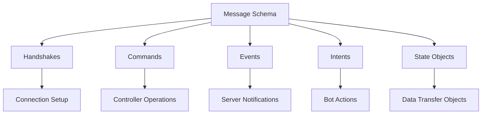
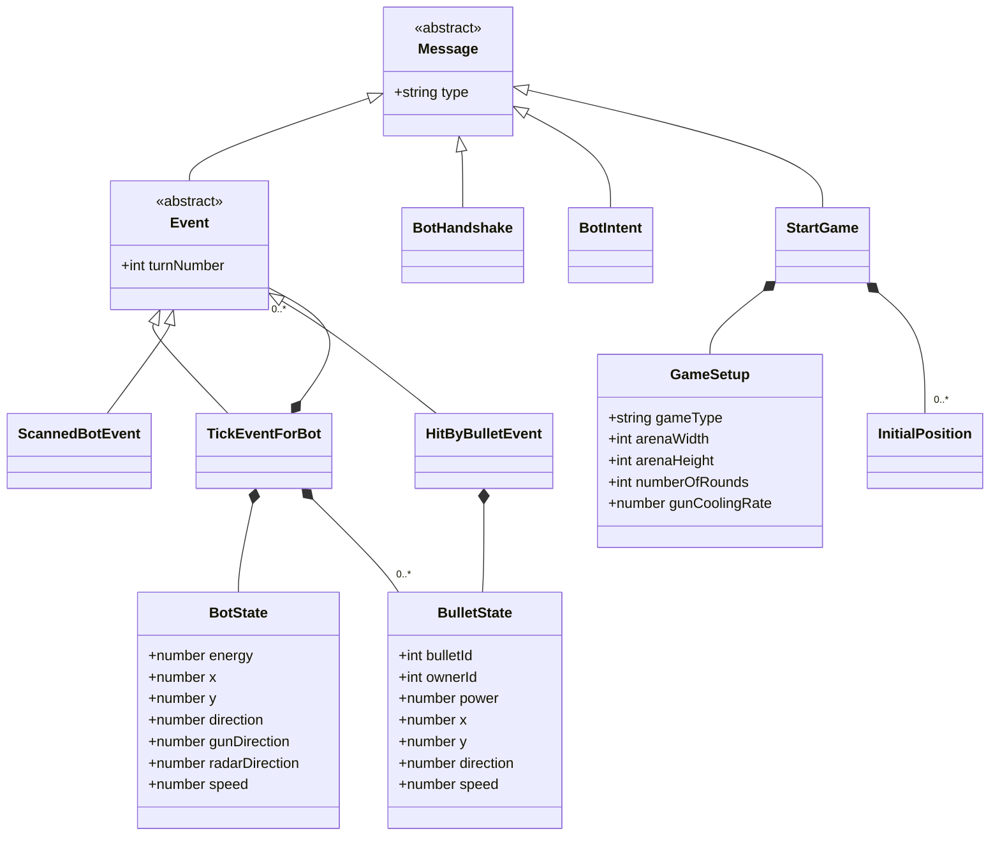
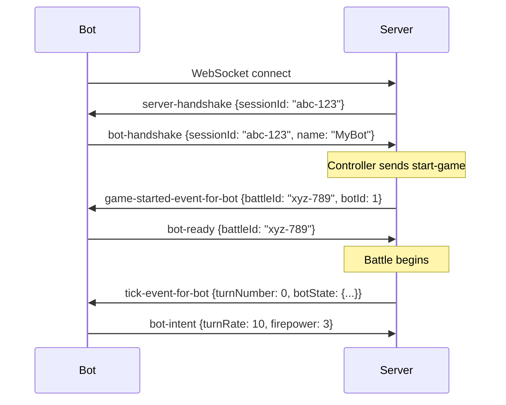

# Message Schema

This directory documents the **WebSocket message contracts** used for network communication in Robocode Tank Royale.

## What are Message Schemas?

Message schemas define the **data exchange format** between components:
- **WebSocket Messages** — JSON payloads sent over WebSocket connections
- **API Contracts** — Versioned interfaces between server, bots, observers, and controllers
- **Validation Rules** — JSON Schema definitions for each message type

Message schemas answer: **"What messages are exchanged over the network?"**

> **Note:** These are NOT internal domain entities or business logic models. They represent the wire protocol only.

---

## Schema Categories

All schemas are defined in [`/schema/schemas/`](../../../../schema/schemas/) as YAML files using JSON Schema Draft 2020-12.



### 1. Handshakes (Connection Establishment)

Initial messages exchanged when clients connect to the server.

**[→ Detailed Documentation](./handshakes.md)**

| Schema | Direction | Purpose |
|--------|-----------|---------|
| [server-handshake](../../../../schema/schemas/server-handshake.schema.yaml) | Server → Client | Server identity + sessionId assignment |
| [bot-handshake](../../../../schema/schemas/bot-handshake.schema.yaml) | Bot → Server | Bot registration with metadata |
| [observer-handshake](../../../../schema/schemas/observer-handshake.schema.yaml) | Observer → Server | Observer registration |
| [controller-handshake](../../../../schema/schemas/controller-handshake.schema.yaml) | Controller → Server | Controller registration |
| [bot-ready](../../../../schema/schemas/bot-ready.schema.yaml) | Bot → Server | Bot ready to start battle |

### 2. Commands (Controller Operations)

Commands sent by controllers to manage game state.

**[→ Detailed Documentation](./commands.md)**

| Schema | Direction | Purpose |
|--------|-----------|---------|
| [start-game](../../../../schema/schemas/start-game.schema.yaml) | Controller → Server | Initiate battle with selected bots |
| [stop-game](../../../../schema/schemas/stop-game.schema.yaml) | Controller → Server | Terminate current battle |
| [pause-game](../../../../schema/schemas/pause-game.schema.yaml) | Controller → Server | Pause battle execution |
| [resume-game](../../../../schema/schemas/resume-game.schema.yaml) | Controller → Server | Resume paused battle |
| [next-turn](../../../../schema/schemas/next-turn.schema.yaml) | Controller → Server | Execute single turn (debug mode) |
| [change-tps](../../../../schema/schemas/change-tps.schema.yaml) | Controller → Server | Change turns per second |

### 3. Events (Server Notifications)

Events broadcast by server to inform clients of state changes.

**[→ Detailed Documentation](./events.md)**

#### Game Lifecycle Events

| Schema | Recipients | Purpose |
|--------|------------|---------|
| [game-started-event-for-bot](../../../../schema/schemas/game-started-event-for-bot.schema.yaml) | Bots | Battle started, includes initial state |
| [game-started-event-for-observer](../../../../schema/schemas/game-started-event-for-observer.schema.yaml) | Observers, Controllers | Battle started, full state |
| [game-ended-event-for-bot](../../../../schema/schemas/game-ended-event-for-bot.schema.yaml) | Bots | Battle ended, personal results |
| [game-ended-event-for-observer](../../../../schema/schemas/game-ended-event-for-observer.schema.yaml) | Observers, Controllers | Battle ended, complete results |
| [game-aborted-event](../../../../schema/schemas/game-aborted-event.schema.yaml) | All | Battle cancelled/aborted |
| [game-paused-event-for-observer](../../../../schema/schemas/game-paused-event-for-observer.schema.yaml) | Observers, Controllers | Battle paused |
| [game-resumed-event-for-observer](../../../../schema/schemas/game-resumed-event-for-observer.schema.yaml) | Observers, Controllers | Battle resumed |

#### Round Events

| Schema | Recipients | Purpose |
|--------|------------|---------|
| [round-started-event](../../../../schema/schemas/round-started-event.schema.yaml) | All | New round began |
| [round-ended-event-for-bot](../../../../schema/schemas/round-ended-event-for-bot.schema.yaml) | Bots | Round ended, personal stats |
| [round-ended-event-for-observer](../../../../schema/schemas/round-ended-event-for-observer.schema.yaml) | Observers, Controllers | Round ended, full stats |

#### Turn Events

| Schema | Recipients | Purpose |
|--------|------------|---------|
| [tick-event-for-bot](../../../../schema/schemas/tick-event-for-bot.schema.yaml) | Bots | Turn state, events, bot's own state |
| [tick-event-for-observer](../../../../schema/schemas/tick-event-for-observer.schema.yaml) | Observers, Controllers | Turn state, all bots' states |
| [skipped-turn-event](../../../../schema/schemas/skipped-turn-event.schema.yaml) | Bot | Bot failed to respond in time |

#### Bot Events (Gameplay)

| Schema | Recipients | Purpose |
|--------|------------|---------|
| [scanned-bot-event](../../../../schema/schemas/scanned-bot-event.schema.yaml) | Bot | Radar detected another bot |
| [hit-by-bullet-event](../../../../schema/schemas/hit-by-bullet-event.schema.yaml) | Bot | Bot took damage from bullet |
| [bullet-fired-event](../../../../schema/schemas/bullet-fired-event.schema.yaml) | Bot | Bot fired a bullet |
| [bullet-hit-bot-event](../../../../schema/schemas/bullet-hit-bot-event.schema.yaml) | Bot | Bot's bullet hit target |
| [bullet-hit-bullet-event](../../../../schema/schemas/bullet-hit-bullet-event.schema.yaml) | Bot | Bot's bullet hit another bullet |
| [bullet-hit-wall-event](../../../../schema/schemas/bullet-hit-wall-event.schema.yaml) | Bot | Bot's bullet hit wall |
| [bot-hit-bot-event](../../../../schema/schemas/bot-hit-bot-event.schema.yaml) | Bot | Bot collided with another bot |
| [bot-hit-wall-event](../../../../schema/schemas/bot-hit-wall-event.schema.yaml) | Bot | Bot collided with wall |
| [bot-death-event](../../../../schema/schemas/bot-death-event.schema.yaml) | Bot | Bot destroyed |
| [won-round-event](../../../../schema/schemas/won-round-event.schema.yaml) | Bot | Bot won the round |

#### Team Events

| Schema | Recipients | Purpose |
|--------|------------|---------|
| [team-message-event](../../../../schema/schemas/team-message-event.schema.yaml) | Team Bot | Message from teammate |

#### Meta Events

| Schema | Recipients | Purpose |
|--------|------------|---------|
| [bot-list-update](../../../../schema/schemas/bot-list-update.schema.yaml) | Observers, Controllers | Available bots changed |
| [tps-changed-event](../../../../schema/schemas/tps-changed-event.schema.yaml) | Observers, Controllers | Turns per second changed |

### 4. Intents (Bot Actions)

Messages sent by bots to declare their desired actions for the next turn.

**[→ Detailed Documentation](./intents.md)**

| Schema | Direction | Purpose |
|--------|-----------|---------|
| [bot-intent](../../../../schema/schemas/bot-intent.schema.yaml) | Bot → Server | Bot's desired movement, rotation, firing |
| [team-message](../../../../schema/schemas/team-message.schema.yaml) | Bot → Server | Message to teammate |

### 5. State Objects (Data Transfer Objects)

Reusable data structures embedded in events and commands.

**[→ Detailed Documentation](./state.md)**

| Schema | Purpose |
|--------|---------|
| [bot-state](../../../../schema/schemas/bot-state.schema.yaml) | Bot's position, energy, direction (no ID) |
| [bot-state-with-id](../../../../schema/schemas/bot-state-with-id.schema.yaml) | Bot state including bot ID |
| [bot-info](../../../../schema/schemas/bot-info.schema.yaml) | Bot metadata (name, version, authors) |
| [bot-address](../../../../schema/schemas/bot-address.schema.yaml) | Bot network address |
| [bullet-state](../../../../schema/schemas/bullet-state.schema.yaml) | Bullet position, direction, power |
| [participant](../../../../schema/schemas/participant.schema.yaml) | Bot participating in battle |
| [game-setup](../../../../schema/schemas/game-setup.schema.yaml) | Battle configuration (arena, rules) |
| [initial-position](../../../../schema/schemas/initial-position.schema.yaml) | Starting position for bot |
| [results-for-bot](../../../../schema/schemas/results-for-bot.schema.yaml) | Personal battle results |
| [results-for-observer](../../../../schema/schemas/results-for-observer.schema.yaml) | Complete battle results |
| [color](../../../../schema/schemas/color.schema.yaml) | RGB color value |
| [event](../../../../schema/schemas/event.schema.yaml) | Base event structure |
| [message](../../../../schema/schemas/message.schema.yaml) | Base message structure |

---

## Schema Relationships



---

## UUID Generation

**All UUIDs are generated by the server** and provided to clients during handshake or game initialization.

### Server-Generated Identifiers

| Identifier | Generated When | Provided Via | Purpose |
|------------|----------------|--------------|---------|
| `sessionId` | WebSocket connection opened | [server-handshake](../../../../schema/schemas/server-handshake.schema.yaml) | Authenticates client in subsequent messages |
| `battleId` | Battle started | [game-started-event-for-bot](../../../../schema/schemas/game-started-event-for-bot.schema.yaml) | Identifies specific battle instance |
| `botId` | Bot handshake accepted | [participant](../../../../schema/schemas/participant.schema.yaml) in game-started events | Identifies bot within battle |

**[→ Detailed UUID Documentation](./handshakes.md#server-generated-identifiers)**

---

## Usage Examples

### Example 1: Bot Connecting and Starting Battle



### Example 2: Bot Receiving Scanned Bot Event

```json
{
  "type": "tick-event-for-bot",
  "turnNumber": 42,
  "roundNumber": 1,
  "botState": {
    "energy": 85.5,
    "x": 400.0,
    "y": 300.0,
    "direction": 45.0,
    "gunDirection": 90.0,
    "radarDirection": 135.0
  },
  "bulletStates": [],
  "events": [
    {
      "type": "scanned-bot-event",
      "turnNumber": 42,
      "scannedByBotId": 1,
      "scannedBotId": 2,
      "energy": 72.0,
      "x": 500.0,
      "y": 350.0,
      "direction": 180.0,
      "speed": 5.0
    }
  ]
}
```

---

## Practical Usage

### 1. Validation

Use JSON Schema validators to ensure messages conform:

```bash
# Example with ajv-cli
ajv validate -s schema/schemas/bot-intent.schema.yaml -d message.json
```

### 2. Code Generation

Generate strongly-typed models:

```bash
# Example with quicktype
quicktype -s schema schema/schemas/bot-intent.schema.yaml -o BotIntent.java
```

### 3. API Documentation

Reference schemas in bot API documentation to explain message formats.

### 4. Testing

Use schemas to generate test fixtures and validate responses.

---

## Related Documentation

- **[Handshakes](./handshakes.md)** — Connection establishment messages
- **[Commands](./commands.md)** — Controller operations
- **[Events](./events.md)** — Server notifications
- **[Intents](./intents.md)** — Bot actions
- **[State Objects](./state.md)** — Data transfer objects
- **[Battle Lifecycle Flow](../flows/battle-lifecycle.md)** — How messages flow through battle
- **[Turn Execution Flow](../flows/turn-execution.md)** — Per-turn message sequence
- **[Schema Source](../../../../schema/schemas/)** — YAML schema definitions

---

**Last Updated:** 2026-02-12

