# Command Messages

Commands are control messages sent by controllers to manage game state and execution.

## Overview

Controllers have privileged access to manage battles through command messages:

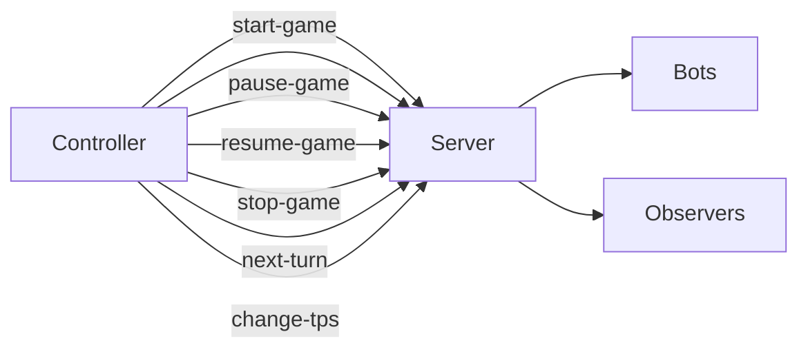

**Key Characteristics:**
- **Sender:** Controller only
- **Receiver:** Server
- **Authority:** Privileged operations (require controller handshake)
- **Effects:** Change game state, affect all participants

---

## Command Schema Hierarchy

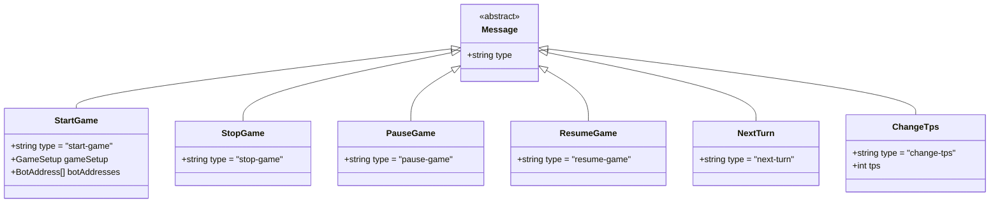

---

## 1. Start Game

**Schema:** [`start-game.schema.yaml`](../../../../schema/schemas/start-game.schema.yaml)

**Direction:** Controller → Server

**Purpose:** Initiate a new battle with selected bots and configuration

### Structure

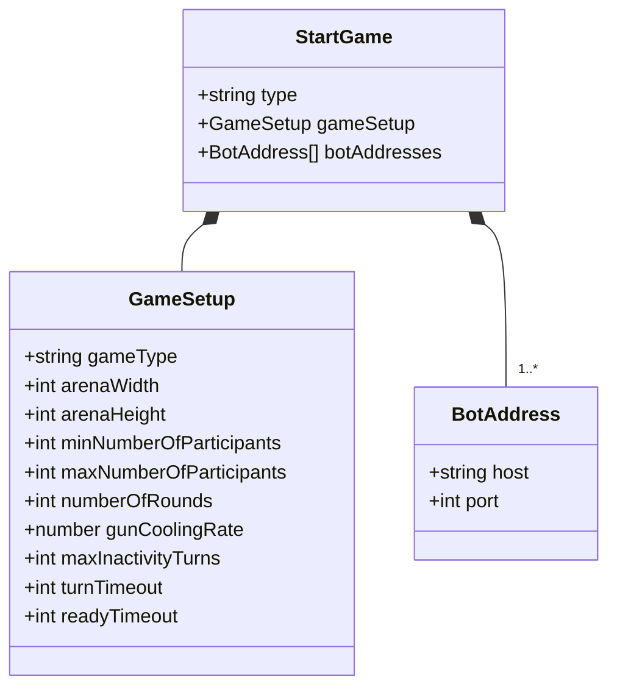

### Example

```json
{
  "type": "start-game",
  "gameSetup": {
    "gameType": "melee",
    "arenaWidth": 800,
    "arenaHeight": 600,
    "minNumberOfParticipants": 2,
    "maxNumberOfParticipants": 4,
    "numberOfRounds": 10,
    "gunCoolingRate": 0.1,
    "maxInactivityTurns": 450,
    "turnTimeout": 30000,
    "readyTimeout": 10000
  },
  "botAddresses": [
    {"host": "localhost", "port": 50001},
    {"host": "localhost", "port": 50002},
    {"host": "192.168.1.100", "port": 50003}
  ]
}
```

### Fields

| Field | Type | Required | Description |
|-------|------|----------|-------------|
| `type` | string | ✅ | Always `"start-game"` |
| `gameSetup` | [GameSetup](../../../../schema/schemas/game-setup.schema.yaml) | ❌ | Battle configuration (uses defaults if omitted) |
| `botAddresses` | [BotAddress[]](../../../../schema/schemas/bot-address.schema.yaml) | ✅ | List of bot network addresses to include in battle |

### Server Response

**Success:**
1. Server sends [`game-started-event-for-bot`](../../../../schema/schemas/game-started-event-for-bot.schema.yaml) to each bot
2. Waits for [`bot-ready`](../../../../schema/schemas/bot-ready.schema.yaml) from all bots
3. Sends [`game-started-event-for-observer`](../../../../schema/schemas/game-started-event-for-observer.schema.yaml) to observers and controllers
4. Begins turn execution loop

**Failure:**
- Not enough bots connected → No response (silent failure)
- Invalid bot addresses → Specific bots excluded from battle
- No bots respond with `bot-ready` within timeout → [`game-aborted-event`](../../../../schema/schemas/game-aborted-event.schema.yaml)

### Use Cases

1. **GUI Starting Battle** — User selects bots from lobby and clicks "Start"
2. **Tournament System** — Automated bracket matches
3. **Testing Framework** — Programmatically launch test battles
4. **Replay System** — Restart battle with same configuration

---

## 2. Stop Game

**Schema:** [`stop-game.schema.yaml`](../../../../schema/schemas/stop-game.schema.yaml)

**Direction:** Controller → Server

**Purpose:** Immediately terminate the currently running battle

### Structure

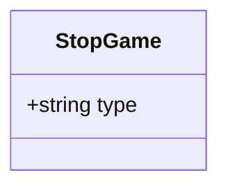

### Example

```json
{
  "type": "stop-game"
}
```

### Fields

| Field | Type | Required | Description |
|-------|------|----------|-------------|
| `type` | string | ✅ | Always `"stop-game"` |

### Server Response

1. Server stops turn execution immediately (current turn completes)
2. Sends [`game-ended-event-for-bot`](../../../../schema/schemas/game-ended-event-for-bot.schema.yaml) to all bots
3. Sends [`game-ended-event-for-observer`](../../../../schema/schemas/game-ended-event-for-observer.schema.yaml) to observers and controllers
4. Winner determined by current state (highest energy)

### Use Cases

1. **User Cancels Battle** — Stop button clicked in GUI
2. **Emergency Stop** — Server overload or error condition
3. **Testing** — Stop battle early to examine state

---

## 3. Pause Game

**Schema:** [`pause-game.schema.yaml`](../../../../schema/schemas/pause-game.schema.yaml)

**Direction:** Controller → Server

**Purpose:** Pause battle execution (stop sending tick events)

### Structure

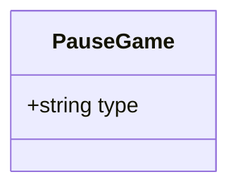

### Example

```json
{
  "type": "pause-game"
}
```

### Fields

| Field | Type | Required | Description |
|-------|------|----------|-------------|
| `type` | string | ✅ | Always `"pause-game"` |

### Server Response

1. Server completes current turn
2. Stops turn execution loop
3. Sends [`game-paused-event-for-observer`](../../../../schema/schemas/game-paused-event-for-observer.schema.yaml) to observers and controllers
4. Waits for [`resume-game`](#4-resume-game) or [`next-turn`](#5-next-turn) command

**Note:** Bots are NOT notified of pause state. They continue waiting for next [`tick-event-for-bot`](../../../../schema/schemas/tick-event-for-bot.schema.yaml).

### Use Cases

1. **Debugging** — Pause to examine battle state
2. **Demonstration** — Pause to explain strategy
3. **Recording** — Pause to adjust camera/recording
4. **Step-Through Debugging** — Pause then use `next-turn` for single-step execution

---

## 4. Resume Game

**Schema:** [`resume-game.schema.yaml`](../../../../schema/schemas/resume-game.schema.yaml)

**Direction:** Controller → Server

**Purpose:** Resume paused battle execution

### Structure

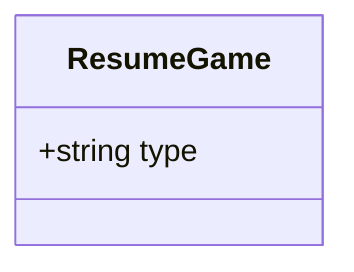

### Example

```json
{
  "type": "resume-game"
}
```

### Fields

| Field | Type | Required | Description |
|-------|------|----------|-------------|
| `type` | string | ✅ | Always `"resume-game"` |

### Server Response

1. Server resumes turn execution loop
2. Sends [`game-resumed-event-for-observer`](../../../../schema/schemas/game-resumed-event-for-observer.schema.yaml) to observers and controllers
3. Continues sending [`tick-event-for-bot`](../../../../schema/schemas/tick-event-for-bot.schema.yaml) to bots at configured TPS

### Use Cases

1. **Continue After Pause** — Resume normal execution
2. **Exit Debug Mode** — Return to real-time after step-through debugging

---

## 5. Next Turn

**Schema:** [`next-turn.schema.yaml`](../../../../schema/schemas/next-turn.schema.yaml)

**Direction:** Controller → Server

**Purpose:** Execute exactly one turn while paused (step-through debugging)

### Structure

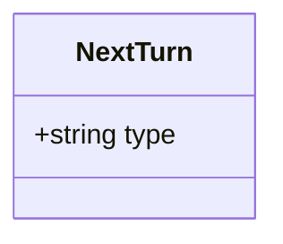

### Example

```json
{
  "type": "next-turn"
}
```

### Fields

| Field | Type | Required | Description |
|-------|------|----------|-------------|
| `type` | string | ✅ | Always `"next-turn"` |

### Server Response

1. Server executes one turn (if paused)
2. Sends [`tick-event-for-bot`](../../../../schema/schemas/tick-event-for-bot.schema.yaml) to bots
3. Sends [`tick-event-for-observer`](../../../../schema/schemas/tick-event-for-observer.schema.yaml) to observers
4. Returns to paused state

**Precondition:** Battle must be paused via [`pause-game`](#3-pause-game)

### Use Cases

1. **Step-Through Debugging** — Advance one turn at a time
2. **Detailed Analysis** — Examine state changes between specific turns
3. **Screenshot Capture** — Capture specific turn states

---

## 6. Change TPS

**Schema:** [`change-tps.schema.yaml`](../../../../schema/schemas/change-tps.schema.yaml)

**Direction:** Controller → Server

**Purpose:** Change the turns per second (game speed) during battle

### Structure

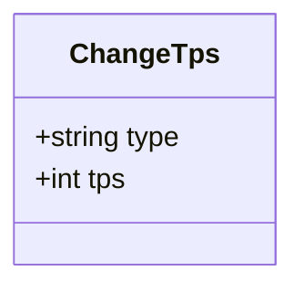

### Example

```json
{
  "type": "change-tps",
  "tps": 60
}
```

### Fields

| Field | Type | Required | Description |
|-------|------|----------|-------------|
| `type` | string | ✅ | Always `"change-tps"` |
| `tps` | integer | ✅ | New turns per second (typically 1-999) |

### Server Response

1. Server adjusts turn execution rate
2. Sends [`tps-changed-event`](../../../../schema/schemas/tps-changed-event.schema.yaml) to observers and controllers

**Note:** Bots are NOT notified of TPS changes. From bot perspective, turns continue normally.

### Common TPS Values

| TPS | Turn Duration | Use Case |
|-----|---------------|----------|
| 1 | 1000ms | Very slow motion debugging |
| 10 | 100ms | Slow motion observation |
| 30 | 33ms | **Default** — Real-time gameplay |
| 60 | 16ms | Fast forward |
| 120 | 8ms | Very fast forward |
| 999 | ~1ms | Maximum speed (testing) |

### Use Cases

1. **Slow Motion** — Reduce TPS to watch complex interactions
2. **Fast Forward** — Increase TPS to skip boring sections
3. **Variable Speed Replay** — Adjust speed during replay
4. **Performance Testing** — Test server at maximum TPS

---

## Command Flow Examples

### Starting a Battle

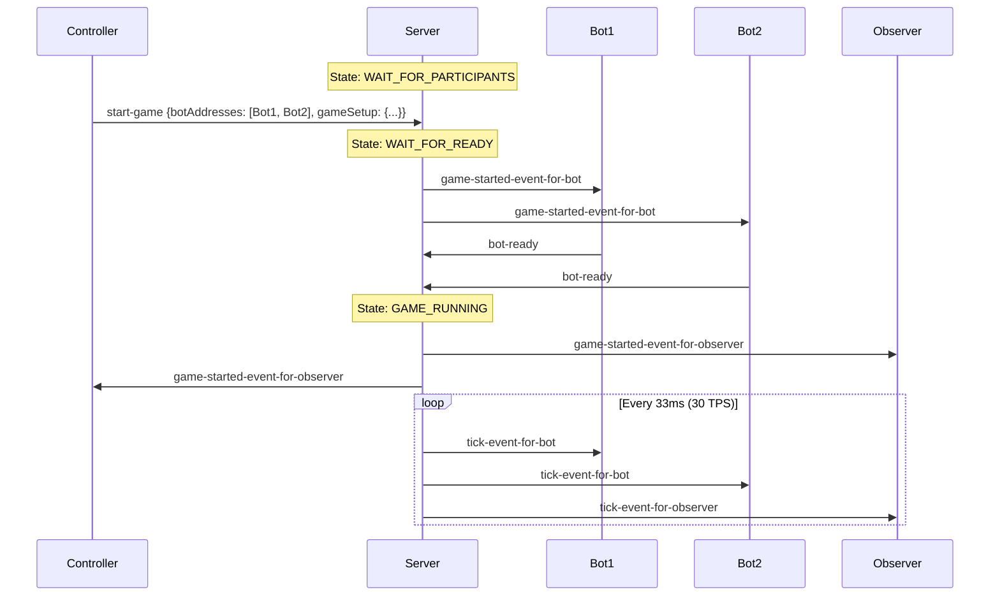

### Pause, Step-Through, Resume

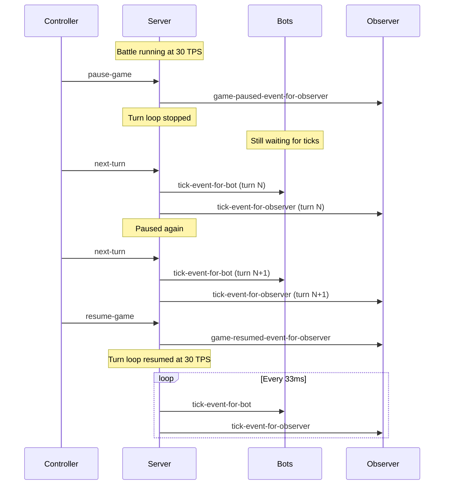

### Changing Speed During Battle

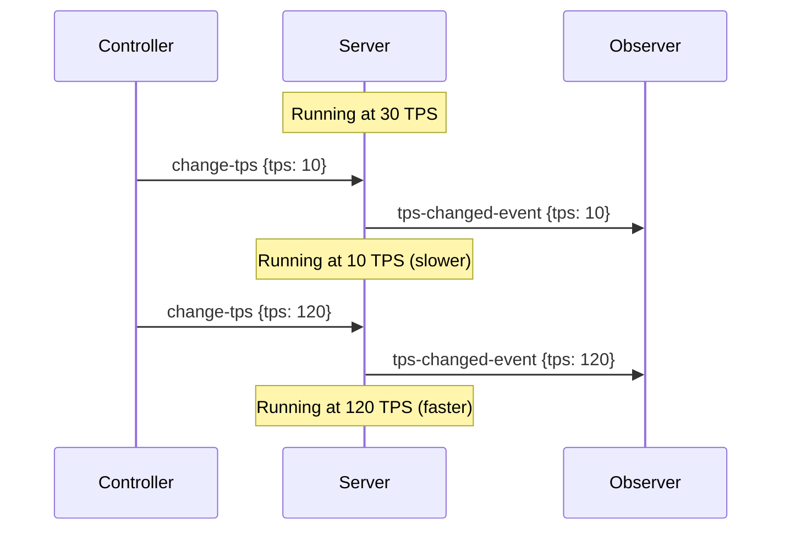

---

## Error Handling

### Command Sent by Non-Controller

```
Non-controller client sends command
  ↓
Server ignores message (no response)
```

### Invalid State Transition

```json
// Attempt to resume when not paused
{
  "type": "resume-game"
}

// Server response: No effect, silent ignore
```

### Start Game with No Bots

```json
{
  "type": "start-game",
  "botAddresses": []
}

// Server response: No game started, silent failure
```

### Invalid TPS Value

```json
{
  "type": "change-tps",
  "tps": -5  // Invalid negative value
}

// Server response: TPS unchanged, silent ignore
```

---

## Best Practices

### For Controller Developers

1. **Wait for Events** — Don't assume commands succeed immediately; wait for confirmation events
2. **State Awareness** — Track game state to avoid invalid command sequences
3. **Error Handling** — Implement timeouts for expected responses
4. **User Feedback** — Show command acknowledgment in UI

### For Server Implementors

1. **Validate Authority** — Ensure only authenticated controllers can send commands
2. **State Machine** — Enforce valid state transitions (e.g., can't pause if not running)
3. **Idempotency** — Handle duplicate commands gracefully (e.g., pause while already paused)
4. **Broadcast Events** — Always notify observers/controllers of state changes

---

## Related Schemas

- [start-game.schema.yaml](../../../../schema/schemas/start-game.schema.yaml)
- [stop-game.schema.yaml](../../../../schema/schemas/stop-game.schema.yaml)
- [pause-game.schema.yaml](../../../../schema/schemas/pause-game.schema.yaml)
- [resume-game.schema.yaml](../../../../schema/schemas/resume-game.schema.yaml)
- [next-turn.schema.yaml](../../../../schema/schemas/next-turn.schema.yaml)
- [change-tps.schema.yaml](../../../../schema/schemas/change-tps.schema.yaml)
- [game-setup.schema.yaml](../../../../schema/schemas/game-setup.schema.yaml)
- [bot-address.schema.yaml](../../../../schema/schemas/bot-address.schema.yaml)

---

## Related Documentation

- [Message Schema Overview](./README.md)
- [Handshakes](./handshakes.md)
- [Events](./events.md)
- [Battle Lifecycle Flow](../flows/battle-lifecycle.md)

---

**Last Updated:** 2026-02-12

