# Event Messages

Events are server-generated notifications sent to clients about game state changes and occurrences.

## Overview

Events flow from server to clients (bots, observers, controllers) to inform them of state changes:

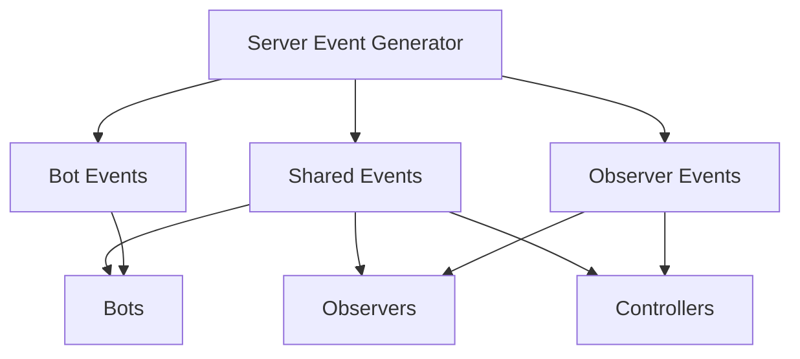

**Key Characteristics:**
- **Sender:** Server only
- **Receivers:** Bots, Observers, and/or Controllers (varies by event type)
- **Purpose:** Inform clients of state changes, collisions, scan results
- **Timing:** Sent during turn execution or state transitions

---

## Event Categories

### 1. Game Lifecycle Events
Battle start, end, abort

### 2. Round Events  
Round start, end, victory

### 3. Turn Events
Per-turn state updates

### 4. Bot Gameplay Events
Scans, collisions, damage, firing

### 5. Team Events
Team communication

### 6. Meta Events
Bot list changes, TPS changes

---

## Event Schema Hierarchy

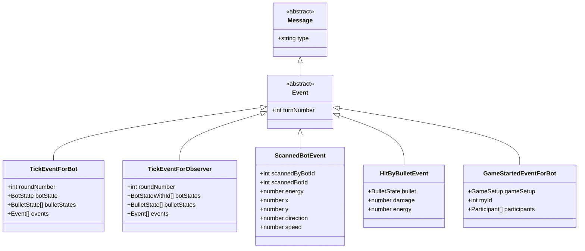

---

## Game Lifecycle Events

### Game Started (For Bot)

**Schema:** [`game-started-event-for-bot.schema.yaml`](../../../../schema/schemas/game-started-event-for-bot.schema.yaml)

**Recipients:** Bots participating in battle

**Purpose:** Notify bot that battle is starting, provide initial configuration

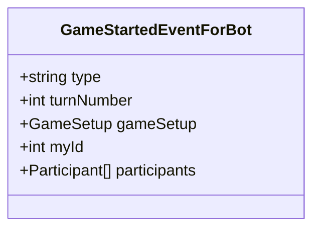

**Example:**
```json
{
  "type": "game-started-event-for-bot",
  "turnNumber": 0,
  "gameSetup": {
    "gameType": "melee",
    "arenaWidth": 800,
    "arenaHeight": 600,
    "numberOfRounds": 10,
    "gunCoolingRate": 0.1
  },
  "myId": 1,
  "participants": [
    {"id": 1, "name": "MyBot", "version": "1.0"},
    {"id": 2, "name": "Opponent1", "version": "2.0"},
    {"id": 3, "name": "Opponent2", "version": "1.5"}
  ]
}
```

---

### Game Started (For Observer)

**Schema:** [`game-started-event-for-observer.schema.yaml`](../../../../schema/schemas/game-started-event-for-observer.schema.yaml)

**Recipients:** Observers, Controllers

**Purpose:** Notify observers that battle is starting with complete bot list

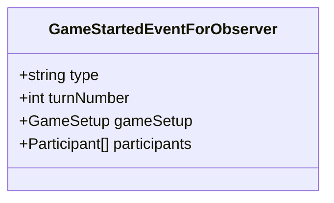

---

### Game Ended (For Bot)

**Schema:** [`game-ended-event-for-bot.schema.yaml`](../../../../schema/schemas/game-ended-event-for-bot.schema.yaml)

**Recipients:** Bots

**Purpose:** Notify bot of battle results (personal view)

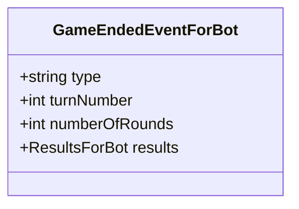

---

### Game Ended (For Observer)

**Schema:** [`game-ended-event-for-observer.schema.yaml`](../../../../schema/schemas/game-ended-event-for-observer.schema.yaml)

**Recipients:** Observers, Controllers

**Purpose:** Notify observers of battle results (complete view)

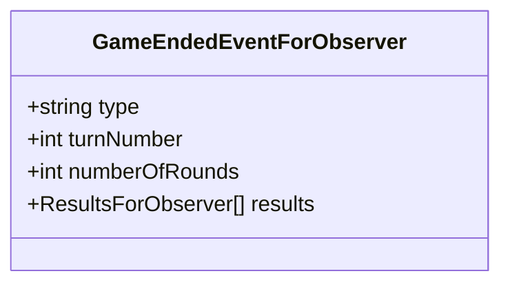

---

### Game Aborted

**Schema:** [`game-aborted-event.schema.yaml`](../../../../schema/schemas/game-aborted-event.schema.yaml)

**Recipients:** All (Bots, Observers, Controllers)

**Purpose:** Notify that battle was cancelled/aborted

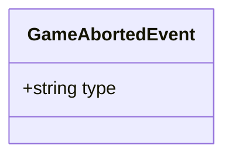

**Example:**
```json
{
  "type": "game-aborted-event"
}
```

---

### Game Paused (For Observer)

**Schema:** [`game-paused-event-for-observer.schema.yaml`](../../../../schema/schemas/game-paused-event-for-observer.schema.yaml)

**Recipients:** Observers, Controllers

**Purpose:** Notify that battle execution has paused

---

### Game Resumed (For Observer)

**Schema:** [`game-resumed-event-for-observer.schema.yaml`](../../../../schema/schemas/game-resumed-event-for-observer.schema.yaml)

**Recipients:** Observers, Controllers

**Purpose:** Notify that battle execution has resumed

---

## Round Events

### Round Started

**Schema:** [`round-started-event.schema.yaml`](../../../../schema/schemas/round-started-event.schema.yaml)

**Recipients:** All (Bots, Observers, Controllers)

**Purpose:** Notify that a new round has begun

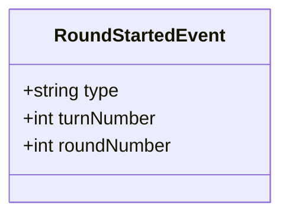

---

### Round Ended (For Bot)

**Schema:** [`round-ended-event-for-bot.schema.yaml`](../../../../schema/schemas/round-ended-event-for-bot.schema.yaml)

**Recipients:** Bots

**Purpose:** Notify bot that round ended (personal stats)

---

### Round Ended (For Observer)

**Schema:** [`round-ended-event-for-observer.schema.yaml`](../../../../schema/schemas/round-ended-event-for-observer.schema.yaml)

**Recipients:** Observers, Controllers

**Purpose:** Notify observers that round ended (complete stats)

---

### Won Round

**Schema:** [`won-round-event.schema.yaml`](../../../../schema/schemas/won-round-event.schema.yaml)

**Recipients:** Winning bot only

**Purpose:** Notify bot that it won the round

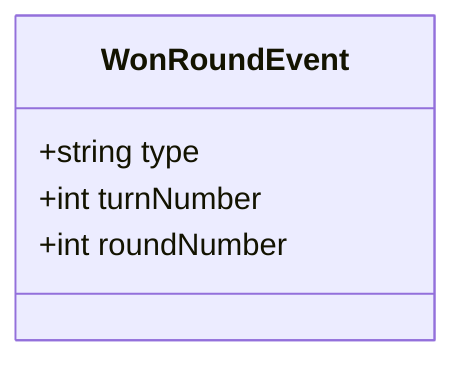

---

## Turn Events

### Tick Event (For Bot)

**Schema:** [`tick-event-for-bot.schema.yaml`](../../../../schema/schemas/tick-event-for-bot.schema.yaml)

**Recipients:** Bots

**Purpose:** Provide bot with its own state and events for current turn

**This is the most important event** — sent 30 times per second (at 30 TPS) during battle.

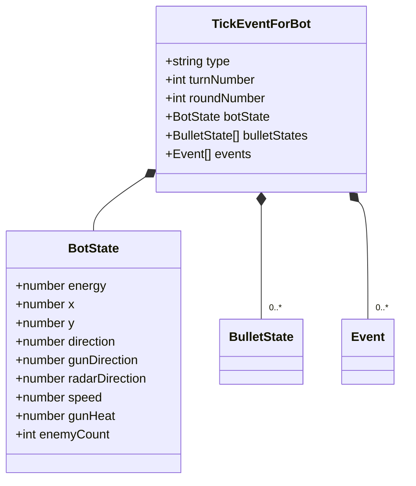

**Example:**
```json
{
  "type": "tick-event-for-bot",
  "turnNumber": 42,
  "roundNumber": 1,
  "botState": {
    "isDroid": false,
    "energy": 85.5,
    "x": 400.0,
    "y": 300.0,
    "direction": 45.0,
    "gunDirection": 90.0,
    "radarDirection": 135.0,
    "radarSweep": 45.0,
    "speed": 5.0,
    "turnRate": 0.0,
    "gunTurnRate": 10.0,
    "radarTurnRate": 20.0,
    "gunHeat": 0.5,
    "enemyCount": 2
  },
  "bulletStates": [
    {
      "bulletId": 1,
      "ownerId": 1,
      "power": 3.0,
      "x": 450.0,
      "y": 320.0,
      "direction": 90.0,
      "speed": 20.0
    }
  ],
  "events": [
    {
      "type": "scanned-bot-event",
      "turnNumber": 42,
      "scannedByBotId": 1,
      "scannedBotId": 2,
      "energy": 72.0,
      "x": 500.0,
      "y": 350.0,
      "direction": 180.0,
      "speed": 5.0
    }
  ]
}
```

---

### Tick Event (For Observer)

**Schema:** [`tick-event-for-observer.schema.yaml`](../../../../schema/schemas/tick-event-for-observer.schema.yaml)

**Recipients:** Observers, Controllers

**Purpose:** Provide complete game state for current turn (all bots visible)

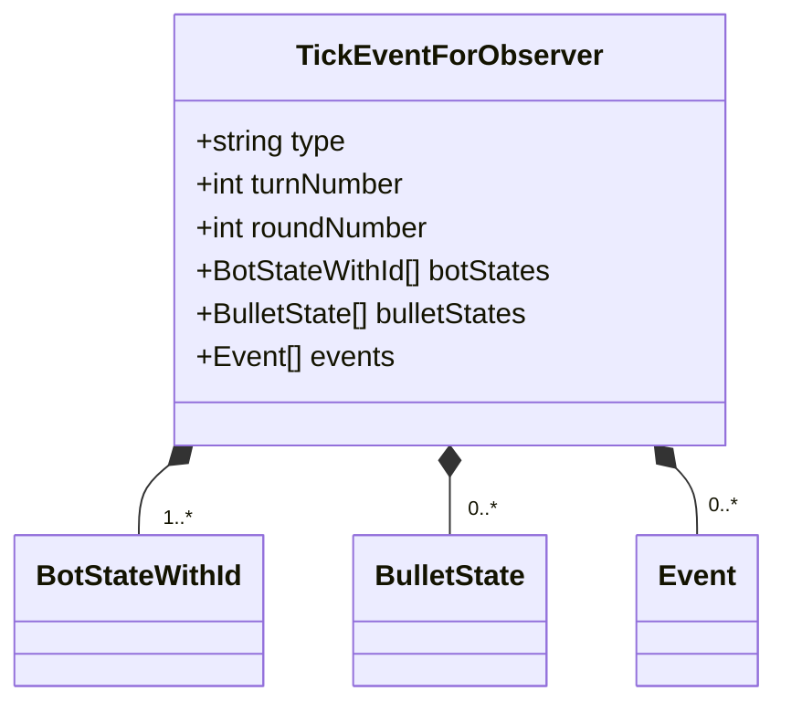

**Key Difference from Bot Tick:**
- `botStates` is an array with ALL bots (observers see everything)
- Each bot state includes `id` field
- Events include all events for all bots

---

### Skipped Turn

**Schema:** [`skipped-turn-event.schema.yaml`](../../../../schema/schemas/skipped-turn-event.schema.yaml)

**Recipients:** Bot that skipped

**Purpose:** Notify bot it failed to respond in time

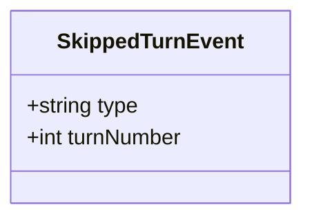

**Cause:** Bot didn't send [`bot-intent`](../../../../schema/schemas/bot-intent.schema.yaml) within turn timeout

---

## Bot Gameplay Events

### Scanned Bot

**Schema:** [`scanned-bot-event.schema.yaml`](../../../../schema/schemas/scanned-bot-event.schema.yaml)

**Recipients:** Bot that performed scan

**Purpose:** Radar detected another bot

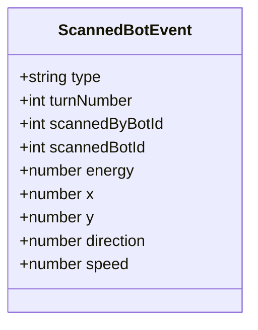

**Example:**
```json
{
  "type": "scanned-bot-event",
  "turnNumber": 42,
  "scannedByBotId": 1,
  "scannedBotId": 2,
  "energy": 72.0,
  "x": 500.0,
  "y": 350.0,
  "direction": 180.0,
  "speed": 5.0
}
```

**Embedded in:** [`tick-event-for-bot`](../../../../schema/schemas/tick-event-for-bot.schema.yaml) `.events[]`

---

### Hit by Bullet

**Schema:** [`hit-by-bullet-event.schema.yaml`](../../../../schema/schemas/hit-by-bullet-event.schema.yaml)

**Recipients:** Bot that got hit

**Purpose:** Bot took damage from bullet

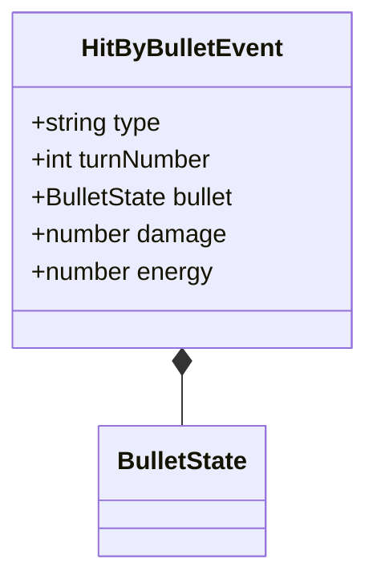

**Example:**
```json
{
  "type": "hit-by-bullet-event",
  "turnNumber": 42,
  "bullet": {
    "bulletId": 5,
    "ownerId": 2,
    "power": 3.0,
    "x": 400.0,
    "y": 300.0,
    "direction": 270.0,
    "speed": 20.0
  },
  "damage": 12.0,
  "energy": 73.5
}
```

---

### Bullet Fired

**Schema:** [`bullet-fired-event.schema.yaml`](../../../../schema/schemas/bullet-fired-event.schema.yaml)

**Recipients:** Bot that fired

**Purpose:** Confirm bullet was fired

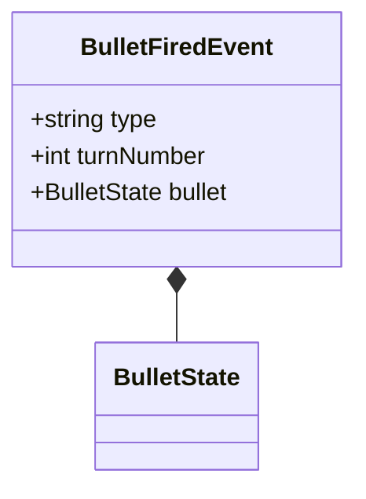

---

### Bullet Hit Bot

**Schema:** [`bullet-hit-bot-event.schema.yaml`](../../../../schema/schemas/bullet-hit-bot-event.schema.yaml)

**Recipients:** Bot that fired the bullet

**Purpose:** Bot's bullet hit another bot

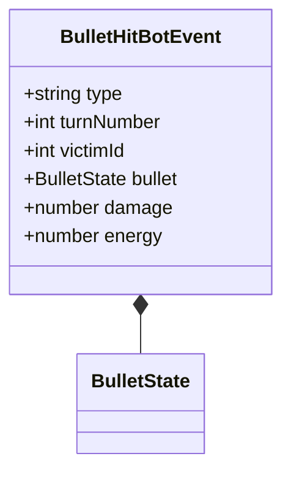

---

### Bullet Hit Bullet

**Schema:** [`bullet-hit-bullet-event.schema.yaml`](../../../../schema/schemas/bullet-hit-bullet-event.schema.yaml)

**Recipients:** Bot that fired the bullet

**Purpose:** Bot's bullet collided with another bullet

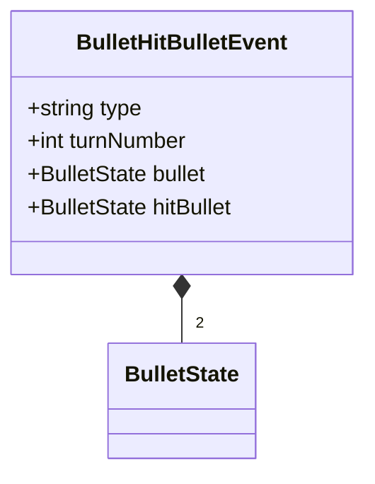

---

### Bullet Hit Wall

**Schema:** [`bullet-hit-wall-event.schema.yaml`](../../../../schema/schemas/bullet-hit-wall-event.schema.yaml)

**Recipients:** Bot that fired the bullet

**Purpose:** Bot's bullet hit arena wall

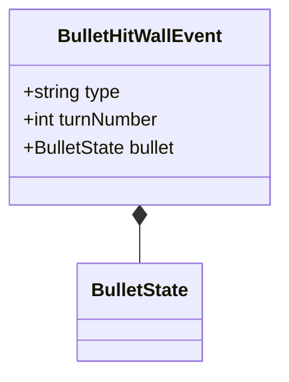

---

### Bot Hit Bot

**Schema:** [`bot-hit-bot-event.schema.yaml`](../../../../schema/schemas/bot-hit-bot-event.schema.yaml)

**Recipients:** Bot that collided

**Purpose:** Bot collided with another bot

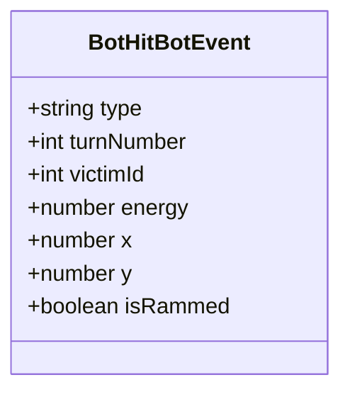

**Fields:**
- `victimId` — ID of bot that was hit
- `isRammed` — `true` if collision was intentional (ramming attack)

---

### Bot Hit Wall

**Schema:** [`bot-hit-wall-event.schema.yaml`](../../../../schema/schemas/bot-hit-wall-event.schema.yaml)

**Recipients:** Bot that collided

**Purpose:** Bot collided with arena wall

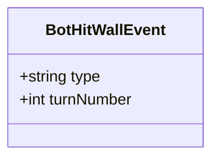

---

### Bot Death

**Schema:** [`bot-death-event.schema.yaml`](../../../../schema/schemas/bot-death-event.schema.yaml)

**Recipients:** Bot that died

**Purpose:** Bot energy reached zero (destroyed)

```mermaid
classDiagram
    class BotDeathEvent {
        +string type
        +int turnNumber
    }
```

---

## Team Events

### Team Message

**Schema:** [`team-message-event.schema.yaml`](../../../../schema/schemas/team-message-event.schema.yaml)

**Recipients:** Teammate bot

**Purpose:** Deliver message from teammate

```mermaid
classDiagram
    class TeamMessageEvent {
        +string type
        +int turnNumber
        +string message
        +int senderId
    }
```

**Example:**
```json
{
  "type": "team-message-event",
  "turnNumber": 42,
  "message": "Enemy at (500, 300)",
  "senderId": 2
}
```

---

## Meta Events

### Bot List Update

**Schema:** [`bot-list-update.schema.yaml`](../../../../schema/schemas/bot-list-update.schema.yaml)

**Recipients:** Observers, Controllers

**Purpose:** Notify that available bots changed (bot joined/left lobby)

```mermaid
classDiagram
    class BotListUpdate {
        +string type
        +BotInfo[] bots
    }
    
    BotListUpdate *-- "0..*" BotInfo
```

---

### TPS Changed

**Schema:** [`tps-changed-event.schema.yaml`](../../../../schema/schemas/tps-changed-event.schema.yaml)

**Recipients:** Observers, Controllers

**Purpose:** Notify that turns per second changed

```mermaid
classDiagram
    class TpsChangedEvent {
        +string type
        +int tps
    }
```

**Example:**
```json
{
  "type": "tps-changed-event",
  "tps": 60
}
```

---

## Event Flow Examples

### Turn Execution with Multiple Events

```mermaid
sequenceDiagram
    participant Server
    participant Bot1
    participant Bot2
    
    Note over Server: Turn 42 begins
    
    Server->>Bot1: tick-event-for-bot {turn: 42, events: [scanned-bot, hit-by-bullet]}
    Server->>Bot2: tick-event-for-bot {turn: 42, events: [bullet-hit-bot]}
    
    Bot1->>Bot1: Process: I scanned Bot2 AND got hit
    Bot2->>Bot2: Process: My bullet hit Bot1
    
    Bot1->>Server: bot-intent {firepower: 3, turnRate: 10}
    Bot2->>Server: bot-intent {speed: 5, radarTurnRate: 20}
    
    Note over Server: Calculate turn 43...
```

### Battle Lifecycle Events

```mermaid
sequenceDiagram
    participant Controller
    participant Server
    participant Bot
    participant Observer
    
    Controller->>Server: start-game
    
    Server->>Bot: game-started-event-for-bot
    Server->>Observer: game-started-event-for-observer
    
    Bot->>Server: bot-ready
    
    Server->>Bot: round-started-event {round: 1}
    Server->>Observer: round-started-event {round: 1}
    
    loop Each turn
        Server->>Bot: tick-event-for-bot
        Server->>Observer: tick-event-for-observer
    end
    
    Server->>Bot: won-round-event
    Server->>Bot: round-ended-event-for-bot
    Server->>Observer: round-ended-event-for-observer
    
    Server->>Bot: game-ended-event-for-bot
    Server->>Observer: game-ended-event-for-observer
```

---

## Related Schemas

### Game Lifecycle
- [game-started-event-for-bot.schema.yaml](../../../../schema/schemas/game-started-event-for-bot.schema.yaml)
- [game-started-event-for-observer.schema.yaml](../../../../schema/schemas/game-started-event-for-observer.schema.yaml)
- [game-ended-event-for-bot.schema.yaml](../../../../schema/schemas/game-ended-event-for-bot.schema.yaml)
- [game-ended-event-for-observer.schema.yaml](../../../../schema/schemas/game-ended-event-for-observer.schema.yaml)
- [game-aborted-event.schema.yaml](../../../../schema/schemas/game-aborted-event.schema.yaml)
- [game-paused-event-for-observer.schema.yaml](../../../../schema/schemas/game-paused-event-for-observer.schema.yaml)
- [game-resumed-event-for-observer.schema.yaml](../../../../schema/schemas/game-resumed-event-for-observer.schema.yaml)

### Round Events
- [round-started-event.schema.yaml](../../../../schema/schemas/round-started-event.schema.yaml)
- [round-ended-event-for-bot.schema.yaml](../../../../schema/schemas/round-ended-event-for-bot.schema.yaml)
- [round-ended-event-for-observer.schema.yaml](../../../../schema/schemas/round-ended-event-for-observer.schema.yaml)
- [won-round-event.schema.yaml](../../../../schema/schemas/won-round-event.schema.yaml)

### Turn Events
- [tick-event-for-bot.schema.yaml](../../../../schema/schemas/tick-event-for-bot.schema.yaml)
- [tick-event-for-observer.schema.yaml](../../../../schema/schemas/tick-event-for-observer.schema.yaml)
- [skipped-turn-event.schema.yaml](../../../../schema/schemas/skipped-turn-event.schema.yaml)

### Bot Gameplay Events
- [scanned-bot-event.schema.yaml](../../../../schema/schemas/scanned-bot-event.schema.yaml)
- [hit-by-bullet-event.schema.yaml](../../../../schema/schemas/hit-by-bullet-event.schema.yaml)
- [bullet-fired-event.schema.yaml](../../../../schema/schemas/bullet-fired-event.schema.yaml)
- [bullet-hit-bot-event.schema.yaml](../../../../schema/schemas/bullet-hit-bot-event.schema.yaml)
- [bullet-hit-bullet-event.schema.yaml](../../../../schema/schemas/bullet-hit-bullet-event.schema.yaml)
- [bullet-hit-wall-event.schema.yaml](../../../../schema/schemas/bullet-hit-wall-event.schema.yaml)
- [bot-hit-bot-event.schema.yaml](../../../../schema/schemas/bot-hit-bot-event.schema.yaml)
- [bot-hit-wall-event.schema.yaml](../../../../schema/schemas/bot-hit-wall-event.schema.yaml)
- [bot-death-event.schema.yaml](../../../../schema/schemas/bot-death-event.schema.yaml)

### Team Events
- [team-message-event.schema.yaml](../../../../schema/schemas/team-message-event.schema.yaml)

### Meta Events
- [bot-list-update.schema.yaml](../../../../schema/schemas/bot-list-update.schema.yaml)
- [tps-changed-event.schema.yaml](../../../../schema/schemas/tps-changed-event.schema.yaml)

---

## Related Documentation

- [Message Schema Overview](./README.md)
- [Handshakes](./handshakes.md)
- [Commands](./commands.md)
- [Intents](./intents.md)
- [State Objects](./state.md)
- [Turn Execution Flow](../flows/turn-execution.md)
- [Battle Lifecycle Flow](../flows/battle-lifecycle.md)

---

**Last Updated:** 2026-02-12

