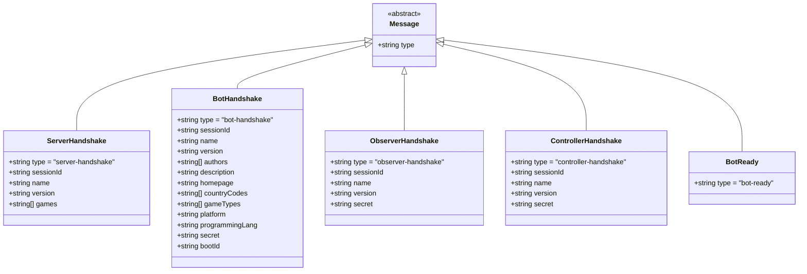

# Handshake Messages

Handshakes establish WebSocket connections and authenticate clients with the server.

## Overview

The handshake process follows this pattern:

1. **Client opens WebSocket connection**
2. **Server sends** [`server-handshake`](../../../../schema/schemas/server-handshake.schema.yaml) with `sessionId`
3. **Client sends** type-specific handshake ([`bot-handshake`](../../../../schema/schemas/bot-handshake.schema.yaml), [`observer-handshake`](../../../../schema/schemas/observer-handshake.schema.yaml), or [`controller-handshake`](../../../../schema/schemas/controller-handshake.schema.yaml))
4. **Server validates** credentials and accepts/rejects connection


---

## Server-Generated Identifiers

**All UUIDs are generated by the server** to ensure uniqueness and prevent spoofing.

### UUID Lifecycle


### Identifier Reference

| Identifier | Type | Generated When | Provided Via | Scope | Purpose |
|------------|------|----------------|--------------|-------|---------|
| `sessionId` | string (UUID) | WebSocket opened | [server-handshake](../../../../schema/schemas/server-handshake.schema.yaml) | Connection lifetime | Authenticates client in all subsequent messages |
| `battleId` | string (UUID) | Battle started | [game-started-event-for-bot](../../../../schema/schemas/game-started-event-for-bot.schema.yaml) | Single battle | Identifies specific battle instance |
| `botId` | integer | Bot joins battle | [participant](../../../../schema/schemas/participant.schema.yaml) in game-started events | Single battle | Identifies bot within battle (1, 2, 3...) |

**Security Note:** Bots receive their own `botId` but should never discover opponent `botId` values before scanning them.

---

## Schema Definitions

### Message Hierarchy



---

## 1. Server Handshake

**Schema:** [`server-handshake.schema.yaml`](../../../../schema/schemas/server-handshake.schema.yaml)

**Direction:** Server → Client (all types)

**When:** Immediately after WebSocket connection established

**Purpose:** Server identifies itself and provides `sessionId` for client authentication

### Structure


### Example

```json
{
  "type": "server-handshake",
  "sessionId": "550e8400-e29b-41d4-a716-446655440000",
  "name": "Robocode Tank Royale Server",
  "version": "0.25.0",
  "games": ["melee", "1v1", "classic"]
}
```

### Fields

| Field | Type | Required | Description |
|-------|------|----------|-------------|
| `type` | string | ✅ | Always `"server-handshake"` |
| `sessionId` | string | ✅ | UUID identifying this connection session |
| `name` | string | ✅ | Server name |
| `version` | string | ✅ | Server version (semver) |
| `games` | string[] | ✅ | Supported game types |

---

## 2. Bot Handshake

**Schema:** [`bot-handshake.schema.yaml`](../../../../schema/schemas/bot-handshake.schema.yaml)

**Direction:** Bot → Server

**When:** After receiving `server-handshake`

**Purpose:** Bot registers with server and provides metadata

### Structure


### Example

```json
{
  "type": "bot-handshake",
  "sessionId": "550e8400-e29b-41d4-a716-446655440000",
  "name": "Killer Bee",
  "version": "2.1.0",
  "authors": ["Jane Doe", "John Smith"],
  "description": "Aggressive close-combat bot with radar lock",
  "homepage": "https://github.com/example/killer-bee",
  "countryCodes": ["US", "DK"],
  "gameTypes": ["melee", "1v1"],
  "platform": "JVM 17",
  "programmingLang": "Java 17",
  "initialPosition": "x=100,y=100,direction=90",
  "secret": "my-secret-token",
  "bootId": "boot-12345"
}
```

### Fields

| Field | Type | Required | Max Length | Description |
|-------|------|----------|------------|-------------|
| `type` | string | ✅ | - | Always `"bot-handshake"` |
| `sessionId` | string | ✅ | - | Must match sessionId from server-handshake |
| `name` | string | ✅ | 30 | Bot name (displayed in UI) |
| `version` | string | ✅ | 20 | Bot version (semver recommended) |
| `authors` | string[] | ✅ | 5 items, 50 chars each | Author names/emails |
| `description` | string | ❌ | 250 | Short bot description |
| `homepage` | string | ❌ | 150 | Bot homepage URL |
| `countryCodes` | string[] | ❌ | 2-letter ISO 3166-1 codes | Country codes (e.g., "US", "GB") |
| `gameTypes` | string[] | ✅ | 10 items, 20 chars each | Supported game types |
| `platform` | string | ❌ | 50 | Runtime platform (e.g., "JVM 17", ".NET 6") |
| `programmingLang` | string | ❌ | 30 | Programming language |
| `initialPosition` | string | ❌ | - | Requested starting position |
| `secret` | string | ❌ | - | Server authentication token (if required) |
| `bootId` | string | ❌ | - | Booter session ID (if launched by Booter) |

**Validation Notes:**
- `name` must be unique among connected bots
- `sessionId` must exactly match the one received in `server-handshake`
- `countryCodes` must follow ISO 3166-1 alpha-2 format

---

## 3. Observer Handshake

**Schema:** [`observer-handshake.schema.yaml`](../../../../schema/schemas/observer-handshake.schema.yaml)

**Direction:** Observer → Server

**When:** After receiving `server-handshake`

**Purpose:** Observer registers to receive full battle state updates

### Structure


### Example

```json
{
  "type": "observer-handshake",
  "sessionId": "550e8400-e29b-41d4-a716-446655440000",
  "name": "GUI Observer",
  "version": "0.25.0",
  "secret": "observer-secret-token"
}
```

### Fields

| Field | Type | Required | Description |
|-------|------|----------|-------------|
| `type` | string | ✅ | Always `"observer-handshake"` |
| `sessionId` | string | ✅ | Must match sessionId from server-handshake |
| `name` | string | ✅ | Observer name |
| `version` | string | ✅ | Observer version |
| `secret` | string | ❌ | Server authentication token (if required) |

---

## 4. Controller Handshake

**Schema:** [`controller-handshake.schema.yaml`](../../../../schema/schemas/controller-handshake.schema.yaml)

**Direction:** Controller → Server

**When:** After receiving `server-handshake`

**Purpose:** Controller registers to send game control commands

### Structure


### Example

```json
{
  "type": "controller-handshake",
  "sessionId": "550e8400-e29b-41d4-a716-446655440000",
  "name": "Game Controller",
  "version": "0.25.0",
  "secret": "controller-secret-token"
}
```

### Fields

| Field | Type | Required | Description |
|-------|------|----------|-------------|
| `type` | string | ✅ | Always `"controller-handshake"` |
| `sessionId` | string | ✅ | Must match sessionId from server-handshake |
| `name` | string | ✅ | Controller name |
| `version` | string | ✅ | Controller version |
| `secret` | string | ❌ | Server authentication token (if required) |

---

## 5. Bot Ready

**Schema:** [`bot-ready.schema.yaml`](../../../../schema/schemas/bot-ready.schema.yaml)

**Direction:** Bot → Server

**When:** After receiving [`game-started-event-for-bot`](../../../../schema/schemas/game-started-event-for-bot.schema.yaml)

**Purpose:** Bot signals it has initialized and is ready to start battle

### Structure


### Example

```json
{
  "type": "bot-ready"
}
```

### Fields

| Field | Type | Required | Description |
|-------|------|----------|-------------|
| `type` | string | ✅ | Always `"bot-ready"` |

**Note:** Server waits for all participating bots to send `bot-ready` before starting turn execution. If a bot fails to respond within the timeout period, it may be excluded from the battle.

---

## Connection Flow Examples

### Bot Connection Flow


### Observer Connection Flow


### Multiple Client Connections


---

## Error Handling

### Invalid SessionId

```json
// Client sends wrong sessionId
{
  "type": "bot-handshake",
  "sessionId": "wrong-session-id",
  "name": "MyBot"
}

// Server response: WebSocket disconnect (no error message)
```

### Invalid Secret

```json
// Client sends wrong secret (if server requires authentication)
{
  "type": "bot-handshake",
  "sessionId": "abc-123",
  "name": "MyBot",
  "secret": "wrong-secret"
}

// Server response: WebSocket disconnect
```

### Duplicate Bot Name

```json
// Bot2 tries to use same name as Bot1
{
  "type": "bot-handshake",
  "sessionId": "xyz-789",
  "name": "MyBot"  // Already taken by Bot1
}

// Server response: WebSocket disconnect
```

### Missing Required Fields

```json
// Missing required 'name' field
{
  "type": "bot-handshake",
  "sessionId": "abc-123",
  "version": "1.0"
}

// Server response: WebSocket disconnect
```

---

## Best Practices

### For Bot Developers

1. **Store sessionId** — Save the `sessionId` from `server-handshake` to use in your `bot-handshake`
2. **Timeout handling** — Implement connection timeout (e.g., 30 seconds) if handshake doesn't complete
3. **Reconnection logic** — Handle disconnects gracefully and allow reconnection attempts
4. **Validate schema** — Ensure your handshake messages conform to the schema before sending

### For Server Implementors

1. **Generate unique sessionIds** — Use UUID v4 or similar for collision resistance
2. **Validate immediately** — Reject invalid handshakes quickly to free resources
3. **Rate limiting** — Prevent spam connections from overwhelming the server
4. **Secret storage** — Use secure storage (environment variables, secrets manager) for authentication tokens

---

## Related Schemas

- [server-handshake.schema.yaml](../../../../schema/schemas/server-handshake.schema.yaml)
- [bot-handshake.schema.yaml](../../../../schema/schemas/bot-handshake.schema.yaml)
- [observer-handshake.schema.yaml](../../../../schema/schemas/observer-handshake.schema.yaml)
- [controller-handshake.schema.yaml](../../../../schema/schemas/controller-handshake.schema.yaml)
- [bot-ready.schema.yaml](../../../../schema/schemas/bot-ready.schema.yaml)
- [bot-list-update.schema.yaml](../../../../schema/schemas/bot-list-update.schema.yaml)

---

## Related Documentation

- [Message Schema Overview](./README.md)
- [Bot Connection Flow](../flows/bot-connection.md)
- [Commands](./commands.md)
- [Events](./events.md)

---

**Last Updated:** 2026-02-12

