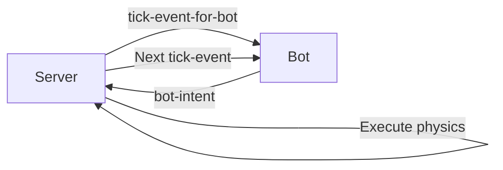
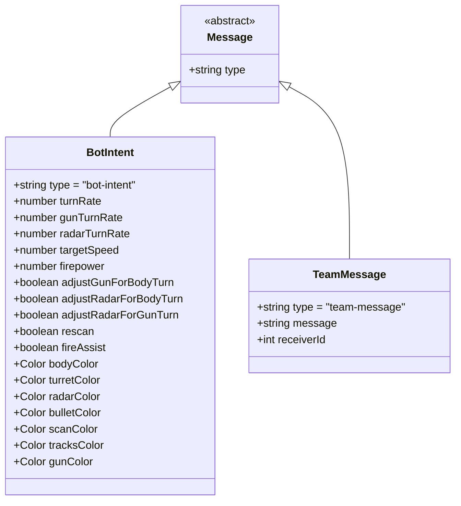
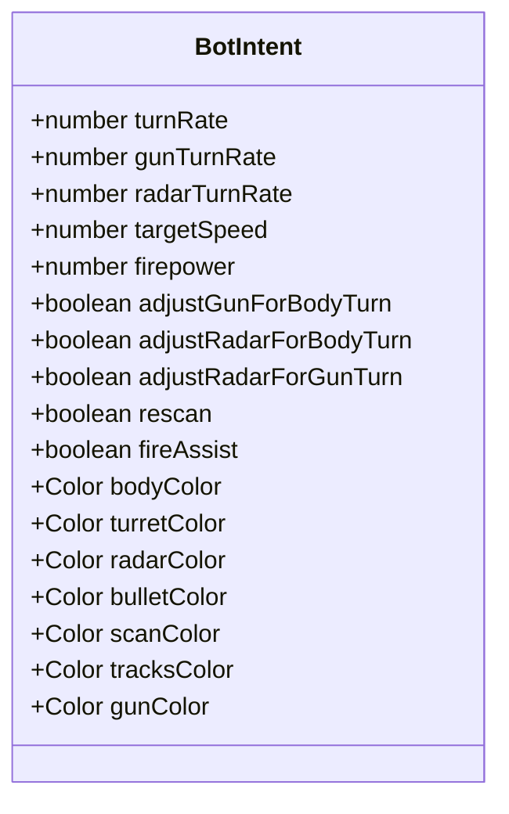
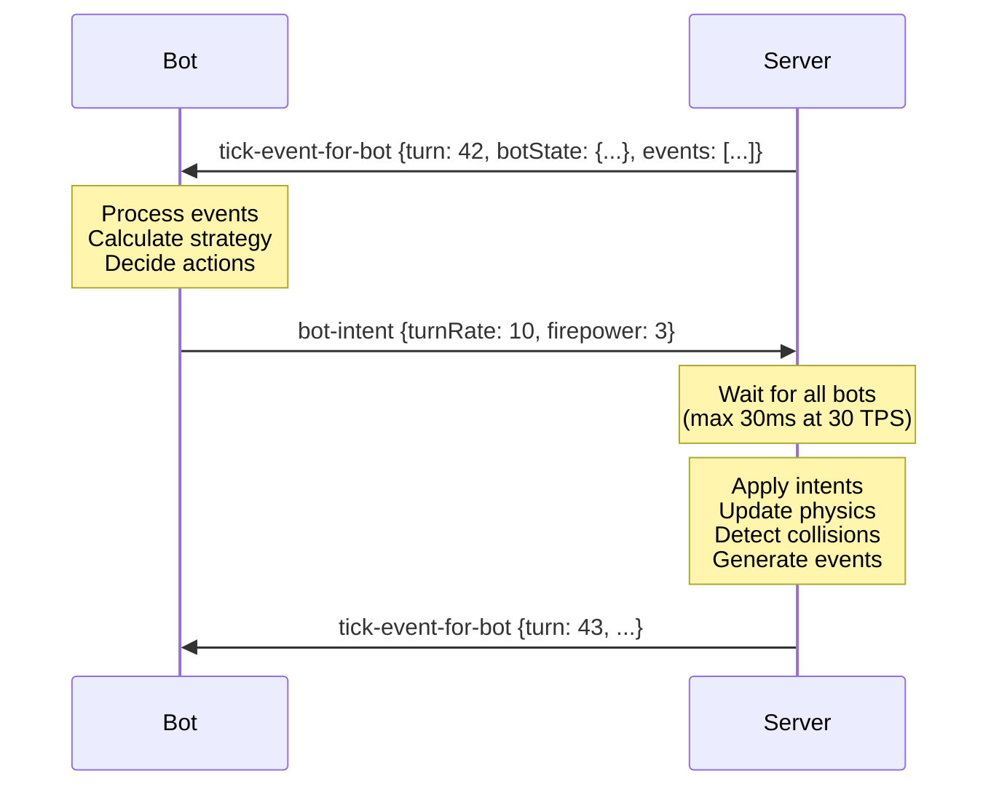
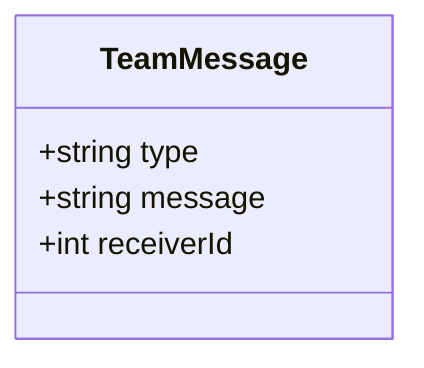

# Intent Messages

Intents are action requests sent by bots to the server to control their behavior for the next turn.

## Overview

Bots send intents in response to tick events to declare desired actions:



**Key Characteristics:**
- **Sender:** Bot only
- **Receiver:** Server
- **Purpose:** Declare desired movement, rotation, firing, and cosmetic changes
- **Timing:** Sent in response to each [`tick-event-for-bot`](../../../../schema/schemas/tick-event-for-bot.schema.yaml)
- **Optional Fields:** Only changed values need to be sent (defaults persist)

---

## Intent Schema

### Message Hierarchy



---

## 1. Bot Intent

**Schema:** [`bot-intent.schema.yaml`](../../../../schema/schemas/bot-intent.schema.yaml)

**Direction:** Bot → Server

**When:** Every turn (in response to [`tick-event-for-bot`](../../../../schema/schemas/tick-event-for-bot.schema.yaml))

**Purpose:** Declare bot's desired actions for next turn

### Structure



### Example

```json
{
  "type": "bot-intent",
  "turnRate": 10.0,
  "gunTurnRate": 15.0,
  "radarTurnRate": 45.0,
  "targetSpeed": 5.0,
  "firepower": 3.0,
  "adjustGunForBodyTurn": true,
  "adjustRadarForGunTurn": true,
  "bodyColor": {"red": 255, "green": 0, "blue": 0}
}
```

### Fields

#### Movement & Rotation

| Field | Type | Range | Default | Description |
|-------|------|-------|---------|-------------|
| `turnRate` | number | -10.0 to +10.0 | 0.0 | Body turn rate (degrees/turn), clamped by speed |
| `gunTurnRate` | number | -20.0 to +20.0 | 0.0 | Gun turn rate (degrees/turn) |
| `radarTurnRate` | number | -45.0 to +45.0 | 0.0 | Radar turn rate (degrees/turn) |
| `targetSpeed` | number | -8.0 to +8.0 | 0.0 | Desired speed (units/turn) |

**Notes:**
- Negative `turnRate` = counterclockwise, Positive = clockwise
- Negative `targetSpeed` = reverse, Positive = forward
- Server applies acceleration/deceleration (can't instantly change speed)
- Actual turn rate limited by current speed (fast bots turn slower)

#### Firing

| Field | Type | Range | Default | Description |
|-------|------|-------|---------|-------------|
| `firepower` | number | 0.1 to 3.0 | null | Bullet power (0.1 = weak, 3.0 = strong) |

**Firing Rules:**
- Gun must be cool (`gunHeat == 0`)
- Bot must have energy ≥ firepower
- Firepower < 0.1 = no shot fired
- Firepower > 3.0 = clamped to 3.0
- Omitting field = don't fire

**Damage Formula:**
```
damage = 4 * firepower
if firepower > 1.0:
    damage += 2 * (firepower - 1.0)
```

**Energy Cost:**
```
energy_cost = firepower
```

**Gun Heat Added:**
```
gun_heat = 1.0 + (firepower / 5.0)
```

#### Adjustment Flags

| Field | Type | Default | Description |
|-------|------|---------|-------------|
| `adjustGunForBodyTurn` | boolean | false | Keep gun direction fixed while body rotates |
| `adjustRadarForBodyTurn` | boolean | false | Keep radar direction fixed while body rotates |
| `adjustRadarForGunTurn` | boolean | false | Keep radar direction fixed while gun rotates |

**Example:**
```
// Bot turns right 10°, gun turns left 10° relative to body
// → Gun stays pointing same absolute direction
adjustGunForBodyTurn = true
turnRate = 10.0
gunTurnRate = -10.0
```

#### Scanning

| Field | Type | Default | Description |
|-------|------|---------|-------------|
| `rescan` | boolean | false | Repeat previous radar scan (same direction/sweep) |
| `fireAssist` | boolean | true | Enable aim assist (slight bullet speed boost) |

#### Colors (Cosmetic)

| Field | Type | Description |
|-------|------|-------------|
| `bodyColor` | [Color](../../../../schema/schemas/color.schema.yaml) | RGB color of body |
| `turretColor` | [Color](../../../../schema/schemas/color.schema.yaml) | RGB color of gun turret |
| `radarColor` | [Color](../../../../schema/schemas/color.schema.yaml) | RGB color of radar |
| `bulletColor` | [Color](../../../../schema/schemas/color.schema.yaml) | RGB color of bullets (future shots) |
| `scanColor` | [Color](../../../../schema/schemas/color.schema.yaml) | RGB color of scan arc |
| `tracksColor` | [Color](../../../../schema/schemas/color.schema.yaml) | RGB color of tracks |
| `gunColor` | [Color](../../../../schema/schemas/color.schema.yaml) | RGB color of gun |

**Color Format:**
```json
{
  "red": 255,
  "green": 128,
  "blue": 0
}
```

---

### Field Persistence

**Important:** Fields persist across turns unless explicitly changed.

```javascript
// Turn 1
{
  "type": "bot-intent",
  "targetSpeed": 5.0,
  "turnRate": 10.0
}

// Turn 2 (only changing turnRate)
{
  "type": "bot-intent",
  "turnRate": -10.0
}
// → targetSpeed still 5.0 (persists from turn 1)

// Turn 3 (stopping)
{
  "type": "bot-intent",
  "targetSpeed": 0.0
}
// → turnRate still -10.0 (persists from turn 2)
```

**Best Practice:** Only send fields you want to change.

---

### Turn Execution Flow



---

### Example Scenarios

#### Scenario 1: Simple Movement

```json
{
  "type": "bot-intent",
  "targetSpeed": 8.0,
  "turnRate": 0.0
}
```
**Result:** Bot accelerates forward in straight line

---

#### Scenario 2: Circular Motion

```json
{
  "type": "bot-intent",
  "targetSpeed": 5.0,
  "turnRate": 10.0
}
```
**Result:** Bot drives in clockwise circle

---

#### Scenario 3: Lock Radar on Target

```json
{
  "type": "bot-intent",
  "turnRate": 10.0,
  "radarTurnRate": 20.0,
  "adjustRadarForBodyTurn": true
}
```
**Result:** Radar rotates 30° absolute (20° + 10° body compensation)

---

#### Scenario 4: Fire While Turning

```json
{
  "type": "bot-intent",
  "turnRate": 10.0,
  "gunTurnRate": -10.0,
  "adjustGunForBodyTurn": true,
  "firepower": 3.0
}
```
**Result:** Body turns, gun stays fixed direction, fires powerful bullet

---

#### Scenario 5: Emergency Stop & Scan

```json
{
  "type": "bot-intent",
  "targetSpeed": 0.0,
  "radarTurnRate": 45.0,
  "rescan": false
}
```
**Result:** Bot decelerates to stop, spins radar at max speed

---

#### Scenario 6: Color Change

```json
{
  "type": "bot-intent",
  "bodyColor": {"red": 255, "green": 0, "blue": 0},
  "bulletColor": {"red": 255, "green": 255, "blue": 0}
}
```
**Result:** Bot turns red, future bullets will be yellow

---

### Missing Intent (Skipped Turn)

If bot fails to send intent within turn timeout:

1. Server uses **previous intent values** (fields persist)
2. Server sends [`skipped-turn-event`](../../../../schema/schemas/skipped-turn-event.schema.yaml) to bot
3. After multiple skipped turns → bot may be destroyed (inactivity timeout)

---

## 2. Team Message

**Schema:** [`team-message.schema.yaml`](../../../../schema/schemas/team-message.schema.yaml)

**Direction:** Bot → Server → Teammate Bot

**When:** Any time during battle (typically sent with bot-intent)

**Purpose:** Send message to teammate in team battle

### Structure



### Example

```json
{
  "type": "team-message",
  "message": "Enemy at (500, 300), energy 45",
  "receiverId": 2
}
```

### Fields

| Field | Type | Required | Description |
|-------|------|----------|-------------|
| `type` | string | ✅ | Always `"team-message"` |
| `message` | string | ✅ | Message content (serialized data) |
| `receiverId` | integer | ✅ | Bot ID of teammate to receive message |

### Server Processing

1. Bot sends `team-message`
2. Server validates sender and receiver are on same team
3. Server delivers message via [`team-message-event`](../../../../schema/schemas/team-message-event.schema.yaml) to receiving bot
4. Delivered in next turn's [`tick-event-for-bot`](../../../../schema/schemas/tick-event-for-bot.schema.yaml) `.events[]`

### Example Usage

```javascript
// Bot 1 (sender)
if (scannedEnemy) {
  sendMessage({
    type: "team-message",
    message: JSON.stringify({
      type: "enemy-spotted",
      x: enemy.x,
      y: enemy.y,
      energy: enemy.energy
    }),
    receiverId: teammateId
  });
}

// Bot 2 (receiver, next turn)
onTeamMessageEvent(event) {
  const data = JSON.parse(event.message);
  if (data.type === "enemy-spotted") {
    targetX = data.x;
    targetY = data.y;
  }
}
```

---

## Intent Best Practices

### For Bot Developers

1. **Send intents every turn** — Even if no changes, send empty intent `{"type": "bot-intent"}` to avoid timeout
2. **Minimal updates** — Only include changed fields to reduce message size
3. **Pre-calculate** — Compute strategy before turn timeout (30ms at 30 TPS)
4. **Handle skipped turns** — Gracefully recover if turn is skipped
5. **Validate values** — Clamp values to valid ranges before sending

### Performance Tips

1. **Avoid complex calculations** — Keep turn logic under 20ms
2. **Cache static data** — Don't recalculate arena dimensions every turn
3. **Early intent sending** — Send intent as soon as calculated (don't wait until timeout)
4. **Batch team messages** — Don't send multiple messages per turn

### Common Mistakes

❌ **Sending absolute directions instead of turn rates**
```json
// Wrong: Setting gunDirection = 90
{"gunTurnRate": 90}  // This rotates 90°, not to 90°
```

✅ **Calculate relative turn needed**
```javascript
const targetDirection = 90;
const currentDirection = botState.gunDirection;
const turnNeeded = normalizeAngle(targetDirection - currentDirection);
intent.gunTurnRate = clamp(turnNeeded, -20, 20);
```

---

❌ **Forgetting adjustment flags**
```json
// Body turns right 10°, gun should stay fixed
{"turnRate": 10, "gunTurnRate": 0}  // Gun rotates with body!
```

✅ **Enable adjustment flag**
```json
{
  "turnRate": 10,
  "gunTurnRate": -10,
  "adjustGunForBodyTurn": true
}
```

---

❌ **Setting firepower every turn**
```json
// Bot fires every single turn (wastes energy, can't fire while cooling)
{"firepower": 3.0}
```

✅ **Only fire when gun is cool**
```javascript
if (botState.gunHeat === 0 && targetLocked) {
  intent.firepower = 3.0;
}
// Otherwise omit firepower field
```

---

## Related Schemas

- [bot-intent.schema.yaml](../../../../schema/schemas/bot-intent.schema.yaml)
- [team-message.schema.yaml](../../../../schema/schemas/team-message.schema.yaml)
- [color.schema.yaml](../../../../schema/schemas/color.schema.yaml)

---

## Related Documentation

- [Message Schema Overview](./README.md)
- [Events](./events.md) — Tick events that trigger intents
- [State Objects](./state.md) — Bot state provided in tick events
- [Turn Execution Flow](../flows/turn-execution.md) — How intents are processed
- [Battle Lifecycle Flow](../flows/battle-lifecycle.md)

---

**Last Updated:** 2026-02-12

