# State Objects (Data Transfer Objects)

State objects are reusable data structures embedded in events, commands, and intents.

## Overview

State objects represent snapshots of game entities and configuration:

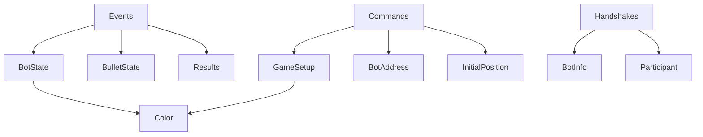

**Key Characteristics:**
- **Not standalone messages** — Embedded in other messages
- **Read-only snapshots** — Represent state at specific moment
- **Reusable** — Same structure used across multiple message types
- **Validation** — Defined schemas ensure consistency

---

## State Object Categories

### 1. Bot State Objects
Represent bot position, energy, direction

### 2. Bullet State Objects
Represent bullet position, power, ownership

### 3. Game Configuration Objects
Arena settings, rules, game type

### 4. Result Objects
Battle outcomes, statistics

### 5. Metadata Objects
Bot information, participant data

---

## State Object Hierarchy

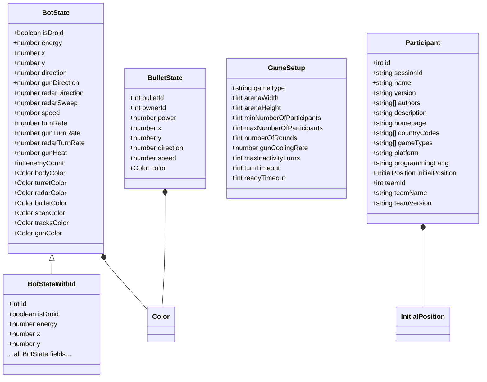

---

## 1. Bot State

**Schema:** [`bot-state.schema.yaml`](../../../../schema/schemas/bot-state.schema.yaml)

**Purpose:** Current state of a bot (without ID for security)

**Used In:** [`tick-event-for-bot`](../../../../schema/schemas/tick-event-for-bot.schema.yaml)

### Structure

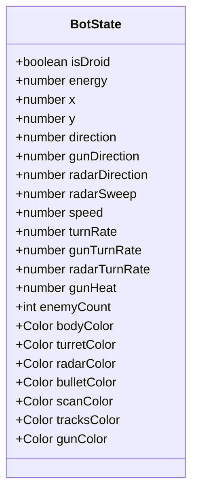

### Example

```json
{
  "isDroid": false,
  "energy": 85.5,
  "x": 400.0,
  "y": 300.0,
  "direction": 45.0,
  "gunDirection": 90.0,
  "radarDirection": 135.0,
  "radarSweep": 45.0,
  "speed": 5.0,
  "turnRate": 10.0,
  "gunTurnRate": 15.0,
  "radarTurnRate": 20.0,
  "gunHeat": 0.5,
  "enemyCount": 2,
  "bodyColor": {"red": 0, "green": 128, "blue": 255}
}
```

### Fields

| Field | Type | Range | Description |
|-------|------|-------|-------------|
| `isDroid` | boolean | - | Droid bot (120 energy, no scanner) |
| `energy` | number | 0-100 (or 120 for droid) | Current energy/health |
| `x` | number | 0 to arenaWidth | X coordinate in arena |
| `y` | number | 0 to arenaHeight | Y coordinate in arena |
| `direction` | number | 0-360 | Body direction (degrees, 0=north) |
| `gunDirection` | number | 0-360 | Gun direction (degrees, 0=north) |
| `radarDirection` | number | 0-360 | Radar direction (degrees, 0=north) |
| `radarSweep` | number | 0-360 | Radar sweep angle this turn |
| `speed` | number | -8 to +8 | Current speed (units/turn) |
| `turnRate` | number | -10 to +10 | Body turn rate (degrees/turn) |
| `gunTurnRate` | number | -20 to +20 | Gun turn rate (degrees/turn) |
| `radarTurnRate` | number | -45 to +45 | Radar turn rate (degrees/turn) |
| `gunHeat` | number | ≥ 0 | Gun cooling (0 = can fire) |
| `enemyCount` | integer | ≥ 0 | Enemies alive in round |
| `bodyColor` | [Color](../../../../schema/schemas/color.schema.yaml) | - | Body color |
| `turretColor` | [Color](../../../../schema/schemas/color.schema.yaml) | - | Turret color |
| `radarColor` | [Color](../../../../schema/schemas/color.schema.yaml) | - | Radar color |
| `bulletColor` | [Color](../../../../schema/schemas/color.schema.yaml) | - | Bullet color |
| `scanColor` | [Color](../../../../schema/schemas/color.schema.yaml) | - | Scan arc color |
| `tracksColor` | [Color](../../../../schema/schemas/color.schema.yaml) | - | Tracks color |
| `gunColor` | [Color](../../../../schema/schemas/color.schema.yaml) | - | Gun color |

**Note:** Bot ID is intentionally omitted to prevent bots from knowing their own ID (security measure).

---

## 2. Bot State With ID

**Schema:** [`bot-state-with-id.schema.yaml`](../../../../schema/schemas/bot-state-with-id.schema.yaml)

**Purpose:** Bot state including bot ID (for observers)

**Used In:** [`tick-event-for-observer`](../../../../schema/schemas/tick-event-for-observer.schema.yaml)

### Structure

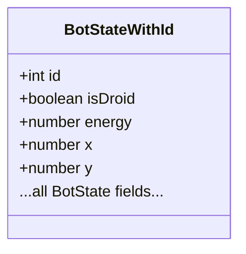

### Example

```json
{
  "id": 1,
  "isDroid": false,
  "energy": 85.5,
  "x": 400.0,
  "y": 300.0,
  "direction": 45.0,
  "gunDirection": 90.0,
  "radarDirection": 135.0
}
```

**Key Difference:** Includes `id` field that identifies which bot this state belongs to.

---

## 3. Bullet State

**Schema:** [`bullet-state.schema.yaml`](../../../../schema/schemas/bullet-state.schema.yaml)

**Purpose:** Current state of a bullet in flight

**Used In:** [`tick-event-for-bot`](../../../../schema/schemas/tick-event-for-bot.schema.yaml), [`tick-event-for-observer`](../../../../schema/schemas/tick-event-for-observer.schema.yaml), bullet hit events

### Structure

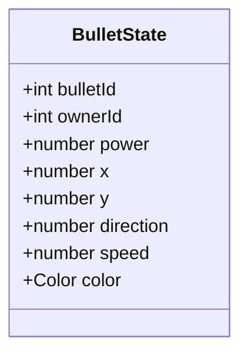

### Example

```json
{
  "bulletId": 5,
  "ownerId": 1,
  "power": 3.0,
  "x": 450.0,
  "y": 320.0,
  "direction": 90.0,
  "speed": 20.0,
  "color": {"red": 255, "green": 255, "blue": 0}
}
```

### Fields

| Field | Type | Range | Description |
|-------|------|-------|-------------|
| `bulletId` | integer | ≥ 1 | Unique bullet identifier (per bot) |
| `ownerId` | integer | ≥ 1 | ID of bot that fired this bullet |
| `power` | number | 0.1-3.0 | Bullet firepower (determines damage) |
| `x` | number | 0 to arenaWidth | X coordinate |
| `y` | number | 0 to arenaHeight | Y coordinate |
| `direction` | number | 0-360 | Direction of travel (degrees) |
| `speed` | number | 11-19.7 | Bullet speed (units/turn, faster for low power) |
| `color` | [Color](../../../../schema/schemas/color.schema.yaml) | - | Bullet color |

**Speed Formula:**
```
speed = 20.0 - (3.0 * power)
// power=0.1 → speed=19.7
// power=3.0 → speed=11.0
```

**Damage Formula:**
```
damage = 4.0 * power
if power > 1.0:
    damage += 2.0 * (power - 1.0)
// power=1.0 → damage=4.0
// power=3.0 → damage=12.0
```

---

## 4. Game Setup

**Schema:** [`game-setup.schema.yaml`](../../../../schema/schemas/game-setup.schema.yaml)

**Purpose:** Battle configuration and rules

**Used In:** [`start-game`](../../../../schema/schemas/start-game.schema.yaml), [`game-started-event-for-bot`](../../../../schema/schemas/game-started-event-for-bot.schema.yaml), [`game-started-event-for-observer`](../../../../schema/schemas/game-started-event-for-observer.schema.yaml)

### Structure

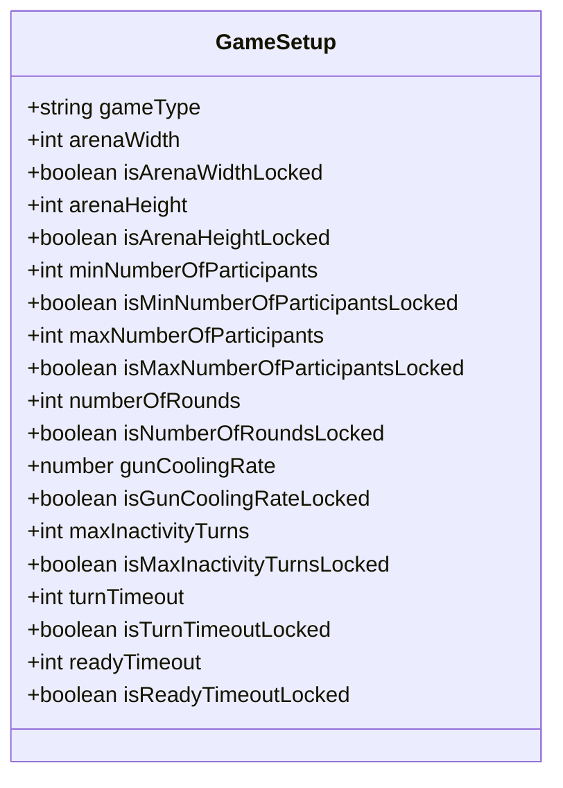

### Example

```json
{
  "gameType": "melee",
  "arenaWidth": 800,
  "isArenaWidthLocked": false,
  "arenaHeight": 600,
  "isArenaHeightLocked": false,
  "minNumberOfParticipants": 2,
  "isMinNumberOfParticipantsLocked": true,
  "maxNumberOfParticipants": 10,
  "isMaxNumberOfParticipantsLocked": false,
  "numberOfRounds": 10,
  "isNumberOfRoundsLocked": false,
  "gunCoolingRate": 0.1,
  "isGunCoolingRateLocked": false,
  "maxInactivityTurns": 450,
  "isMaxInactivityTurnsLocked": false,
  "turnTimeout": 30000,
  "isTurnTimeoutLocked": false,
  "readyTimeout": 10000,
  "isReadyTimeoutLocked": false
}
```

### Fields

| Field | Type | Default | Description |
|-------|------|---------|-------------|
| `gameType` | string | "melee" | Game type ("melee", "1v1", "classic") |
| `arenaWidth` | integer | 800 | Arena width (units) |
| `arenaHeight` | integer | 600 | Arena height (units) |
| `minNumberOfParticipants` | integer | 2 | Minimum bots required |
| `maxNumberOfParticipants` | integer | 10 | Maximum bots allowed |
| `numberOfRounds` | integer | 10 | Number of rounds |
| `gunCoolingRate` | number | 0.1 | Gun heat decrease per turn |
| `maxInactivityTurns` | integer | 450 | Turns before inactivity timeout |
| `turnTimeout` | integer | 30000 | Bot response timeout (milliseconds) |
| `readyTimeout` | integer | 10000 | Bot ready timeout (milliseconds) |

**Lock Fields:** `is*Locked` fields indicate if the value is fixed for this game type.

---

## 5. Participant

**Schema:** [`participant.schema.yaml`](../../../../schema/schemas/participant.schema.yaml)

**Purpose:** Bot participating in a battle

**Used In:** [`game-started-event-for-bot`](../../../../schema/schemas/game-started-event-for-bot.schema.yaml), [`game-started-event-for-observer`](../../../../schema/schemas/game-started-event-for-observer.schema.yaml)

### Structure

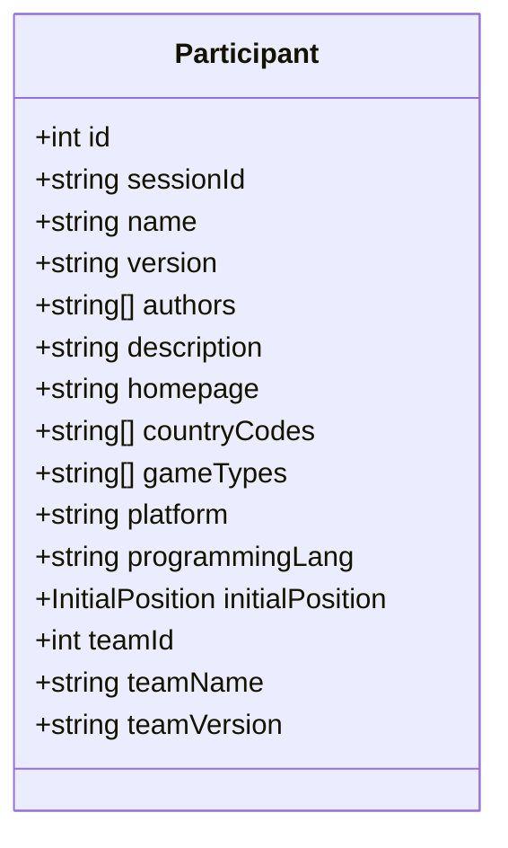

### Example

```json
{
  "id": 1,
  "sessionId": "abc-123-xyz",
  "name": "Killer Bee",
  "version": "2.1.0",
  "authors": ["Jane Doe"],
  "description": "Aggressive close-combat bot",
  "homepage": "https://github.com/example/killer-bee",
  "countryCodes": ["US"],
  "gameTypes": ["melee", "1v1"],
  "platform": "JVM 17",
  "programmingLang": "Java 17",
  "initialPosition": {"x": 100, "y": 100, "direction": 90},
  "teamId": null,
  "teamName": null,
  "teamVersion": null
}
```

### Fields

| Field | Type | Description |
|-------|------|-------------|
| `id` | integer | Bot ID in battle (1, 2, 3...) |
| `sessionId` | string | WebSocket session ID |
| `name` | string | Bot name |
| `version` | string | Bot version |
| `authors` | string[] | Bot authors |
| `description` | string | Bot description |
| `homepage` | string | Bot homepage URL |
| `countryCodes` | string[] | ISO 3166-1 country codes |
| `gameTypes` | string[] | Supported game types |
| `platform` | string | Runtime platform |
| `programmingLang` | string | Programming language |
| `initialPosition` | [InitialPosition](../../../../schema/schemas/initial-position.schema.yaml) | Starting position |
| `teamId` | integer | Team ID (null if not team game) |
| `teamName` | string | Team name (null if not team game) |
| `teamVersion` | string | Team version (null if not team game) |

---

## 6. Bot Info

**Schema:** [`bot-info.schema.yaml`](../../../../schema/schemas/bot-info.schema.yaml)

**Purpose:** Bot metadata (lobby listing)

**Used In:** [`bot-list-update`](../../../../schema/schemas/bot-list-update.schema.yaml)

### Structure

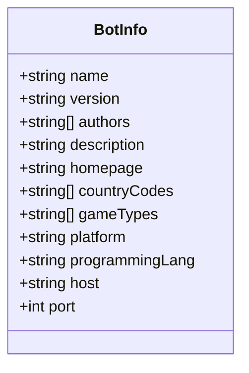

**Similar to Participant but includes network address and excludes battle-specific fields.**

---

## 7. Initial Position

**Schema:** [`initial-position.schema.yaml`](../../../../schema/schemas/initial-position.schema.yaml)

**Purpose:** Bot's requested starting position

**Used In:** [`bot-handshake`](../../../../schema/schemas/bot-handshake.schema.yaml), [`participant`](../../../../schema/schemas/participant.schema.yaml)

### Structure

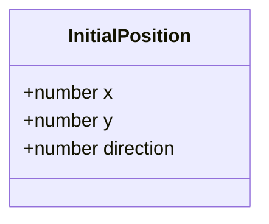

### Example

```json
{
  "x": 100.0,
  "y": 100.0,
  "direction": 90.0
}
```

**Note:** Server may ignore or adjust position if conflicts exist.

---

## 8. Results (For Bot)

**Schema:** [`results-for-bot.schema.yaml`](../../../../schema/schemas/results-for-bot.schema.yaml)

**Purpose:** Personal battle results

**Used In:** [`game-ended-event-for-bot`](../../../../schema/schemas/game-ended-event-for-bot.schema.yaml)

### Structure

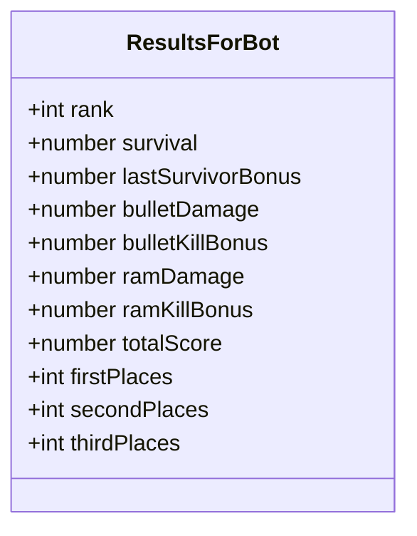

### Example

```json
{
  "rank": 1,
  "survival": 450,
  "lastSurvivorBonus": 100,
  "bulletDamage": 320.5,
  "bulletKillBonus": 60,
  "ramDamage": 12.0,
  "ramKillBonus": 0,
  "totalScore": 942.5,
  "firstPlaces": 1,
  "secondPlaces": 0,
  "thirdPlaces": 0
}
```

---

## 9. Results (For Observer)

**Schema:** [`results-for-observer.schema.yaml`](../../../../schema/schemas/results-for-observer.schema.yaml)

**Purpose:** Complete battle results (all bots)

**Used In:** [`game-ended-event-for-observer`](../../../../schema/schemas/game-ended-event-for-observer.schema.yaml)

### Structure

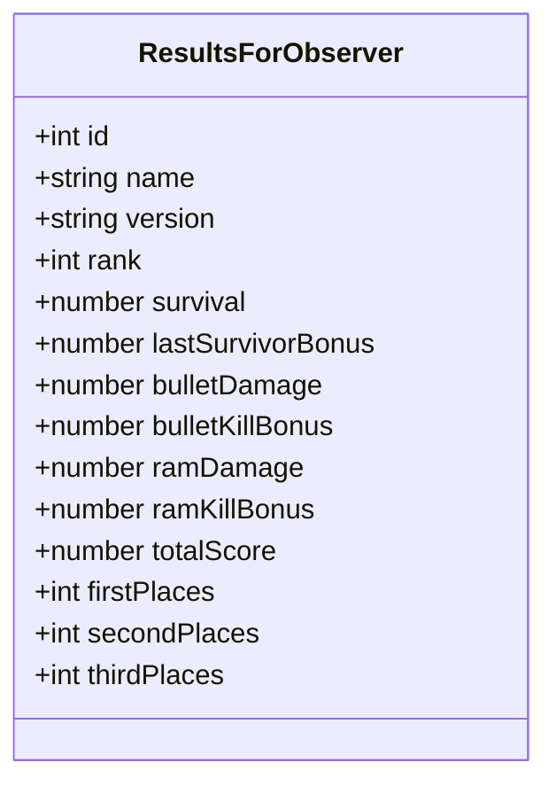

**Extends ResultsForBot with identification fields.**

---

## 10. Bot Address

**Schema:** [`bot-address.schema.yaml`](../../../../schema/schemas/bot-address.schema.yaml)

**Purpose:** Bot network address

**Used In:** [`start-game`](../../../../schema/schemas/start-game.schema.yaml), [`bot-info`](../../../../schema/schemas/bot-info.schema.yaml)

### Structure

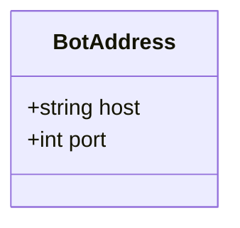

### Example

```json
{
  "host": "localhost",
  "port": 50001
}
```

---

## 11. Color

**Schema:** [`color.schema.yaml`](../../../../schema/schemas/color.schema.yaml)

**Purpose:** RGB color value

**Used In:** [BotState](../../../../schema/schemas/bot-state.schema.yaml), [BulletState](../../../../schema/schemas/bullet-state.schema.yaml), [BotIntent](../../../../schema/schemas/bot-intent.schema.yaml)

### Structure

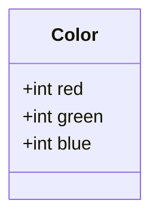

### Example

```json
{
  "red": 255,
  "green": 128,
  "blue": 0
}
```

### Fields

| Field | Type | Range | Description |
|-------|------|-------|-------------|
| `red` | integer | 0-255 | Red component |
| `green` | integer | 0-255 | Green component |
| `blue` | integer | 0-255 | Blue component |

---

## 12. Base Types

### Message

**Schema:** [`message.schema.yaml`](../../../../schema/schemas/message.schema.yaml)

**Purpose:** Base structure for all WebSocket messages

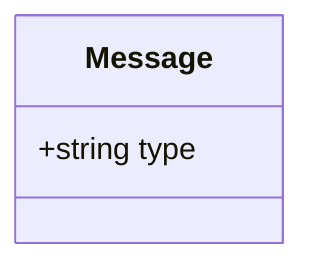

**All messages extend this base with `type` field.**

---

### Event

**Schema:** [`event.schema.yaml`](../../../../schema/schemas/event.schema.yaml)

**Purpose:** Base structure for all events

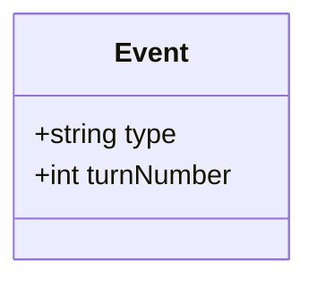

**All events extend this base with `turnNumber` field.**

---

## State Object Usage Patterns

### Pattern 1: Embedded in Events

```json
{
  "type": "tick-event-for-bot",
  "turnNumber": 42,
  "botState": {
    // BotState object embedded here
    "energy": 85.5,
    "x": 400.0
  }
}
```

### Pattern 2: Arrays of State Objects

```json
{
  "type": "tick-event-for-observer",
  "botStates": [
    {"id": 1, "energy": 85.5, "x": 400.0},
    {"id": 2, "energy": 72.0, "x": 500.0}
  ]
}
```

### Pattern 3: Nested State Objects

```json
{
  "type": "hit-by-bullet-event",
  "bullet": {
    // BulletState object embedded here
    "bulletId": 5,
    "power": 3.0
  },
  "damage": 12.0
}
```

---

## Related Schemas

### Bot State
- [bot-state.schema.yaml](../../../../schema/schemas/bot-state.schema.yaml)
- [bot-state-with-id.schema.yaml](../../../../schema/schemas/bot-state-with-id.schema.yaml)
- [bot-info.schema.yaml](../../../../schema/schemas/bot-info.schema.yaml)

### Bullet State
- [bullet-state.schema.yaml](../../../../schema/schemas/bullet-state.schema.yaml)

### Game Configuration
- [game-setup.schema.yaml](../../../../schema/schemas/game-setup.schema.yaml)
- [initial-position.schema.yaml](../../../../schema/schemas/initial-position.schema.yaml)

### Results
- [results-for-bot.schema.yaml](../../../../schema/schemas/results-for-bot.schema.yaml)
- [results-for-observer.schema.yaml](../../../../schema/schemas/results-for-observer.schema.yaml)

### Metadata
- [participant.schema.yaml](../../../../schema/schemas/participant.schema.yaml)
- [bot-address.schema.yaml](../../../../schema/schemas/bot-address.schema.yaml)

### Primitives
- [color.schema.yaml](../../../../schema/schemas/color.schema.yaml)
- [message.schema.yaml](../../../../schema/schemas/message.schema.yaml)
- [event.schema.yaml](../../../../schema/schemas/event.schema.yaml)

---

## Related Documentation

- [Message Schema Overview](./README.md)
- [Events](./events.md) — Messages that embed state objects
- [Intents](./intents.md) — Bot actions using state objects
- [Turn Execution Flow](../flows/turn-execution.md)

---

**Last Updated:** 2026-02-12

