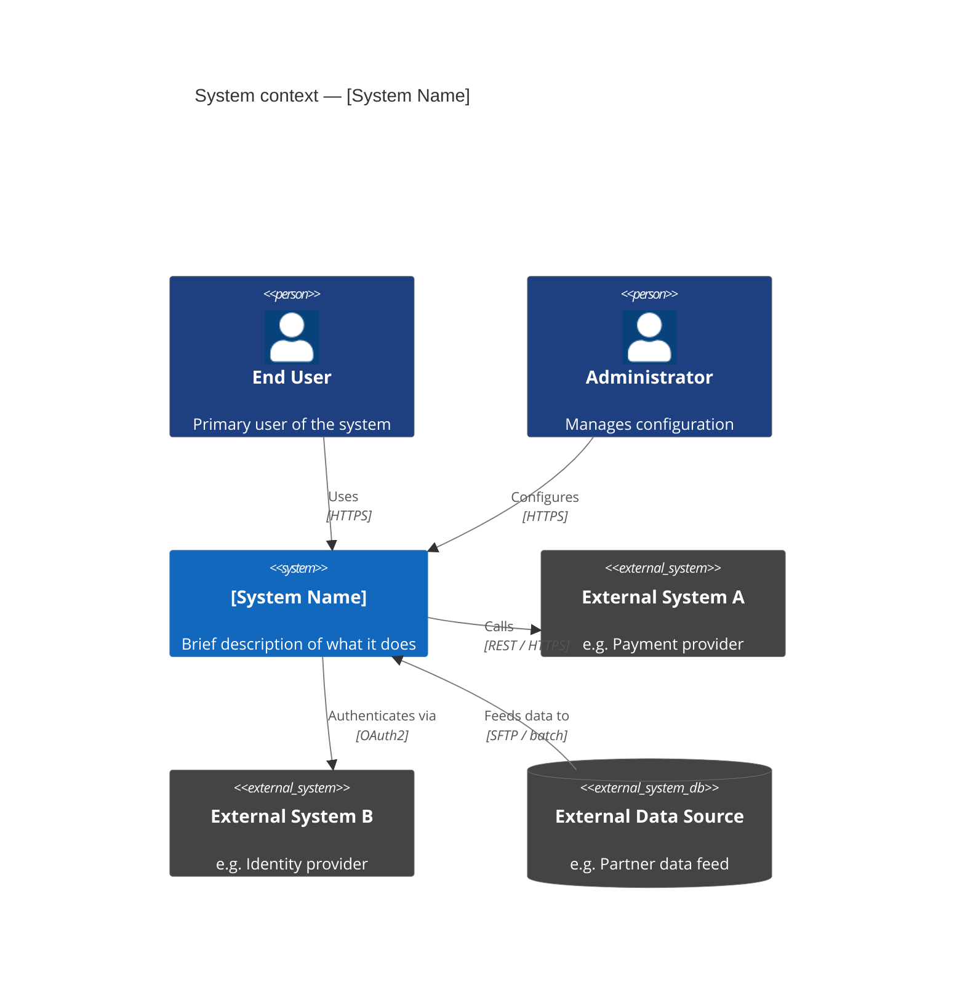
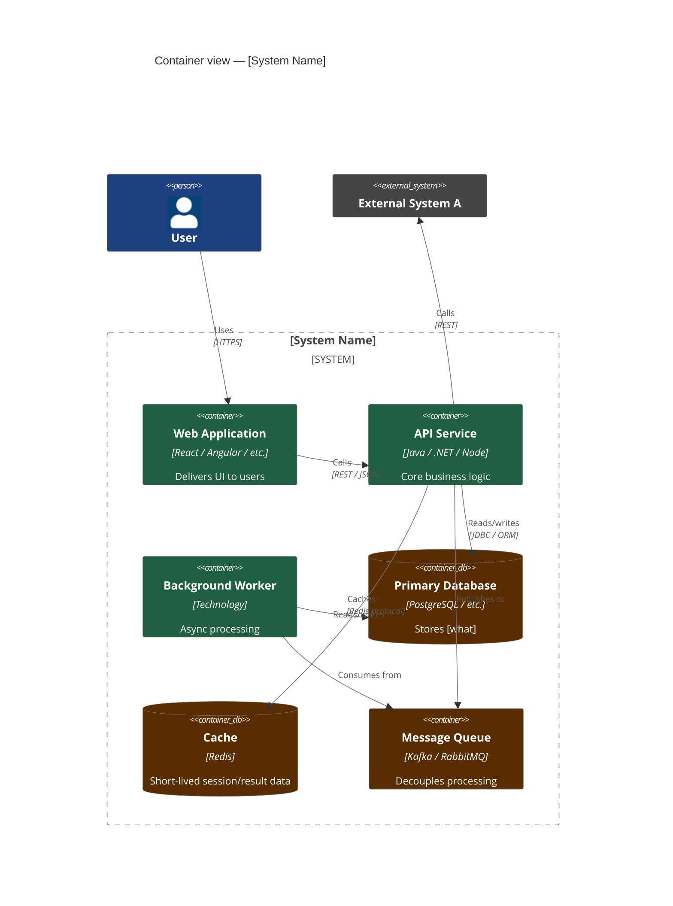
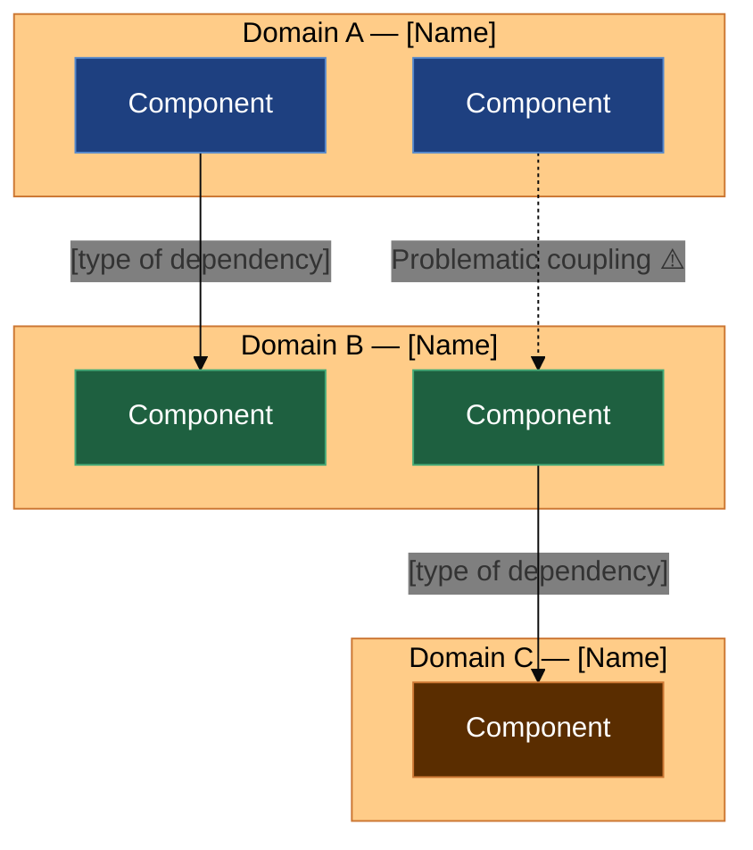
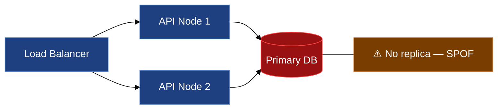
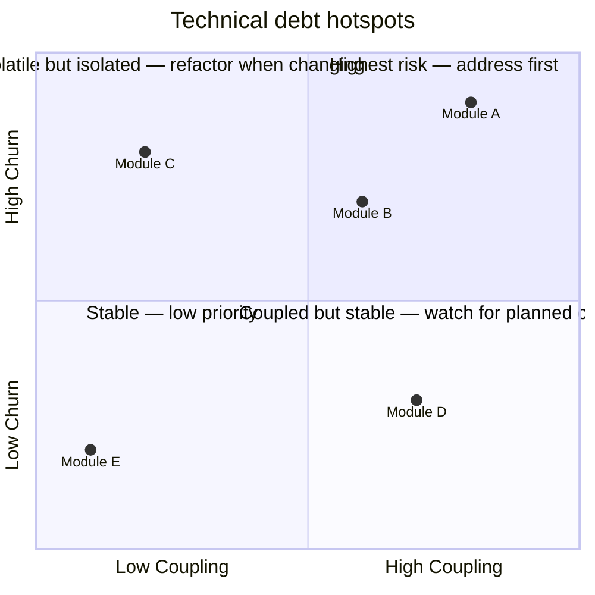
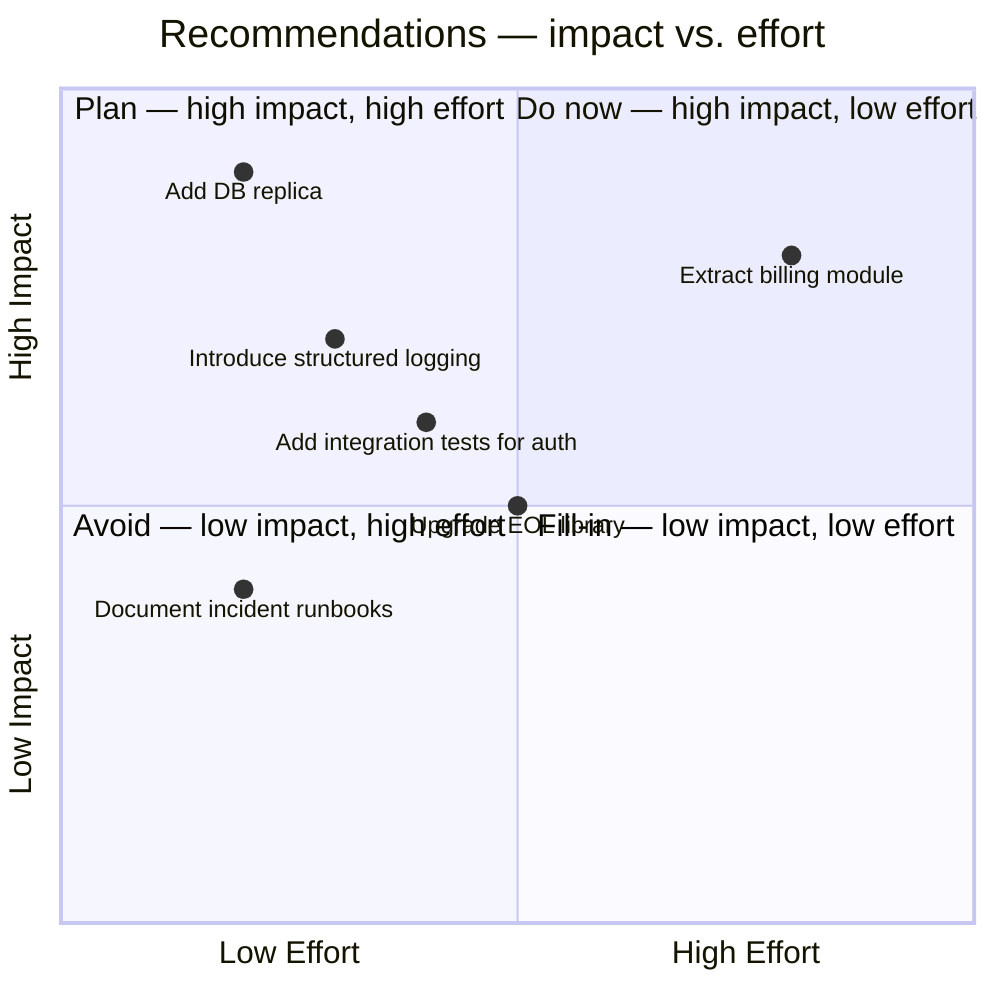
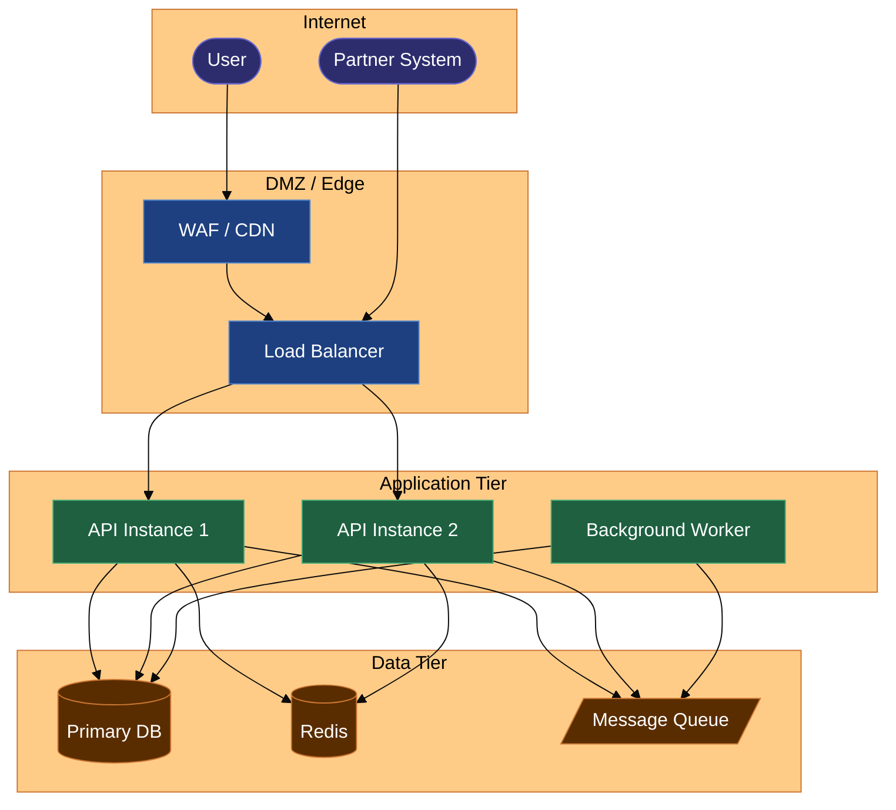
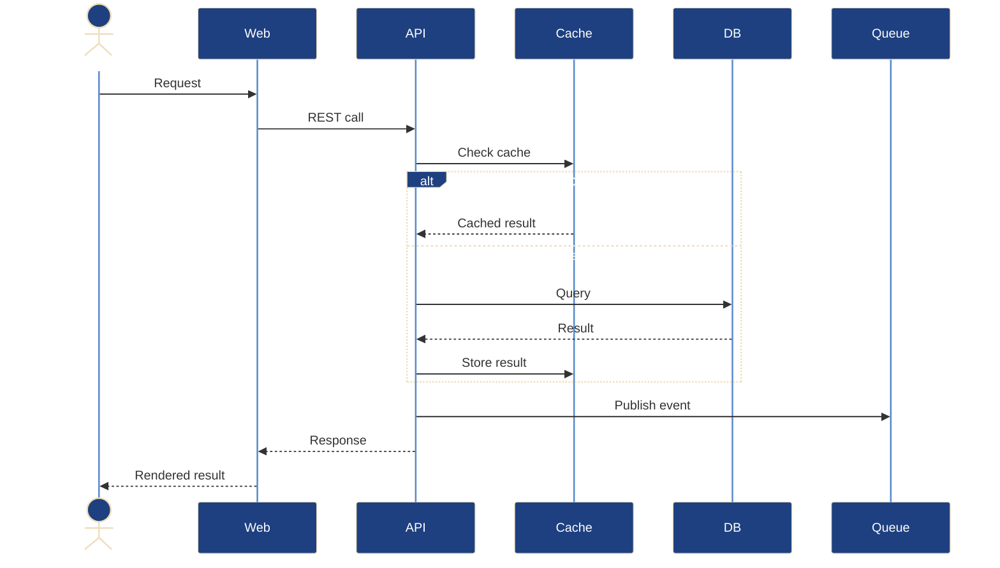

# Architectural Health Report: [System Name]

> Influenced by the [arc42 architecture documentation template](https://arc42.org/overview) by Dr. Peter Hruschka & Dr. Gernot Starke.

> **Version:** 1.0  
> **Date:** YYYY-MM-DD  
> **Author:** [Name, Role]  
> **Review trigger:** [Why this review was initiated — migration, incident, modernisation, onboarding, etc.]  
> **Scope:** [What is included and explicitly excluded]

---

## Executive Summary

[2–4 sentences. What is the system, what is its health status, and what is the single most important thing to know. Write this last.]

### Health Scorecard

| Dimension | Status | Summary |
|---|---|---|
| Architectural style & fitness | 🟢 / 🟡 / 🔴 | [One line] |
| Structural quality | 🟢 / 🟡 / 🔴 | [One line] |
| Performance & scalability | 🟢 / 🟡 / 🔴 | [One line] |
| Reliability & failure handling | 🟢 / 🟡 / 🔴 | [One line] |
| Security posture | 🟢 / 🟡 / 🔴 | [One line] |
| Observability | 🟢 / 🟡 / 🔴 | [One line] |
| Maintainability & debt | 🟢 / 🟡 / 🔴 | [One line] |
| Team & ownership | 🟢 / 🟡 / 🔴 | [One line] |

> 🟢 Healthy — no significant concerns  
> 🟡 Needs attention — manageable issues present  
> 🔴 Critical — immediate action required

### Top Findings

| # | Severity | Finding |
|---|---|---|
| F-01 | 🔴 Critical | [One-line summary] |
| F-02 | 🔴 Critical | [One-line summary] |
| F-03 | 🟠 High | [One-line summary] |

### Top Recommendations

| Priority | Recommendation | Effort | Impact |
|---|---|---|---|
| 1 | [What to do] | S / M / L | High / Medium |
| 2 | [What to do] | S / M / L | High / Medium |
| 3 | [What to do] | S / M / L | High / Medium |

---

## 1. System in Context

### Purpose

[What the system does. What business capability it provides. 2–3 sentences max. Not a feature list.]

### Users and actors

| Actor | Type | Interaction |
|---|---|---|
| [e.g. End users] | Human | [e.g. Web UI] |
| [e.g. Partner API] | External system | [e.g. REST inbound] |
| [e.g. Batch jobs] | Automated | [e.g. Scheduled trigger] |

### System context

### Key constraints

[Regulatory, contractual, organisational, or technical constraints that are non-negotiable and shape the architecture. GDPR, specific cloud provider, mandated frameworks, etc.]

---

## 2. Architectural Overview

### Style

| | Detail |
|---|---|
| **Stated style** | [What the team says it is] |
| **Actual style** | [What it actually is, based on observation] |
| **Intentional?** | Yes / Partially / No — [explain the gap if any] |
| **Style fitness** | 🟢 / 🟡 / 🔴 — [Is this style appropriate for the team size, load, and change rate?] |

### Container view

### Key architectural decisions

[3–5 decisions that most explain why the system looks the way it does. Not a full ADR list — just the ones that matter for understanding the health assessment.]

| Decision | Rationale | Still valid? |
|---|---|---|
| [e.g. Chose monolith over microservices] | [e.g. Team size, speed to market] | Yes / Partially / No |
| [e.g. Event-driven for order processing] | [e.g. Decoupling, async load handling] | Yes / Partially / No |
| [e.g. Shared database across modules] | [e.g. Legacy decision, original simplicity] | No — coupling is now a problem |

---

## 3. Domain Model

### Domains and boundaries

[Are domain boundaries explicit or blurred? Is domain logic centralised or scattered? Where does coupling hurt?]

> **Note:** Mermaid subgraph backgrounds do not adapt to dark themes. Node colors are set explicitly above to ensure readability in both light and dark renderers.

### Domain coupling assessment

| Dependency | Type | Assessment |
|---|---|---|
| Domain A → Domain B | [Sync call / Shared DB / Event] | 🟢 Acceptable / 🟡 Watch / 🔴 Problem |
| Domain B → Domain C | [Type] | 🟢 / 🟡 / 🔴 |

---

## 4. Quality Attributes Assessment

For each attribute: what was the stated target (if known), what is observed in practice, and what is the gap.

### Performance

| Metric | Target | Actual | Status |
|---|---|---|---|
| API p95 latency | [e.g. < 200ms] | [e.g. 450ms observed] | 🔴 |
| Throughput | [e.g. 500 req/s] | [e.g. 320 req/s max before degradation] | 🟡 |
| Batch processing time | [Target] | [Actual] | 🟢 / 🟡 / 🔴 |

[Where are the bottlenecks? What degrades under load?]

### Reliability

| Metric | Target | Actual | Status |
|---|---|---|---|
| Availability (30d) | [e.g. 99.9%] | [e.g. 99.4%] | 🟡 |
| MTTR | [e.g. < 30min] | [e.g. ~2h avg] | 🔴 |
| Error rate | [e.g. < 0.1%] | [e.g. 0.8%] | 🔴 |

[Where does the system fail? What are the single points of failure?]

### Scalability

[What is the scaling model? Where does it break down? What happens at 2×, 10× current load?]

### Security

| Control | In place? | Assessment |
|---|---|---|
| Authentication | Yes / Partial / No | [Method — JWT, session, API key, etc.] |
| Authorisation | Yes / Partial / No | [RBAC, ABAC, none?] |
| Secrets management | Yes / Partial / No | [Vault, env vars, hardcoded?] |
| Transport encryption | Yes / Partial / No | [TLS everywhere? Exceptions?] |
| Input validation | Yes / Partial / No | [Where applied, where missing?] |
| Dependency vulnerabilities | Yes / Partial / No | [Automated scanning? Last check?] |

[Overall security posture: what is the attack surface? What is the most exposed risk?]

### Observability

| Capability | In place? | Quality | Assessment |
|---|---|---|---|
| Structured logging | Yes / Partial / No | [Centralised? Queryable?] | 🟢 / 🟡 / 🔴 |
| Metrics | Yes / Partial / No | [What is measured? Actionable?] | 🟢 / 🟡 / 🔴 |
| Distributed tracing | Yes / Partial / No | [End-to-end? Partial?] | 🟢 / 🟡 / 🔴 |
| Alerting | Yes / Partial / No | [Meaningful alerts? Alert fatigue?] | 🟢 / 🟡 / 🔴 |
| Dashboards | Yes / Partial / No | [Available? Used? Up to date?] | 🟢 / 🟡 / 🔴 |

> Key question: Can the team answer "is the system healthy right now?" without SSH access?

### Maintainability

| Indicator | Observation | Assessment |
|---|---|---|
| Test coverage | [%? Which types?] | 🟢 / 🟡 / 🔴 |
| High-churn modules | [Which files/modules change most?] | 🟢 / 🟡 / 🔴 |
| Onboarding time | [How long to productive contribution?] | 🟢 / 🟡 / 🔴 |
| Deployment frequency | [How often? Manual steps?] | 🟢 / 🟡 / 🔴 |
| Build/CI time | [How long? Flaky?] | 🟢 / 🟡 / 🔴 |

---

## 5. Findings

Each finding has a severity, root cause, and impact. Findings are the factual basis for recommendations.

> **Severity levels**  
> 🔴 Critical — system risk, data integrity, security exposure, or blocks evolution  
> 🟠 High — significant operational or quality impact, needs near-term attention  
> 🟡 Medium — technical debt or quality concern, plan to address  
> 🔵 Low — improvement opportunity, address when convenient

---

### F-01 — [Short title] 🔴 Critical

**Observed:** [What is actually happening. Facts only — no recommendations here.]

**Root cause:** [Why this exists. Be honest — accidental complexity, original design decision, growth without refactoring, etc.]

**Impact:** [What does this mean in practice? What incidents, limitations, or risks does it cause?]

**Evidence:** [Code reference, incident report, metric, or direct observation that substantiates the finding.]

---

### F-02 — [Short title] 🔴 Critical

**Observed:** [...]

**Root cause:** [...]

**Impact:** [...]

**Evidence:** [...]

---

### F-03 — [Short title] 🟠 High

**Observed:** [...]

**Root cause:** [...]

**Impact:** [...]

**Evidence:** [...]

---

### F-04 — [Short title] 🟠 High

**Observed:** [...]

**Root cause:** [...]

**Impact:** [...]

**Evidence:** [...]

---

### F-05 — [Short title] 🟡 Medium

**Observed:** [...]

**Root cause:** [...]

**Impact:** [...]

**Evidence:** [...]

---

*[Continue numbering findings. Group by theme if > 8 findings.]*

---

## 6. Technical Debt & Hotspots

### Hotspot map

Hotspots are areas of high churn, high coupling, low coverage, or known workarounds. These are where the next incident is most likely to originate.

### Debt register

| Area | Type | Description | Risk if unaddressed |
|---|---|---|---|
| [Module / component] | [Architectural / Code / Test / Ops] | [Brief description] | [What happens if this is ignored] |
| [Module / component] | [...] | [...] | [...] |

---

## 7. Risks

### Risk register

| ID | Risk | Likelihood | Impact | Exposure | Mitigation |
|---|---|---|---|---|---|
| R-01 | [e.g. Primary DB has no replica — SPOF] | High | Critical | 🔴 | [Immediate action / workaround] |
| R-02 | [e.g. Key developer is only person who understands billing module] | Medium | High | 🟡 | [Knowledge transfer, documentation] |
| R-03 | [e.g. Core library approaching EOL in 6 months] | High | Medium | 🟡 | [Upgrade path scoped] |
| R-04 | [...] | Low | High | 🟡 | [...] |

> **Exposure** = Likelihood × Impact  
> 🔴 High exposure — act now  
> 🟠 Medium-high exposure — plan mitigation  
> 🟡 Medium exposure — monitor  
> 🔵 Low exposure — accept or watch

---

## 8. Recommendations

Recommendations are ordered by priority. Each maps to one or more findings.

### Impact vs. effort

### Recommendation detail

| # | Recommendation | Addresses | Effort | Impact | When |
|---|---|---|---|---|---|
| R1 | [e.g. Add read replica for primary DB] | F-01, R-01 | Small | Critical | Immediately |
| R2 | [e.g. Introduce structured logging with correlation IDs] | F-03 | Small | High | Within 1 sprint |
| R3 | [e.g. Extract billing domain into isolated module] | F-02, F-04 | Large | High | Next quarter |
| R4 | [e.g. Establish ownership map and rotate knowledge for billing module] | R-02 | Small | High | Within 2 weeks |
| R5 | [e.g. Plan EOL library upgrade — scope and timeline] | R-03 | Medium | Medium | Before EOL date |

### What not to do now

[Be explicit about what to defer. This is as important as the recommendations — prevents thrash on low-ROI work while high-risk issues remain open.]

---

## Appendix A: Technology Stack

| Component | Technology | Version | EOL / Support status | Notes |
|---|---|---|---|---|
| Runtime | [Java / Node / .NET / etc.] | [x.y] | [Supported / EOL YYYY-MM] | |
| Framework | [Spring Boot / Express / etc.] | [x.y] | [Supported] | |
| Primary database | [PostgreSQL / MySQL / etc.] | [x.y] | [Supported] | |
| Cache | [Redis / Memcached] | [x.y] | [Supported] | |
| Message broker | [Kafka / RabbitMQ / etc.] | [x.y] | [Supported] | |
| Container runtime | [Docker / Podman] | [x.y] | [Supported] | |
| Orchestration | [Kubernetes / ECS / etc.] | [x.y] | [Supported] | |
| CI/CD | [Jenkins / GitHub Actions / etc.] | [x.y] | [Supported] | |

---

## Appendix B: Deployment Topology

---

## Appendix C: Key Data Flows

[Document 1–2 critical or architecturally interesting data flows. Use sequence diagrams for anything with ordering or timing dependencies.]

---

## Appendix D: Observations vs. Inferences

[Be explicit about what was directly observed vs. inferred. This section protects the credibility of the report.]

| Statement | Type | Source |
|---|---|---|
| [e.g. No DB replica configured] | Observed | Infrastructure review / AWS console |
| [e.g. Billing module is high-risk due to lack of tests] | Observed | Coverage report — 12% coverage |
| [e.g. Original team chose monolith for speed] | Inferred | No ADRs found; inferred from code history and interviews |
| [e.g. Performance degrades at ~300 req/s] | Observed | Load test from YYYY-MM |

---

## Appendix E: Analysis Checklist

Use this to track coverage of the analysis. Unchecked items are acknowledged gaps.

### Covered in this report
- [ ] System purpose and boundaries defined
- [ ] System context diagram produced
- [ ] Container view produced
- [ ] Architectural style assessed (actual vs. intended)
- [ ] Domain boundaries assessed
- [ ] Performance characteristics assessed (target vs. actual)
- [ ] Reliability and SPOF analysis done
- [ ] Security controls reviewed
- [ ] Observability gaps identified
- [ ] Maintainability indicators reviewed
- [ ] Hotspot analysis done (churn + coupling)
- [ ] Technical debt register produced
- [ ] Risk register produced
- [ ] Recommendations prioritised by impact and effort
- [ ] Observations explicitly distinguished from inferences

### Known gaps in this report
- [ ] [e.g. Security penetration test not available — last test unknown]
- [ ] [e.g. Production metrics not accessible — estimates based on load test only]
- [ ] [e.g. Team topology not fully mapped — only core team interviewed]
