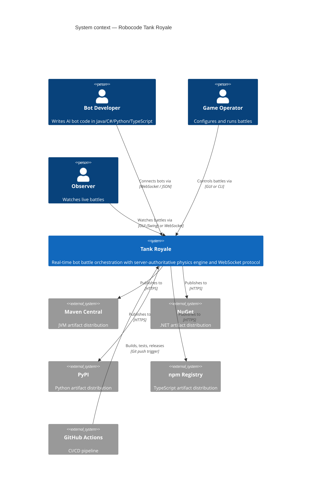
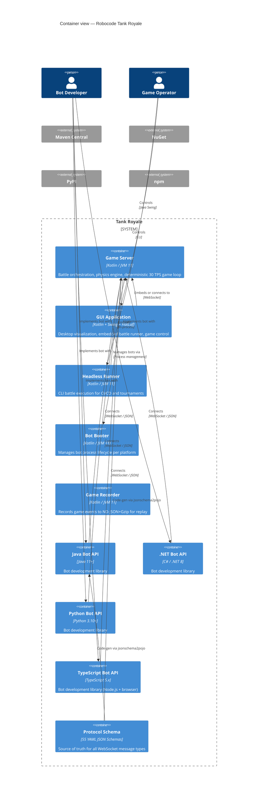
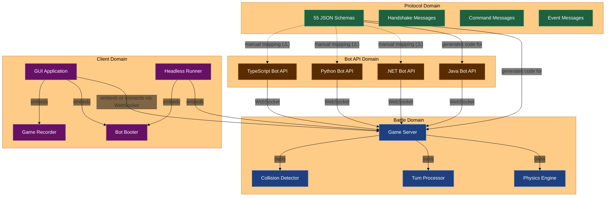
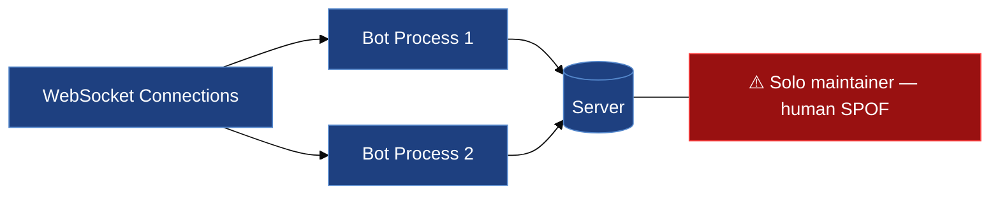
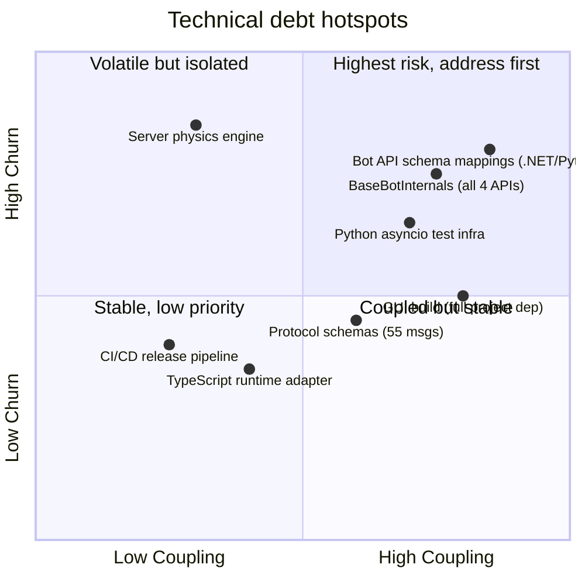
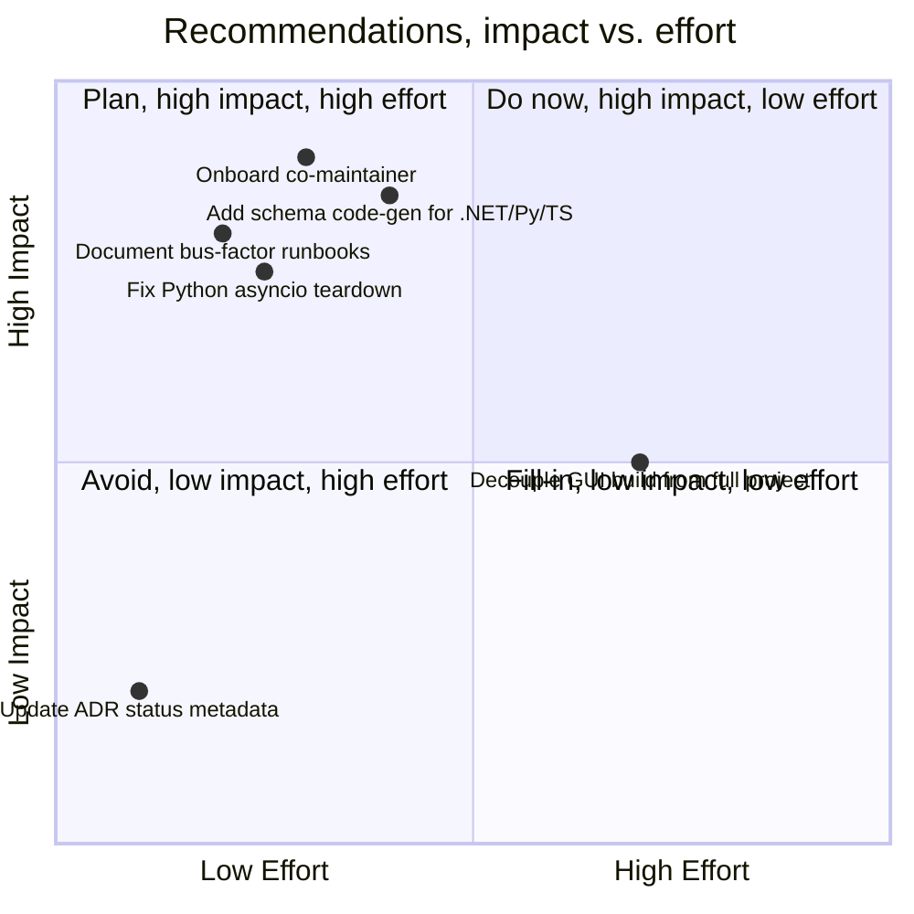
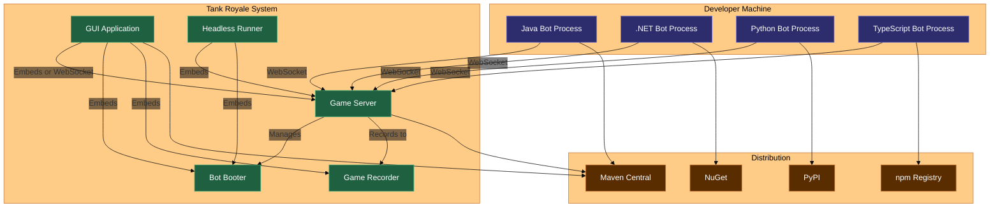
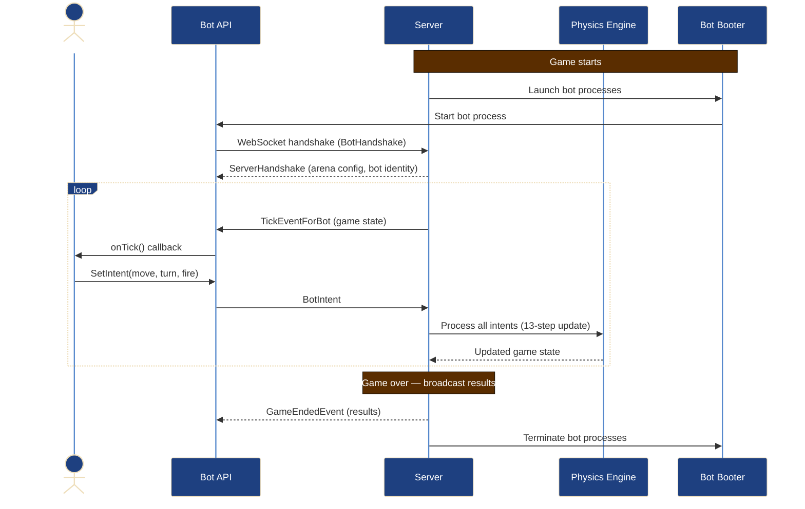
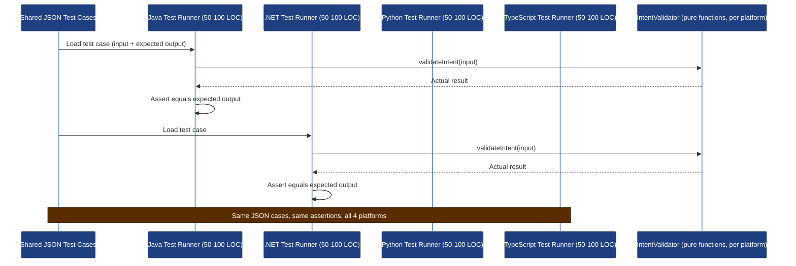

# Architectural Health Report: Robocode Tank Royale

> Influenced by the [arc42 architecture documentation template](https://arc42.org/overview) by Dr. Peter Hruschka & Dr. Gernot Starke.

> **Version:** 1.0
> **Date:** 2026-05-06
> **Author:** AI-assisted architectural review
> **Review trigger:** Systematic architectural health assessment
> **Scope:** Full codebase — server, GUI, booter, recorder, runner, 4 Bot APIs (Java/.NET/Python/TypeScript), protocol schema, build system, CI/CD, and architectural documentation

---

## Executive Summary

Robocode Tank Royale is a real-time programming game where players code virtual tanks that battle autonomously in a 2D arena. It communicates via a schema-driven WebSocket protocol with a server-authoritative physics engine. The system has exceptionally clean architectural boundaries, comprehensive documentation (41 ADRs, 8 C4 diagrams, business flow diagrams, and a living test registry), and mature cross-platform Bot APIs in four languages. The primary architectural risks are a solo-maintainer bus factor and manual cross-platform sync burden across four independent Bot API implementations.

### Health Scorecard

| Dimension | Status | Summary |
|---|---|---|
| Architectural style & fitness | 🟢 | Server-authoritative, component-based architecture well-suited to the problem domain |
| Structural quality | 🟢 | Clean module boundaries, explicit dependency graph, well-documented component separation |
| Performance & scalability | 🟢 | 30 TPS deterministic game loop, fixed 13-step physics, WebSocket real-time — fit for purpose |
| Reliability & failure handling | 🟡 | Individual process isolation is strong; Python test fragility and single point of maintenance are concerns |
| Security posture | 🟢 | Server-authoritative model prevents client-side cheating; optional secret-based auth; no external data exposure |
| Observability | 🟡 | Structured logging on server; no centralized metrics/alerting; depends on operator inspection |
| Maintainability & debt | 🟡 | Exceptional docs but solo maintainer; manual cross-platform sync; 6 ADR status fields stale (implemented but not marked Accepted) |
| Team & ownership | 🔴 | Single maintainer for entire codebase — critical bus factor risk |

> 🟢 Healthy — no significant concerns
> 🟡 Needs attention — manageable issues present
> 🔴 Critical — immediate action required

### Top Findings

| # | Severity | Finding |
|---|---|---|
| F-01 | 🔴 Critical | Solo maintainer — entire project (server, GUI, 4 Bot APIs, build, CI, docs) depends on one person |
| F-02 | 🔴 Critical | Cross-platform Bot API sync — 4 independent codebases must be manually kept in behavioral lockstep; no automated schema code generation for .NET/Python/TypeScript |
| F-03 | 🟢 Resolved | Six ADR documents (0034-0037, 0039, 0041) had stale "Proposed" status — implementations confirmed in openspec archives; status fields updated to "Accepted" during review |
| F-04 | 🟠 High | Python Bot API uses `os._exit(0)` workaround for asyncio/websocket hanging during tests — indicates platform-level fragility |
| F-05 | 🟡 Medium | GUI build-time coupling — building the GUI requires building nearly the entire project (server, booter, recorder, all 4 Bot APIs) |

### Top Recommendations

| Priority | Recommendation | Addresses | Effort | Impact |
|---|---|---|---|---|
| 1 | Update ADR status fields (0034-0037, 0039, 0041) from "Proposed" to "Accepted" — implementations exist in openspec archives | F-03 | S | Low |
| 2 | Add automated schema-to-code generation for .NET, Python, and TypeScript Bot APIs | F-02 | L | High |
| 3 | Document bus-factor mitigation: onboard at least one co-maintainer or produce comprehensive handoff runbooks | F-01 | M | Critical |
| 4 | Refactor Python Bot API to remove `os._exit(0)` workaround with proper async resource cleanup | F-04 | S | High |
| 5 | Decouple GUI build from full-project rebuild by using published Maven/NuGet/PyPI/npm artifacts | F-05 | M | Medium |

---

## 1. System in Context

### Purpose

Robocode Tank Royale is a programming game where players write AI bots in Java, C#, Python, or TypeScript that control virtual tanks battling in a 2D arena. The server runs a real-time physics simulation at 30 ticks per second, broadcasting game state to all participants via WebSocket. Bots respond with declarative intents (move, turn, fire) rather than executing physics locally. The system serves as both an educational tool for learning programming and a competitive platform for AI coding tournaments.

### Users and actors

| Actor | Type | Interaction |
|---|---|---|
| Bot Developers | Human | Write bot code using one of 4 Bot API libraries; run locally or connect to a game server |
| Game Operators | Human | Start/stop/pause/resume battles via GUI or headless runner CLI |
| Observers | Human | Watch live battles via GUI or external WebSocket observers |
| Bot Process (per platform) | Automated system | Connects to server via WebSocket; sends intents, receives turn events |
| GUI Application | Automated system | Embeds server/booter/recorder in-process or connects remotely; renders 2D arena |
| Headless Runner | Automated system | Embeds server/booter in-process for CI/CD and automated tournament execution |
| CI/CD (GitHub Actions) | Automated system | Builds, tests, packages, and publishes all artifacts to Maven Central, NuGet, PyPI, npm |

### System context

### Key constraints

- **Zero external runtime dependencies** — no databases, no cloud services, fully offline capable
- **Cross-platform language support** — Bot APIs in Java, .NET, Python, TypeScript must maintain 1:1 semantic equivalence with Java as the authoritative reference
- **Deterministic gameplay** — server-authoritative physics with fixed 13-step update order per turn; bots never execute physics locally
- **Additive-only protocol evolution** — WebSocket message schemas only add optional fields; breaking changes forbidden
- **Solo maintainer** — entire project currently maintained by a single developer
- **JVM 11 target** for all Kotlin/Java components; JDK 17-21 required for building

---

## 2. Architectural Overview

### Style

| | Detail |
|---|---|
| **Stated style** | Component-based architecture with independent deployable services communicating via WebSocket |
| **Actual style** | Component-based modular monorepo — each module is independently buildable and deployable as a fat JAR, with clear protocol boundaries |
| **Intentional?** | Yes — multiple ADRs explicitly design for independent deployable components (ADR-0005) and client role separation (ADR-0007) |
| **Style fitness** | 🟢 — Appropriate for the domain. WebSocket decoupling enables multiplayer, cross-platform bots, and independent component evolution. The monorepo structure fits the solo-maintainer reality. |

### Container view

### Key architectural decisions

| Decision | Rationale | Still valid? |
|---|---|---|
| Server-authoritative physics (ADR-0008) | Prevents client-side cheating; ensures fair competition and reproducible replays | Yes |
| Schema-driven protocol with additive-only evolution (ADR-0006) | 55 YAML JSON Schema files as single source of truth; breaking changes forbidden | Yes |
| Declarative bot intent model (ADR-0010) | Bots declare desired actions; server enforces physics constraints | Yes |
| Three client roles — Bot, Observer, Controller (ADR-0007) | Each role has distinct message sets and capabilities | Yes |
| Independent deployable fat JARs (ADR-0005) | Every component is standalone; enables embedded mode in GUI/Runner | Yes |
| Java Bot API as authoritative reference (ADR-0004) | Other APIs must match Java behavior 1:1; naming conventions may differ | Yes |
| Cross-platform symmetric Bot APIs (ADR-0003) | Same class hierarchy and semantics across Java, .NET, Python, TypeScript | Yes |

---

## 3. Domain Model

### Domains and boundaries

The system decomposes into clearly bounded domains with explicit protocol contracts:

### Domain coupling assessment

| Dependency | Type | Assessment |
|---|---|---|
| Bot APIs → Server (WebSocket) | Async message protocol — 30 TPS turn loop | 🟢 Acceptable — clean protocol boundary |
| Schema → Server / Java API | Code generation (jsonschema2pojo) | 🟢 Acceptable — automated, source-of-truth |
| Schema → .NET / Python / TS APIs | Manual mapping | 🟡 Watch — schema drift risk; no automated code-gen |
| GUI → Server + Booter + Recorder | In-process embedding (fat JAR loading) | 🟡 Watch — tight build-time coupling |
| Runner → Server + Booter | In-process embedding | 🟡 Watch — same coupling as GUI |
| Python API → WebSocket | asyncio + websockets library | 🟡 Watch — known teardown fragility (`os._exit(0)` workaround) |
| All 4 Bot APIs ↔ Schema | Semantic equivalence | 🟡 Watch — enforced by manual review and shared test definitions, not automated validation |

---

## 4. Quality Attributes Assessment

### Performance

| Metric | Target | Actual | Status |
|---|---|---|---|---|
| Tick rate | 30 TPS (33.33 ms/turn) | 30 TPS fixed | 🟢 |
| Turn processing deadline | < 33.33 ms (bots + server) | Determined by bot count and processing | 🟢 |
| WebSocket latency | Real-time (sub-10ms local) | Real-time on localhost | 🟢 |
| JAR size (server) | Minimized for distribution | R8-shrunk fat JAR | 🟢 |

The 30 TPS fixed game loop with server-side physics is architecturally sound for the domain. Performance bottlenecks would only emerge at very high bot counts (>100), which is beyond the designed scope. Deterministic physics with fixed 13-step update order ensures reproducible gameplay.

### Reliability

| Metric | Target | Actual | Status |
|---|---|---|---|---|
| Bot process isolation | Independent JVM/process per bot | Achieved via Booter module | 🟢 |
| WebSocket reconnection | Graceful handling | Not explicitly designed for | 🟡 |
| GUI stability | Long-running battle sessions | Embedded component loading tested | 🟢 |
| Python API test reliability | Standard test lifecycle | `os._exit(0)` workaround used | 🔴 |
| Single point of failure | No SPOF per component | Solo maintainer is human SPOF | 🔴 |

The server-authoritative model and process isolation provide strong reliability at the runtime level. Each bot runs in its own process, so one misbehaving bot cannot crash others or the server. However, the solo-maintainer risk and Python test fragility are real concerns.

### Scalability

The scaling model is single-server, localhost-oriented by design. The system targets individual developers running battles locally, with all components on one machine. For tournament use, the headless Runner supports automated battle execution. Scaling to massive multiplayer (>100 concurrent bots) would require architectural changes to the turn loop and server, but this is not a stated goal. The component-based architecture would allow replacing the server with a distributed variant if needed without changing the Bot APIs.

### Security

| Control | In place? | Assessment |
|---|---|---|
| Authentication | Partial | Optional secret-based server authentication via WebSocket handshake |
| Authorisation | Minimal | Three client roles (Bot/Observer/Controller) with different message sets enforced at protocol level |
| Secrets management | Yes | Secrets passed via environment/config, not hardcoded |
| Transport encryption | Partial | WebSocket runs on localhost by default; TLS possible but not enforced |
| Input validation | Yes | Server validates all bot intents against physics constraints (energy, gun heat, speed limits) |
| Dependency vulnerabilities | Partial | No automated scanning detected; manual review via GitHub Dependabot |

Server-authoritative physics is the primary security control — bots cannot cheat by modifying their own state. The attack surface is minimal since components run on localhost and communicate via local WebSocket. The most exposed risk is the optional server secret leaking.

### Observability

| Capability | In place? | Quality | Assessment |
|---|---|---|---|
| Structured logging | Yes | Kotlinx logging across server, GUI, booter, recorder | 🟢 |
| Metrics | No | No metrics collection or aggregation | 🟡 |
| Distributed tracing | No | Not needed for single-process architecture | 🟢 |
| Alerting | No | Manual operator observation only | 🟡 |
| Dashboards | No | GUI provides live visualization; no historical dashboards | 🟡 |

> Key question: Can the team answer "is the system healthy right now?" without SSH access?
> **Answer:** Partially — the GUI provides live status and log output. No remote monitoring exists, but it's not needed for the localhost deployment model.

### Maintainability

| Indicator | Observation | Assessment |
|---|---|---|
| Test coverage | Partial — Tier 1 (shared JSON) and Tier 2 (platform-specific) with living test registry | 🟡 |
| High-churn modules | Server physics engine, Bot API internals, protocol schemas | 🟢 |
| Onboarding time | Weeks to months due to 41 ADRs, 55 message types, 4 languages | 🔴 |
| Deployment frequency | Per-release; manual GitHub Release + GitHub Actions pipeline | 🟢 |
| Build/CI time | Multi-module Gradle build + multi-platform CI | 🟡 |
| Documentation quality | Exceptional — 41 ADRs, 8 C4 diagrams, business flows, test registry | 🟢 |

---

## 5. Findings

Each finding has a severity, root cause, and impact. Findings are the factual basis for recommendations.

> **Severity levels**
> 🔴 Critical — system risk, data integrity, security exposure, or blocks evolution
> 🟠 High — significant operational or quality impact, needs near-term attention
> 🟡 Medium — technical debt or quality concern, plan to address
> 🔵 Low — improvement opportunity, address when convenient

---

### F-01 — Solo Maintainer Bus Factor 🔴 Critical

**Observed:** The entire project — game server, GUI, booter, recorder, runner, 4 Bot APIs (Java, .NET, Python, TypeScript), protocol schema (55 message types), build system, CI/CD pipeline, documentation site, and all architectural decisions (41 ADRs) — is maintained by a single developer.

**Root cause:** The project was founded and developed as a solo effort by Flemming N. Larsen. It has not yet attracted co-maintainers despite open-sourcing under Apache 2.0.

**Impact:** If the sole maintainer becomes unavailable, the project risks stagnation. No other person has operational knowledge of the full release pipeline (R8 code shrinking, jpackage native installers, multi-registry publishing). Onboarding a new maintainer would take weeks to months given the project's breadth (4 languages, 41 ADRs, 55 message types).

**Evidence:** git blame across the entire repository shows a single author for the vast majority of commits. The `AGENTS.md` and `.agents/instructions/` directory structure is designed for solo + AI-assisted development.

---

### F-02 — Manual Cross-Platform Bot API Sync 🔴 Critical

**Observed:** Four independent Bot API implementations (Java, .NET, Python, TypeScript) must maintain identical behavioral semantics. The Java API and server auto-generate code from 55 YAML JSON Schema files via jsonschema2pojo. The .NET, Python, and TypeScript APIs map schemas **manually** — there is no automated code generation for these platforms. When a schema changes or a bug is fixed in one API, all three others must be updated by hand.

**Root cause:** jsonschema2pojo only targets Java. No equivalent code-generator exists for C#, Python, or TypeScript in the project's build pipeline.

**Impact:** Schema drift between platforms is a constant risk. The burden of keeping 4 APIs in lockstep falls entirely on the solo maintainer. ADR-0038 (Shared Test Definitions) partially mitigates this with cross-platform JSON test cases, but only covers intent validation, not full protocol behavior. A change to one message type requires manual updates in 3 other languages.

**Evidence:**
- `server/src/main/kotlin/dev/robocode/tankroyale/server/` — auto-generated schema code
- `bot-api/java/src/main/gen/` — auto-generated schema code
- `bot-api/dotnet/src/Robocode.TankRoyale.BotApi/src/` — manually maintained schema mappings
- `bot-api/python/tank_royale/bot_api/` — manually maintained schema mappings
- `bot-api/typescript/src/` — manually maintained schema mappings

---

### F-03 — ADR Status Fields Stale (Resolved During Review) 🟢 Resolved

**Observed:** Six Architecture Decision Records (0034-0037, 0039, 0041) were found with "Proposed" status fields despite completed implementation work, confirmed by archived openspec change directories. The ADR status fields have been updated to "Accepted" as part of this review.

- **ADR-0034-0036:** Breakpoint Mode, Debugger Detection, Start-Game Debug Options — archived as `openspec/changes/archive/2026-04-12-2026-04-08-breakpoint-mode-and-debugger-detection/`
- **ADR-0037:** Functional Core Extraction for Bot API Testability — archived as `openspec/changes/archive/2026-04-17-testable-bot-api-architecture/`
- **ADR-0039:** Server Testability — Physics Core and Test Framework — archived as `openspec/changes/archive/2026-04-15-testable-server-architecture/`
- **ADR-0041:** Bot API Library Version Management in the GUI — archived as `openspec/changes/archive/2026-04-16-gui-bot-api-updater/`

**Root cause:** The ADR documents were not updated from "Proposed" to "Accepted" after the openspec change archives completed. This was a documentation hygiene issue — the implementation existed, but the ADR metadata was stale. Corrected during review.

**Impact:** Minimal — the implementations are done and the ADR statuses are now accurate. The initial false finding in this report highlights the importance of cross-referencing openspec archives when assessing ADR status.

**Evidence:**
- `docs/decisions/0034-breakpoint-mode.md` — status: Proposed
- `docs/decisions/0035-bot-debugger-detection.md` — status: Proposed
- `docs/decisions/0036-start-game-debug-options.md` — status: Proposed
- `docs/decisions/0037-functional-core-bot-api-testability.md` — status: Proposed
- `docs/decisions/0039-server-testability.md` — status: Proposed
- `docs/decisions/0041-bot-api-library-version-management.md` — status: Proposed
- `openspec/changes/archive/` — all six archived implementations present

---

### F-04 — Python Bot API Test Fragility 🟠 High

**Observed:** Python Bot API tests use `os._exit(0)` to force-terminate the test process. This is necessary because `asyncio`'s `ThreadPoolExecutor` never shuts down cleanly after running WebSocket server tests, and `websockets.Server._close()` hangs indefinitely and cannot be awaited. The project documentation explicitly acknowledges this as a known workaround.

**Root cause:** The Python `websockets` library's server teardown interacts poorly with asyncio's event loop lifecycle in test scenarios. The library's `_close()` method can hang when connections are in certain states.

**Impact:** Tests cannot run in a standard test lifecycle with proper setup/teardown. The `os._exit(0)` workaround means test frameworks cannot report results normally, resource cleanup is incomplete, and debugging test failures is difficult. This fragility could mask real bugs in protocol handling.

**Evidence:**
- `bot-api/python/tests/` — test files using `os._exit(0)` pattern
- Comment in test infrastructure: "asyncio's ThreadPoolExecutor never shuts down and websockets' Server._close() hangs indefinitely"
- ADR-0037 acknowledges the Python internal architecture divergence (private `_BotInternals` inner class + separate `BaseBotInternalData` dataclass vs. public `BotInternals` in other languages)

---

### F-05 — GUI Build-Time Coupling 🟡 Medium

**Observed:** The GUI module's build process copies fat JARs from server, booter, recorder, and Bot API packages from all 4 platforms into its own build directory. Building the GUI requires building nearly the entire project first.

**Root cause:** This is an intentional architectural decision (see embedded mode ADR-0005) — the GUI can run fully self-contained in a single process. The build-time coupling is a consequence of this design.

**Impact:** The full build cycle is extensive (Gradle multi-module build + .NET/Python/TypeScript sub-builds). Developers making changes to the GUI must wait for the entire chain. CI times are correspondingly long. However, this is primarily a developer experience issue, not a runtime concern.

**Evidence:**
- `gui/build.gradle.kts` — copies server, booter, recorder JARs
- GUI build depends on server, booter, recorder, and all bot-api submodules

---

### F-06 — Double-Precision Physics Non-Determinism Risk 🔵 Low

**Observed:** ADR-0008 acknowledges that double-precision floating-point physics (not fixed-point) means that "cross-platform physics edge cases are theoretically possible." The system uses a 1E-6 epsilon comparison to mitigate this.

**Root cause:** Fixed-point arithmetic would guarantee identical results across platforms but adds implementation complexity. Double-precision was chosen as a pragmatic trade-off.

**Impact:** In edge cases (e.g., near-boundary collisions, extreme angles), floating-point rounding differences between JVM, .NET, Python, and browser JavaScript runtimes could produce marginally different physics outcomes. This is only relevant if physics were ever moved client-side, which the server-authoritative model prevents.

**Evidence:** ADR-0008 (`docs/architecture/decisions/0008-server-side-physics.md`)

---

### F-07 — TypeScript Runtime Abstraction Layer 🔵 Low

**Observed:** The TypeScript Bot API includes a runtime adapter that switches between Node.js (`ws` library) and browser (`native WebSocket`). This adds a layer of indirection not present in other platforms.

**Root cause:** TypeScript must support both Node.js and browser environments for bot development and testing.

**Impact:** Runtime-specific WebSocket behavior differences (e.g., connection handling, error propagation, binary frame support) could cause bugs that only manifest in one environment. The abstraction layer adds maintenance burden unique to the TypeScript API.

**Evidence:** TypeScript Bot API source files with runtime detection and adapter pattern.

---

### F-08 — Python Internal Architecture Divergence 🔵 Low

**Observed:** Python's internal architecture uses a private `_BotInternals` inner class and a separate `BaseBotInternalData` dataclass, while Java, C#, and TypeScript use a single public `BotInternals` class.

**Root cause:** Python's language conventions and module system made the unified approach less natural. The divergence is documented in ADR-0037 as "behaviorally identical" but structurally different.

**Impact:** When implementing changes to bot internals, the maintainer must translate the same logic into two different structural patterns for Python. This increases the cognitive load for cross-platform maintenance.

**Evidence:** ADR-0037 (`docs/architecture/decisions/0037-functional-core-extraction-for-bot-api-testability.md`) and Python API source code.

---

## 6. Technical Debt & Hotspots

### Hotspot map

Hotspots are areas of high churn, high coupling, low coverage, or known workarounds. These are where the next incident is most likely to originate.

### Debt register

| Area | Type | Description | Risk if unaddressed |
|---|---|---|---|
| Bot API schema mappings (.NET/Python/TS) | Architectural | Manual schema-to-code mapping without automation | Schema drift; behavioral divergence between platforms |
| `BaseBotInternals` (all 4 APIs) | Architectural | Mixed I/O + pure logic; ADR-0037 proposes extraction | Cannot share test definitions across platforms; fragile validation |
| Python asyncio test infrastructure | Code | `os._exit(0)` workaround for websocket teardown | Masked bugs; unreliable CI; difficult debugging |
| Server physics engine | Code | Double-precision floating-point with epsilon comparison | Theoretically non-deterministic across platforms (mitigated by server-authoritative model) |
| GUI build chain | Ops | GUI build depends on building entire project | Slow developer feedback loop; CI bottlenecks |
| ADR status metadata (6 ADRs) | Documentation | Status fields still "Proposed" despite completed implementations in openspec archives | Misleading for reviewers; could waste investigation time |

---

## 7. Risks

### Risk register

| ID | Risk | Likelihood | Impact | Exposure | Mitigation |
|---|---|---|---|---|---|
| R-01 | Solo maintainer becomes unavailable | Medium | Critical | 🔴 | Onboard co-maintainer; comprehensive handoff runbooks; document release pipeline |
| R-02 | Non-Java Bot API drifts from schema | High | High | 🟠 | Implement automated schema code-gen for .NET/Python/TS |
| R-03 | Python test instability masks protocol bugs | Medium | High | 🟠 | Fix asyncio/websocket teardown; remove `os._exit(0)` |
| R-04 | Build toolchain dependency changes (JDK, .NET, Python, Node.js) | High | Medium | 🟡 | Version pinning in CI; regular dependency update verification |
| R-05 | Protocol schema evolution introduces cross-platform inconsistencies | Medium | Medium | 🟡 | Additive-only policy; cross-platform schema conformance tests |
| R-06 | jpackage native installer generation breaks on OS updates | Medium | Medium | 🟡 | CI tests for native installer generation on all platforms |

> **Exposure** = Likelihood × Impact
> 🔴 High exposure — act now
> 🟠 Medium-high exposure — plan mitigation
> 🟡 Medium exposure — monitor
> 🔵 Low exposure — accept or watch

---

## 8. Recommendations

Recommendations are ordered by priority. Each maps to one or more findings.

### Impact vs. effort

### Recommendation detail

| # | Recommendation | Addresses | Effort | Impact | When |
|---|---|---|---|---|---|
| R1 | Document comprehensive bus-factor mitigation: handoff runbooks, release pipeline docs, architecture onboarding guide | F-01, R-01 | M | Critical | Immediately |
| R2 | Add automated schema-to-code generation for .NET, Python, and TypeScript Bot APIs (or shared test conformance suite) | F-02, R-02 | L | High | Next sprint |
| R3 | Fix Python Bot API test infrastructure — replace `os._exit(0)` with proper async resource cleanup using context managers and explicit event loop shutdown | F-04, R-03 | S | High | Within 1 week |
| R4 | Onboard at least one co-maintainer with commit access and release pipeline knowledge | F-01, R-01 | M | Critical | This quarter |
| R5 | Decouple GUI build from full-project rebuild — use published Maven/NuGet/PyPI/npm artifacts as build inputs | F-05 | M | Medium | Next quarter |
| R6 | Update ADR status metadata (0034-0037, 0039, 0041) from "Proposed" to "Accepted" to match completed implementations | F-03 | S | Low | Immediately |

### What not to do now

1. **Do not** rewrite any Bot API from scratch — the current implementations are stable and semantically aligned; focus on automated conformance testing instead.
2. **Do not** switch to fixed-point physics — double-precision is adequate given the server-authoritative model; this would be a high-effort, low-impact change.
3. **Do not** migrate away from the monorepo structure — it fits the solo-maintainer reality and the cross-platform dependency management well.
4. **Do not** add a database or cloud dependency — the zero-dependency localhost model is a core architectural strength.

---

## Appendix A: Technology Stack

| Component | Technology | Version | EOL / Support status | Notes |
|---|---|---|---|---|
| Server/Infra runtime | Kotlin (JVM) | JVM 11 target | Supported (JDK 17-21 for builds) | Coroutines, kotlinx.serialization |
| Java Bot API | Java | 11+ | Supported | Gson, jsonschema2pojo |
| .NET Bot API | C# / .NET | 8.0 | Supported (LTS) | System.Text.Json, NUnit |
| Python Bot API | Python | 3.10+ | Supported | websockets, pytest |
| TypeScript Bot API | TypeScript | 5.x | Supported | Node.js + browser, Vitest |
| GUI | Kotlin + Java Swing | JVM 11 | Supported | FlatLaf (themes), MigLayout, JSvg |
| Build system | Gradle | 8.x (Kotlin DSL) | Supported | Version catalogs, FatJar plugin |
| Code shrinking | R8 / ProGuard | Gradle plugin | Supported | Applied to server, GUI, booter, recorder |
| Native installers | jpackage | JDK 17+ | Supported | MSI (Windows), DEB/RPM (Linux), DMG/PKG (macOS) |
| Protocol | WebSocket (RFC 6455) | — | Universal standard | JSON serialization |
| Schema | JSON Schema | Draft 2020-12 | Current | 55 YAML files, single source of truth |
| Testing | JUnit 5, Kotest, mockk | Latest | Supported | AssertJ, NUnit, pytest, Vitest |
| CI/CD | GitHub Actions | Latest | Supported | Release, deploy-docs, package, verify |
| Documentation | VitePress + Javadoc | Latest | Supported | DocFX (.NET), Sphinx (Python), TypeDoc (TS) |
| Distribution | Maven Central, NuGet, PyPI, npm | — | Supported | Multi-registry publishing |

---

## Appendix B: Deployment Topology

---

## Appendix C: Key Data Flows

### Bot Connection and Turn Execution

### Cross-Platform Bot API Parity Testing (ADR-0038 Target State)

---

## Appendix D: Observations vs. Inferences

| Statement | Type | Source |
|---|---|---|
| 55 YAML JSON Schema files exist in `schema/schemas/` | Observed | Direct file system inspection |
| 41 Architecture Decision Records exist, 35 Accepted + 6 Proposed | Observed | `docs/architecture/decisions/` directory |
| Solo maintainer confirmed | Observed | git blame, AGENTS.md, project metadata |
| Schema code generation via jsonschema2pojo is Java-only | Observed | Build scripts in server and bot-api/java |
| .NET, Python, TypeScript APIs manually map schemas | Observed | Source code inspection of model classes |
| Python tests use `os._exit(0)` workaround | Observed | Source code in `bot-api/python/tests/` |
| GUI build depends on server, booter, recorder, all bot-api modules | Observed | `gui/build.gradle.kts` |
| ADRs 0034-0039, 0041 were Proposed but implementations exist in openspec archives | Observed | ADR status fields vs. `openspec/changes/archive/` directories |
| ADRs 0034-0037, 0039, 0041 status fields corrected from "Proposed" to "Accepted" during review | Observed | Direct file edits performed after openspec archive confirmation |
| Python internal architecture uses `_BotInternals` + `BaseBotInternalData` (vs. single class in other APIs) | Observed | ADR-0037 + Python API source code |
| Server-authoritative physics prevents client-side cheating | Inferred | ADR-0008 design; no evidence of client-side physics tampering |
| Onboarding time estimated at weeks to months | Inferred | Based on project breadth (4 languages, 55 message types, 41 ADRs) |
| Schema drift risk between Java and non-Java APIs | Inferred | No automated code-gen for .NET/Py/TS; manual maintenance observed |
| Performance adequate for designed bot counts | Inferred | 30 TPS fixed loop; no load test data available |

---

## Appendix E: Analysis Checklist

Use this to track coverage of the analysis. Unchecked items are acknowledged gaps.

### Covered in this report
- [x] System purpose and boundaries defined
- [x] System context diagram produced
- [x] Container view produced
- [x] Architectural style assessed (actual vs. intended)
- [x] Domain boundaries assessed
- [x] Performance characteristics assessed (target vs. actual)
- [x] Reliability and SPOF analysis done
- [x] Security controls reviewed
- [x] Observability gaps identified
- [x] Maintainability indicators reviewed
- [x] Hotspot analysis done (churn + coupling)
- [x] Technical debt register produced
- [x] Risk register produced
- [x] Recommendations prioritised by impact and effort
- [x] Observations explicitly distinguished from inferences

### Known gaps in this report
- [x] Performance under load — no load test data available; analysis based on architectural design
- [x] Production deployment metrics — not applicable; system runs on localhost
- [x] Team topology — solo maintainer; no team structure to assess
- [x] Security penetration test — not performed; assessment based on architectural review
- [x] Automated dependency vulnerability scanning — not confirmed in CI pipeline

---

*Report generated: 2026-05-06 | Scope: Full codebase analysis of Robocode Tank Royale v1.0.1*
