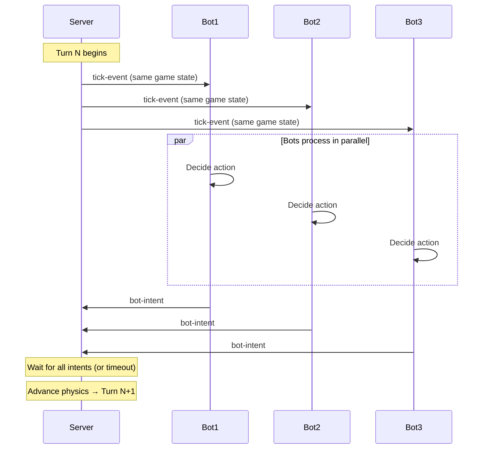

---
status: accepted
date: 2026-02-11
---

# Real-Time Game Loop Architecture

---

## Context and Problem Statement

Tank Royale is a real-time programming game where multiple bots battle simultaneously.

**Problem:** How to synchronize actions of multiple bots while ensuring deterministic, fair gameplay?

## Decision Drivers
- Consistent frame rate (30 TPS target)
- Deterministic physics (reproducible results)
- Fair synchronization (all bots see same state)
- Graceful handling of bot timeouts
- Support for pause/resume for debugging

---

## Decision Outcome

Use a **turn-based discrete tick loop** at **30 TPS** with:
- Server as authoritative game state manager
- Synchronous bot intent collection per tick  
- Strict timeout enforcement per bot
- Deterministic physics simulation

---

## Considered Options
- Discrete tick-based loop at fixed 30 TPS (chosen)
- Continuous real-time loop
- Event-driven async processing
- Client-side lockstep synchronization
- Hybrid tick + event approach

## Pros and Cons of the Options

### Discrete tick-based loop at 30 TPS (chosen)
Good, because deterministic, fair synchronization, predictable performance, and robust timeout handling.

Bad, because fixed frame rate and quantized movement.

### Continuous real-time
Bad, because non-deterministic and synchronization issues.

### Event-driven async
Bad, because race conditions and unfair network advantages.

### Client-side lockstep
Bad, because slow clients can stall the entire game.

### Hybrid tick + event
Bad, because added complexity without clear benefit in this context.

### Synchronization Pattern

**Alternatives rejected:**
- **Continuous real-time**: Non-deterministic, sync issues
- **Event-driven async**: Race conditions, unfair network advantages  
- **Lockstep sync**: One slow client stalls everyone
- **Hybrid tick+event**: Added complexity without clear benefit

---

## More Information

- Detailed design, diagrams, and pseudo-code: `/docs/design/game-loop-architecture.md`

---

### Consequences

- ✅ Deterministic physics (fair competition)  
- ✅ Timeout enforcement prevents game stalling
- ✅ Predictable performance (33ms per turn)
- ✅ Pause/resume support for debugging
- ✅ Replay system possible (record intents per turn)
- ❌ Fixed frame rate (can't exceed 30 TPS)
- ❌ Movement quantized to 33ms granularity
- ❌ Bot logic must complete within timeout

---

## More Information

- Game Loop Patterns: https://gameprogrammingpatterns.com/game-loop.html
- Server Implementation: `/server/README.md`

