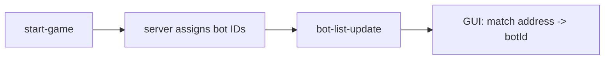

---
status: accepted
date: 2026-04-08
---

# ADR-0036: Start-Game Debug Options

## Context

ADR-0033 adds server debug mode (pause-after-every-turn) and ADR-0034 adds per-bot breakpoint mode. Both are runtime commands: a controller sends `enable-debug-mode` or `bot-policy-update` while the game is running.

[Issue #205](https://github.com/robocode-dev/tank-royale/issues/205) asks for two features in the **New Battle dialog**:

1. **"Start battle paused"** — the game starts already in debug mode so the developer can watch from turn 1, tick by tick.
2. **"Graphical debugging" toggle** (optional) — enable debug graphics for one bot directly from the New Battle dialog, rather than having to open the bot panel after the battle starts.

**The gap:** ADR-0033 does not define when `enable-debug-mode` may be sent. If the server only accepts it during a running game, a GUI that sends `start-game` then immediately `enable-debug-mode` is subject to a race condition — turn 1 could complete before `enable-debug-mode` arrives. For graphical debugging, `bot-policy-update` requires a `botId` assigned by the server after `start-game`, so the GUI must listen for `bot-list-update` before it can send the policy.

---

## Decision

### 1. Add `debugMode` flag to `start-game`

Extend `start-game` with an optional boolean field `debugMode`. When `true`, the server enters debug mode before the first turn is dispatched — race-free by construction.

```yaml
# start-game.schema.yaml — new optional field
debugMode:
  description: >
    If true, the server starts the game in debug mode (ADR-0033).
    The server pauses after each turn instead of auto-advancing.
    Equivalent to sending enable-debug-mode immediately after start-game,
    but without a race condition.
  type: boolean
```

This is the only protocol change in this ADR.

### 2. GUI — "Start battle paused" checkbox

The New Battle dialog adds a **"Start battle paused"** checkbox. When checked, the GUI sets `debugMode: true` in the `start-game` message. No further sequencing logic is needed.

After the game starts in debug mode, the battle view shows the debug controls already described in ADR-0033 (Step button, etc.).

### 3. GUI — "Graphical debugging" toggle in New Battle dialog

The New Battle dialog optionally adds a **"Graphical debugging"** checkbox enabled when exactly one bot is highlighted in the Selected Bots list.

Because bot IDs are assigned by the server after `start-game`, the GUI cannot include the policy in `start-game`. Instead:

1. GUI records the target bot's **address** when the checkbox is checked.
2. After `start-game`, GUI registers a one-shot listener on `bot-list-update`.
3. On the first `bot-list-update`, GUI matches the stored address to the assigned `botId`.
4. GUI sends `bot-policy-update { botId, debuggingEnabled: true }`.

This is a purely GUI-side sequencing pattern — no protocol change needed.



---

## Protocol Changes

### `start-game.schema.yaml` — Add `debugMode` field

```yaml
debugMode:
  description: >
    If true, the server starts the game in debug mode (ADR-0033).
    The server pauses after each turn instead of auto-advancing.
  type: boolean
```

Optional field, defaults to `false`. No other schema changes.

**Backwards compatibility:** Old GUI clients that don't send `debugMode` continue to work — server defaults to `false`. Old servers that don't know `debugMode` ignore it.

---

## Rationale

### Why add `debugMode` to `start-game` instead of relying on `enable-debug-mode` + `start-game` sequencing?

A GUI sends `start-game` then immediately `enable-debug-mode`. Because WebSocket message processing is sequential on the server, this is *unlikely* to race. But the first turn timeout begins as soon as the first tick is sent (after `start-game` processing). If network latency is high (e.g., remote server), `enable-debug-mode` could arrive after turn 1 has already completed.

A single field in `start-game` eliminates the race entirely at no meaningful cost.

### Why not a `startPaused` flag (raw pause) instead of `debugMode`?

"Start paused" using `pause-game` semantics (TPS=0, game loop stopped) would prevent bots from receiving any ticks. The developer wouldn't see state or events — just a frozen game. Debug mode (ADR-0033) is what they actually want: turn 1 executes normally, then the server pauses so they can inspect.

### Why address→botId mapping for graphical debugging (not include in `start-game`)?

`start-game` carries bot *addresses* (host:port), not bot IDs. Bot IDs are assigned by the server and first appear in `bot-list-update`. There is no way to reference a bot by ID in `start-game` itself. The one-shot listener pattern is straightforward and requires no new message.

---

## Implementation Strategy

### Schema

- `schema/schemas/start-game.schema.yaml` — add optional `debugMode: boolean`.

### Server

- `StartGame` model — add nullable `debugMode: Boolean?` field.
- `GameServer.handleStartGame()` — after registering participants, check `debugMode`. If `true`, call `lifecycleManager.enableDebugMode()` (or set the flag directly) before scheduling the first turn.

### GUI — New Battle dialog

- Add **"Start battle paused"** checkbox.
- When checked, include `debugMode = true` in the `StartGame` message.
- Add **"Graphical debugging"** checkbox (enabled only when exactly one bot is selected in the Selected Bots list).
- On `start-game` send, if the graphical debugging checkbox is checked, register a one-shot `bot-list-update` listener to send `bot-policy-update { botId, debuggingEnabled: true }` after address→id resolution.

### Bot APIs

- No changes.

---

## Alternatives Considered

### A. `startPaused: boolean` (raw pause at game start)

Start the game with `pause-game` semantics — game loop stopped, no ticks sent.

**Rejected** — The developer wants to watch from turn 1, not stare at a frozen game. Debug mode (turn runs, then pauses) is the correct semantic.

### B. GUI sends `start-game` then `enable-debug-mode` with no protocol change

Rely on sequential WebSocket processing. Works in practice on LAN but is technically racy on high-latency connections.

**Rejected** — Minor protocol extension (`debugMode` field in `start-game`) eliminates the race at negligible cost.

### C. Include debug policy in `start-game` for graphical debugging too

Add `debuggingEnabled` or a bot-address-keyed policy map to `start-game`.

**Rejected** — Overcomplicates `start-game`. The address→botId listener pattern is simple and matches how all other per-bot policies work (always reference by botId, never by address).

---

## Consequences

### Positive

- **Race-free debug start** — `debugMode` in `start-game` guarantees the game starts paused from turn 1.
- **Minimal protocol change** — one optional field on an existing message.
- **Graphical debugging setup** — developer can pre-select a bot for graphical debugging before clicking Start.
- **Backwards compatible** — old clients and old servers ignore the new field.

### Negative

- **`start-game` grows slightly** — one more optional field. Low impact.
- **Address→botId timing** — the one-shot listener adds a small amount of GUI complexity.

### Neutral

- `enable-debug-mode` / `disable-debug-mode` messages (ADR-0033) remain valid at runtime — `debugMode` in `start-game` is a convenience shortcut for the startup case, not a replacement.

---

## Related Decisions

- **ADR-0033:** Server Debug Mode — defines debug mode behavior and `enable-debug-mode` / `disable-debug-mode`
- **ADR-0034:** Breakpoint Mode — per-bot breakpoint protection, `bot-policy-update`
- **ADR-0035:** Bot API Debugger Detection — `debuggerAttached` flag, controller auto-enable
- **ADR-0007:** Client Role Separation — controllers manage game state, not bots

## References

- [GitHub Issue #205](https://github.com/robocode-dev/tank-royale/issues/205) — Feature request: start battle paused / graphical debugging toggle
- [ADR-0033](./0033-bot-debug-mode.md) — Server Debug Mode
- [start-game schema](/schema/schemas/start-game.schema.yaml)
