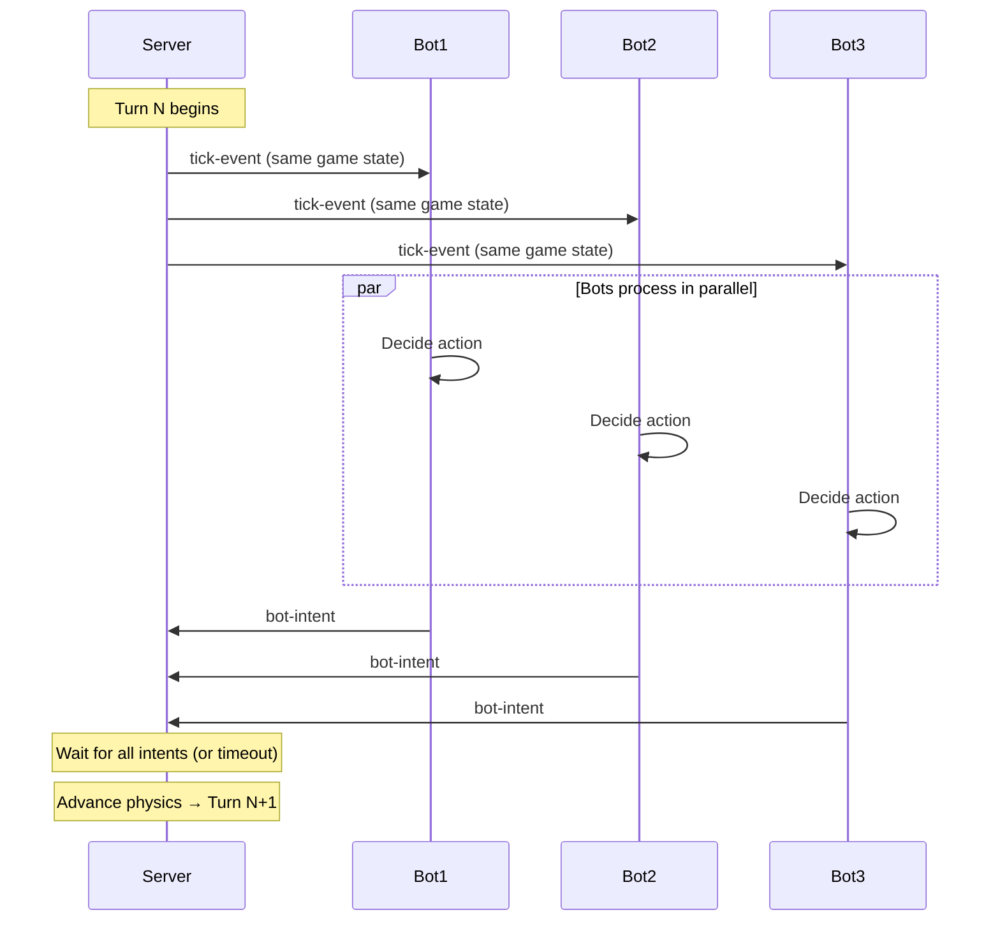
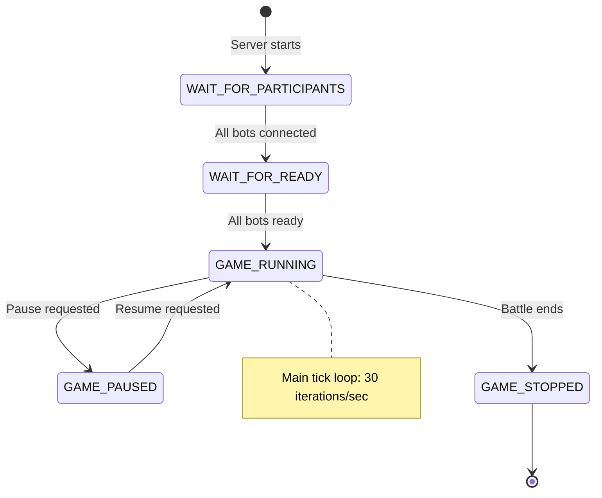

# Real-Time Game Loop — Design Specification

This document details the real-time, discrete tick game loop architecture for Tank Royale. It complements ADR-0011 and centralizes diagrams, pseudo-code, and operational configuration.

## Overview

- Discrete tick loop at 30 TPS (~33ms per turn)
- Server authoritative physics and game state
- Synchronous intent collection per tick with strict timeouts
- Deterministic physics for fair, reproducible battles

## Synchronization Pattern



## State Machine



## Per-Tick Execution (Pseudo-code)

```kotlin
fun executeTurn() {
    // 1. Send tick events to all bots (same game state)
    bots.forEach { it.sendTickEvent(gameState) }
    
    // 2. Collect intents with timeout (~30ms)
    val intents = bots.associateWith { bot ->
        try {
            bot.receiveIntent(timeout = botTimeoutMs)
        } catch (e: TimeoutException) {
            bot.sendSkippedTurnEvent()
            null // Late response
        }
    }
    
    // 3. Apply all valid intents to physics
    applyIntents(intents.filterNotNull())
    updatePhysics()
    checkCollisions()
    
    // 4. Maintain 30 TPS
    sleepToMaintainTPS()
}
```

## Operational Configuration

```bash
java -jar server.jar --tps=30 --turn-timeout=30 --max-inactivity=30
```

## References

- ADR-0011: `/docs/decisions/0011-realtime-game-loop-architecture.md`
- Server Implementation: `/server/README.md`
- Related ADRs: ADR-0008 (Server-authoritative deterministic physics), ADR-0012 (Turn timing semantics)
